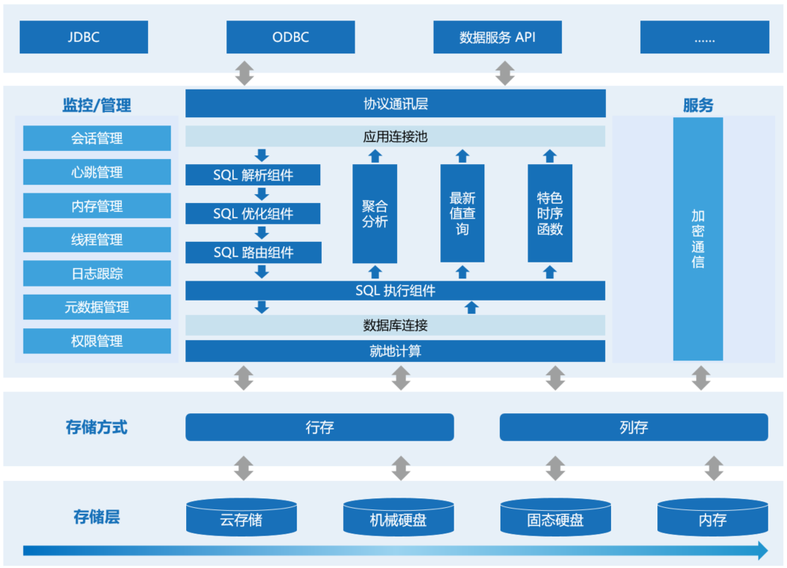
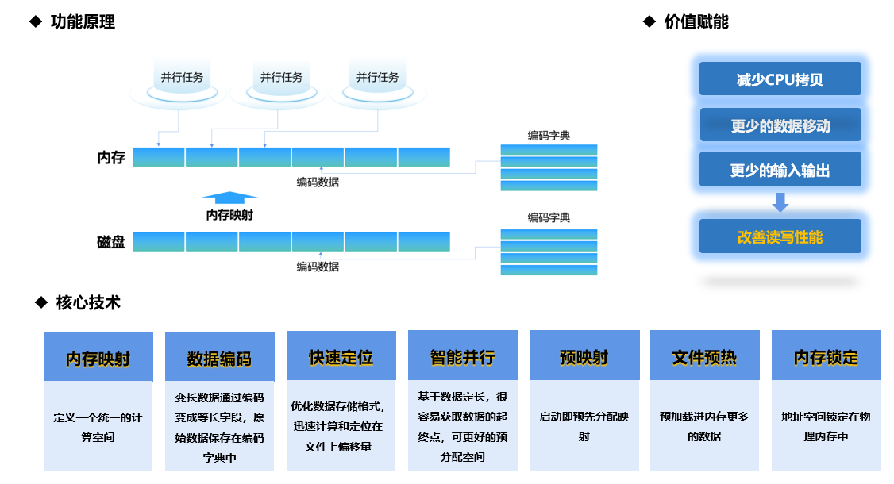

# KaiwuDB简介

KaiwuDB是一款面向AIoT场景的高性能数据库产品，针对工业物联网、数字能源、交通车联网、智慧产业等场景进行了优化，具备高速入库、极速查询等特性，具备时序数据百万级记录秒级写入、千万级数据复杂查询毫秒级响应能力，满足不同领域复杂业务需求和多种数据处理场景。

## 核心技术

KaiwuDB采用“就地计算”专利技术，解决海量时序数据实时写入与数据计算问题，使得数据读写不再沿袭传统的从磁盘到内存多种转换处理的模式，而是定义一个统一的虚拟计算空间，通过数据编码技术将磁盘数据映射到内存，以“就地”为形式，解决“计算”瓶颈问题。“就地”指的是数据在位置、结构和格式方面对计算的准备程度，意味着数据可以直接访问和处理，而无需从一个地方移动到另一个地方，或从一种形式(数据结构、格式或编码)转换到另一种形式，进而实现数据“0”拷贝，减少了数据移动和转换的过程，改善了数据整体的读写性能。

## 主要功能

- 支持标准SQL语法或者类SQL语法；
- 数据写入：支持SQL写入，支持文件导入；
- 数据查询：支持聚合查询、最新值查询、嵌套查询、时序数据特色查询等；
- 数据处理：支持毫秒级精度数据采集等；
- 连接语言：支持 C/C++、Python、Java、Go、Rust、Node.js、C\#等多种编程语言；
- 数据安全：支持身份认证、权限等多种数据安全保障功能；
- 安装部署：支持容器部署，部署升级简易、快速；
- 支持数据在线备份。

## 产品特性

### 海量数据高性能写入

KaiwuDB提供多样及高性能的数据写入能力：

- 支持SQL语法、类SQL语法；支持通过insert SQL语句完成数据写入；
- 支持单指标或者多指标写入，提供单次或批次写入接口；
- 支持导入，用户可以通过不同的连接端口将数据导入KaiwuDB；
- 支持百万级别的单/多指标秒级写入，可增加随时间变化而产生的数据集；
- 支持毫秒精度数据写入。

### 实时查询与分析

KaiwuDB支持数据聚合查询，提供多种维度的聚合查询接口；提供最新数据查询直接获取时间序列的最后一个数据点；支持值过滤查询、条件查询等。

KaiwuDB支持主要函数类型和自定义函数，包括min、max、avg、count、sum等基本聚合函数、日期函数、数学函数等；通过支持自定义函数实现复杂计算逻辑，解决已有函数或功能无法解决的用户问题。

KaiwuDB的时间序列查询速度相较于传统关系型数据库，提升了10-500倍。KaiwuDB利用就地计算技术实现海量时序数据的快速定位和存取，在时序场景的“查询总量”、“年最大值”、和“group by”、“join”等复杂查询场景性能提升10倍。

### 多重安全性保障

KaiwuDB支持多种身份认证方式，能够对接入数据库用户进行身份认证工作；支持创建不同权限的账户，对不同账户授予不同的读写权限，并且授权可修改；支持对数据库与服务器通信的过程加密；也支持AES等加密算法的使用，实现全过程保护数据安全。

### 统一运管低成本运维

KaiwuDB提供开箱即用的能力，支持统一运维管理降低成本：

- 容器化部署：支持容器部署；部署升级简易、快速。
- 元数据查看：能够查看时间序列的定义、标签的定义、指标的定义。
- 数据迁移：支持与其他类型数据库之间的数据导入和导出，数据迁移方案完善。
- 配置管理：全局范围内的数据库配置在线管理能力。

### 高兼容性

KaiwuDB支持MySQL协议，支持C/C++、Python、Java、Go、Rust、Node.js、C#等编程语言；支持ODBC和JDBC接口。支持Spark和HTTP两种外部接口访问数据库，可支持数据库外部集成需求或实现其他方式对外部进行访问；使用Spark的用户可以通过JDBC接口访问来自多个KaiwuDB实例的数据；使用HTTP API旨在满足大多数开发人员的最低依赖要求，通过HTTP API可以进行数据库的数据各类读写操作。

## 应用场景

### 工业物联网

在工业制造、电力运行、化工生产等众多工业物联网领域，生产、测试、运行环境分布着大量用于实时监测、检查与分析的设备传感器。这些设备不断产生新数据，因此设备制造的数字化建设前期需要大量投入。此外，收益形成的先决条件是形成规模效应，导致目前行业整体数字化水平呈两极分化，并且存在以下痛点：

- 内部系统繁多，数据量庞大繁杂
- 数据点位规模大，一条产品生产线上的数据点位总量达到300万-500万
- 设备数据采集多以秒级为主。在某些生产环节，设备要求采集频率达到毫秒级别
- 数据资源独立分散，无法满足数据资源的整合利用
- 受制于单机性能瓶颈，无法满足高并发与海量数据的增长
- 跨区域访问数据读写性能低

KaiwuDB 提供了面向海量工业数据的高吞吐写入，并结合高效存储、就地计算等技术，支撑超速聚合查询分析，服务各种工业软件、大数据平台、物联网平台以及数据中台建设。

### 数字能源

随着互联网信息技术的发展、双碳改革进程的加快，开展综合能源服务已成为提升能源利用效率、降低用能成本、促进产业竞争与合作的重要发展方向，然而能源数据的应用仍面临多种多样的问题。

- 海量数据存储：需要存储能源行业的众多设备、众多环节、多种类型的数据，需要具备兼容各种协议、容量可扩展至PB级的能力。
- 高性能读写能力：能源行业海量生产数据需要实时反馈到生产环境。数据库需要具备海量数据的实时高性能读写、数据压缩、冷热数据区分、数据聚合的能力。
- 数据分析计算能力：能源行业数据繁杂多样、信息密度低、数据价值难洞察，需要具备数据计算存储、深度分析、对接大数据组件、支持机器学习算法等能力，从数据中挖掘价值，通过数据建模、可视化等方式对外提供服务。
- 数据平滑兼容与迁移能力：能源行业涉及众多数据、业务系统类型，需要具备较强迁移与兼容能力，实现与原设备、系统的数据兼容，确保历史数据可用。

KaiwuDB通过AIoT数据库的能力建设，将传感器、生产状况、机器运行状态等时序数据与人员信息、设备信息、业务数据等关系类数据统一汇聚，集中处理；支持百万级测点的数据汇入，提供强大的实时计算、事务处理、交互查询等能力，通过实时数据预测分析为企业提供准确的调峰调频等方案，通过实时数据的监测预警保障企业安全，实现能源数据的采集-存储-治理-计算分析与应用。

### 交通车联网

车联网指车辆上的车载设备通过无线通信技术，对信息网络平台中的所有车辆动态信息进行有效利用，在车辆运行中提供不同的功能服务。车联网具有以下特征：车联网能够为车与车之间的间距提供保障，降低车辆发生碰撞事故的几率；帮助车主实时导航，通过与其它车辆和网络系统的通信，提高交通运行的效率。目前车联网存在以下痛点：

- 数据采集源多、频次高导致数据采集困难：车辆GPS数据、车端工控数据、车身传感器和激光雷达等数据采集点多，数据采集频率高，导致写入能力不足、数据入库延迟；
- 日增数据量多：数据量达TB级别。数据需要进行转存和生命周期管理，历史数据访问频次低，数据存储成本高；
- 数据应用场景多，对数据底层处理能力要求高：数据应用方向包括实时分析、离线分析、机器学习等，对数据分析能力要求高，对质量要求相应提高。

KaiwuDB通过构建时序数据引擎能力，将车端采集到的时序类数据（车传感器数据，车辆中控状态数据，发动机数据等数据）通过MQTT和5G网络入库到高速写入到KaiwuDB中；经过网关汇聚到KaiwuDB时序数据库后，进行存、管、算。通过对数据的分析，应用，服务于上层的业务系统；运用KaiwuDB对时序数据的出色的聚合分析能力和高速查询能力对数据进行查询和分析。运用KaiwuDB的高性能和生命周期管理功能有效的降低企业的存储成本和计算成本，整体降低了企业建设车联网能力的TCO。

### 智慧产业

智慧产业领域面向智慧城市、智慧园区、智慧水务、应急管理等场景，建立国产化的实时数据汇聚、展示、分析的云上渠道，实时汇聚不同省、市、区的监测数据，统一治理、归档、展示、共享数据，支持不同级别地域的调度，打破数据孤岛，保障政务数据安全。目前智慧产业具有如下痛点：

- 数据分散，各个部门数据不统一，数据无法统一处理和展示，存在数据孤岛；
- 数据多源异构，数据存储量持续增长；
- 系统兼容性问题突出，国产化和原有系统适配困难；
- 原有系统性能不满足业务需求，无法实时处理数据。

KaiwuDB利用就地计算、智能预计算等核心技术，可实现百万级数据秒级写入，毫秒级查询响应能力带来强大的存储与计算分析能力，支持存储汇聚来自多个部门的海量多源数据，显著提升数据分享及处理效能，提升实时处理能力，做到数据快速汇入、实时分析以及统一展示和分析。

