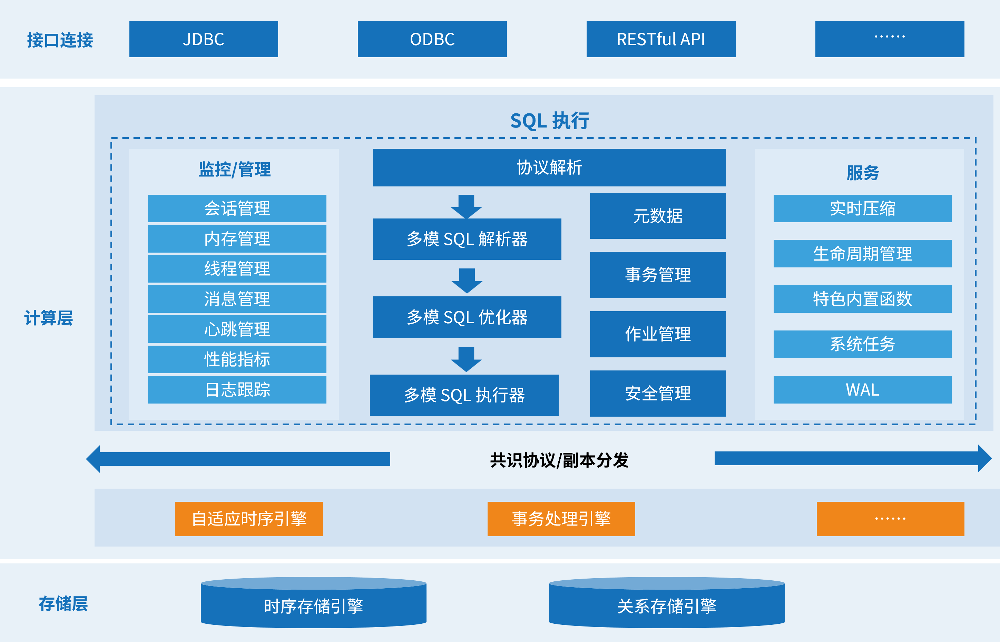

# 产品架构

相比传统的数据库，KWDB 提供多模数据管理能力，支持不同数据模型的统一存储，助力企业跨部门、跨业务统一管理数据，实现多业务数据融合，支撑多样化的应用服务。KWDB 的产品架构如下图所示：

- **数据存储**：采用行列混存架构，支持固态硬盘、机械硬盘、云存储等各类存储设备。
- **数据副本**：采用 Shared Nothing 架构，基于 Raft 协议的高可用、多副本架构，支持数据均衡及容错，保障数据服务不中断。
- **执行计算**：融合多种数据计算引擎，根据不同模型数据特征选择不同的存储、计算模式，对外提供统一的接口，提供多种分析计算能力，提升查询效率。
  - **自适应时序引擎**：支持多种时序数据特色的复杂查询和多维聚合方式。与传统关系数据库相比，KWDB 具备优异的查询性能。另外，KWDB 提供 5-30 倍的压缩能力，数据压缩后无需解压缩即可使用。
  - **事务处理引擎**：支持分布式事务和多版本并发控制（Multi-Version Concurrency Control，MVCC），具备注释、视图、约束、索引、序列等功能。
- **系统管理**：提供系统连接、身份认证、权限管理、资源管理等多种系统管理方式。
- **生态工具与兼容**：提供数据库操作、监控管理等可视化工具，兼容 [EMQX](https://www.emqx.io/)、[Kafka](https://kafka.apache.org/)、[Telegraf](https://github.com/influxdata/telegraf) 等第三方工具。
