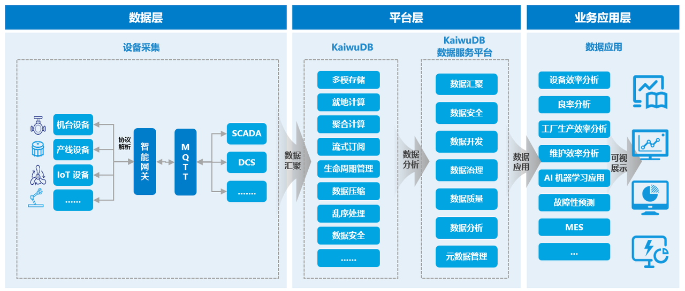
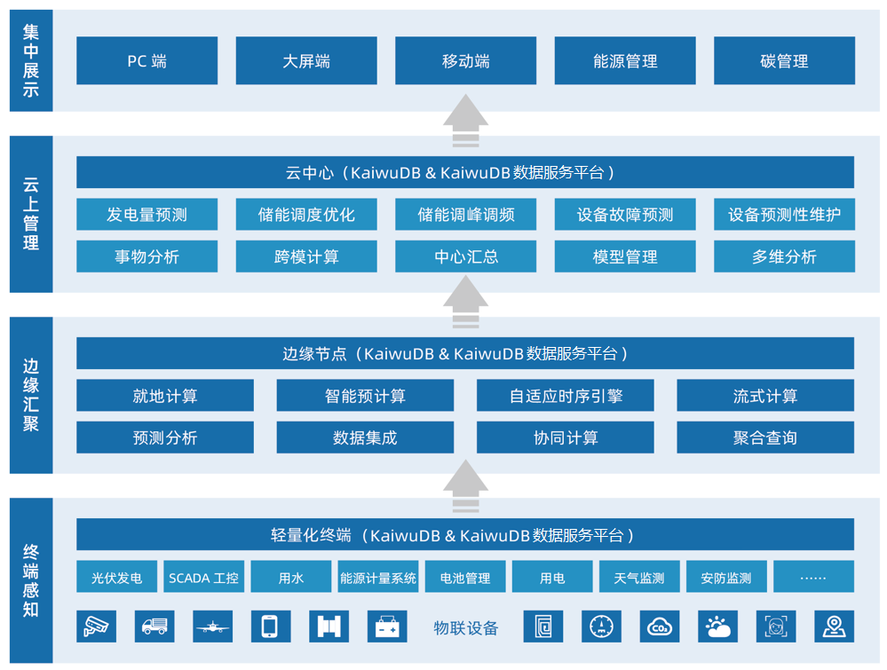
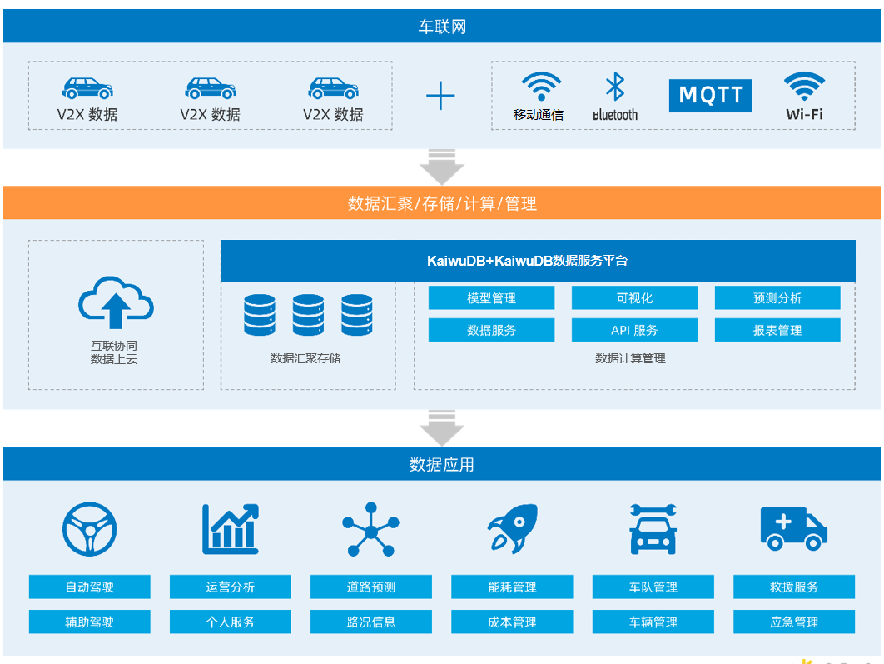
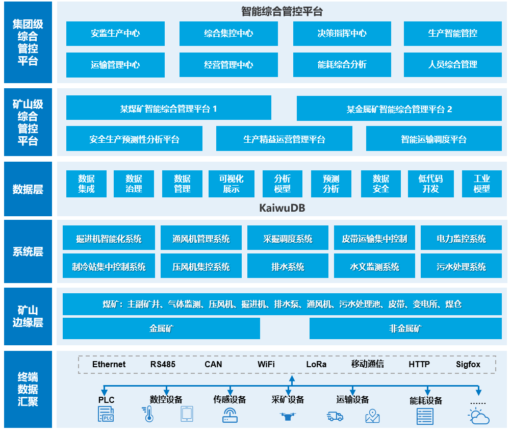

# 应用场景

KaiwuDB 主要面向工业物联网、车联网、数字能源、智慧产业等行业和场景。随着经济社会的进步与发展，上述行业场景的数据爆发式增长。KaiwuDB 提供卓越的性能和强大的复杂查询能力，旨在以极高的性能存储和分析海量多模数据。

目前，KaiwuDB 在工业物联网、数字能源、数字政务、金融等领域均已成功完成落地实践。未来，KaiwuDB 能够为工业物联网、数字能源、车联网、智慧产业等各大行业领域提供数字化赋能，助力企业从数据中挖掘更大的商业价值。

## 工业物联网

在工业制造、电力运行、化工生产等众多工业物联网领域，生产、测试、运行环境分布着大量用于实时监测、检查与分析的设备传感器。这些设备每时每刻都在产生带有时间戳标志、写多读少、极少更改、频率高、海量等独特特性的时序数据。另外，这些行业内部系统繁多，实时生产数据与各类业务数据混杂，增量及存量数据大，给企业整体数据管理带来了新的挑战。

KaiwuDB 提供针对海量工业数据的高吞吐写入能力，具备对接 SCADA 和 DCS 等系统的能力，能够将生产过程中的产生的机械设备、产线设备等实时数据以及生产管理过程中的设备管理等关系数据等进行统一的存储。KaiwuDB 采用就地计算和数据压缩等技术，确保数据的高效存储和管理。KaiwuDB 的数据服务平台集成来自不同来源的数据，形成统一的数据视图，并提供强大的分析工具，帮助企业挖掘数据价值，发现业务趋势和问题。KaiwuDB 从数据采集、存储、查询、分析全链路服务各种工业软件、大数据平台、物联网平台以及数据中台的建设，帮助企业最大化数据价值，提高运营效率，实现业务创新和决策优化。

## 数字能源

数字能源通常泛指基于数字技术和信息化手段，对能源的生产、传输、储存、使用等环节进行升级管理，以提高能源生产和利用效率，降低生产成本，减少环境污染。近几年，国家大力推动互联网、智能化技术与电力系统的融合发展，能源数字化发展离不开数据采集、存储、计算、应用等，同时也对上述流程提出更高的需求与挑战。

KaiwuDB 通过 AIoT 多模数据库的能力建设，将传感器、生产状况、机器运行状态等时序数据与人员信息、设备信息、业务数据等关系类数据统一汇聚，集中处理。KaiwuDB 支持百万级测点的数据汇入，提供强大的实时计算、事务处理、交互查询等能力，通过实时数据预测分析为企业提供准确的调峰调频等方案，通过实时数据的监测预警保障企业安全，实现能源数据的采集、存储、治理、计算分析与应用。

## 车联网

随着 IoT 技术的快速发展，车联网正在迅速普及和发展，成为智慧城市的重要组成部分。车联网中的数据具有实时性高、数据量大、类型多样、时效性要求高、交互性强、安全保密性高等特点。这些数据的持续生成和传输对数据管理提出了新的要求。

KaiwuDB 具备构建时序数据引擎的能力，将车端采集的车传感器数据、车辆中控状态数据、发动机数据等时序类数据，通过 MQTT 和移动通信网络高速写入到 KaiwuDB，然后经过网关汇聚到 KaiwuDB 时序数据库后进行存储、管理和计算分析，服务上层的业务系统。KaiwuDB 运用时序数据的聚合分析能力和高速查询能力对数据进行查询和分析，运用高性能和生命周期管理功能有效降低企业的存储成本和计算成本，整体降低企业建设车联网能力的总成本。

## 智慧产业

智慧产业作为智慧经济龙头的产业，是人的智慧在生产各要素中占主导地位的产业形态。以智慧矿山为例，随着勘探和矿产开发技术的提高以及能源需求量的大幅增加，矿山开发速度持续加快。随之而来的矿山资源综合利用率低、管理方式粗放、安全和环境污染等问题日益突出，使得矿业智能化建设迫在眉睫。近年来，政府机构十分重视采矿行业数字化、智慧化建设，明确提出加快建设自动化、信息化、智能化的矿山，促进矿山产业向安全、绿色、高效转型升级。智慧矿山建设助力企业实现生产控制少人化、无人化、生产管理智能化、安全管理本质化，这也是全面提升企业综合竞争力和可持续发展能力的关键路径之一。

KaiwuDB 支持存储关系数据、时序数据、地理位置数据等多种类型的数据。KaiwuDB 一库多用，以一套数据库打通在采、选、冶、产、供、销全流程下多个业务系统对数据的计算与分析能力。KaiwuDB 支持就地计算、智能预计算等核心技术，可以实现批量、高速、复杂查询的快速响应，实现对数据进行精准快速响应，为矿山数字化系统人员实时状态、设备运行状态、生产经营等业务场景提供支撑。

KaiwuDB 支持时序数据 3-30 倍的压缩，大幅降低数据存储成本。借助数据生命周期管理功能的数据分级治理，KaiwuDB 实现对数据的归档管理，有效节省数据存储空间。

