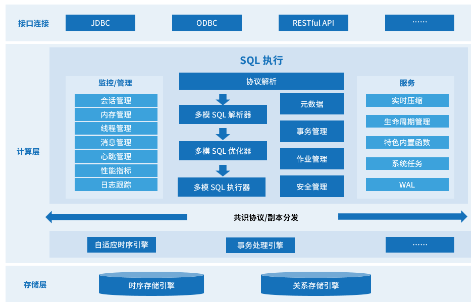

# 产品架构

相比传统的数据库，KWDB 提供多模数据管理能力，支持不同数据模型的统一存储，助力企业跨部门、跨业务统一管理数据，实现多业务数据融合，支撑多样化的应用服务。KWDB 的产品架构如下图所示：

**接口连接层**：支持 JDBC、ODBC、RESTful API 等多种标准化接口协议，确保与各类应用程序和开发工具良好兼容。

**计算层**：

- SQL 执行引擎：提供完整的 SQL 处理流程，包括协议解析、多模 SQL 解析器、多模 SQL 优化器和多模 SQL 执行器，支持时序和关系数据的统一查询处理。
- 监控管理模块：涵盖会话管理、内存管理、线程管理、消息管理、心跳管理、性能指标、日志跟踪等全方位的系统监控和管理功能。
- 核心服务组件：包括元数据管理、事务管理、作业管理、安全管理等核心数据库服务。
- 增值服务：提供实时压缩、生命周期管理、特色内置函数、系统任务、WAL（预写日志）等高级功能。
- 多引擎融合：融合多种数据计算引擎，根据不同模型数据特征选择最优存储计算模式，对外提供统一接口，提供多种分析计算能力，提升查询效率。
  - 自适应时序引擎：专门针对时序数据优化，支持多种时序数据特色的复杂查询及多维聚合方式，百万级数据可秒级写入、亿级数据可秒级读取；提供 5-30 倍实时压缩能力，数据压缩后无需解压缩即可使用。
  - 事务处理引擎：支持分布式事务和 MVCC 多版本并发控制，具备注释、视图、约束、索引、序列、存储过程、触发器等完整的关系数据库功能。

**存储层**：

- 时序存储引擎：专为时序数据优化的存储结构，支持高效的时间序列数据存储和检索。
- 关系存储引擎：基于传统关系模型的存储引擎，支持完整的 ACID 事务特性。