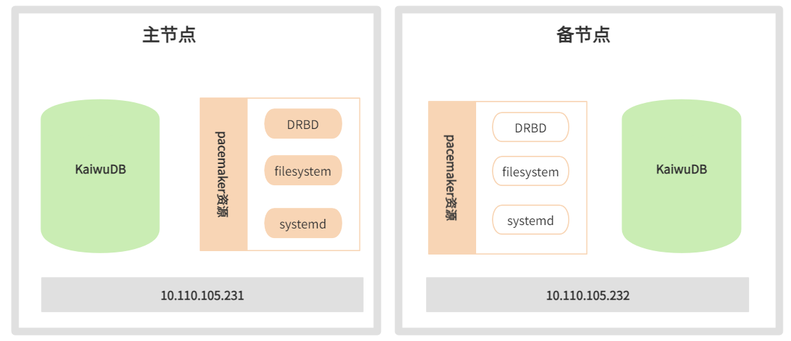
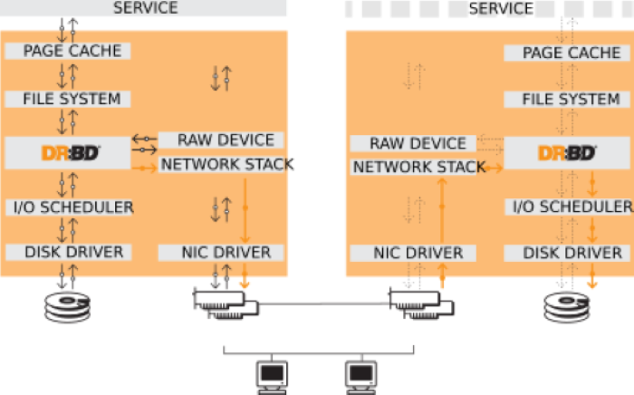

# 单机高可用性方案

物联网业务场景对数据库高可用性有极高的要求。发生硬件故障或者停机维护时，需要能够快速切换到备机以支撑业务持续运行，不间断地接收设备上传的数据，持续监控设备运行情况。因此，数据库必须具备高可用性方案，来满足业务连续性的要求。

在评估业务连续性能力时，需要考虑以下两个重要指标：

- **RTO：** 发生计划内或者计划外的停机事件后，系统恢复到可对外提供服务所需的时间。例如，RTO=0 意味着在遇到停机事件时，业务运行没有任何暂停，而 RTO=1 分钟表示遇到停机事件时，系统最多暂停服务 1 分钟便可恢复运行。
- **RPO：** 停机过程中丢失的用户数据量，通常以秒为单位计算。例如，RPO=0 意味着没有数据丢失，而 RPO=1 秒则意味着在停机并重启系统后，用户最多会丢失最后 1 秒录入系统的数据。

理想情况下，用户希望 RTO=0 并且 RPO=0，即在任何情况下，业务运行都可以连续提供服务，并且没有数据丢失。但这也意味着需要在系统设计时考虑硬件冗余、额外软件以及更多的资源使用成本，来实现高可用性目标。

更为现实的方式是结合业务实际需求，设定合理的 RTO 与 RPO 目标，然后选择合适的高可用性方案。KWDB 建议将目标细化为计划内和计划外场景下的 RTO 与 RPO，因为应对计划外停机事件的成本更高，计划外停机事件发生的机率也远低于计划内停机事件。因此，用户可以为计划内停机场景设置更严格的 RTO 与 RPO 指标，而对计划外停机场景降低要求。

高可用性方案通常由多个重要技术组件共同构成，包括系统运行状态的监控与健康检查、集群高可用性策略的制定与管理、集群资源的管理、自动化脚本的编排与执行，以及数据复制等。数据复制是其中最核心、最基础的技术组件。对于 KWDB 数据库系统来说，通过数据复制技术减少停机过程中的数据丢失是首要任务。

KWDB 集群部署默认支持高可用性，能够实现故障转移和数据强一致性。更多详细信息。参见[集群高可用](../db-operation/cluster-ha.md)。

KWDB 单机部署采用基于 DRBD 块设备复制的开源软件方案，以实现主备节点间的数据复制。使用 Pacemaker 方案用于监控运行状态，进行健康检查。Pacemaker 方案是 Linux-HA 工程的一部分，也是目前最成功开源高可用项目之一。Pacemaker 方案通过心跳服务和集群通信两项关键技术，构建了一个高可用集群，能够监控集群中各类资源的状态，执行实例漂移、主备切换等多种功能。

## 方案架构

单机高可用性方案架构如下图所示：



方案技术重点如下：

- 在主备节点各使用一个容量相等的块设备，用于 DRBD 主备复制。
- 主备节点的安装部署应保持完全一致，包括用户数据目录（即安装部署配置文件 `deploy.cfg` 中指定的 `data_root`目录）。
- 将 DRBD 设备挂载到用户数据目录，通过 DRBD 复制软件进行数据同步复制。
- CA 证书等文件由于未存放在用户数据目录中，需要从主节点手工同步至备节点（非安全部署方式无需执行本步骤）。
- 使用 `systemd` 服务来管理 KWDB 的启动和停止操作。
- 将 DRBD 设备、文件系统及 `systemd` 服务等资源统一定义在 Pacemaker 集群软件中，通过 Pacemaker 进行状态监控和管理。

## 技术介绍

Distributed Replicated Block Device（DRBD），分布式复制块设备是一种基于软件的无共享复制存储解决方案，用于复制主机之间的块设备（硬盘、分区、逻辑卷等）的内容。

DRBD 镜像数据具有以下特点：

- **实时**：应用程序修改设备上的数据时，复制将连续进行。
- **透明**：应用程序无需关心数据存储在多个主机上的细节。
- **同步或异步**：DRBD 提供同步和异步两种复制模式。在同步模式下，只有所有连接的主机都完成写操作后，应用程序才会收到写完成的通知。在异步模式下，本地完成写入时（通常在镜像数据传输到其他节点之前）应用程序就会收到写完成的通知。



由于 KWDB 的单机高可用性方案主要关注机房内单台设备故障时，如何利用备机尽快恢复运行，保障系统整体的连续可用，对于异地灾备的需求较少。在设计基于块设备复制的高可用性方案时，建议优先考虑使用同步复制协议来保障数据的一致性。

## 部署准备

### 环境要求

除需满足 KWDB [裸机安装部署](../quickstart/install-kaiwudb/quickstart-bare-metal.md)或[容器安装部署](../quickstart/install-kaiwudb/quickstart-docker.md)的环境要求外，单机高可用性方案还需额外满足以下环境要求：

- 网卡：千兆或万兆
- DRBD: 9.11.0
- Pacemaker: 2.0.3

### 配置 IP 地址和主机名

步骤：

1. 在主备节点的`/etc/hosts`文件中配置主备节点的 IP 地址和主机名。

   示例：

   ```shell
   your-master-host-ip   ha-node01
   your-backup-host-ip   ha-node02
   ```

### 配置非交互式 SSH 登录

步骤：

1. 登录主节点，生成公私密钥对：
   
   ```shell
   ssh-keygen -f ~/.ssh/id_rsa -N ""
   ```

   参数说明：

   - `-f`：指定生成的密钥对文件名。

   - `-N`：指定密钥的密码，为实现非交互式登录，将密码设置为空。

2. 将公钥分发到备节点：

   ```shell
   ssh-copy-id -f -i ~/.ssh/id_rsa.pub -o StrictHostKeyChecking=no <secondary_node> 
   ```

3. 检查主节点能否非交互式地登录备节点：

   ```shell
   ssh <secondary_node>
   ```

4. 登录备节点，配置非交互式 SSH 登录主节点。

### 关闭相关服务

步骤：

1. 查看系统的`/bin/sh`文件的详细信息：

   ```shell
   ls -al /bin/sh
   ```

2. 在主备节点上重新配置 `dash` shell，选择 `no`：

   ```shell
   sudo dpkg-reconfigure dash
   ```

3. 在主备节点停止并禁用 `multipathd.socket`、`multipath-tools` 和 `multipath` 服务：

   ```shell
   systemctl stop multipathd.socket
   systemctl disable multipathd.socket
   systemctl stop multipath-tools.service
   systemctl disable multipath-tools.service
   systemctl stop multipath
   systemctl disable multipath
   ```

## 方案部署

本节以Ubuntu 20.04，DRBD 9.11.0，Pacemaker 2.0.3，pcs 0.10.4为例说明如何部署单机高可用性方案。

使用不同版本的 Linux 系统、 DRBD 软件和 Pacemaker 软件时，操作命令格式可能会有所不同。

### 搭建 Pacemaker 集群

前提条件：

- 主备节点的 IP 地址在同一子网内，且子网内有未分配的 IP 地址用于建立虚拟 IP 地址（virtual IP）。
- 主备节点已通过 NTP 协议进行时间同步。提示：可以通过安装 chrony 包来实现 NTP 时间同步。
- 主备节点已配置非交互式 SSH 登录。

步骤：

1. 在主备节点安装 Pacemaker、corosync 和 pcs 软件包，安装完成之后系统会默认创建 `hacluster` 用户。

   ```shell
   apt install pacemaker corosync pcs
   ```

2. 授权操作用户。

   1. 在主备节点为 hacluster 用户设置密码：

         ```shell
         passwd hacluster 
         ```

   2. 在任一节点销毁软件安装后自动建立的默认集群：

         ```shell
         pcs cluster destroy 
         ```

   3. 在任一节点授权用户管理节点，根据系统提示输入密码。

         ```shell
         pcs host auth <primary_node> <secondary_node> -u hacluster 
         ```

         示例：

         ```shell
         pcs host auth ha-node01 ha-node02 -u hacluster 
         ```

3. 在任一节点创建并启动高可用集群

   ```shell
   pcs cluster setup <cluster_name> <primary_node> <secondary_node> --start --enable --force
   ```

   参数说明：

   - `cluster_name`：新创建的集群名称。

   - `primary_node`：主节点的主机名。

   - `secondary_node`：备节点的主机名。

   - `--start`：创建集群后启动高可用集群。

   - `--enable`：设置集群开机自启动。

   - `--force`：删除之前残留的集群配置信息。

    示例：

   ```shell
   root@ha-node01:~# pcs cluster setup ha-cluster ha-node01 ha-node02 --start --enable --force
   No addresses specified for host 'ha-node01', using 'ha-node01'
   No addresses specified for host 'ha-node02', using 'ha-node02'
   Destroying cluster on hosts: 'ha-node01','ha-node02'...
   ha-node01: Successfully destroyed cluster
   ha-node02: Successfully destroyed cluster
   Requesting remove 'pcsd settings' from 'ha-node01','ha-node02'
   ha-node01: successful removal of the file 'pcsd settings'
   ha-node02: successful removal of the file 'pcsd settings'
   Sending 'corosync authkey', 'pacemaker authkey' to 'ha-node01','ha-node02'
   ha-node01: successful distribution of the file 'corosync authkey'
   ha-node01: successful distribution of the file 'pacemaker authkey'
   ha-node02: successful distribution of the file 'corosync authkey'
   ha-node02: successful distribution of the file 'pacemaker authkey'
   Sending 'corosync.conf' to 'ha-node01','ha-node02'
   ha-node01: successful distribution of the file 'corosync.conf'
   ha-node02: successful distribution of the file 'corosync.conf'
   cluster has been successfully set up.
   Enabling cluster on hosts:'ha-node01','ha-node02'...
   ha-node01: Cluster enabled
   ha-node02: Cluster enabled
   Starting cluster on hosts: 'ha-node01','ha-node02'...
   ```

4. 在任一节点配置强行关机协议：

   ```shell
   pcs property set stonith-enabled=false
   pcs property set no-quorum-policy=ignore
   ```

5. 在任一节点检查集群状态：

   ```shell
   pcs status
   ```

   示例：

   ```shell
   root@ha-node01:~# pcs status
   Cluster name: ha-cluster
   Cluster Summary:
      * Stack: corosync
      * Current DC: ha-node01 (version 2.0.4-4b1f869f0f) - partition with quorum
      * Last updated: Tue Sep 26 03:49:28 2023
      * Last change: Tue Sep 26 03:48:20 2023 by root via cibadmin on ha-node01
      * 2 nodes configured
      * 0 resource instances configured
      
   Node List:
      * Online: [ ha-node01 ha-node02 ]
      
   Full List of Resources:
      * No resources
      
   Daemon Status:
      corosync: active/enabled
      pacemaker: active/enabled
      pcsd: active/enabled
   ```

6. 在任一节点创建虚拟 IP 资源（ClusterIP），配置属性和监控操作：

   ```shell
   pcs resource create ClusterIP ocf:heartbeat:IPaddr2 ip=<virtual_ip_address> cidr_netmask=24 op monitor interval=30s
   ```

   参数说明：

   - `virtual_ip_address`：虚拟 IP 地址。

7. （可选）检查资源是否创建成功：

      ```shell
      pcs resource
      ```

      示例：

      ```shell
      root@ha-node01:/etc# pcs resource
      ClusterIP      (ocf::heartbeat:IPaddr2):       Started ha-node01
      ```

8. （可选）使用`arp -vn`检查虚拟 IP 地址的 MAC 地址是否和主节点的网卡 MAC 地址一致：

9. 在任一节点模拟计划内停机事件来测试资源漂移，Pacemaker 集群会自动将 ClusterIP 资源漂移到备节点上。

      1. 将主节点设置为待机状态：

         ```shell
         pcs node standby <primary_node>
         ```

      2. 等待一段时间后，解除主节点的待机状态：

         ```shell
         pcs node unstandby <primary_node>
         ```

10. （可选）检查资源漂移结果：

      ```shell
      pcs resource
      ```

     示例：

      ```shell
      root@ha-node02:~# pcs resource
      ClusterIP      (ocf::heartbeat:IPaddr2):       Started ha-node02
      ```

### 建立 DRBD 复制关系

前提条件：

- 已在主备节点预备容量相等的块设备（硬盘、分区、逻辑卷）。

- 如果使用磁盘或磁盘分区，例如`/dev/sdd`，由于磁盘或磁盘分区名称会因为系统重启而变化，已通过 `udevadm info`命令获取到磁盘位于`/dev/disk/by-id/`的稳定标识符作为该磁盘的唯一标识符。

   ```shell
   udevadm info /dev/sdd
   ...
   E: DEVLINKS= .../dev/disk/by-id/scsi-36f80f41ffaf5a00028e0acde21f326ff
   E: TAGS=:systemd:
   ```

步骤：

1. 在主备节点安装 DRBD 软件：

   ::: warning 提示
   配置类型建议选择“No configuration”。
   :::

   ```shell
   apt install drbd-utils 
   ```

2. 在主备节点配置 DRBD 参数。

   1. 切换至`/etc/drbd.d` 目录：

      ```sql
      cd /etc/drbd.d
      ```

   2. 修改 `global_common.conf`配置文件，定义 DRBD 的全局性参数以及默认参数。

      示例：

      ```shell
      # DRBD is the result of over a decade of development by LINBIT.
      # In case you need professional services for DRBD or have
      # feature requests visit http://www.linbit.com
       
      global {
              usage-count no;
              # minor-count dialog-refresh disable-ip-verification
              # cmd-timeout-short 5; cmd-timeout-medium 121; cmd-timeout-long 600;
      }
       
      common {
              protocol C;
       
              handlers {
                      # These are EXAMPLE handlers only.
                      # They may have severe implications,
                      # like hard resetting the node under certain circumstances.
                      # Be careful when chosing your poison.
       
                      # pri-on-incon-degr "/usr/lib/drbd/notify-pri-on-incon-degr.sh; /usr/lib/drbd/notify-emergency-reboot.sh; echo b > /proc/sysrq-trigger ; reboot -f";
                      # pri-lost-after-sb "/usr/lib/drbd/notify-pri-lost-after-sb.sh; /usr/lib/drbd/notify-emergency-reboot.sh; echo b > /proc/sysrq-trigger ; reboot -f";
                      # local-io-error "/usr/lib/drbd/notify-io-error.sh; /usr/lib/drbd/notify-emergency-shutdown.sh; echo o > /proc/sysrq-trigger ; halt -f";
                      # fence-peer "/usr/lib/drbd/crm-fence-peer.sh";
                      # split-brain "/usr/lib/drbd/notify-split-brain.sh root";
                      # out-of-sync "/usr/lib/drbd/notify-out-of-sync.sh root";
                      # before-resync-target "/usr/lib/drbd/snapshot-resync-target-lvm.sh -p 15 -- -c 16k";
                      # after-resync-target /usr/lib/drbd/unsnapshot-resync-target-lvm.sh;
              }
       
              startup {
                      # wfc-timeout degr-wfc-timeout outdated-wfc-timeout wait-after-sb
              }
       
              options {
                      # cpu-mask on-no-data-accessible
              }
       
              disk {
                      # size on-io-error fencing disk-barrier disk-flushes
                      # disk-drain md-flushes resync-rate resync-after al-extents
                      # c-plan-ahead c-delay-target c-fill-target c-max-rate
                      # c-min-rate disk-timeout
                      on-io-error detach;
                      no-disk-flushes;
                      no-md-flushes;
              }
       
              net {
                      # protocol timeout max-epoch-size max-buffers
                      # connect-int ping-int sndbuf-size rcvbuf-size ko-count
                      # allow-two-primaries cram-hmac-alg shared-secret after-sb-0pri
                      # after-sb-1pri after-sb-2pri always-asbp rr-conflict
                      # ping-timeout data-integrity-alg tcp-cork on-congestion
                      # congestion-fill congestion-extents csums-alg verify-alg
                      # use-rle
                      sndbuf-size 512k;
                      max-buffers 8000;
                      max-epoch-size 8000;
                      unplug-watermark 1024;
                      cram-hmac-alg "sha1";
                      shared-secret "justaverificationtest";
                      #after-sb-0pri disconnect;
                      #after-sb-1pri disconnect;
                      #after-sb-2pri disconnect;
                      after-sb-0pri discard-zero-changes;
                      after-sb-1pri discard-secondary;
                      after-sb-2pri disconnect;
                      rr-conflict   disconnect;  
              }
       
              syncer {
                      rate 330M;
                      al-extents 517;
                      verify-alg crc32c;
              }
      }
      ```

   3. 修改 `*.res` 配置文件，定义通过 DRBD 复制的块设备资源，文件名称支持自定义。

      示例：

      ```shell
      resource drbd3 {     ##与文件名相同
              on ha-node01 {     ##主节点主机名
              device /dev/drbd3;    ##自定义设备名称
              disk /dev/sde;     ##挂载的供同步的磁盘盘符
              address your-master-host-ip:port;    ##主节点IP
              meta-disk internal;
              }
              on ha-node02 {    ##备节点主机名
              device /dev/drbd3;    ##自定义设备名称
              disk /dev/sde;      ##挂载的供同步的磁盘盘符
              address your-backup-host-ip:port;    ##备节点IP
              meta-disk internal;
              }
      ```

3. 配置文件生效后，在主备节点写入元数据：

   示例：

   ```shell
   drbdadm create-md drbd3
   drbdadm adjust all
   ```

4. 登录主节点，启动主备复制。命令执行后即启动初始化复制，复制时间可能会因存储大小而较长。

   ::: warning 注意
   此命令会覆盖备节点磁盘中所有的数据，只需第一次初始化复制时执行。
   :::

   ```shell
   drbdadm -- --overwrite-data-of-peer primary drbd3
   ```

5. （可选）执行`drbdadm status`命令查看复制进度。

   示例：

   - 复制进行中

        ```shell
        root@ha-node01:/etc/drbd.d# drbdadm status drbd3
        drbd3 role:Secondary
          disk:Inconsistent
          peer role:Primary
        replication:SyncTarget peer-disk:UpToDate done:24.90
         
        root@ha-node02:/etc/drbd.d# drbdadm status drbd3
        drbd3 role:Primary
          disk:UpToDate
          peer role:Secondary congested:yes
        replication:SyncSource peer-disk:Inconsistent done:25.28
        ```

   - 复制完成

        ```shell
        root@ha-node01:/etc/drbd.d# drbdadm status drbd3
        drbd3 role:Secondary
          disk:UpToDate
          peer role:Primary
        replication:Established peer-disk:UpToDate
         
        root@ha-node02:/etc/drbd.d# drbdadm status drbd3
        drbd3 role:Primary
          disk:UpToDate
          peer role:Secondary
        replication:Established peer-disk:UpToDate
        ```

6. 完成复制后，在主节点的块设备上创建文件系统。文件系统创建完成之后就可以挂载文件系统并正常使用。

   示例：

   ```shell
   mkfs.ext4 /dev/drbd3
   ```

### 部署高可用环境

1. 在主备节点创建数据库目录。

   示例：

   ```shell
   mkdir –p /var/lib/kaiwudb
   ```

2. 在资源活动节点挂载文件系统。

   示例：

   ```shell
   mount /dev/drbd3 /var/lib/kaiwudb
   ```

3. 登录任一节点，在 Pacemaker 高可用集群中创建 DRBD 资源，由 Pacemaker 统一管理 DRBD 复制。

   示例：

   ```shell
   pcs resource create KaiwuData ocf:linbit:drbd drbd_resource="drbd3" op monitor interval=10s #创建名为KaiwuData的资源，指定DRBD资源名为drbd3，每 10 秒监控一次资源状态
   pcs resource promotable KaiwuData promoted-max=1 promoted-node-max=1 clone-max=2 clone-node-max=1 notify=true #支持资源节点内移动、指定可提升节点数和可克隆节点数
   pcs resource refresh KaiwuData #刷新资源状态
   ```

4. 在任一节点检查 Pacemaker 集群中 DRBD 资源的状态。

   ::: warning 提示
   如果发现资源状态不正确，可先通过`drbdadm status`命令检查 DRBD 状态；如果仍有问题，可以通过`systemctl restart drbd`命令重启 DRBD 服务来尝试修复。
   :::

   示例：

   ```Plain
   pcs resource
   * Clone Set: KaiwuData-clone [KaiwuData] (promotable):
   * Promoted: [ ha-node02 ]
   * Stopped: [ ha-node01 ] 
   ```

5. 在任一节点定义 Filesystem 资源以及 Filesystem 资源与 DRBD 资源的依赖关系，由 Pacemaker 管理主备切换时的挂载操作。

   示例：

   ```shell
   pcs resource create KaiwuFS ocf:heartbeat:Filesystem device="/dev/drbd3" directory="/var/lib/kaiwudb" fstype="ext4" #创建名为 KaiwuFS的文件系统资源，指定DRBD设备文件、挂载点和文件系统类型
   pcs constraint colocation add KaiwuFS  with KaiwuData-clone  INFINITY with-rsc-role=Master #添加亲和性约束
   pcs constraint order promote KaiwuData-clone  then start KaiwuFS #添加启动顺序约束
   ```

6. 在备节点安装 KWDB。 

   1. 检查当前 DRBD 和 Filesystem 资源的活动节点是否为备节点，如果活动节点为主节点需要先将资源迁移到备节点上，然后恢复主节点的在线状态。

      1. 将主节点设置为待机状态：

         ```shell
         pcs node standby <primary_node>
         ```

      2. 等待一段时间后，解除主节点的待机状态：

         ```shell
         pcs node unstandby <primary_node>
         ```

   2. 安装部署 KWDB，具体安装步骤见[单节点裸机部署](../quickstart/install-kaiwudb/quickstart-bare-metal.md)或[单节点容器部署](../quickstart/install-kaiwudb/quickstart-docker.md)。

      ::: warning 注意
      - 确保在`deploy.cfg`配置文件中，将 `data_root` 配置为文件系统资源，示例中KaiwuFS 指定的目录。
      - 备节点安装完成后，删除 `data_root` 所指定目录中的所有文件，之后将通过 DRBD 复制将从主节点该目录中的数据复制到备节点中。
      :::

7. 在主节点安装 KWDB。

   1. 确保 DRBD 和 Filesystem 资源的活跃节点为主节点。

   2. 安装部署 KWDB，具体安装步骤见[单节点裸机部署](../quickstart/install-kaiwudb/quickstart-bare-metal.md)或[单节点容器部署](../quickstart/install-kaiwudb/quickstart-docker.md)。

   3. 配置主节点证书允许通过备节点 IP 和 VIP 访问。

      ::: warning 提示
      如果主备节点采用非安全部署方式则无需执行本步骤操作。
      :::
      1. 删除`/etc/kaiwudb/certs`目录下已有的`node.crt`和`node.key`文件。

      2. 执行证书生成命令，允许备节点和虚拟IP地址访问主节点证书。

         ```shell
         kwbase cert create-node <primary_node_ip> <secondary_node_ip> <virtual_ip> 127.0.0.1 0.0.0.0 localhost --certs-dir=/etc/kaiwudb/certs --ca-key=ca.key
         ```

      3. 将主节点`/etc/kaiwudb/certs/*`中的证书文件复制到备节点相同目录。

         ```shell
         scp /etc/kaiwudb/certs/* ha-node02:/etc/kaiwudb/certs/
         ```

8. 在任一节点的 Pacemaker 集群中定义 KWDB 数据库资源以及与其它资源的依赖关系。

      示例：

      ```Plain
      pcs resource create KaiwuDB systemd:kaiwudb.service op monitor on-fail=restart #创建新资源
      pcs resource defaults migration-threshold=2 #设置资源默认值
      pcs resource meta KaiwuDB failure-timeout=10s #设置资源元数据
      pcs constraint colocation add KaiwuDB  with KaiwuFS  INFINITY #设置亲和性约束
      pcs constraint order start KaiwuFS then start KaiwuDB #设置启动顺序约束
      pcs resource group add KaiwuDBGrp KaiwuFS KaiwuDB #创建资源组，对资源进行统一管理
      ```

9. 在任一节点创建虚拟 IP 地址与数据库资源之间的依赖关系。

      示例：

      ```Plain
      pcs constraint colocation add ClusterIP with KaiwuDB  INFINITY 
      ```

10. 在任一节点检查高可用集群状态。

     1. 通过`pcs status`命令查看集群状态。

         示例：

         ```shell
         root@ha-node01: ~# pcs status
         Cluster name: ha-cluster
         Cluster Summary:
         * Stack: corosync
         * Current DC: ha-node01 (version 2.0.3-4b1f869fof) - partition with quorum
         * Last updated: Mon Jul 1 16:15:01 2024
         * Last change: Mon Jul 1 10:58:57 2024 by root via cibadmin on ha-node02
         * 2 nodes configured
         * 5 resource instances configured
         
         Node List:
         * Online: [ ha-node01 ha-node02 ]

         Full List of Resources:
         * ClusterIP (ocf::heartbeat:IPaddr2):   Started ha-node01 
         * Clone Set: KaiwuData-clone [KaiduData] (promotable):
         * Masters: [ ha-node01 ]
         * Slaves: [ ha-node02 ]
         * Resource Group: KaiwuDBGrp:
         * KaiwuFS (ocf::heartbeat:Filesystem): Started ha-node01
         * KaiwuDB (systemd: kaiwudb.service):  Started ha-node01

         Daemon Status:
         corosync: active/enabled
         pacemaker: active/enabled
         pcsd: active/enabled
         ```

     2. 通过`pcs constraint`命令检查集群资源之间的依赖关系。更多 Pacemaker 相关的操作指令见 [Pacemaker 参考文档](https://clusterlabs.org/pacemaker/doc/)。

## 方案验证

步骤：

1. 连接 KWDB 数据库，更多操作信息见[连接 KWDB](../quickstart/overview.md)。

2. 执行数据库增删改查操作。

3. 将主节点设置为待机状态。

   ```shell
   pcs node standby <primary_node>
   ```

4. 大约经过 40 秒左右，查询集群状态。

   示例：

   ```shell
   root@ha-node01: ~# pcs status
   Cluster name: ha-cluster
   Cluster Summary:
   * Stack: corosync
   * Current DC: ha-node01 (version 2.0.3-4b1f869fof) - partition with quorum
   * Last updated: Mon Jul 1 16:15:01 2024
   * Last change: Mon Jul 1 10:58:57 2024 by root via cibadmin on ha-node02
   * 2 nodes configured
   * 5 resource instances configured

   Node List:
   * Online: [ ha-node02 ]

   Full List of Resources:
   * ClusterIP (ocf::heartbeat:IPaddr2):   Started ha-node02
   * Clone Set: KaiwuData-clone [KaiduData] (promotable):
   * Masters: [ ha-node02 ]
   * Stopped: [ ha-node01 ]
   * Resource Group: KaiwuDBGrp:
   * KaiwuFS (ocf::heartbeat:Filesystem): Started ha-node02
   * KaiwuDB (systemd: kaiwudb.service):  Started ha-node02

   Daemon Status:
   corosync: active/enabled
   pacemaker: active/enabled
   pcsd: active/enabled
   ```

6. 将主节点设置为在线状态。

   示例：

   ```shell
   pcs node unstandby ha-node01
   ```

7. （可选）查看集群状态。

   示例：

   ```shell
   root@ha-node01: ~# pcs status
   Cluster name: ha-cluster
   Cluster Summary:
   * Stack: corosync
   * Current DC: ha-node01 (version 2.0.3-4b1f869fof) - partition with quorum
   * Last updated: Mon Jul 1 16:15:01 2024
   * Last change: Mon Jul 1 10:58:57 2024 by root via cibadmin on ha-node02
   * 2 nodes configured
   * 5 resource instances configured
   
   Node List:
   * Online: [ ha-node01 ha-node02 ]

   Full List of Resources:
   * ClusterIP (ocf::heartbeat:IPaddr2):   Started ha-node02
   * Clone Set: KaiwuData-clone [KaiduData] (promotable):
   * Masters: [ ha-node02 ]
   * Slaves: [ ha-node01 ]
   * Resource Group: KaiwuDBGrp:
   * KaiwuFS (ocf::heartbeat:Filesystem): Started ha-node02
   * KaiwuDB (systemd: kaiwudb.service):  Started ha-node02

   Daemon Status:
   corosync: active/enabled
   pacemaker: active/enabled
   pcsd: active/enabled
   ```

1. 通过备节点登录数据库。
2. 执行数据库增删改查操作。主备切换之后数据没有丢失，数据库读写正常。
3. 通过同样的方式将活跃节点回切到主节点，通过主节点登录数据库，检查表中的数据是否符合预期。

## 附录

### 常用 Pacemaker 操作指令

- 创建和销毁高可用集群：

  - 创建集群：

      ```shell
      pcs cluster setup <cluster_id> ...
      ```

  - 销毁集群：

      ```shell
      pcs cluster destroy <cluster_id>
      ```

- 节点管理：

  - 将节点置为待机状态：

      ```shell
      pcs node standby <node_id>
      ```

  - 解除节点的待机状态：

      ```shell
      pcs node unstandby <node_id>
      ```

- 资源管理：

  - 创建资源：

      ```shell
      pcs resource create <resource_id> ...
      ```

  - 移除资源：

      ```shell
      pcs resource remove <resource_id>
      ```

- 约束管理：

  - 配置资源相关性：

      ```shell
      pcs constraint colocation ...
      ```

### 常用 DRBD 复制操作指令

- 使用 drbdadm 工具来管理 DRBD 复制关系：

  - 创建元数据和启动复制关系：

      ```shell
      drbdadm --overwrite-data-of-peer primary <resource_id>
      ```

  - 查看 DRBD 状态和信息：

      ```shell
      drbdadm status <resource_id>
      ```

- 使用 drbdmon 来监控 DRBD：

   ```shell
   drbdmon
   ```