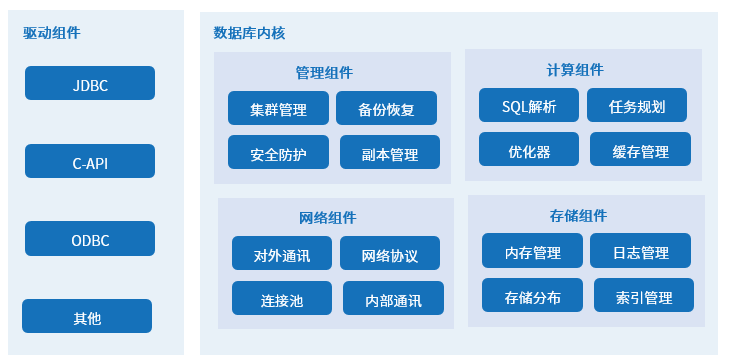

# 基本概念

## 数据库通用概念

### 数据库

数据库的概念有狭义和广义之分。

狭义数据库指按照一定的逻辑结构组织、存储和和管理数据的大容量电子文件柜。一个数据库中可以包含多张表，每张表存储特定类型的数据，例如文字、数字、图像等。用户可以根据需求写入、查询、更新或删除表内的数据。

广义数据库通常指数据库系统，包括数据库和数据库管理系统两部分。数据库系统向上通过数据库管理系统支撑应用引擎，向下以数据库承接文本、数字、图像等数据源，调动计算、网络、存储等基础资源。

**数据库管理系统**：对数据库进行统一管理和控制的大型软件，通常用于建立、使用和维护数据库。数据库管理系统由内核组件集和驱动组件构成，其中内核组件集包括管理组件、存储组件、计算组件和网络组件。

### 数据库类型

数据库可以按照不同维度进行分类，常见的分类依据包括数据模型、架构、部署模式等。一个数据库按照不同的分类依据可能分属于不同的类型。

### 数据库用户

任何通过应用程序访问数据库的人都属于数据库用户。数据库用户根据用户与数据库的交互方式可以分为不同类别。

### 数据库实例

数据库实例指数据库运行时的内存和后台进程，负责管理连接和执行数据库操作。用户通过连接到实例来访问和使用数据库。数据库启动后，数据文件将被挂载到实例上，用于执行数据访问和管理操作。

### 数据库对象

数据库对象是数据库中用来存储和指向数据的各种概念和结构的总称。

下表列出常见的数据库对象及其作用

| 对象                   | 名称       | 作用                                                                                                      |
| -------------------------- | -------------- | ------------------------------------------------------------------------------------------------------------- |
| TABLE                      | 表             | 用于存储数据的基本结构。                                                                                      |
| VIEW                       | 视图           | 以不同的侧面反映表的数据，是一种逻辑上的虚拟表，视图本身不存储数据。                                      |
| INDEX                      | 索引           | 索引提供指向存储在表的指定列中的数据值的指针，如同图书的目录，能够加快表的查询速度。                          |
| SEQUENCE                   | 序列           | 用来产生唯一整数的数据库对象。                                                                                |
| STORED PROCEDURE、FUNCTION | 存储过程、函数 | 一组为了完成特定功能的 SQL 语句集。存储过程和函数经过编译后，可以被重复调用，从而减少数据库开发人员的工作量。 |

### SQL

SQL（Structured Query Language，结构化查询语言）是用于管理和操作数据库的标准化编程语言。根据在数据库操作中的功能和用途，SQL 语句分为以下几类：

- **数据定义语言**（Data Definition Language，DDL）：用于定义或改变表的结构、数据类型、表之间的链接和约束等初始化工作，通常在建表时使用。常用的语句关键字包括：
  - CREATE：创建数据库对象。
  - ALTER：修改现有数据库对象。
  - DROP：删除现有数据库对象。
  - RENAME：重命名现有数据库对象。
  - TRUNCATE：清空现有数据库对象中的数据。
- **数据操纵语言**（Data Manipulation Language，DML）：用于添加、删除、更新数据库记录，并检查数据完整性。常用的语句关键字包括：
  - INSERT：向表中插入数据。
  - UPDATE：更新表中的现有数据。
  - UPSERT：更新表中的现有数据。
  - DELETE：从表中删除数据。
- **数据控制语言**（Data Control Language，DCL）：用于授予或回收访问数据库的某种特权。常用的语句关键字包括：
  - GRANT：授予指定权限。
  - REVOKE：撤销指定权限。
- **数据查询语言**（Data Query Language，DQL）：用于查询数据库记录，通常也可以归类于 DML。常用的语句关键字包括：
  - SELECT：从数据库中检索数据。

## KWDB 基础概念

### KWDB 多模数据库

KWDB 深度融合了自适应时序引擎、事务处理引擎、预测分析引擎、超速分析引擎和内存实时引擎，支持在同一实例同时建立时序库和关系库并融合处理多模数据，属于多模数据库。

### 关系库

- **关系库**：用于存储和管理关系数据的数据库对象（Relational Database）。同一数据库实例可创建一个或多个关系库。每个关系库包括关系表、视图、索引等对象。

- **关系表**：在关系库下创建的数据表（Base Table）。每个关系库下可以创建多张关系表，表中的每列为一个字段，每行为一条记录。

    

- **字段**：每个字段包括两个属性：字段名称和数据类型。字段名称和数据类型需要在建表时指定，部分数据类型支持限制数据长度。

    

### 时序库

- **时序库**：用于存储和管理时序数据的数据库对象（Time Series Database）。同一数据库实例可以创建一个或多个时序库。时序库只包含时序表。

- **时序表**：在时序库下建立的数据表（Time Series Table）。每个时序库下可以创建多张时序表。除字段外，时序表还需要包括时间戳列和标签列。时间戳列用于记录数据采集的时间。标签列用于记录采集对象的静态数据。字段用于记录采集对象的实时数据。

    

- **标签**：标签可进一步细分为主标签和非主标签。主标签用于区分不同的实体。每张表需要指定至少一个主标签。例如，传感器的主标签可以是 `sensor_id`，因为每个传感器都有唯一的 ID。主标签需要在建表时指定，且后续不允许修改或删除主表签。

    

    以下示例说明如何定义标签和主标签。

    
