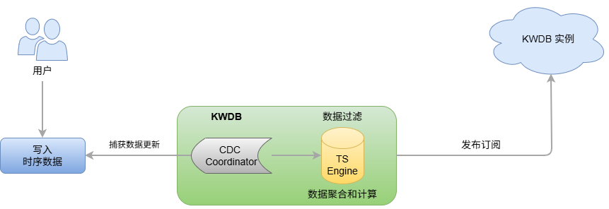

# 流计算

KWDB 提供开箱即用的流计算功能，旨在对实时入库的时序数据进行流式处理。用户可以使用 SQL 语句定义流计算的数据来源、需应用的计算规则、数据过滤条件及需要写入的目标表。流计算主要用于以下应用场景：

- 智能降采样​​：流计算可以将高频率采样的原始数据（如每秒 1000 个点）实时降采样（如每秒仅保留一个点）后保存到另一张时序表中。用户可以通过发布订阅功能把降采样后的数据同步到 KWDB 云端实例。
- 预计算加速实时决策​：流计算可以实时对一些重复的查询进行预计算，并将查询结果保存在新的时序表中。用户可以通过直接查询预计算时序表达到快速获取计算结果的目的。

KWDB 的流计算为复杂的流处理系统提供轻量级解决方案，不依赖任何外部组件，可以在高吞吐量的时序数据写入场景下，提供高效的实时流计算能力。

## 工作原理

KWDB 流计算功能使用变更数据捕获（Change Data Capture，CDC）机制实时捕获写入的时序数据，并使用 SQL 语句定义实时流变换。当数据写入流计算的源表后，系统使用定义的方式自动处理数据，并把处理结果写入目标表。

流计算包含数据过滤、标量函数计算、以及窗口聚合（支持滑动窗口、会话窗口与状态窗口）。其源表为时序表，目标表可以为时序表或关系表。流计算创建后，新插入的数据应用用户定义的数据过滤和变换规则并写入到目标表中。如果源表中存在历史数据，用户可以通过流计算创建参数选择处理方式。此外，KWDB 流计算也能够通过乱序数据处理策略参数处理乱序写入的数据。用户可以根据业务场景需求进行调整。

## 使用限制

- 不支持对多个时序表、时序库或关系表进行流计算。
- 不支持分布式集群高可用。
- 不支持同步 DDL 操作。用户需要手动停止流计算后再进行 DDL 操作，然后再重启流计算流程。
- 不支持指定数据去重规则。
- 流计算的 `stream_query` 参数
  - 如果目标表是时序表，`select_list` 必须满足时序表约束（包括非空时间戳列和全部 Primary Tag 列）。
    - 如未指定别名，则按照 `select_list` 中数据列出现的顺序构造目标表插入语句。
    - 如指定别名，则别名应与目标表的列名相同，且包含所有非空列（包括数据列和标记列）。如需指定别名，需要全部列都使用别名。
    - 为了支持流计算的暂停、恢复特性，需要把每个聚合窗口的起止时间（`window_start`、`window_end`）记录到目标表中且作为最开始的两个输出列，并以窗口开始时间作为目标表的数据时间。
  - 当使用 `WHERE` 子句对原始数据进行过滤时，由于捕获的用户输入中可能不包含普通 Tag 列的数据，系统需要实时从时序表读取普通 Tag 列的数据，可能会带来额外的性能开销。
  - 当使用 `GROUP BY` 子句对数据进行分组聚合时
    - `GROUP BY` 子句中必须包含窗口函数（会话窗口、状态窗口、时间窗口、事件窗口与计数窗口）或 `Timebucket` 函数。其中，使用状态窗口、事件窗口与计数窗口三种窗口函数分组时，必须与全部 Primary Tag 列一起使用。
    - KWDB 窗口函数仅支持 `GROUP BY [<ptag>,]`、`group_window_function`，不支持其它分组条件。
    - 不支持使用部分 Primary Tag 进行分组，也不支持仅对普通 Tag 列和或数据列进行分组。
    - 使用 `count_window` 函数重算过期数据后，插入过期数据会影响后面所有窗口，因此可能与使用流计算中查询语句直接查询源表结果不一致。
  - 支持函数计算（时间函数、字符串函数等），与普通 `SELECT` 语句相同。函数可以应用在 `stream_query` 的任意位置，包括 `select_list` 子句和 `WHERE` 子句。
  - 不支持使用 `ORDER BY` 子句。如果用户在 `stream_query` 中使用了非时间戳列的 `ORDER BY` 子句，或使用了时间戳列的倒序 `ORDER BY` 子句，会导致在所有数据写入源时序表前，无法进行聚合运算。
  - 不支持使用 `LIMIT`、`OFFSET` 子句等对结果集进行条数限制的子句。
  - 不支持使用 `DISTINCT` 等需要实时数据范围以外的数据作为输入的子句或函数。
  - 不支持使用子查询。当前流计算的源表限定为一个时序表，同一个源表中的子查询无法通过流计算执行。

- 流计算目标端：如果 `stream_query` 输出列的数据类型与目标表的数据类型不兼容，系统报错并打印错误消息。下面列出`stream_query` 的输出列的数据类型与目标时序表和关系表的数据类型的对应关系。

    | `stream_query` 输出列 | 目标表（时序表）| 目标表 （关系表）| 说明 |
    | --- | --- | --- | --- |
    | TimestampFamily | TIMESTAMP | TIMESTAMP | N/A |
    |  | TIMESTAMPTZ | TIMESTAMPTZ | - 当目标表为时序表时，支持自动转换。  - 当目标表为关系表时，数据类型不兼容，需保持源表和目标表的时间格式一致。|
    | TimestampTZFamily | TIMESTAMP | TIMESTAMP | - 当目标表为时序表时，支持自动转换。  - 当目标表为关系表时，数据类型不兼容，需保持源表和目标表的时间格式一致。 |
    |  | TIMESTAMPTZ | TIMESTAMPTZ | N/A |
    | IntFamily | INT8 | DECIMAL | - 当目标表为时序表时，强制转换为 IN8 类型。  - 当目标表为关系表时，强制转换为 DECIMAL 类型。|
    | FloatFamily |  FLOAT8 | DECIMAL | - 当目标表为时序表时，强制转换为 FLOAT8 类型。  - 当目标表为关系表时，强制转换为 DECIMAL 类型。|
    | DecimalFamily | - INT8  - FLOAT8 | DECIMAL | - 当目标表为时序表时，强制转换为 INT8 类型或 FLOAT8 类型。强制转换为 INT8 类型，有可能截短。强制转换为 FLOAT8 类型，有可能截短或丢失精度。  - 当目标表为关系表时，强制转换为 DECIMAL 类型。|
    | StringFamily | - VARCHAR  - NVARCHAR | STRING | - 当目标表为时序表时，强制转换为 INT8 类型或 FLOAT8 类型。强制转换为 VARCHAR 类型，用户需保证列宽满足流计算结果的最小长度且不包含 Unicode 字符，否则会造成数据丢失。强制转换为 NVARCHAR 类型，用户需保证列宽满足流计算结果的最小长度，否则会造成数据丢失。  - 当目标表为关系表时，强制转换为 STRING 类型。|
    | BoolFamily |  N/A | BOOL | - 当目标表为时序表时，不支持数据类型转换。  - 当目标表为关系表时，强制转换为 BOOL 类型。|
    | BytesFamily |  N/A | N/A | - 当目标表为时序表时，不支持数据类型转换。  - 当目标表为关系表时，不支持数据类型转换。|
    | DateFamily |  N/A | N/A | - 当目标表为时序表时，不支持数据类型转换。  - 当目标表为关系表时，不支持数据类型转换。|

## 功能特性

- 流计算对象
  - 支持对时序表的数据进行流计算，包括时序表的历史数据和用户通过 `INSERT` 语句写入实时时序数据。
  - 目标端可以是时序表或关系表。
  - 支持将流计算结果写入目标时序表或关系表。
  - 支持对同一张时序表定义多个流计算，或将多个流计算结果写入同一张表。
  - 支持使用 `WHERE` 子句对时序数据进行行级条件过滤。
  - 支持用户使用 `GROUP BY` 子句对数据进行分组和聚合计算。
  - 支持用户对数据进列间和行间计算，包括逻辑计算、数学计算和聚合计算。
- 流计算的触发模式
  - 对于非窗口计算，数据写入后立即触发计算。
  - 对于窗口函数和 `Timebucket` 函数，如果实时数据满足窗口条件，聚合窗口正常关闭并触发计算。如果实时数据不满足窗口条件，聚合窗口无法正常关闭。若延迟超过指定时间（如 10s），则强制触发计算。
- 流计算配置
  - 断点数据处理策略：当用户启动一个处于停止状态的流计算时，系统会检查是否存在断点数据（未处理数据）并使用流计算最低水位线标识断点数据的范围。如果存在断点数据，系统先采用同步方式优先获取并处理水位线之后的历史数据，然后再处理实时数据。如果有窗口函数，在收到第一个实时数据窗口后，系统采用异步方式处理断点处历史数据与实时数据之间的割裂窗口。
  - 历史数据处理策略：默认情况下，流计算不会处理在其创建时已经存在的历史数据。如果用户需要处理历史数据，可以在创建流计算时将 `PROCESS_HISTORY` 参数设置为 `on`。
  - 乱序数据处理策略：创建流计算时，用户可以通过 `SYNC_TIME` 参数指定流计算等待时间，默认为 1 分钟。只有超过该时间的数据才会进入流计算流程。
  - 过期数据处理策略：如果新入库的数据落入了已关闭的聚合窗口，则称为过期数据。用户可以通过 `IGNORE_EXPIRED` 参数配置过期数据的处理策略。当 `IGNORE_EXPIRED` 参数设置为 `on` 时，系统丢弃过期数据。当 `IGNORE_EXPIRED` 参数设置为 `off` 时，系统从源时序表中重新查找并加载对应聚合窗口的所有数据并重新计算，然后把最新结果更新到目标表中。如果过期数据落在一个窗口中，则重算窗口。如果落在窗口之间，则重算前后各一个窗口之间的所有数据。
- 流计算管理：有关流计算管理的详细信息，参见[流计算](../sql-reference/other-sql-statements/stream-sql.md)。
  - 支持启动和停止流计算。
  - 支持查看目前正在运行的流计算，包括流计算名称、目标表、创建参数、创建时间、创建者、当前状态、开始时间、结束时间、失败原因等重要信息。
  - 支持删除指定的流计算（若系统正在执行流计算，当前批次的流计算正常完成后才能删除指定的流计算）。
