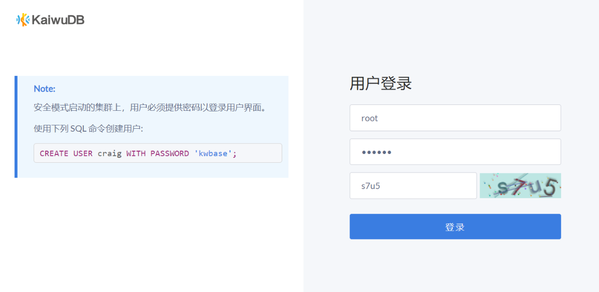

# 数据库监控概述

KWDB 支持使用内置的 KaiwuDB 监控平台或 [Prometheus](https://prometheus.io/) 和 [Grafana](https://grafana.com/grafana) 开源组件监控集群状态。用户可根据实际需求选择任意一种监控方案。

::: warning 说明
目前，KaiwuDB 监控平台是企业版特性。如需了解 KaiwuDB 监控平台的更多详细信息，[联系](https://cs.kaiwudb.com/support/) KWDB 技术支持人员。
:::

## KaiwuDB 监控平台

KWDB 内置 KaiwuDB 监控平台。部署 KWDB 集群后，KaiwuDB 监控平台服务随 KWDB 集群一起启动。

::: warning 说明

- KaiwuDB 监控平台的 IP 地址和端口取决于 KWDB 安装部署时 `deploy.cfg` 配置文件中 `node_addr` 和 `rest_port` 参数配置。默认情况下，`rest_port` 参数的取值为 `8080`。
- 如果用户在 10 分钟内连续 5 次登录 KaiwuDB 监控平台失败，系统将自动锁定该账户。十分钟之后，账号自动解锁，用户可以再次尝试登录。

:::

- 当以非安全模式启动 KWDB 集群时，用户可通过安装部署时指定的 IP 地址和端口直接访问 KaiwuDB 监控平台，例如 `http://10.10.102.43:8080/`。
- 当以安全模式启动 KWDB 集群时，用户需要先连接 KWDB 数据库才能访问 KaiwuDB 监控平台，且用户必须具有 Admin 权限。登录 KaiwuDB 监控平台使用的用户名和密码与登录数据库使用的用户名和密码相同。如果尚未创建目标用户，用户需要使用 `CREATE USER` 语句创建目标用户，并使用 `GRANT admin TO <user_name>` 为目标用户赋权。有关创建用户和为用户赋权的详细信息，参见[创建用户](../sql-reference/db-mgmt/user-mgmt-sql.md#创建用户)和[为角色添加成员](../sql-reference/db-mgmt/role-mgmt-sql.md#为角色添加成员)。

KaiwuDB 监控平台读取 KWDB 集群的指标数据、语句数据和事件数据，以网页可视化方式展示数据库的集群节点状态、监控指标、数据库、语句、事件和网络延迟信息。有关如何使用 KaiwuDB 监控平台查看指标数据，参见[使用 KaiwuDB 监控平台查看指标数据](./view-metrics-adminui.md)。

## 基于 Prometheus 和 Grafana 的监控

Prometheus 是一款开源的系统监控和告警平台，用于采集和存储 KWDB 集群的监控和性能指标信息。Grafana 是一款开源的数据可视化工具，可以从多种数据源获取数据，并在数据面板中展示所有数据。Grafana 读取 KWDB 集群的指标数据，以可视化方式展示数据库的集群节点状态、监控指标。

KWDB 提供以下指标面板模板。用户下载面板模板并将其导入 Grafana 后，即可监控 KWDB 集群。

- 概览：展示集群和节点的关键指标。
- 硬件：展示硬件相关的监控指标。
- 运行时：展示运行时相关的监控指标。
- SQL：展示 SQL 相关的监控指标。
- 存储：展示存储相关的监控指标。
- 副本：展示副本相关的监控指标。
- 分布式：展示分布式相关的监控指标。
- 队列：展示队列相关的监控指标。
- 慢查询：展示慢查询相关的监控指标。

每个指标面板包括多个监控项。具体信息，参见[使用 Grafana 查看指标数据](./os-monitor-component/view-metrics-grafana.md)。

下图说明如何使用 Prometheus 和 Grafana 监控 KWDB 集群。

