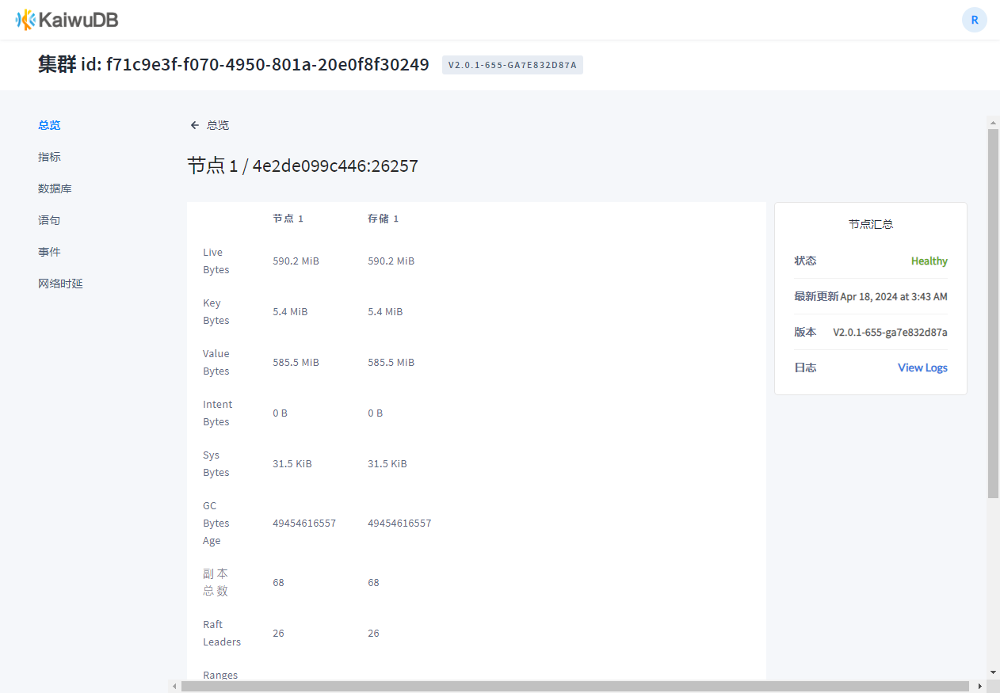
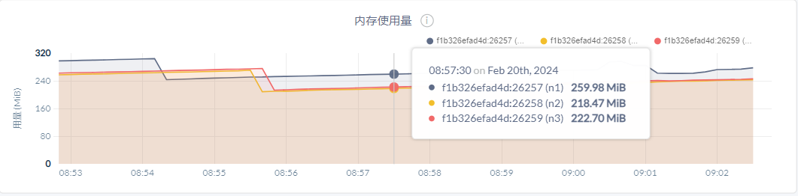
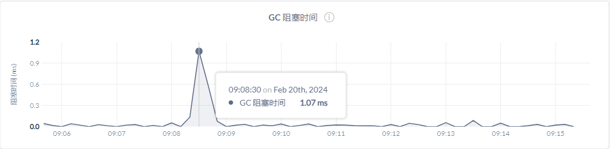
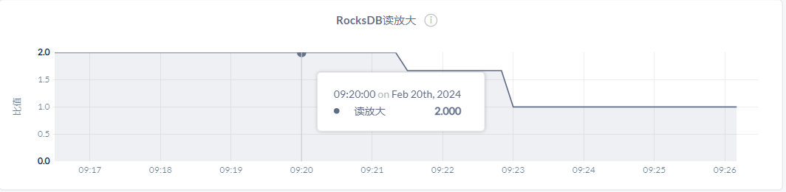
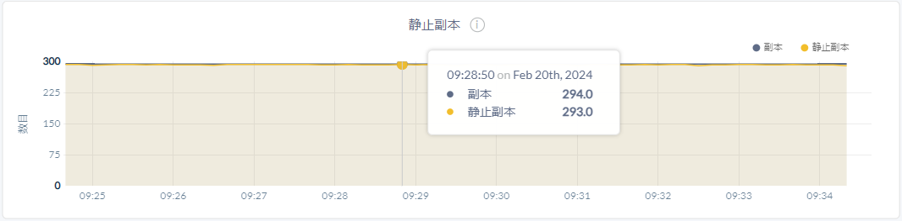
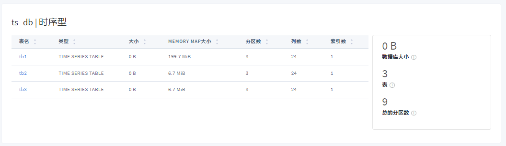

# 使用 KaiwuDB 监控平台查看指标数据

KWDB 内置 KaiwuDB 监控平台。部署 KWDB 集群后，用户无需额外操作，KaiwuDB 监控平台服务即可与 KWDB 集群一起启动。

::: warning 说明
目前，KaiwuDB 监控平台是企业版特性。如需了解 KaiwuDB 监控平台的更多详细信息，[联系](https://cs.kaiwudb.com/support/) KWDB 技术支持人员。
:::

KaiwuDB 监控平台读取 KWDB 集群的指标数据、语句数据和事件数据，以网页可视化方式展示数据库的集群节点状态、监控指标、数据库、语句、事件和网络延迟信息。

## 总览

**总览**页面展示关键硬件指标、节点状态和副本相关的信息。

**总览**面板集中展示集群的整体健康和性能。

下表列出各指标的具体信息。

| 指标         | 内容                                                                                                                                                 |
| ------------ | ---------------------------------------------------------------------------------------------------------------------------------------------------- |
| 存储容量使用 | - 已用容量：KWDB 已经使用的存储容量。 - 可用容量：KWDB 可以使用的存储容量，不包括 KWDB 程序本身、操作系统和其他系统文件占用的存储空间。 |
| 节点状态     | - 存活节点：集群中存活节点的数量。 - 异常节点：集群中异常节点的数量。如果一个节点无法获取其活跃状态或处于退役过程中，则该节点被视为异常节点。 - 不可用节点：集群中不可用节点的数量。 |
| 副本状态     | - 总分区数：集群的分区总数。 - 副本不足分区数：集群中副本不足的分区数量。取值为非 `0` 时，表示集群处于不稳定状态。 - 不可用分区数：集群中不可用的分区数量。取值为非 `0` 时，表示集群处于不稳定状态。                   |

**节点列表**面板列出集群内所有节点的具体信息，包括节点 ID、启动时间、副本数、已用存储容量和内存、CPU 数量、集群版本、状态和日志。

::: warning 说明
默认情况下，KWDB 不支持通过监控平台查看节点日志。如需启用该功能，运行 `SET CLUSTER SETTING server.remote_debugging.mode='any'` 命令，开启远程调试功能。
:::

单击单个节点 ID，即可查看目标节点的更多信息。

## 指标

**指标**页面展示 KWDB 集群及各个节点的监控指标，包括指标概览、硬件指标、运行时指标、SQL 指标、存储指标、副本指标、分布式指标、队列指标和慢查询指标。

用户可以通过下拉菜单调整监控指标的查看范围，选择查看整个集群或指定节点的具体指标，以及查看指定时间范围的数据。

**指标**页面右侧展示集群的概览、告警和事件信息。

- 概览部分列出集群的总节点数、存储容量使用情况、不可用分区的数量、每秒查询次数、P99 时延等信息。
- 告警信息部分列出集群的非健康节点的数量、CPU 使用率、内存使用率、已用空间、可用空间和连接数使用率。当集群实际指标信息超出设定阈值时，相应的指标信息将展示为红色。
    ::: warning 说明

    KWDB 支持用户通过 `SET CLUSTER SETTING <parameter>=<value>` 命令配置以下指标阈值。

    - `alert.cpu.threshold`：CPU 使用率阈值。
    - `alert.mem.threshold`：内存使用率阈值。
    - `alert.storage.threshold`：已用空间阈值。
    - `alert.connections.threshold`：连接数阈值。

    更多集群参数配置，参见[集群实时参数](../db-operation/cluster-settings-config.md#实时参数)。

    :::

- 事件信息部分列出集群最近发生事件的类型、详情和发生时间。单击**查看所有事件**跳转到**事件**页面，即可查看所有发生的事件。

### 概览

**概览**页面展示集群和节点的关键指标。

- **SQL**

    

    在节点视图中，该时间序列图展示指定节点处理客户端请求的 QPS（Queries Per Second，每秒查询数）。支持的类型包括查询、更新、插入、删除。采样值为 `10` 秒内的平均值。在集群视图中，该时间序列图展示当前集群查询负载的估计值。该估计值为每个节点最近 `10` 秒的活动情况的汇总值。

- **服务延迟：SQL999**

    服务延迟是集群从接收到查询请求到查询结束之间的时间，不包含将查询结果传输给客户端的时间。

    

    该时间序列图展示指定节点或者集群内所有节点的服务延迟的 99th 百分位数，即在观察时间内，百分之九十九（`99%`）的节点的服务延迟低于或等于这个值。

- **每个节点的副本数目**

    

    该时间序列图展示指定节点或者集群内所有节点的副本数量。

- **存储容量**

    用户可以通过监控存储容量图来判断什么时候需要为集群添加新的存储空间。

### 硬件

- **CPU 使用率**

    

    该时间序列图展示指定节点或者集群内所有节点上 KWDB 进程的 CPU 使用率。

- **内存使用量**

    

    该时间序列图展示指定节点或者集群内所有节点上 KWDB 进程的内存使用情况。

- **磁盘读取**

    

    该时间序列图展示指定节点或者集群内所有节点上运行的所有进程（包括 KWDB 进程）读取硬盘的速率。采样值为 `10` 秒内 RPS（Read Per Second，每秒读取速度）的平均值。

- **磁盘写入**

    

    该时间序列图展示指定节点或者集群内所有节点上运行的所有进程（包括 KWDB 进程）写入硬盘的速率。采样值为 `10` 秒内 WPS（Write Per Second，每秒写入速度）的平均值。

- **磁盘每秒读取次数**

    

    该时间序列图展示指定节点或者集群内所有节点上运行的所有进程（包括 KWDB 进程）读取硬盘的速率。采样值为 `10` 秒内 OPS（Operations Per Second，每秒运算次数）的平均值。

- **磁盘每秒写入次数**

    

    该时间序列图展示指定节点或者集群内所有节点上运行的所有进程（包括 KWDB 进程）写入硬盘的速率。采样值为 `10` 秒内 OPS（Operations Per Second，每秒运算次数）的平均值。

- **正在处理的硬盘 IOPS**

    

    该时间序列图展示指定节点或者集群内所有节点上运行的所有进程（包括 KWDB 进程）读写队列中请求的数量。采样值为 `10` 秒内的平均值。

- **可用的硬盘容量**

    

    该时间序列图展示指定节点或者集群内所有节点可用的存储容量。

- **网络接收数据**

    

    该时间序列图展示指定节点或者集群内所有节点上运行的所有进程（包括 KWDB 进程）每秒接收的网络字节数的总和。采样值为 `10` 秒内的平均值。

- **网络发送数据**

    

    该时间序列图展示指定节点或者集群内所有节点上运行的所有进程（包括 KWDB 进程）每秒发送的网络字节数的总和。采样值为 `10` 秒内的平均值。

### 运行时

- **活跃节点数目**

    

    该时间序列图展示集群内所有活跃节点的数量。曲线下降表示存在异常节点或不可用节点。

- **内存使用**

    

    该时间序列图展示指定节点或者集群内所有节点的内存使用量。

    将鼠标悬停在图表上，可以查看更多指标信息。

    | 指标     | 简介                    |
    | -------- | ----------------------- |
    | RSS      | KWDB 内存的使用量。  |
    | Go 总计  | Go 语言层管理的总内存。 |
    | CGo 总计 | C 语言层管理的总内存。  |

- **Kmalloc 内存申请**

    

    该时间序列图展示指定节点的 Kmalloc 内存申请量或者集群内所有节点的内存申请总量。

- **Memory Map 大小**

    

    该时间序列图展示指定节点占用的 Memory Map 虚拟内存量或者集群内所有节点占用的 Memory Map 虚拟内存总量。

- **Memory Map 区域数量**

    

    该时间序列图展示指定节点和集群内所有节点进程中连续开启的虚拟内存块的数量。单个节点中，每个内存块的大小可能不同，所有内存块的大小总和即为该节点占用的 Memory Map 虚拟内存量。所有节点的内存块的大小总和即为该集群所有节点占用的 Memory Map 虚拟内存总量。

- **Goroutine 数目**

    

    该时间序列图展示指定节点或者集群内所有节点的当前 Goroutine 的数目。

- **GC 每秒钟执行次数**

    

    该时间序列图展示指定节点或者集群内所有节点的 GC 运行次数。

- **GC 阻塞时间**

    

    在节点视图中，该时间序列图展示指定节点的 GC 阻塞时间。在集群视图中，该时间序列图展示集群中所有节点的 GC 阻塞时间总和。

- **CPU 时间**

    

    在节点视图中，该时间序列图展示指定节点上的 KWDB 用户级进程和相关系统级操作的 CPU 时间。在集群视图中，该时间序列图展示集群中所有节点的 KWDB 用户级进程和相关系统级操作的 CPU 时间总和。

- **时钟偏移量**

    

    在节点视图中，该时间序列图展示指定节点与集群其他节点的时钟偏差值的平均值。在集群视图中，该时间序列图展示集群中每个节点与集群其他节点的时钟偏差值的平均值。

### SQL

- **SQL 总连接数**

    

    该时间序列图展示指定节点或者集群内所有节点的瞬时 SQL 连接数, 包括成功建立的连接和因密码错误或超过最大连接数等原因未能建立的连接。

- **SQL 成功连接数**

    

    该时间序列图展示指定节点或者集群内所有节点已建立的活跃的 SQL 连接数。

- **SQL 字节流量**

    SQL 字节流量视图帮助用户关联 SQL 查询数量和字节流量，特别适合监控批量数据插入或者返回大量数据的分析型查询。

    

    该时间序列图展示指定节点或者集群内所有节点的客户端网络流量的总和，单位为 BPS（Bytes Per Second，每秒字节数）。

- **SQL 操作**

    

    在节点视图中，该时间序列图展示指定节点处理客户端请求的 QPS（Queries Per Second，每秒查询数）。支持的类型包括查询、更新、插入、删除。采样值为 `10` 秒内的平均值。在集群视图中，该时间序列图展示当前集群所有节点处理客户端请求的 QPS。

- **SQL 访问错误**

    

    该时间序列图展示指定节点或者集群内所有节点返回计划或运行时错误的 SQL 语句数。采样值为 `10` 秒内的平均值。

- **活跃的分布式 SQL 操作**

    

    该时间序列图展示指定节点或者集群内所有节点运行的分布式 SQL 操作数目。

- **活跃的分布式 SQL 操作的执行流**

    

    该时间序列图展示指定节点或者集群内所有节点协助执行当前分布式 SQL 操作的流的数量。

- **服务延迟：SQL P99**

    服务延迟是集群从接收到查询请求到查询执行结束之间的时间，不包含将结果传输给客户端的延迟。

    

    在节点视图中，该时间序列图展示指定节点的服务延迟的 99th 百分位数，即在观察时间内，99% 的服务延迟低于或等于这个值。在集群视图中，该时间序列图展示集群中所有节点的服务延迟的 99th 百分位数，即在观察时间内，99% 的节点的服务延迟低于或等于这个值。

- **服务延迟：SQL P90**

    

    在节点视图中，该时间序列图展示每个节点的服务延迟的 90th 百分位数，即在观察时间内，90% 的服务延迟低于或等于这个值。在集群视图中，该时间序列图展示集群中所有节点的服务延迟的 90th 百分位数，即在观察时间内，90% 的节点的服务延迟低于或等于这个值。

- **执行延迟：P99**

    

    在节点视图中，该时间序列图展示指定节点在一分钟内执行延迟的 99th 百分位数，即在观察时间内，99% 完成时间低于或等于这个值。在集群视图中，该时间序列图展示集群中所有节点在一分钟内执行延迟的 99th 百分位数，即在观察时间内，99% 的节点的完成时间低于或等于这个值。

- **执行延迟：P90**

    

    在节点视图中，该时间序列图展示指定节点在一分钟内执行延迟的 90th 百分位数，即在观察时间内，90% 完成时间低于或等于这个值。在集群视图中，该时间序列图展示集群中所有节点在一分钟内执行延迟的 90th 百分位数，即在观察时间内，90% 的节点的完成时间低于或等于这个值。

- **事务数目**

    

    在节点视图中，该时间序列图展示指定节点每秒打开、提交、回滚或中止的事务总数。采样值为 `10` 秒内的平均值。在集群视图中，该时间序列图汇总了所有节点每秒打开、提交、回滚或中止的事务总数。

- **事务延迟：P99**

    

    在节点视图中，该时间序列图展示指定节点在一分钟内事务延迟的 99th 百分位数，即在观察时间内，99% 的事务延迟低于或等于这个值。在集群视图中，该时间序列图展示集群中所有节点在一分钟内事务延迟的 99th 百分位数，即在观察时间内，99% 的节点的事务延迟低于或等于这个值。

- **事务延迟：P90**

    

    在节点视图中，该时间序列图展示指定节点在一分钟内事务延迟的 90th 百分位数，即在观察时间内，90% 的事务延迟低于或等于这个值。在集群视图中，该时间序列图展示集群中所有节点在一分钟内事务延迟的 90th 百分位数，即在观察时间内，90% 的节点的事务延迟低于或等于这个值。

- **模式变更**

    

    该时间序列图展示指定节点或者集群内所有节点每秒 DDL 语句的总数。

### 存储

- **存储容量**

    用户可以通过监控存储容量图来判断是否需要为集群添加新的存储空间。

    

    在节点视图中，该时间序列图展示指定节点的总容量（即数据库占用的磁盘空间）、时序数据库占用的磁盘空间、关系数据库占用的磁盘空间、时序和关系数据库已用总空间和磁盘剩余空间。在集群视图中，该时间序列图展示集群中所有节点的磁盘总空间、时序数据库占用的总磁盘空间、关系数据库占用的总磁盘空间、时序和关系数据库已用总空间和磁盘剩余空间。

- **热数据**

    热数据指应用程序和 KWDB 数据库可以读取的数据量，不包括历史数据和已删除数据。

    

    该时间序列图展示指定节点或者集群内所有节点应用程序和系统可以读取的数据量，不包括历史数据和已删除数据。

- **Raft 日志提交延迟：P99**

    Raft 日志提交延迟可视为对存储引擎的预写式日志执行 fdatasync 的度量。

    

    在节点视图中，该时间序列图展示指定节点 Raft 日志提交延迟的 99th 百分位数，即在观察时间内，99% 的提交延迟低于或等于这个值。在集群视图中，该时间序列图展示集群中所有节点 Raft 日志提交延迟的 99th 百分位数，即在观察时间内，99% 的节点的提交延迟低于或等于这个值。

- **Raft 日志提交延迟：P50**

    Raft 日志提交延迟可视为对存储引擎的预写式日志执行 fdatasync 的度量。

    

    在节点视图中，该时间序列图展示指定节点 Raft 日志提交延迟的 50th 百分位数，即在观察时间内，50% 的提交延迟低于或等于这个值。在集群视图中，该时间序列图展示集群中所有节点 Raft 日志提交延迟的 50th 百分位数，即在观察时间内，50% 的节点的提交延迟低于或等于这个值。

- **Raft 命令提交延迟：P99**

    

    在节点视图中，该时间序列图展示指定节点 Raft 命令提交延迟的 99th 百分位数，即在观察时间内，99% 的提交延迟低于或等于这个值。在集群视图中，该时间序列图展示集群中所有节点 Raft 命令提交延迟的 99th 百分位数，即在观察时间内，99% 的节点的提交延迟低于或等于这个值。

- **Raft 命令提交延迟：P50**

    

    在节点视图中，该时间序列图展示指定节点 Raft 命令提交延迟的 50th 百分位数，即在观察时间内，50% 的提交延迟低于或等于这个值。在集群视图中，该时间序列图展示集群中所有节点 Raft 命令提交延迟的 50th 百分位数，即在观察时间内，50% 的节点的提交延迟低于或等于这个值。

- **RocksDB 读放大**

    RocksDB 读放大统计用来衡量节点中每个逻辑读操作的实际读操作的平均值。

    

    在节点视图中，该时间序列图展示指定节点 RocksDB 读放大统计。在集群视图中，该时间序列图展示集群中所有节点 RocksDB 读放大统计总和。

- **RocksDBSSTables**

    

    在节点视图中，该时间序列图展示指定节点在用的 RocksDB SSTable 的数目。在集群视图中，该时间序列图展示集群中所有节点在用的 RocksDB SSTable 的数目总和。

- **文件描述符**

    

    该时间序列图展示指定节点或者集群内所有节点开放的文件描述符数量以及文件描述符数量的上限。

- **RocksDB 压缩/写入硬盘的数目**

    

    该时间序列图展示指定节点或者集群内所有节点每秒 RocksDB 压缩和写入硬盘的数目。

- **metrics 监控数据写**

    

    该时间序列图展示指定节点或者集群内所有节点每秒写入 metrics 监控数据成功的数目和错误的数目。

- **metrics 监控数据占用的大小**

    

    在节点视图中，该时间序列图展示指定节点每秒 metrics 监控数据写入的字节数。在集群视图中，该时间序列图展示集群中所有节点每秒 metrics 监控数据写入的字节数总和。

    ::: warning 注意
    由于数据在磁盘上高度压缩，本视图展示的是 metrics 监控写数据产生的网络流量和硬盘活动量，不是 metrics 监控数据写占用磁盘的速率。可通过数据库页面查看 metrics 监控数据的当前硬盘使用情况。
    :::

### 副本

- **Ranges 数目**

    Ranges 数目视图展示 Range 状态相关的具体信息。

    

    该时间序列图展示指定节点或者集群内所有节点持有的 Range 的详细信息。

- **每个 Store 的副本**

    

    该时间序列图展示指定节点或者集群内所有节点的每个 store 的副本数量。

- **每个 Store 的租赁副本**

    租赁副本指接收和协调其 Range 上所有读取和写入请求的副本。

    

    该时间序列图展示指定节点或者集群内所有节点的每个 Store 的租赁副本数。

- **每个 Store 的平均访问次数**

    每个 Store 的平均访问次数指每个 Store 的租赁副本每秒处理的 KV 批量请求的数目的指数加权平均值。记录大约最后 `30` 分钟的请求，用来协助基于负载的再平衡决策。

    

    该时间序列图展示指定节点或者集群内所有节点的每个 Store 的平均访问次数。

- **每个 Store 的逻辑字节数**

    

    该时间序列图展示指定节点或者集群内所有节点的每个 Store 的数据逻辑字节数，包含历史数据和已删除数据。

- **静止副本**

    

    在节点视图中，该时间序列图展示指定节点的副本和静止副本数量。在集群视图中，该时间序列图展示集群中所有节点的副本和静止副本数量总和。

- **Range 操作**

    

    该时间序列图展示指定节点或者集群内所有节点的操作涉及的 Range 操作次数。

- **快照**

    

    在节点视图中，该时间序列图展示指定节点的快照数目。在集群视图中，该时间序列图展示集群中所有节点的快照数目总和。
  
### 分布式

- **Batch 数目**

    

    该时间序列图展示指定节点或者集群内所有节点的 Batch 数目。

- **RPC 数目**

    

    该时间序列图展示指定节点或者集群内所有节点的 RPC（Remote Procedure Call，远程过程调用）数目。

- **RPC 错误**

    

    该时间序列图展示指定节点或者集群内所有节点的 RPC 错误数。

- **KV 事务**

    

    该时间序列图展示指定节点或者集群内所有节点的 KV 事务数。

- **KV 事务重试**

    

    该时间序列图展示指定节点或者集群内所有节点的 KV 事务的重试次数。

- **KV 事务持续时间：P99**

    

    在节点视图中，该时间序列图展示指定节点过去一分钟 KV 事务持续时间的 99th 百分位数，即在观察时间内，99% 的持续时间低于或等于这个值。在集群视图中，该时间序列图展示集群中所有节点过去一分钟 KV 事务持续时间的 99th 百分位数，即在观察时间内，99% 的节点的持续时间低于或等于这个值。

- **KV 事务持续时间：P90**

    

    在节点视图中，该时间序列图展示指定节点 KV 事务持续时间的 90th 百分位数，即在观察时间内，90% 的持续时间低于或等于这个值。在集群视图中，该时间序列图展示集群中所有节点 KV 事务持续时间的 90th 百分位数，即在观察时间内，90% 的节点的持续时间低于或等于这个值。

- **节点心跳延迟：P99**

    

    在节点视图中，该时间序列图展示指定节点心跳延迟的 99th 百分位数，即在观察时间内，99% 的心跳延迟低于或等于这个值。在集群视图中，该时间序列图展示集群中所有节点心跳延迟的 99th 百分位数，即在观察时间内，99% 的节点的心跳延迟低于或等于这个值。

- **节点心跳延迟：P90**

    

    在节点视图中，该时间序列图展示指定节点心跳延迟的 90th 百分位数，即在观察时间内，90% 的心跳延迟低于或等于这个值。在集群视图中，该时间序列图展示集群中所有节点心跳延迟的 90th 百分位数，即在观察时间内，90% 的节点的心跳延迟低于或等于这个值。

### 队列

- **队列操作失败处理**

    

    该时间序列图展示指定节点或者集群内所有节点的队列操作处理失败数目。

- **队列处理时间**

    

    在节点视图中，该时间序列图展示指定节点各队列处理时间。在集群视图中，该时间序列图展示集群中所有节点各队列处理时间的总和。

- **GC 副本队列**

    

    在节点视图中，该时间序列图展示指定节点的 GC 副本队列数目。在集群视图中，该时间序列图展示集群中所有节点的 GC 副本队列数目总和。

- **副本队列**

    

    在节点视图中，该时间序列图展示指定节点的副本队列数目。在集群视图中，该时间序列图展示集群中所有节点的副本队列数目总和。

- **分割队列**

    

    在节点视图中，该时间序列图展示指定节点的分割队列数目。在集群视图中，该时间序列图展示集群中所有节点分割队列数目总和。

- **合并队列**

    

    在节点视图中，该时间序列图展示指定节点的合并队列数目。在集群视图中，该时间序列图展示集群中所有节点合并队列数目总和。

- **GC 队列**

    

    在节点视图中，该时间序列图展示指定节点的 GC 队列数目。在集群视图中，该时间序列图展示集群中所有节点 GC 队列数目总和。

- **Raft 日志队列**

    

    在节点视图中，该时间序列图展示指定节点的 Raft 日志队列数目。在集群视图中，该时间序列图展示集群中所有节点 Raft 日志队列数目总和。

- **Raft 快照队列**

    

    在节点视图中，该时间序列图展示指定节点的 Raft 快照队列数目。在集群视图中，该时间序列图展示集群中所有节点 Raft 快照队列数目总和。

- **一致性检查器队列**

    

    在节点视图中，该时间序列图展示指定节点一致性检查器队列数目。在集群视图中，该时间序列图展示集群中所有节点一致性检查器队列数目总和。

- **metrics 监控维护队列**

    

    在节点视图中，该时间序列图展示指定节点的 metrics 监控维护队列数目。在集群视图中，该时间序列图展示集群中所有节点 metrics 监控维护队列数目总和。

- **压缩队列**

    

    在节点视图中，该时间序列图展示指定节点通过强制 RocksDB 压缩回收或可能回收的已完成或估计的存储字节。在集群视图中，该时间序列图展示集群中所有节点通过强制 RocksDB 压缩回收或可能回收的已完成或估计的存储字节。

### 慢查询

- **Raft 提案缓慢**

    

    在节点视图和集群视图中，该时间序列图展示集群中所有节点 Raft 中提案提交变缓的请求数。

- **跨节点的远程调用缓慢**

    

    在节点视图和集群视图中，该时间序列图展示了集群中所有节点不同节点之间发送远程过程调用（RPC）变缓的请求数。

- **租约获取缓慢**

    分布式系统中，租约（Lease）通常用于协调和同步操作。

    

    在节点视图和集群视图中，该时间序列图展示了集群中所有节点租约获取变缓的请求数。

- **Latch 获取缓慢**

    Latch 是一种用于同步的低级别的机制，用于保护共享资源。

    

    在节点视图和集群视图中，该时间序列图展示了集群中所有节点 Latch 获取变缓的请求数。

## 数据库

**数据库**页面展示数据库配置的细节内容、数据库中的表和用户拥有的权限。

- **表视图**

    表视图展示目标数据库中表的详细内容。

    ::: warning 说明
    如果关系表中的数据量很小，展示的表的大小可能会出现误差。目前，时序表不支持展示表大小功能，因此展示为 `0B`。
    :::

    

    单击表名，即可查看指定表的建表语句和权限信息。

- **权限视图**

    权限视图展示用户在每个数据库中拥有的权限。

    

## 语句

**语句**页面展示已执行完成的热点查询以及高延迟的 SQL 语句，支持用户单击某个 SQL 语句，查看该语句的细节信息。

下表列出各参数的具体信息。

| 参数     | 描述                                                                                                                                                                                                              |
| -------- | ----------------------------------------------------------------------------------------------------------------------------------------------------------------------------------------------------------------- |
| 语句     | SQL 语句或相似指纹的 SQL 语句。用户可以单击特定行，进入该行语句指纹对应的语句执行详情页，查看语句指纹相关的更多信息。                                                                                           |
| 事务类型 | 事务操作的两种方式。 - 展示事务：由用户明确定义和管理的事务。 - 隐式事务：由数据库系统自动管理的事务。                                                                                                                 |
| 重试次数 | 在最近 1 小时或自定义时间间隔内，单个 SQL 语句（或相似指纹的 SQL 语句）的重试次数。                                                                                                                       |
| 执行次数 | 在最近 1 小时或自定义时间间隔内，单个 SQL 语句（或相似指纹的 SQL 语句）的执行计数。用户可以根据改参数对列表进行排序。                                                                                               |
| 失败次数 | 在最近 1 小时或自定义时间间隔内，单个 SQL 语句（或相似指纹的 SQL 语句）执行失败的次数。用户可以根据改参数对列表进行排序。                                                                                         |
| 影响行数 | 在最近 1 小时或自定义时间间隔内，单个 SQL 语句（或相似指纹的 SQL 语句）返回行数的平均值。用户可以根据改参数对列表进行排序。                                                                                 |
| 时延     | 在最近 1 小时或自定义时间间隔内，单个 SQL 语句（或相似指纹的 SQL 语句）服务延迟的平均值。该指标以数值和水平条形图的形式展示。条形图用颜色标记，蓝色代表服务延迟的标准差。用户可以根据该参数对列表进行排序。 |

## 事件

**事件**页面展示数据库操作的事件类型、详情和发生时间。

## 网络时延

**网络时延**页面展示集群中所有节点之间的往返延迟。往返延迟表示在数据包在网络上传输所需的时间，延迟时间长短主要依赖于网络拓扑。

