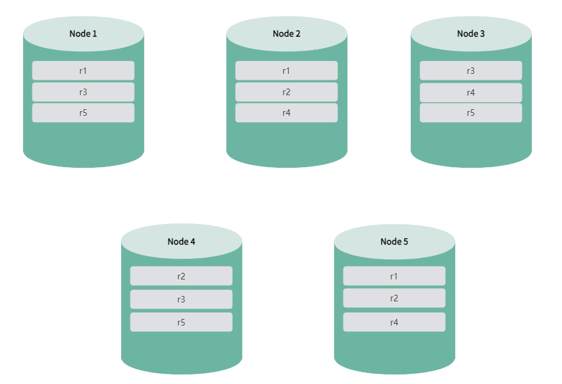
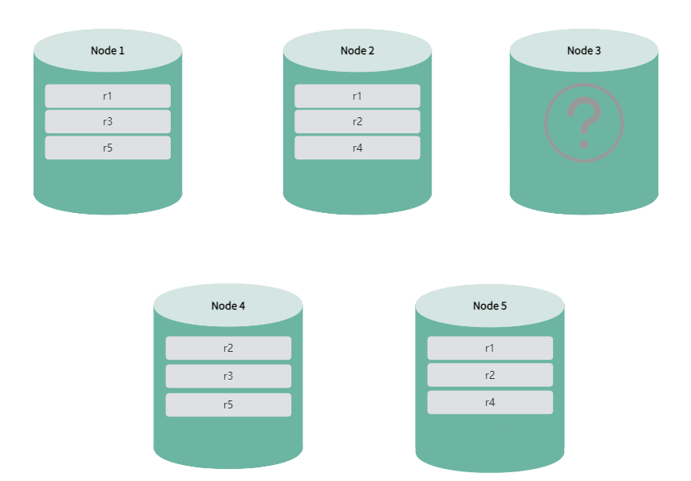
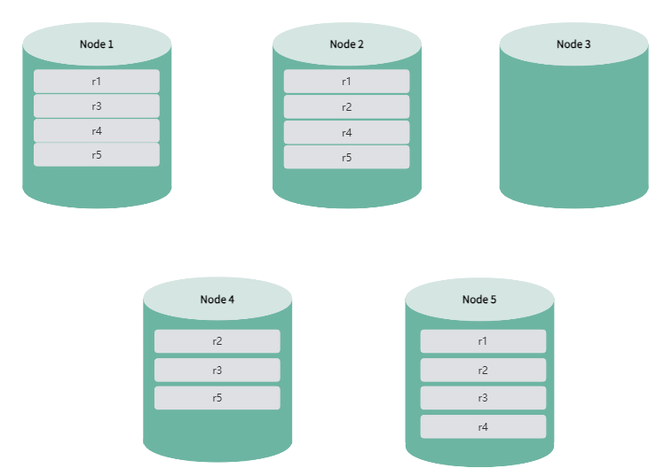
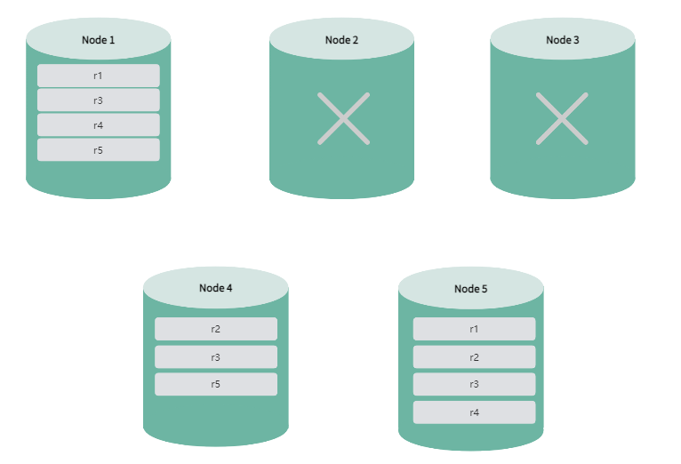

# 集群高可用

默认情况下，KWDB 集群支持高可用，能够实现故障转移和数据强一致性。

::: warning 说明

- 避免使用 HDD 磁盘部署分布式集群。
- 初始化和启动集群大约需要 10 秒左右的时间。在此期间，如果有节点死亡，可能会导致集群无法触发高可用机制。
- 启动集群后，在 `kaiwudb_env` 或 `docker-compose.yml` 文件中配置 `KWBASE_RAFT_ELECTION_TIMEOUT_TICKS=100` 环境变量，然后重启 KaiwuDB 服务，可以避免偶发的性能下降问题。
- 待迁移表的数量会影响实际节点状态的更新时间。需要迁移的表越多，迁移时间就越长，实际节点状态更新所需的时间也就越长。
- 在使用 `IMPORT` 语句或 `INSERT INTO SELECT` 语句向时序表写入大量数据前，建议根据实际数据写入量，使用 `SET CLUSTER SETTING ts.wal.file_size` 语句将 WAL 日志大小调整为 `256 MiB` 或更大，否则可能会导致集群节点宕机。
- 通过重试建表避免高并发建表场景下偶发的建表失败问题。
- 通过重试写入避免高并发数据写入场景下偶发的写入失败问题。
- 如果长时间执行大量建表和删表操作，例如并发数超过 50 且持续时间超过 4 小时，同时 Range 数量超过 1 万，系统可能会变慢，甚至可能导致 DDL 操作卡住。
- 通过向空表写入数据避免偶发的删除空表失败问题。

:::

集群中的各节点通过定期的心跳机制来维护连接和状态，以便及时发现故障并采取相应措施。

KWDB 支持在安装包目录运行 `./deploy.sh cluster --status` 或者 `./deploy.sh cluster --s` 命令查看集群节点的状态。

下表列出集群节点支持的所有状态。

|     状态      |                                                         说明                                                          |
|---------------|-----------------------------------------------------------------------------------------------------------------------|
| Prejoin       | 节点等待加入集群状态。当集群中有其它节点处于 `joining` 状态时，新增节点会先进入 `pre-join` 状态，等待加入集群。                               |
| Joining       | 节点正在加入集群。节点可能处于初始化或加入过程中。该状态期间，不支持 DDL 语句操作。                                 |
| Rejoining     | 节点重新加入集群。节点在死亡或者非健康状态下重新启动后，正在加入集群。该状态期间，不支持 DDL 语句操作。                       |
| Healthy       | 节点健康状态。节点在最近 30 秒内有心跳响应，处于正常工作状态。                                                              |
| Unhealthy     | 节点非健康状态。节点在最近 30 秒内无心跳响应，系统将自动迁移租约持有者（leaseholder），保证业务联系不中断。该状态期间，不支持 DDL 语句操作。 |
| Dead          | 节点死亡状态。节点在最近 30 分钟内无心跳响应。如果现有节点数大于副本数，系统将自动补足缺失副本。                            |
| Decommissing | 节点正在退役。在此状态下，节点将不接受新的任务或工作负载，但会继续完成当前正在执行的任务。                            |
| Decommissioed | 节点已退役。此时，应将节点退出，不再使用该节点。如果想将该界定重新加入集群，需要清空节点的数据目录，作为新节点重新加入集群。                    |
| Upgrading     | 节点正在升级。该状态期间，不支持 DDL 语句操作。                                                                           |

KWDB 支持使用 `SET CLUSTER SETTING server.time_until_store_dead = <value>` SQL 语句设置系统标记死亡节点的时间。取值范围为 10s ~ 30min。

KWDB 支持用户在安装目录使用 `kwbase node set-status dead --node-id=<node_id> [--host=<address_of_any_alive_node>]` 命令手动将非健康节点标记为死亡节点。其中 `host` 为可选参数。如未指定 `host` 参数，则默认使用 `127.0.0.1:26257`。

用户可使用 `SHOW TS PARTITIONS` SQL 语句查看集群各节点的副本和 leaseholder 的分布情况。

为了确保系统即使发生节点故障也能够提供服务，部署集群采用了多数投票的机制。假设有 N 个节点，每个数据块有 R 个副本。在采用多数投票的情况下，为了保证数据的一致性和可用性，至少需要超过一半的副本是可用的。具体来说，假设 R 为副本数量，那么：

- 当 R 为奇数时，至少需要 (R/2) + 1 个副本可用。

- 当 R 为偶数时，至少需要 R/2 + 1 个副本可用。

::: warning 注意

- 目前，KWDB 集群默认采用 3 副本，且不支持修改集群副本的数量。
- 集群节点故障后，仅能重新加入故障节点，避免重新加入新节点。
- 集群节点多次发生故障再加入集群后，可能会导致数据写入缓慢。

:::

以下以 5 节点 3 副本为例，说明 KWDB 集群如何实现高可用。

- 当启动 KWDB 集群后，副本和 leaseholder 均匀分布在所有节点上，确保数据的高可用性和平衡性。

    

- 节点处于非健康或升级状态时，系统自动迁移该节点的 leaseholder，保证业务的连续性，同时移除该节点的副本。在 leaseholder 迁移期间，数据查询可能会失败或卡住。此时，用户需要通过写入重试避免由于 leaseholder 重新选举和切换导致数据查询出现短暂不可用或卡住现象。迁移完成后，数据查询将完整无丢失。在节点处于非健康或升级状态下，系统不支持 DDL 语句，并且不允许扩缩容集群。

    

- 节点从非健康状态或升级状态恢复为健康状态时，系统自动填补缺失的副本。整个过程不会影响数据查询的完整性。leaseholder 也将回迁到该节点，使整个系统内 leaseholder 的分布更为均衡。

    

- 如果单个节点死亡，而现有节点数量仍然大于副本数，系统自动补足缺失的副本，确保数据的高可用性，同时迁移该节点的 leaseholder，保证业务的连续性。在 leaseholder 迁移期间，数据查询可能会失败或卡住。此时，用户需要通过写入重试避免由于 leaseholder 重新选举和切换导致数据查询出现短暂不可用或卡住现象。迁移完成后，数据查询将完整无丢失。

    

- 单个死亡节点恢复正常后，由于已经补齐副本，系统不会再补齐副本，也不会回迁 leaseholder 到该节点。

    

- 如果出现两个及以上的节点死亡，由于节点数量小于等于副本量，系统无法补足缺失的副本，可能导致无法访问部分数据。如果后续有其他节点状态转为非健康，将会导致数据查询卡住，直至非健康节点状态恢复为可用状态。

    
