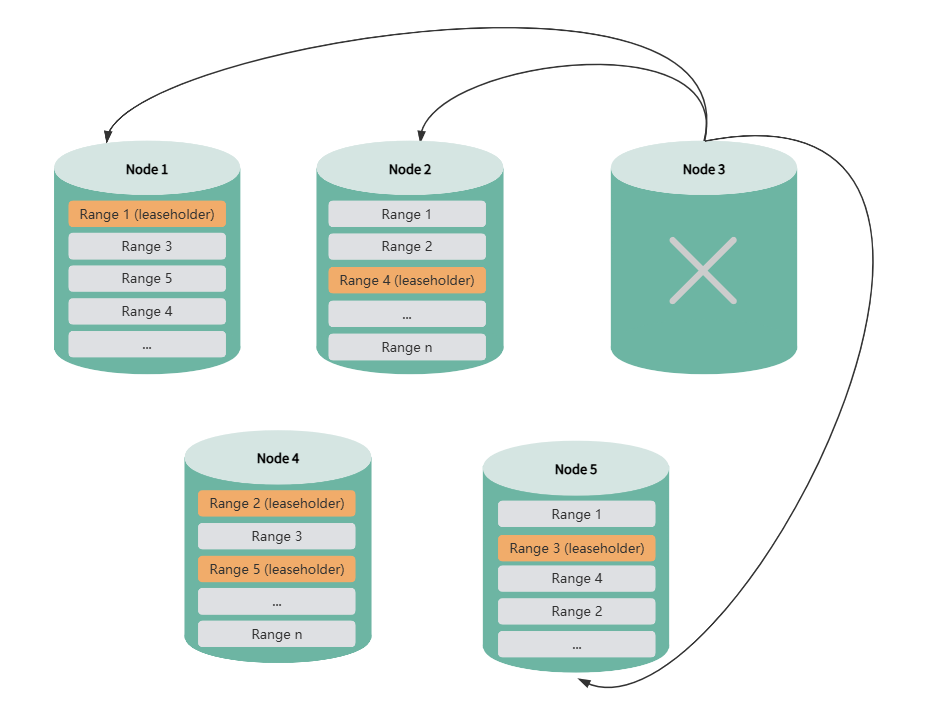

# 高可用

## 高可用支持

- **多副本集群**：默认情况下，KWDB 多副本集群支持高可用，能够实现故障转移和数据强一致性。集群中的各节点通过定期的心跳机制来维护连接和状态，以便及时发现故障并采取相应措施。
- **单机版**：KWDB 单机版支持基于 DRBD 块设备复制的开源软件方案，实现主备节点间的数据复制，更多相关信息，参见[单机高可用性方案](../best-practices/single-ha.md)。
- **单副本集群**：KWDB 单副本集群不支持高可用性。

## 多副本集群高可用

### 概述

KWDB 多副本集群具备高可用能力，能够实现故障转移和数据强一致性。集群中的各节点通过定期的心跳机制维护连接和状态，以便及时发现故障并采取相应措施。

KWDB 多副本集群默认采用 3 副本机制，通过 RAFT 协议保证数据一致性和可用性，因此至少需要 2 个副本保持可用状态。

### 基础概念

| 概念                  | 描述                                                         |
| :-------------------- | :----------------------------------------------------------- |
| 数据分片（Range）     | KWDB 将所有用户数据（表、索引等）和几乎所有系统数据存储在键值对的排序映射中。这个键空间被划分为多个数据分片，每个键始终可以在单个数据分片内找到。数据分片是集群高可用性和数据迁移的最小单元。 |
| 副本（Replica）       | 每个用户数据分片默认有 3 个副本，以保证高可用性。数据迁移时，以分片副本为单位进行迁移。 |
| 主副本（Leaseholder） | 每个分片的主副本，负责处理该分片的读写请求。主副本通过 RAFT 协议选举产生，确保数据一致性。 |
| 节点状态              | KWDB 中的集群节点存在以下状态：<br>- 存活节点：默认节点状态，表示节点正常运行<br>- 异常节点：1 分钟内无网络连接的节点会被标记为异常节点<br>- 不可用节点：默认 30 分钟内无网络连接的节点将被标记为不可用节点，触发数据副本补足机制 <br><br>**提示:** 用户可通过 `kw-status` 或 `kwbase node status` 命令查看集群内的节点状态 |

### 机制说明

以下以 5 节点集群为例，说明 KWDB 多副本集群如何实现高可用性。

#### 正常运行

KWDB 集群启动后，分片副本均匀分布在所有节点上，确保数据的高可用性和负载均衡。


#### 单节点故障

单个节点离线后，如果该节点存在某分片的主副本，系统会自动从该分片在其他节点上的副本中重新选出新的主副本，以确保数据服务的连续性及数据一致性。

在主副本重新选举期间，集群可以正常提供服务，DDL 和 DML 操作均可正常执行。对于查询操作，只有当正在执行的查询语句涉及故障节点时，该语句才会执行失败。此时应用可以立即重新发起查询，系统能够正常响应并提供服务。


节点离线超过 1 分钟后，系统会将其标记为异常节点。节点离线时间达到设定值（默认为 30 分钟）后，系统会将该节点标记为不可用节点。如果剩余节点数量仍大于副本数，如图示中剩余 4 节点，但集群副本数为 3，此时系统自动补足缺失的副本，确保数据的高可用性。副本补足期间，数据查询、DDL 和 DML 操作均不受影响。

用户也可通过相关参数关闭副本自动补足功能，在系统负载较低时重新启用。

::: warning 提示

如果之前通过 CONFIGURE ZONE 语句设置了副本约束，且约束规则中包含异常节点，可能会影响副本补足功能的正常运行。此时需要重新配置约束规则，将异常节点从规则中移除，副本补足功能即可恢复正常。 

:::



异常节点或不可用节点恢复后，系统会自动进行数据同步或数据补齐。节点恢复期间，数据查询、DDL 和 DML 操作均不受影响。

#### 多节点故障

##### 依次故障

如果两个节点依次发生故障，当第二个节点故障前系统已完成副本补足，则第二个节点故障后，系统仍可正常运行。注意：在 5 节点三副本集群中禁用副本自动补足功能后，将无法承受连续的节点故障。


##### 同时故障

如果两个或更多节点同时出现故障，由于剩余节点数小于或等于副本数，系统无法补足缺失的副本，可能导致部分数据无法访问，甚至出现集群无法使用的情况。


::: warning 说明

- KWDB 2.0 版本使用导入导出方式升级到 2.0.4 版本后，多副本集群的高可用性可能会受到影响。
- 集群节点多次发生故障后重新加入，可能会导致数据写入缓慢。

:::

### 相关操作

#### 配置不可用节点判定时间

默认情况下，如果一个节点的离线时间超过 30 分钟，系统会将其标记为不可用节点，并将该节点上的数据副本重新分配到其他节点，以确保数据的可用性和一致性。

用户也可以通过以下 SQL 命令设置节点判定时间：

```sql
SET CLUSTER SETTING server.time_until_store_dead = <value>;
```

设置时间建议不小于 75s。注意：延长节点判定时间，可以减少节点故障对集群性能的长时间影响，但可能会影响集群的高可用性功能和 DDL 相关操作。

### 控制节点死亡后是否自动迁移补齐副本

系统将离线节点标记为不可用节点后，如果剩余节点数量仍大于副本数，系统将自动补足缺失的副本，确保数据的高可用性。用户也可以通过以下 SQL 命令关闭自动补足副本功能：

```sql
SET CLUSTER SETTING kv.allocator.ts_store_dead_rebalance.enabled = false;
```

注意：在 5 节点三副本集群中禁用该功能后，将无法承受连续节点故障。

#### 查看节点状态

- **通过 `kw-status.sh` 脚本**
  
  ::: warning 说明
  该命令只适用于脚本部署。
  :::

  ```shell
  kw-status
  ```

- **通过 `kwbase` 命令**

    ```shell
    <kwbase_path>/kwbase node status [--host=<ip:port>] [--insecure | --certs-dir=<path>]
    ```

  `is_available` 和 `is_live` 均为 `true` 表示节点正常运行，均为 `false` 表示节点异常。

#### 查看副本补足状态

使用 SQL 命令查询是否存在副本不足或不可用分片:

  ```sql
  SELECT sum((metrics->>'ranges.unavailable')::DECIMAL)::INT AS ranges_unavailable,
      sum((metrics->>'ranges.underreplicated')::DECIMAL)::INT As ranges_underreplicated
  FROM kwdb_internal.kv_store_status;
  ```

### 查看副本同步状态

  通过导入[分布式面板](https://gitee.com/kwdb/kwdb/blob/master/kwbase/monitoring/grafana-dashboards/6.KaiwuDB_Console_Replication.json)查看副本同步情况。