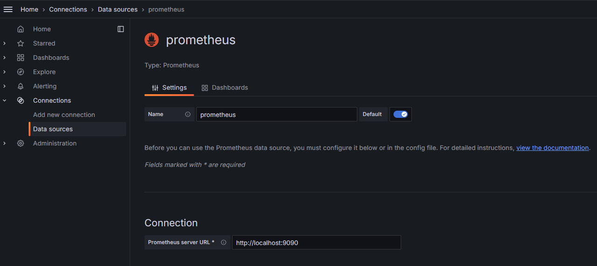
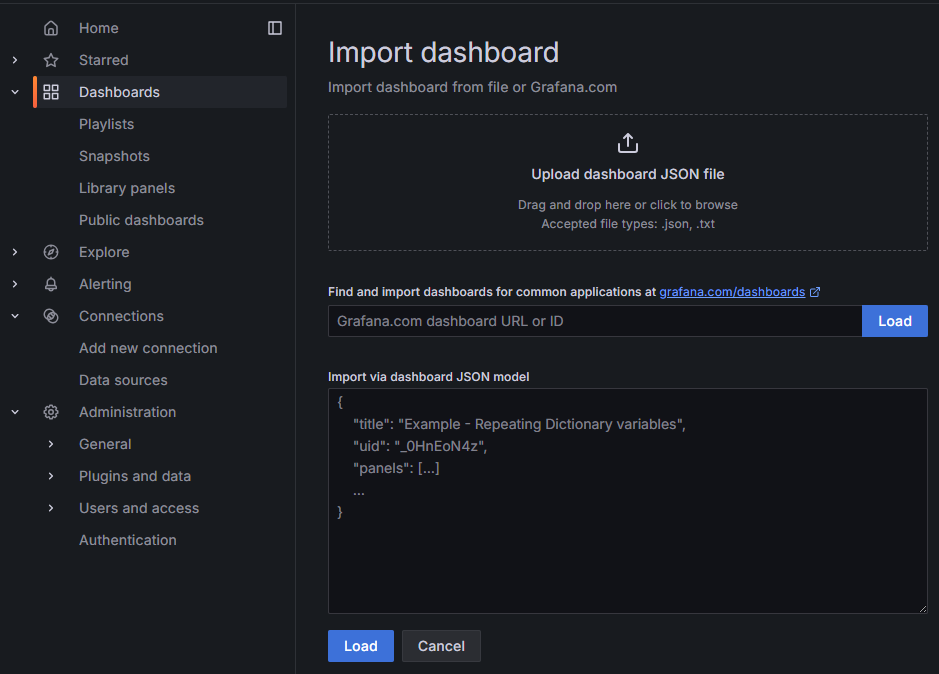

# 部署监控

KWDB 使用 [Prometheus](https://prometheus.io/) 采集和存储 KWDB 集群的监控和性能指标信息，使用 [Grafana](https://grafana.com/grafana) 作为可视化组件进行展示。本文介绍如何部署 Prometheus 和 Grafana。

## 部署 Prometheus

1. [下载](https://prometheus.io/download/) Prometheus 安装包并解压缩到本地目录。

    以下示例解压缩 Prometheus v2.53.0 安装包。

    ```shell
    tar -zxvf prometheus-2.53.0.linux-amd64.tar.gz
    ```

2. 在 `prometheus-2.53.0.linux-amd64` 目录下创建 `rules` 子目录。
3. 下载 Prometheus 告警规则和聚合规则配置文件并将其放置在 `rules` 子目录。

    KWDB 在其安装包的 `monitoring/rules` 目录下提供 `alerts.rules.yml` 和 `aggregation.rules.yml` 文件。有关告警规则配置项和聚合规则配置项的详细信息，参见 [Prometheus 告警规则](https://prometheus.io/docs/prometheus/latest/configuration/alerting_rules/)和 [Prometheus 聚合规则](https://prometheus.io/docs/practices/rules/#aggregation)。

    - `alerts.rules.yml`：告警规则配置文件。
    - `aggregation.rules.yml`：聚合规则配置文件。

4. 配置 Prometheus。

    ```shell
    cd prometheus-2.53.0.linux-amd64 &&
    vi prometheus.yml
    ```

    以下是配置文件示例。用户可以根据实际部署情况，调整配置参数及取值。

    ```yaml
    # Prometheus configuration for kaiwudb clusters.
    # Requires prometheus 2.X
    #
    # Run with:
    # $ prometheus -config.file=prometheus.yml
    global:
      scrape_interval: 10s
      evaluation_interval: 10s

    rule_files:
    - "rules/alerts.rules.yml"
    - "rules/aggregation.rules.yml"

    scrape_configs:
      - job_name: 'kaiwudb'
        metrics_path: '/_status/vars'
        # Insecure mode:
        scheme: 'http'
        # Secure mode:
        # scheme: 'https'
        tls_config:
          insecure_skip_verify: true

        static_configs:
        - targets: ['localhost:8080', 'localhost:8081', 'localhost:8082']
          labels:
            cluster: 'my-kaiwudb-cluster'
    ```

    配置参数说明：

    - `global`：Prometheus Server 的全局配置。
      - `scrape_interval`：配置 Prometheus Server 采集数据的周期。
      - `evaluation_interval`：配置 Prometheus Server 评估规则的周期。Prometheus 使用规则创建新的时间序列并生成报警。
    - `rule_files`：指定 Prometheus Server 加载的规则文件的路径。
    - `scrape_configs`：数据采集的目标对象和参数。一般情况下，一个采集配置指定一个作业。可以通过 `static_configs` 参数配置静态目标，也可以使用支持的服务发现机制动态发现目标。
      - `job_name`：数据采集作业的名称。
      - `metrics_path`：从目标采集数据指标的 HTTP 资源路径。
      - `scheme`：用于请求的协议。
      - `tls_config`：数据采集请求的 TLS 设置。
      - `static_configs`：配置静态目标列表。

    有关 Prometheus 所有配置项的详细信息，参见 [Prometheus 官方文档](https://prometheus.io/docs/prometheus/latest/configuration/configuration/)。

5. 启动 Prometheus 服务。

    ```shell
    ./prometheus --config.file=prometheus.yml
    ```

    默认情况下，Prometheus 的启动端口是 `9090`。用户可以按需修改 Prometheus 的启动端口。以下示例将 Prometheus 的启动端口设置为 `8091`。

    ```shell
    ./prometheus --config.file=prometheus.yml --web.listen-address=:8091
    ```

    如需查看 Prometheus 支持的所有命令行参数，运行 `./prometheus -h` 命令。

6. 登录 Prometheus。

    默认情况下，Prometheus 的登录地址是 `http://localhost:9090`。启动 Prometheus 服务后，用户即可通过该地址访问 Prometheus。

## 部署 Grafana

1. 下载 Grafana 安装包并解压缩到本地目录。

    以下示例下载 Grafana v11.1.0 安装包。

    ```shell
    wget https://dl.grafana.com/enterprise/release/grafana-enterprise-11.1.0.linux-amd64.tar.gz
    tar -zxvf grafana-enterprise-11.1.0.linux-amd64.tar.gz
    ```

2. 启动 Grafana 服务。

    ```shell
    cd grafana-v11.1.0/bin
    ./grafana-server
    ```

## 配置 Grafana

### 添加 Prometheus 数据源

1. 登录 Grafana。

    默认情况下，Grafana 的登录地址是 `http://localhost:3000`。用户可以使用默认的用户名和密码（均为 `admin`）登录 Grafana。

2. 在 Grafana 左侧边栏，单击 **Connections** > **Data sources**。
3. 在 **Data sources** 窗口，单击 **Add data source**，然后选择 **Prometheus**。

    

4. 配置 Prometheus 的相关信息。

    - `Name`：数据源的名称。
    - `URL`：Prometheus Server 的 IP 地址。
    - 按需配置其它字段。

5. 单击 `Save & test`，保存 Prometheus 数据源。

### 导入 Grafana 面板

默认情况下，KWDB 在其安装包的 `monitoring/grafana-dashboards` 目录下提供以下指标面板模板。用户将指标面板模板（`.json` 格式）导入 Grafana 后，即可监控 KWDB 集群。

- 概览：展示集群和节点的关键指标。
- 硬件：展示硬件相关的监控指标。
- 运行时：展示运行时相关的监控指标。
- SQL：展示 SQL 相关的监控指标。
- 存储：展示存储相关的监控指标。
- 副本：展示副本相关的监控指标。
- 分布式：展示分布式相关的监控指标。
- 队列：展示队列相关的监控指标。
- 慢查询：展示慢查询相关的监控指标。

如需导入 KWDB 指标面板，遵循以下步骤。

1. 在 Grafana 左侧边栏，单击 **Dashboards**。
2. 在 **Dashboard** 窗口，单击 **New**，然后从下列菜单中选择 **Import**。
3. 上传目标面板文件，然后单击 **Load**。

    

    ::: warning 说明

    默认情况下，KWDB 在其安装包的 `monitoring/grafana-dashboards` 目录下提供以下指标模板。KWDB 各指标面板对应的文件名如下所示：

    - 概览：`1.KaiwuDB_Console_Overview.json`
    - 硬件：`2.KaiwuDB_Console_Hardware.json`
    - 运行时：`3.KaiwuDB_Console_Runtime.json`
    - SQL：`4.KaiwuDB_Console_SQL.json`
    - 存储：`5.KaiwuDB_Console_Storage.json`
    - 副本：`6.KaiwuDB_Console_Replication.json`
    - 分布式：`7.KaiwuDB_Console_Distribution.json`
    - 队列：`8.KaiwuDB_Console_Queue.json`
    - 慢查询：`9.KaiwuDB_Console_Slow_Query.json`

    :::

4. （可选）在 Grafana 左侧边栏，单击 **Dashboards**，然后选择任一指标模板，即可查看监控指标数据。
