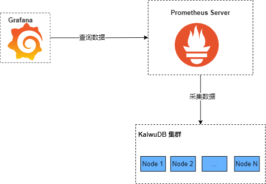

# 集群监控概述

KWDB 使用 [Prometheus](https://prometheus.io/) 采集和存储 KWDB 集群的监控和性能指标信息，使用 [Grafana](https://grafana.com/grafana) 作为可视化组件进行展示。

Prometheus 是一款开源的系统监控和告警平台，用于采集和存储监控对象的指标数据。Grafana 是一款开源的数据可视化工具，可以从多种数据源获取数据，并在数据面板中展示所有数据。Grafana 读取 KWDB 集群的指标数据，以可视化方式展示数据库的集群节点状态、监控指标。

KWDB 提供以下指标面板模板。用户下载面板模板并将其导入 Grafana 后，即可监控 KWDB 集群。

- 概览：展示集群和节点的关键指标。
- 硬件：展示硬件相关的监控指标。
- 运行时：展示运行时相关的监控指标。
- SQL：展示 SQL 相关的监控指标。
- 存储：展示存储相关的监控指标。
- 副本：展示副本相关的监控指标。
- 分布式：展示分布式相关的监控指标。
- 队列：展示队列相关的监控指标。
- 慢查询：展示慢查询相关的监控指标。

每个指标面板包括多个监控项。具体信息，参见[查看指标数据](./view-metrics.md)。

下图说明如何使用 Prometheus 和 Grafana 监控 KWDB 集群。

