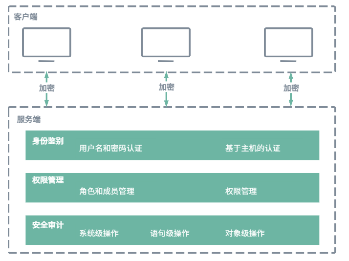

# 集群安全概述

KWDB 提供了一系列的安全功能，确保用户数据的保密性、完整性和可用性。

- **加密传输**：KWDB 支持使用 SSL/TLS 协议对客户端和服务器之间的数据传输进行加密，确保数据在传输过程中不被窃取或篡改，提高了数据传输的安全性。

- **身份鉴别**：KWDB 通过基于用户名和密码的身份鉴别以及灵活的主机认证规则，确保数据库访问的安全性。
  - 基于用户名和密码的身份鉴别：用户在登录时需要提供正确的用户名和密码，系统将验证其凭证以允许访问。
  - 基于主机的认证：KWDB 支持用户通过系统参数配置对指定用户和指定 IP 地址范围配置基于证书、密码的认证，无条件允许或拒绝连接等认证规则，实现对主机的访问的精确管理。
- **权限管理**：KWDB 支持灵活的权限管理机制，为用户提供了多层次、多维度的权限管理功能，具体包括：
  - 基于角色的权限管理：管理员可以创建不同的角色，并为每个角色分配特定的权限。通过将用户和角色分配到适当的角色中，实现对用户权限的管理，从而简化权限管理流程，确保安全性。
  - 细粒度的对象级权限控制：KWDB 允许管理员对数据库中的对象，例如数据库、表，进行细粒度的权限控制。管理员可以精确地指定用户或角色可以访问的数据库对象，以及可以执行的操作类型。
  - 动态权限调整：管理员可以随时根据需要调整用户或角色的权限，包括增加、修改或撤销权限，及时响应业务需求或安全策略的变化，确保系统的灵活性和安全性。

- **审计管理**：审计管理是 KWDB 安全管理的核心组成部分。通过全面记录数据库活动和用户操作，KWDB 能够帮助用户实时监控数据库的安全状态，并生成详尽的审计日志。这些审计日志可以帮助用户追溯安全事件的发生原因，加强对数据库的监控和管理。
