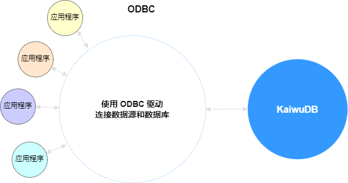
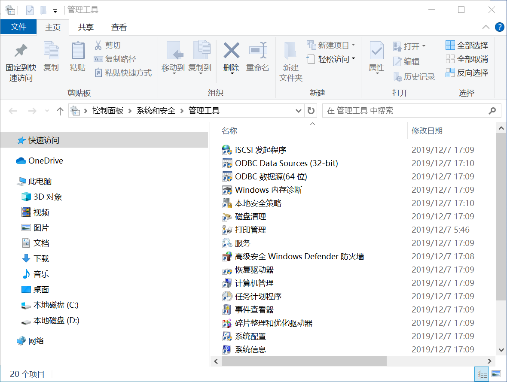
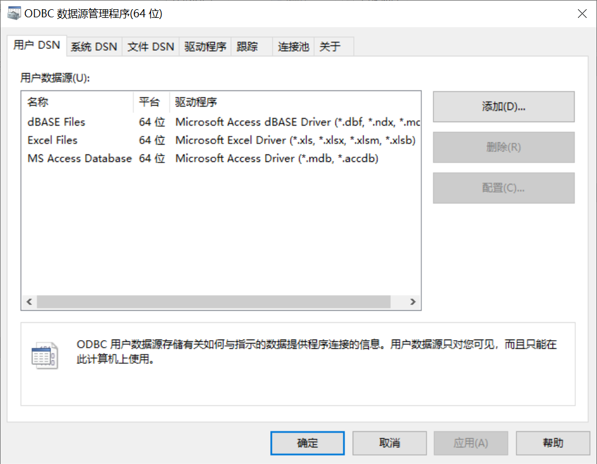
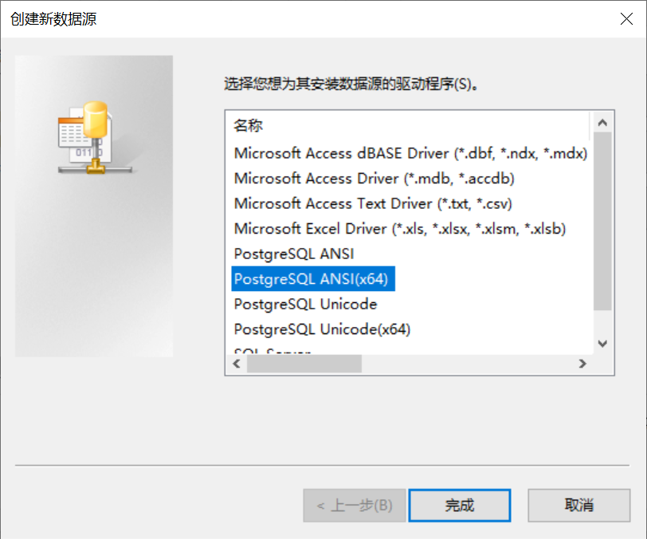
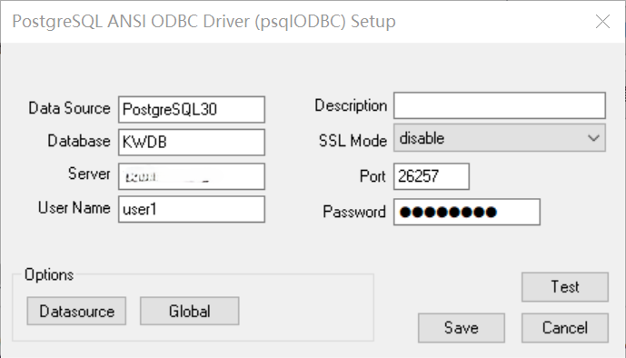

# PostgreSQL ODBC 连接 KWDB 数据库

开放数据库连接（Open Database Connectivity，ODBC）是一种应用程序编程接口（Application Programming Interface，API），为应用程序访问数据库存储的信息提供了一种标准。ODBC 为异构数据库访问提供统一接口，实现异构数据库间的数据共享。使用 ODBC API 的应用程序可以访问任何符合 ODBC 标准的数据库中的数据，通常无需修改应用程序代码。



本文介绍如何使用 PostgreSQL ODBC 连接 KWDB 数据库。

## Windows 系统

### 前提条件

- 安装 KWDB 数据库、配置数据库认证方式、创建数据库。
- 获取 [PostgreSQL ODBC 驱动安装包](https://www.postgresql.org/ftp/odbc/releases/)。

### 安装 PostgreSQL ODBC 驱动

1. 解压缩 PostgreSQL ODBC 驱动安装包。
2. 双击运行 `psqlodbc-setup.exe` 应用程序，按照提示安装 PostgreSQL ODBC 驱动。

### 配置 ODBC 数据源

1. 单击**开始**，然后选择 **控制面板** > **系统和安全** > **管理工具**，打开**管理工具**窗口。

    

2. 在**管理工具**窗口，双击 **ODBC 数据源(64位)**，打开 **ODBC 数据源管理程序**窗口。

3. 在 **ODBC 数据源管理程序**窗口，选择**用户 DSN** 页签，然后单击**添加**。

    

4. 在**创建新数据源**窗口，选择 **PostgreSQL ANSI(x64)**，然后单击**完成**。

    

5. 配置数据源。

    

    - `Data Source`：数据源名称。
    - `Description`：可选项，数据源描述信息。
    - `Database`：KWDB 数据库的名称。
    - `SSL Mode`：是否开启 SSL 加密模式。默认情况下，不开启 SSL 加密模式。
    - `Server`：KWDB 数据库的 IP 地址。
    - `Port`：KWDB 数据库的连接端口。
    - `User Name`：连接数据库的用户名。
    - `Password`：身份验证时使用的密码。安全模式下，优先使用 SSL 证书进行登录认证。

6. （可选）验证配置是否正确。

    单击 **Test**。如果出现 `Connection successful`，说明配置正确。

7. 单击 **Save**，保存配置信息。

8. 单击**确定**。

### 连接示例

#### 关系库

以下示例说明如何根据配置的数据源连接 KWDB 数据库并查询数据。

```cpp{21-29}
#include <windows.h>
#include <sql.h>
#include <sqlext.h>
#include <stdio.h>

int main() {
    SQLHENV hEnv = NULL;
    SQLHDBC hDbc = NULL;
    SQLHSTMT hStmt = NULL;
    SQLRETURN retcode;
    SQLLEN id;
    SQLCHAR menuID[32];
    SQLCHAR menuName[128];

    // 分配环境句柄
    SQLAllocHandle(SQL_HANDLE_ENV, SQL_NULL_HANDLE, &hEnv);
    // 设置环境属性
    SQLSetEnvAttr(hEnv, SQL_ATTR_ODBC_VERSION, (void*)SQL_OV_ODBC3, 0);
    // 分配连接句柄
    SQLAllocHandle(SQL_HANDLE_DBC, hEnv, &hDbc);
    // 连接数据库
    SQLRETURN ret;
    ret = SQLConnect(hDbc, (SQLCHAR*)"kwdb", SQL_NTS, (SQLCHAR*)"pz", SQL_NTS, (SQLCHAR*)"123", SQL_NTS);
    if (ret != SQL_SUCCESS) {
        printf("Failed to connect the database\n\n");
    }
    else {
        printf("Connected to the database\n\n");
    }


    SQLHSTMT hStmt3 = NULL;
    SQLCHAR* create3 = (SQLCHAR*)"CREATE TABLE b(a varchar); ";
    SQLAllocHandle(SQL_HANDLE_STMT, hDbc, &hStmt3);
    ret = SQLExecDirect(hStmt3, create3, SQL_NTS);
    if (ret != SQL_SUCCESS) {
        printf("execute failed\n");
    }
    else {
        printf("execute success\n");
    }

    SQLHSTMT hStmt4 = NULL;
    SQLCHAR* query4 = (SQLCHAR*)"INSERT INTO b VALUES ('中文读取'); ";
    SQLAllocHandle(SQL_HANDLE_STMT, hDbc, &hStmt4);
    ret = SQLExecDirect(hStmt4, query4, SQL_NTS);
    if (ret != SQL_SUCCESS) {
        printf("execute failed\n");
    }
    else {
        printf("execute success\n");
    }


    SQLHSTMT hStmt9 = NULL;
    SQLCHAR* query9 = (SQLCHAR*)"select * from b;";
    // 分配语句句柄
    SQLAllocHandle(SQL_HANDLE_STMT, hDbc, &hStmt9);
    // 执行查询
    ret = SQLExecDirect(hStmt9, query9, SQL_NTS);
    if (ret != SQL_SUCCESS) {
        printf("execute failed\n");
    }
    else {
        printf("execute success\n");
        ret = SQLBindCol(hStmt9, 1, SQL_C_CHAR, &menuID, sizeof(menuID), NULL);

        // 检索数据
        while ((ret = SQLFetch(hStmt9)) == SQL_SUCCESS) {
            printf("a: %s\n", menuID);
        }

        if (ret == SQL_NO_DATA) {
            printf("No more data\n");
        }
        else {
            printf("Failed to fetch data\n");
        }
    }

    // 释放句柄
    SQLFreeHandle(SQL_HANDLE_STMT, hStmt4);
    SQLFreeHandle(SQL_HANDLE_STMT, hStmt9);

    SQLDisconnect(hDbc);
    SQLFreeHandle(SQL_HANDLE_DBC, hDbc);
    SQLFreeHandle(SQL_HANDLE_ENV, hEnv);

    return 0;
}
```

#### 时序库

时序引擎默认开启写入短接功能。PostgreSQL ODBC 也支持通过 `PREPARE INSERT` 语句提高时序数据写入速度。

```cpp
#include <windows.h>
#include <sql.h>
#include <sqlext.h>
#include <iostream>
#include <vector>
#include <string>
#include <iomanip>
#include <ctime>

// 检查ODBC返回码，如果有错误则抛出异常
void checkReturn(SQLRETURN ret, SQLHANDLE handle, SQLSMALLINT handleType, const std::string& msg) {
    if (ret != SQL_SUCCESS && ret != SQL_SUCCESS_WITH_INFO) {
        SQLCHAR sqlState[6];
        SQLCHAR message[SQL_MAX_MESSAGE_LENGTH];
        SQLSMALLINT length;
        SQLINTEGER nativeError;

        SQLGetDiagRec(handleType, handle, 1, sqlState, &nativeError, message, sizeof(message), &length);
        std::cerr << "Error: " << msg << "\nSQL State: " << sqlState << "\nMessage: " << message << std::endl;
        throw std::runtime_error(msg);
    }
}

int main() {
    SQLHENV env = nullptr;
    SQLHDBC dbc = nullptr;
    SQLHSTMT stmt = nullptr;

    try {
        // 分配环境句柄
        SQLAllocHandle(SQL_HANDLE_ENV, SQL_NULL_HANDLE, &env);
        SQLSetEnvAttr(env, SQL_ATTR_ODBC_VERSION, (void*)SQL_OV_ODBC3, 0);

        // 分配连接句柄
        SQLAllocHandle(SQL_HANDLE_DBC, env, &dbc);

        // 连接数据源
        SQLCHAR* dsn = (SQLCHAR*)"kwdb";
        SQLCHAR* user = (SQLCHAR*)"u1";
        SQLCHAR* pass = (SQLCHAR*)"123";

        SQLRETURN ret = SQLConnect(dbc, dsn, SQL_NTS, user, SQL_NTS, pass, SQL_NTS);
        checkReturn(ret, dbc, SQL_HANDLE_DBC, "Failed to connect to data source");

        std::cout << "Connected to data source successfully." << std::endl;

        // 分配语句句柄
        SQLAllocHandle(SQL_HANDLE_STMT, dbc, &stmt);

        // 创建数据库
        const char* createDatabaseSQL =
                "CREATE TS DATABASE tsdb";

        ret = SQLExecDirect(stmt, (SQLCHAR*)createDatabaseSQL, SQL_NTS);
        checkReturn(ret, stmt, SQL_HANDLE_STMT, "Failed to create database");
        std::cout << "Database created successfully." << std::endl;

        // 创建表
        const char* createTableSQL =
                "CREATE TABLE tsdb.device_logs ("
                "    ts TIMESTAMP NOT NULL,"
                "    status_code SMALLINT,"
                "    is_online BOOLEAN,"
                "    error_count INTEGER,"
                "    device_name VARCHAR(50))"
                "TAGS ("
                "    device_id INTEGER NOT NULL,"
                "    location VARCHAR(100),"
                "    device_type VARCHAR(30)"
                ") PRIMARY TAGS (device_id)";

        ret = SQLExecDirect(stmt, (SQLCHAR*)createTableSQL, SQL_NTS);
        checkReturn(ret, stmt, SQL_HANDLE_STMT, "Failed to create table");
        std::cout << "Table created successfully." << std::endl;

        // 准备插入语句
        const char* insertSQL =
                "INSERT INTO tsdb.device_logs VALUES (?, ?, ?, ?, ?, ?, ?, ?)";

        ret = SQLPrepare(stmt, (SQLCHAR*)insertSQL, SQL_NTS);
        checkReturn(ret, stmt, SQL_HANDLE_STMT, "Failed to prepare insert statement");

        // 定义要插入的数据
        struct DeviceLog {
            SQL_TIMESTAMP_STRUCT ts;
            SQLSMALLINT status_code;
            SQLCHAR is_online;
            SQLINTEGER error_count;
            SQLCHAR device_name[51];
            SQLINTEGER device_id;
            SQLCHAR location[101];
            SQLCHAR device_type[31];
        };

        std::vector<DeviceLog> logs;

        // 逐个添加记录
        DeviceLog log1 = {{2023, 6, 1, 8, 0, 0, 0}, 200, 1, 0, "", 101, "", ""};
        strncpy(reinterpret_cast<char *>(log1.device_name), "Main Server", sizeof(log1.device_name) - 1);
        strncpy(reinterpret_cast<char *>(log1.location), "Server Room", sizeof(log1.location) - 1);
        strncpy(reinterpret_cast<char *>(log1.device_type), "Server", sizeof(log1.device_type) - 1);
        logs.push_back(log1);

        DeviceLog log2 = {{2023, 6, 1, 8, 5, 0, 0}, 200, 1, 0, "", 101, "", ""};
        strncpy(reinterpret_cast<char *>(log2.device_name), "Main Server", sizeof(log2.device_name) - 1);
        strncpy(reinterpret_cast<char *>(log2.location), "Server Room", sizeof(log2.location) - 1);
        strncpy(reinterpret_cast<char *>(log2.device_type), "Server", sizeof(log2.device_type) - 1);
        logs.push_back(log2);

        DeviceLog log3 = {{2023, 6, 1, 8, 0, 0, 0}, 404, 0, 3, "", 201, "", ""};
        strncpy(reinterpret_cast<char *>(log3.device_name), "Sensor Node 1", sizeof(log3.device_name) - 1);
        strncpy(reinterpret_cast<char *>(log3.location), "Hallway", sizeof(log3.location) - 1);
        strncpy(reinterpret_cast<char *>(log3.device_type), "Sensor", sizeof(log3.device_type) - 1);
        logs.push_back(log3);

        DeviceLog log4 = {{2023, 6, 1, 8, 5, 0, 0}, 200, 1, 0, "", 201, "", ""};
        strncpy(reinterpret_cast<char *>(log4.device_name), "Sensor Node 1", sizeof(log4.device_name) - 1);
        strncpy(reinterpret_cast<char *>(log4.location), "Hallway", sizeof(log4.location) - 1);
        strncpy(reinterpret_cast<char *>(log4.device_type), "Sensor", sizeof(log4.device_type) - 1);
        logs.push_back(log4);

        DeviceLog log5 = {{2023, 6, 1, 8, 0, 0, 0}, 500, 0, 5, "", 301, "", ""};
        strncpy(reinterpret_cast<char *>(log5.device_name), "Gateway 1", sizeof(log5.device_name) - 1);
        strncpy(reinterpret_cast<char *>(log5.location), "Entrance", sizeof(log5.location) - 1);
        strncpy(reinterpret_cast<char *>(log5.device_type), "Gateway", sizeof(log5.device_type) - 1);
        logs.push_back(log5);

        // 绑定参数并执行插入
        for (auto& log : logs) {
            SQLBindParameter(stmt, 1, SQL_PARAM_INPUT, SQL_C_TYPE_TIMESTAMP, SQL_TIMESTAMP, 0, 0, &log.ts, 0, nullptr);
            SQLBindParameter(stmt, 2, SQL_PARAM_INPUT, SQL_C_SSHORT, SQL_SMALLINT, 0, 0, &log.status_code, 0, nullptr);
            SQLBindParameter(stmt, 3, SQL_PARAM_INPUT, SQL_C_BIT, SQL_BIT, 0, 0, &log.is_online, 0, nullptr);
            SQLBindParameter(stmt, 4, SQL_PARAM_INPUT, SQL_C_SLONG, SQL_INTEGER, 0, 0, &log.error_count, 0, nullptr);
            SQLBindParameter(stmt, 5, SQL_PARAM_INPUT, SQL_C_CHAR, SQL_VARCHAR, 50, 0, log.device_name, sizeof(log.device_name), nullptr);
            SQLBindParameter(stmt, 6, SQL_PARAM_INPUT, SQL_C_SLONG, SQL_INTEGER, 0, 0, &log.device_id, 0, nullptr);
            SQLBindParameter(stmt, 7, SQL_PARAM_INPUT, SQL_C_CHAR, SQL_VARCHAR, 100, 0, log.location, sizeof(log.location), nullptr);
            SQLBindParameter(stmt, 8, SQL_PARAM_INPUT, SQL_C_CHAR, SQL_VARCHAR, 30, 0, log.device_type, sizeof(log.device_type), nullptr);

            ret = SQLExecute(stmt);
            checkReturn(ret, stmt, SQL_HANDLE_STMT, "Failed to execute insert");

            SQLFreeStmt(stmt, SQL_UNBIND);
        }
        std::cout << "Data inserted successfully." << std::endl;

        //  准备查询语句
        const char* querySQL = "SELECT * FROM tsdb.device_logs WHERE device_type = ?";
        ret = SQLPrepare(stmt, (SQLCHAR*)querySQL, SQL_NTS);
        checkReturn(ret, stmt, SQL_HANDLE_STMT, "Failed to prepare query statement");

        // 绑定查询参数
        SQLCHAR deviceType[] = "Sensor";
        SQLBindParameter(stmt, 1, SQL_PARAM_INPUT, SQL_C_CHAR, SQL_VARCHAR, sizeof(deviceType)-1, 0, deviceType, sizeof(deviceType), nullptr);

        // 执行查询
        ret = SQLExecute(stmt);
        checkReturn(ret, stmt, SQL_HANDLE_STMT, "Failed to execute query");

        // 绑定结果列
        SQLCHAR ts[64];
        SQLSMALLINT status_code;
        SQLCHAR is_online;
        SQLINTEGER error_count;
        SQLCHAR device_name[51];
        SQLINTEGER device_id;
        SQLCHAR location[101];
        SQLCHAR device_type[31];

        SQLBindCol(stmt, 1, SQL_C_CHAR, &ts, sizeof(ts), nullptr);
        SQLBindCol(stmt, 2, SQL_C_SSHORT, &status_code, 0, nullptr);
        SQLBindCol(stmt, 3, SQL_C_BIT, &is_online, 0, nullptr);
        SQLBindCol(stmt, 4, SQL_C_SLONG, &error_count, 0, nullptr);
        SQLBindCol(stmt, 5, SQL_C_CHAR, device_name, sizeof(device_name), nullptr);
        SQLBindCol(stmt, 6, SQL_C_SLONG, &device_id, 0, nullptr);
        SQLBindCol(stmt, 7, SQL_C_CHAR, location, sizeof(location), nullptr);
        SQLBindCol(stmt, 8, SQL_C_CHAR, device_type, sizeof(device_type), nullptr);

        // 打印结果
        std::cout << "\nQuery results for device_type = 'Sensor':" << std::endl;
        std::cout << std::left << std::setw(20) << "Timestamp"
                  << std::setw(10) << "Status"
                  << std::setw(8) << "Online"
                  << std::setw(10) << "Errors"
                  << std::setw(15) << "Device Name"
                  << std::setw(8) << "Dev ID"
                  << std::setw(15) << "Location"
                  << std::setw(10) << "Type" << std::endl;

        while (SQLFetch(stmt) == SQL_SUCCESS) {
            std::cout << std::setw(20) << ts
                      << std::setw(10) << status_code
                      << std::setw(8) << (int)is_online
                      << std::setw(10) << error_count
                      << std::setw(15) << device_name
                      << std::setw(8) << device_id
                      << std::setw(15) << location
                      << std::setw(10) << device_type << std::endl;
        }

        std::cout << "\nAll operations completed successfully." << std::endl;
    } catch (const std::exception& e) {
        std::cerr << "Error: " << e.what() << std::endl;
        return 1;
    }

    // 释放资源
    if (stmt) SQLFreeHandle(SQL_HANDLE_STMT, stmt);
    if (dbc) {
        SQLDisconnect(dbc);
        SQLFreeHandle(SQL_HANDLE_DBC, dbc);
    }
    if (env) SQLFreeHandle(SQL_HANDLE_ENV, env);

    return 0;
}
```

## Linux 系统

### 前提条件

- 下载软件依赖包。
  - libgcc（9.4.0 及以上版本）
  - [postgresql-devel](https://pkgs.org/download/postgresql-devel)（10.5 及以上版本）
  - [unixODBC-devel](https://pkgs.org/download/unixODBC-devel)（2.3.7 及以上版本）
- 安装 KWDB 数据库、配置数据库认证方式、创建数据库。

### 安装软件依赖包

- libgcc

    [联系](https://www.kaiwudb.com/support/) KWDB 技术支持人员。

- postgresql-devel

    ```shell
    yum install postgresql-devel
    ```

- unixODBC-devel

    ```shell
    yum install unixODBC-devel
    ```

### 安装 PostgreSQL ODBC 驱动

1. 下载并安装 PostgreSQL ODBC 驱动。

    ```bash
    wget https://update.cs2c.com.cn/NS/V10/V10SP3-2403/os/adv/lic/base/x86_64/Packages/postgresql-odbc-13.00.0000-1.ky10.x86_64.rpm
    sudo rpm -ivh postgresql-odbc-13.00.0000-1.ky10.x86_64.rpm
    ```

2. 验证是否成功安装 PostgreSQL ODBC 驱动。

    - 验证是否成功安装 [unixODBC](https://www.unixodbc.org/)。

        ```shell
        odbcinst -j
        ```

    - 验证是否成功安装 PostgreSQL ODBC 驱动。

        ```shell
        odbcinst -q -d
        ```

    用户也可以在 `/etc/odbcinst.ini` ⽂件中查看已安装的驱动程序。

### 配置 ODBC 数据源

1. 打开 ODBC 配置文件（`odbc.ini`）。

    ```shell
    vim /etc/odbc.ini
    ```

2. 配置数据源。

    ```ini
    [kwdb]
    Description = PostgreSQL
    Driver = PostgreSQL
    Trace = No
    TraceFile = /tmp/pgodbc.log
    Database = defaultdb
    Servername = xx.xx.xx.xx
    UserName = user1
    Password = 123456
    Port = pppp
    SSLMode = require
    ```

    - `Description`：可选项，数据源描述信息。
    - `Driver`：ODBC 驱动的名称。
    - `Trace`：是否开启 ODBC 跟踪功能。默认情况下，不开启 ODBC 跟踪功能。
    - `TraceFile`：ODBC 跟踪日志的存储路径。
    - `Database`：KWDB 数据库的名称。
    - `Servername`：KWDB 数据库的 IP 地址。
    - `UserName`：连接数据库的用户名。
    - `Password`：身份验证时使用的密码。
    - `Port`：KWDB 数据库的连接端口。
    - `SSLMode`：指定客户端与数据库服务器通信时使用的 SSL/TLS 加密模式。

    有关 PostgreSQL ODBC 的更多配置信息，参见 [PostgreSQL ODBC 官方文档](https://odbc.postgresql.org/docs/config.html)。

3. 验证 unixODBC 是否识别配置的数据源。

    ```shell
    odbcinst -q -s
    ```

    执行成功后，控制台输出以下信息：

    ```shell
    [kwdb]
    ```

### 连接示例

#### 关系库

以下示例说明如何根据配置的数据源连接 KWDB 数据库并查询数据。

1. 创建示例程序文件。

    以下示例创建一个名为 `demo.cpp` 的示例文件。

    ```shell
    vim demo.cpp
    ```

2. 将以下配置示例添加至 `demo.cpp` 示例文件。

    ```cpp{22-30}
    #include <stdio.h>
    #include <sql.h>
    #include <sqlext.h>
    #include <fstream>
    #include <string>

    int main() {
        SQLHENV hEnv = NULL;
        SQLHDBC hDbc = NULL;
        SQLHSTMT hStmt = NULL;
        SQLRETURN retcode;
        SQLLEN id;
        SQLCHAR menuID[32];
        SQLCHAR menuName[128];

        // 分配环境句柄
        SQLAllocHandle(SQL_HANDLE_ENV, SQL_NULL_HANDLE, &hEnv);
        // 设置环境属性
        SQLSetEnvAttr(hEnv, SQL_ATTR_ODBC_VERSION, (void*)SQL_OV_ODBC3, 0);
        // 分配连接句柄
        SQLAllocHandle(SQL_HANDLE_DBC, hEnv, &hDbc);
        // 连接数据库
        SQLRETURN ret;
        ret = SQLConnect(hDbc, (SQLCHAR*)"kwdb", SQL_NTS, (SQLCHAR*)"pz", SQL_NTS, (SQLCHAR*)"123", SQL_NTS);
        if (ret != SQL_SUCCESS) {
            printf("Failed to connect the database\n\n");
        }
        else {
            printf("Connected to the database\n\n");
        }


        SQLHSTMT hStmt3 = NULL;
        SQLCHAR* create3 = (SQLCHAR*)"CREATE TABLE b(a varchar); ";
        SQLAllocHandle(SQL_HANDLE_STMT, hDbc, &hStmt3);
        ret = SQLExecDirect(hStmt3, create3, SQL_NTS);
        if (ret != SQL_SUCCESS) {
            printf("execute failed\n");
        }
        else {
            printf("execute success\n");
        }

        SQLHSTMT hStmt4 = NULL;
        SQLCHAR* query4 = (SQLCHAR*)"INSERT INTO b VALUES ('中文读取'); ";
        SQLAllocHandle(SQL_HANDLE_STMT, hDbc, &hStmt4);
        ret = SQLExecDirect(hStmt4, query4, SQL_NTS);
        if (ret != SQL_SUCCESS) {
            printf("execute failed\n");
        }
        else {
            printf("execute success\n");
        }


        SQLHSTMT hStmt9 = NULL;
        SQLCHAR* query9 = (SQLCHAR*)"select * from b;";
        // 分配语句句柄
        SQLAllocHandle(SQL_HANDLE_STMT, hDbc, &hStmt9);
        // 执行查询
        ret = SQLExecDirect(hStmt9, query9, SQL_NTS);
        if (ret != SQL_SUCCESS) {
            printf("execute failed\n");
        }
        else {
            printf("execute success\n");
            ret = SQLBindCol(hStmt9, 1, SQL_C_CHAR, &menuID, sizeof(menuID), NULL);

            // 检索数据
            while ((ret = SQLFetch(hStmt9)) == SQL_SUCCESS) {
                printf("a: %s\n", menuID);
            }

            if (ret == SQL_NO_DATA) {
                printf("No more data\n");
            }
            else {
                printf("Failed to fetch data\n");
            }
        }

        // 释放句柄
        SQLFreeHandle(SQL_HANDLE_STMT, hStmt4);
        SQLFreeHandle(SQL_HANDLE_STMT, hStmt9);

        SQLDisconnect(hDbc);
        SQLFreeHandle(SQL_HANDLE_DBC, hDbc);
        SQLFreeHandle(SQL_HANDLE_ENV, hEnv);

        return 0;
    }
    ```

3. 使用 g++ 编译器编译 `demo.cpp` 示例文件。

    ```shell
    g++ demo.cpp -lodbc -o demo
    ```

    系统生成一个名为 `demo` 的⼆进制⽂件。

4. 运行示例程序。

    ```shell
    ./demo
    ```

#### 时序库

时序引擎默认开启写入短接功能。PostgreSQL ODBC 也支持通过 `PREPARE INSERT` 语句提高时序数据写入速度。

以下示例说明如何根据配置的数据源连接 KWDB 数据库并查询数据。

1. 创建示例程序文件。

    以下示例创建一个名为 `demo1.cpp` 的示例文件。

    ```shell
    vim demo1.cpp
    ```

2. 将以下配置示例添加至 `demo1.cpp` 示例文件。

    ```cpp
    #include <sql.h>
    #include <sqlext.h>
    #include <iostream>
    #include <vector>
    #include <string>
    #include <iomanip>
    #include <ctime>
    #include <cstring>

    // 检查ODBC返回码，如果有错误则抛出异常
    void checkReturn(SQLRETURN ret, SQLHANDLE handle, SQLSMALLINT handleType, const std::string& msg) {
        if (ret != SQL_SUCCESS && ret != SQL_SUCCESS_WITH_INFO) {
            SQLCHAR sqlState[6];
            SQLCHAR message[SQL_MAX_MESSAGE_LENGTH];
            SQLSMALLINT length;
            SQLINTEGER nativeError;

            SQLGetDiagRec(handleType, handle, 1, sqlState, &nativeError, message, sizeof(message), &length);
            std::cerr << "Error: " << msg << "\nSQL State: " << sqlState << "\nMessage: " << message << std::endl;
            throw std::runtime_error(msg);
        }
    }

    int main() {
        SQLHENV env = nullptr;
        SQLHDBC dbc = nullptr;
        SQLHSTMT stmt = nullptr;

        try {
            // 分配环境句柄
            SQLAllocHandle(SQL_HANDLE_ENV, SQL_NULL_HANDLE, &env);
            SQLSetEnvAttr(env, SQL_ATTR_ODBC_VERSION, (void*)SQL_OV_ODBC3, 0);

            // 分配连接句柄
            SQLAllocHandle(SQL_HANDLE_DBC, env, &dbc);

            // 连接数据源
            SQLCHAR* dsn = (SQLCHAR*)"kwdb";
            SQLCHAR* user = (SQLCHAR*)"u1";
            SQLCHAR* pass = (SQLCHAR*)"123";

            SQLRETURN ret = SQLConnect(dbc, dsn, SQL_NTS, user, SQL_NTS, pass, SQL_NTS);
            checkReturn(ret, dbc, SQL_HANDLE_DBC, "Failed to connect to data source");

            std::cout << "Connected to data source successfully." << std::endl;

            // 分配语句句柄
            SQLAllocHandle(SQL_HANDLE_STMT, dbc, &stmt);

            // 创建数据库
            const char* createDatabaseSQL =
                    "CREATE TS DATABASE tsdb";

            ret = SQLExecDirect(stmt, (SQLCHAR*)createDatabaseSQL, SQL_NTS);
            checkReturn(ret, stmt, SQL_HANDLE_STMT, "Failed to create database");
            std::cout << "Database created successfully." << std::endl;

            // 创建表
            const char* createTableSQL =
                    "CREATE TABLE tsdb.device_logs ("
                    "    ts TIMESTAMP NOT NULL,"
                    "    status_code SMALLINT,"
                    "    is_online BOOLEAN,"
                    "    error_count INTEGER,"
                    "    device_name VARCHAR(50))"
                    "TAGS ("
                    "    device_id INTEGER NOT NULL,"
                    "    location VARCHAR(100),"
                    "    device_type VARCHAR(30)"
                    ") PRIMARY TAGS (device_id)";

            ret = SQLExecDirect(stmt, (SQLCHAR*)createTableSQL, SQL_NTS);
            checkReturn(ret, stmt, SQL_HANDLE_STMT, "Failed to create table");
            std::cout << "Table created successfully." << std::endl;

            // 准备插入语句
            const char* insertSQL =
                    "INSERT INTO tsdb.device_logs VALUES (?, ?, ?, ?, ?, ?, ?, ?)";

            ret = SQLPrepare(stmt, (SQLCHAR*)insertSQL, SQL_NTS);
            checkReturn(ret, stmt, SQL_HANDLE_STMT, "Failed to prepare insert statement");

            // 定义要插入的数据
            struct DeviceLog {
                SQL_TIMESTAMP_STRUCT ts;
                SQLSMALLINT status_code;
                SQLCHAR is_online;
                SQLINTEGER error_count;
                SQLCHAR device_name[51];
                SQLINTEGER device_id;
                SQLCHAR location[101];
                SQLCHAR device_type[31];
            };

            std::vector<DeviceLog> logs;

            // 逐个添加记录
            DeviceLog log1 = {{2023, 6, 1, 8, 0, 0, 0}, 200, 1, 0, "", 101, "", ""};
            strncpy(reinterpret_cast<char *>(log1.device_name), "Main Server", sizeof(log1.device_name) - 1);
            strncpy(reinterpret_cast<char *>(log1.location), "Server Room", sizeof(log1.location) - 1);
            strncpy(reinterpret_cast<char *>(log1.device_type), "Server", sizeof(log1.device_type) - 1);
            logs.push_back(log1);

            DeviceLog log2 = {{2023, 6, 1, 8, 5, 0, 0}, 200, 1, 0, "", 101, "", ""};
            strncpy(reinterpret_cast<char *>(log2.device_name), "Main Server", sizeof(log2.device_name) - 1);
            strncpy(reinterpret_cast<char *>(log2.location), "Server Room", sizeof(log2.location) - 1);
            strncpy(reinterpret_cast<char *>(log2.device_type), "Server", sizeof(log2.device_type) - 1);
            logs.push_back(log2);

            DeviceLog log3 = {{2023, 6, 1, 8, 0, 0, 0}, 404, 0, 3, "", 201, "", ""};
            strncpy(reinterpret_cast<char *>(log3.device_name), "Sensor Node 1", sizeof(log3.device_name) - 1);
            strncpy(reinterpret_cast<char *>(log3.location), "Hallway", sizeof(log3.location) - 1);
            strncpy(reinterpret_cast<char *>(log3.device_type), "Sensor", sizeof(log3.device_type) - 1);
            logs.push_back(log3);

            DeviceLog log4 = {{2023, 6, 1, 8, 5, 0, 0}, 200, 1, 0, "", 201, "", ""};
            strncpy(reinterpret_cast<char *>(log4.device_name), "Sensor Node 1", sizeof(log4.device_name) - 1);
            strncpy(reinterpret_cast<char *>(log4.location), "Hallway", sizeof(log4.location) - 1);
            strncpy(reinterpret_cast<char *>(log4.device_type), "Sensor", sizeof(log4.device_type) - 1);
            logs.push_back(log4);

            DeviceLog log5 = {{2023, 6, 1, 8, 0, 0, 0}, 500, 0, 5, "", 301, "", ""};
            strncpy(reinterpret_cast<char *>(log5.device_name), "Gateway 1", sizeof(log5.device_name) - 1);
            strncpy(reinterpret_cast<char *>(log5.location), "Entrance", sizeof(log5.location) - 1);
            strncpy(reinterpret_cast<char *>(log5.device_type), "Gateway", sizeof(log5.device_type) - 1);
            logs.push_back(log5);

            // 绑定参数并执行插入
            for (auto& log : logs) {
                SQLBindParameter(stmt, 1, SQL_PARAM_INPUT, SQL_C_TYPE_TIMESTAMP, SQL_TIMESTAMP, 0, 0, &log.ts, 0, nullptr);
                SQLBindParameter(stmt, 2, SQL_PARAM_INPUT, SQL_C_SSHORT, SQL_SMALLINT, 0, 0, &log.status_code, 0, nullptr);
                SQLBindParameter(stmt, 3, SQL_PARAM_INPUT, SQL_C_BIT, SQL_BIT, 0, 0, &log.is_online, 0, nullptr);
                SQLBindParameter(stmt, 4, SQL_PARAM_INPUT, SQL_C_SLONG, SQL_INTEGER, 0, 0, &log.error_count, 0, nullptr);
                SQLBindParameter(stmt, 5, SQL_PARAM_INPUT, SQL_C_CHAR, SQL_VARCHAR, 50, 0, log.device_name, sizeof(log.device_name), nullptr);
                SQLBindParameter(stmt, 6, SQL_PARAM_INPUT, SQL_C_SLONG, SQL_INTEGER, 0, 0, &log.device_id, 0, nullptr);
                SQLBindParameter(stmt, 7, SQL_PARAM_INPUT, SQL_C_CHAR, SQL_VARCHAR, 100, 0, log.location, sizeof(log.location), nullptr);
                SQLBindParameter(stmt, 8, SQL_PARAM_INPUT, SQL_C_CHAR, SQL_VARCHAR, 30, 0, log.device_type, sizeof(log.device_type), nullptr);

                ret = SQLExecute(stmt);
                checkReturn(ret, stmt, SQL_HANDLE_STMT, "Failed to execute insert");

                SQLFreeStmt(stmt, SQL_UNBIND);
            }
            std::cout << "Data inserted successfully." << std::endl;

            //  准备查询语句
            const char* querySQL = "SELECT * FROM tsdb.device_logs WHERE device_type = ?";
            ret = SQLPrepare(stmt, (SQLCHAR*)querySQL, SQL_NTS);
            checkReturn(ret, stmt, SQL_HANDLE_STMT, "Failed to prepare query statement");

            // 绑定查询参数
            SQLCHAR deviceType[] = "Sensor";
            SQLBindParameter(stmt, 1, SQL_PARAM_INPUT, SQL_C_CHAR, SQL_VARCHAR, sizeof(deviceType)-1, 0, deviceType, sizeof(deviceType), nullptr);

            // 执行查询
            ret = SQLExecute(stmt);
            checkReturn(ret, stmt, SQL_HANDLE_STMT, "Failed to execute query");

            // 绑定结果列
            SQLCHAR ts[64];
            SQLSMALLINT status_code;
            SQLCHAR is_online;
            SQLINTEGER error_count;
            SQLCHAR device_name[51];
            SQLINTEGER device_id;
            SQLCHAR location[101];
            SQLCHAR device_type[31];

            SQLBindCol(stmt, 1, SQL_C_CHAR, &ts, sizeof(ts), nullptr);
            SQLBindCol(stmt, 2, SQL_C_SSHORT, &status_code, 0, nullptr);
            SQLBindCol(stmt, 3, SQL_C_BIT, &is_online, 0, nullptr);
            SQLBindCol(stmt, 4, SQL_C_SLONG, &error_count, 0, nullptr);
            SQLBindCol(stmt, 5, SQL_C_CHAR, device_name, sizeof(device_name), nullptr);
            SQLBindCol(stmt, 6, SQL_C_SLONG, &device_id, 0, nullptr);
            SQLBindCol(stmt, 7, SQL_C_CHAR, location, sizeof(location), nullptr);
            SQLBindCol(stmt, 8, SQL_C_CHAR, device_type, sizeof(device_type), nullptr);

            // 打印结果
            std::cout << "\nQuery results for device_type = 'Sensor':" << std::endl;
            std::cout << std::left << std::setw(20) << "Timestamp"
                      << std::setw(10) << "Status"
                      << std::setw(8) << "Online"
                      << std::setw(10) << "Errors"
                      << std::setw(15) << "Device Name"
                      << std::setw(8) << "Dev ID"
                      << std::setw(15) << "Location"
                      << std::setw(10) << "Type" << std::endl;

            while (SQLFetch(stmt) == SQL_SUCCESS) {
                std::cout << std::setw(20) << ts
                          << std::setw(10) << status_code
                          << std::setw(8) << (int)is_online
                          << std::setw(10) << error_count
                          << std::setw(15) << device_name
                          << std::setw(8) << device_id
                          << std::setw(15) << location
                          << std::setw(10) << device_type << std::endl;
            }

            std::cout << "\nAll operations completed successfully." << std::endl;
        } catch (const std::exception& e) {
            std::cerr << "Error: " << e.what() << std::endl;
            return 1;
        }

        // 释放资源
        if (stmt) SQLFreeHandle(SQL_HANDLE_STMT, stmt);
        if (dbc) {
            SQLDisconnect(dbc);
            SQLFreeHandle(SQL_HANDLE_DBC, dbc);
        }
        if (env) SQLFreeHandle(SQL_HANDLE_ENV, env);

        return 0;
    }
    ```

3. 使用 g++ 编译器编译 `demo1.cpp` 示例文件。

    ```shell
    g++ demo1.cpp -lodbc -o demo1
    ```

    系统生成一个名为 `demo1` 的⼆进制⽂件。

4. 运行示例程序。

    ```shell
    ./demo1
    ```

## 支持的 ODBC 接口

下表列出 KWDB 支持的 ODBC 接口。

| 接口              | <div style="width:90px">一致性级别</div>| 描述                                                                                     |
| ----------------- | ---------- | ---------------------------------------------------------------------------------------- |
| `SQLAllocHandle`    | 核心       | 获取环境、连接、语句或描述符句柄。                                                       |
| `SQLBindCol`        | 核心       | 为结果列分配存储并指定数据类型。                                                         |
| `SQLBindParameter`  | 核心       | 为 SQL 语句中的参数分配存储。**注意**：ODBC 驱动在执行 prepare 操作时不支持多行参数绑定。使用多行绑定可能导致数据类型转换异常，建议改为逐行绑定参数。                                                                                                      |
| `SQLCloseCursor`    | 核心       | 关闭已在语句句柄上打开的游标。                                                           |
| `SQLColAttribute`   | 核心       | 描述结果集中列的属性。                                                                   |
| `SQLColumns`        | 核心       | 返回指定表中的列名列表。                                                                 |
| `SQLConnect`        | 核心       | 按数据源名称、用户 ID 和密码连接到特定驱动程序。                                         |
| `SQLDataSources`    | 核心       | 返回可用数据源的列表。                                                                   |
| `SQLDescribeCol`    | 核心       | 描述结果集中的列。                                                                       |
| `SQLDisconnect`     | 核心       | 关闭连接。                                                                               |
| `SQLDriverConnect`  | 核心       | 通过连接字符串或请求驱动程序管理器和驱动程序为用户显示连接对话框连接到特定驱动程序。     |
| `SQLDrivers`        | 核心       | 返回已安装驱动程序及其属性的列表。                                                       |
| `SQLExecDirect`     | 核心       | 执行语句。                                                                               |
| `SQLExecute`        | 核心       | 执行已准备的语句。                                                                       |
| `SQLFetch`          | 核心       | 返回多个结果行。                                                                         |
| `SQLFreeHandle`     | 核心       | 释放环境、连接、语句或描述符句柄。                                                       |
| `SQLFreeStmt`       | 核心       | 结束语句处理，放弃挂起的结果，并（可选）释放与语句句柄关联的所有资源。                   |
| `SQLGetConnectAttr` | 核心       | 返回连接属性的值。                                                                       |
| `SQLGetCursorName`  | 核心       | 返回与语句句柄关联的游标名称。                                                           |
| `SQLGetData`        | 核心       | 返回结果集一行的一列的一部分或全部。 (适用于长数据值)                                    |
| `SQLGetDiagField`   | 核心       | 返回诊断信息（诊断数据结构的单个字段）。                                                 |
| `SQLGetDiagRec`     | 核心       | 返回诊断信息（诊断数据结构的多个字段）。                                                 |
| `SQLGetEnvAttr`     | 核心       | 返回环境属性的值。                                                                       |
| `SQLGetFunctions`   | 核心       | 返回支持的驱动程序函数。                                                                 |
| `SQLGetInfo`        | 核心       | 返回有关特定驱动程序和数据源的信息。                                                     |
| `SQLGetStmtAttr`    | 核心       | 返回语句属性的值。                                                                       |
| `SQLGetTypeInfo`    | 核心       | 返回关于支持数据类型的信息。                                                             |
| `SQLNativeSql`      | 核心       | 返回由驱动程序翻译的 SQL 语句的文本。                                                    |
| `SQLNumParams`      | 核心       | 返回 SQL 语句中的参数数量。                                                              |
| `SQLNumResultCols`  | 核心       | 返回结果集中的列数。                                                                     |
| `SQLParamData`      | 核心       | 与 SQLPutData 结合使用，在执行时提供参数数据。 (适用于长数据值)                          |
| `SQLPrepare`        | 核心       | 准备 SQL 语句以供以后执行。                                                              |
| `SQLPutData`        | 核心       | 发送参数的部分或全部数据值。 (适用于长数据值)                                            |
| `SQLRowCount`       | 核心       | 返回受到插入、更新或删除请求影响的行数。                                                 |
| `SQLSetConnectAttr` | 核心       | 设置连接属性。                                                                           |
| `SQLSetCursorName`  | 核心       | 指定游标名称。                                                                           |
| `SQLSetDescField`   | 核心       | 设置单个描述符字段。                                                                     |
| `SQLSetEnvAttr`     | 核心       | 设置环境属性。                                                                           |
| `SQLSetStmtAttr`    | 核心       | 设置语句属性。将所有语句属性设置为缺省值以及将特定语句属性设置为非默认值。               |
| `SQLStatistics`     | 核心       | 返回有关单个表以及与表关联的索引列表的统计信息。                                         |
| `SQLTables`         | 核心       | 返回存储在特定数据源中的表名称的列表。                                                   |
| `SQLMoreResults`    | 级别 1     | 确定是否有更多的结果集可用，如果是，则初始化下一个结果集的处理。                         |
| `SQLProcedures`     | 级别 1     | 返回存储在特定数据源中的过程名称列表。                                                   |
| `SQLSetPos`         | 级别 1     | 将光标置于提取的数据块内，并允许应用程序刷新行集中的数据，或者更新或删除结果集中的数据。 |
| `SQLDescribeParam`  | 级别 2     | 返回语句中特定参数的描述信息。                                                           |
