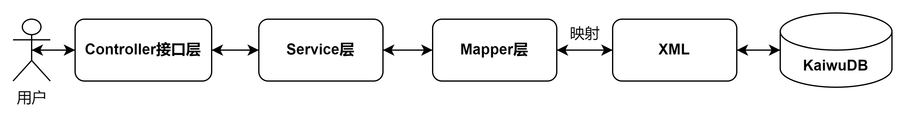

# MyBatis 连接 KWDB 数据库

[MyBatis](https://mybatis.org/mybatis-3/index.html) 是开源 Java 应用持久层框架，支持定制化 SQL、存储过程以及高级映射。MyBatis 避免了几乎所有的 JDBC 代码和手动设置参数以及获取结果集。该框架可以通过简单的 XML 或注解来配置和映射原生信息，将接口和 Java 的 POJOs 对象映射成数据库中的记录。在 Java 应用程序中，开发人员通常会基于 JDBC 驱动，集成 MyBatis 框架，创建一个基于 SpringBoot+Maven 的 Java 应用程序，从而实现用户应用程序与底层数据库之间的数据信息交互和 CRUD 等操作。

本文档介绍基于 SpringBoot+Maven 项目使用 MyBatis 连接 KWDB 的配置信息。用户在完成配置后，可以基于 MyBatis 框架的应用程序开发流程，编写应用程序对 KWDB 数据库进行操作。

## 前提条件

- [安装 Java](https://docs.oracle.com/en/java/javase/22/install/overview-jdk-installation.html)（1.8 及以上版本）。
- [安装 Maven](https://maven.apache.org/install.html)（3.6 及以上版本）。
- 安装 KWDB 数据库、配置数据库认证方式、创建数据库。
- 获取 KaiwuDB JDBC 驱动包。

## 配置连接

1. 运行以下命令，将 KaiwuDB JDBC 安装到本地 Maven 仓库中。

    ```shell
    mvn install:install-file"-Dfile=../kaiwudb-jdbc.2.0.4.jar" "-DgroupId=com.kaiwudb" "-DartifactId=kaiwudb-jdbc" "-Dversion=2.0.4" "-Dpackaging=jar"
    ```

2. 在 `pom.xml` 中添加依赖，将 KaiwuDB JDBC 驱动和 MyBatis 引入到应用程序中。

    ```xml
    <!--kaiwudb-jdbc-->
    <dependency>
    <groupId>com.kaiwudb</groupId>
    <artifactId>kaiwudb-jdbc</artifactId>
    <version>2.0.4</version>
    </dependency>

    <!--mybatis-->
    <dependency>
    <groupId>org.mybatis.spring.boot</groupId>
    <artifactId>mybatis-spring-boot-starter</artifactId>
    <version>2.1.3</version>
    </dependency>
    ```

3. 配置数据源。

    SpringBoot 集成 MyBatis 框架，连接 KWDB 数据库。用户在 `application.yml` 文件配置数据源，使用对应的 `@Configuration` 类加载配置信息。

    ```yaml
    spring:
      # 时序库数据源配置
    
      tsdb-datasource:
        driver-class-name: com.kaiwudb.Driver
        jdbc-url: jdbc:kaiwudb://127.0.0.1:26257/ts_db
        username: kwdbuser
        password: *******
    
      # 关系库数据源配置
    
      rdb-datasource:
        driver-class-name: com.kaiwudb.Driver
        jdbc-url: jdbc:kaiwudb://127.0.0.1:26257/defaultdb
        username: kwdbuser
        password: *******
    
    # 日志信息输出配置
    
    logging:
      config: classpath:log4j2-dev.xml
    
    # Swagger-UI 配置
    
    knife4j:
      enable: true
      basic:
        enable: false
        username: kwdbuser
        password: *******
    
    # 服务启动端口配置
    
    server:
      port: 8989
    ```

    - 对于时序数据库，通过 `TsDatabaseConfig` 时序数据源配置类，加载 `application.yml` 配置文件中设置的时序数据库连接信息，示例如下：

        ```java
        @Configuration
        @MapperScan(basePackages = "com.kaiwudb.kwdb.mapper.tsdb", sqlSessionTemplateRef = "tsdbSqlSessionTemplate")
        public class TsDatabaseConfig {
          @Bean(name = "tsdbDataSource")
          @ConfigurationProperties(prefix = "spring.tsdb-datasource")
          public DataSource tsdbDataSource() {
            return DataSourceBuilder.create().build();
          }

          @Bean(name = "tsdbJdbcTemplate")
          public JdbcTemplate tsdbJdbcTemplate(@Qualifier("tsdbDataSource") DataSource tsdbDataSource) {
            return new JdbcTemplate(tsdbDataSource);
          }

          @Bean(name = "tsdbSqlSessionFactory")
          public SqlSessionFactory tsdbSqlSessionFactory(@Qualifier("tsdbDataSource") DataSource tsdbDataSource) throws Exception {
            SqlSessionFactoryBean bean = new SqlSessionFactoryBean();
            bean.setDataSource(tsdbDataSource);
            /*加载所有的mapper.xml映射文件*/
            bean.setMapperLocations(new PathMatchingResourcePatternResolver().getResources("classpath:mapper/tsdb/*.xml"));
            return bean.getObject();
          }

          @Bean(name = "tsdbTransactionManager")
          public DataSourceTransactionManager tsdbTransactionManager(@Qualifier("tsdbDataSource") DataSource tsdbDataSource) {
            return new DataSourceTransactionManager(tsdbDataSource);
          }

          @Bean(name = "tsdbSqlSessionTemplate")
          public SqlSessionTemplate tsdbSqlSessionTemplate(@Qualifier("tsdbSqlSessionFactory") SqlSessionFactory tsdbSqlSessionFactory) {
            return new SqlSessionTemplate(tsdbSqlSessionFactory);
          }
        }
        ```

    - 对于关系数据库，通过 `DatabaseConfig` 数据源配置类，加载 `application.yml` 配置文件中设置的关系数据库连接信息，示例如下：

        ```java
        @Configuration
        @MapperScan(basePackages = "com.kaiwudb.kwdb.mapper.rdb", sqlSessionTemplateRef = "sqlSessionTemplate")
        public class DatabaseConfig {
        @Bean(name = "dataSource")
        @ConfigurationProperties(prefix = "spring.rdb-datasource")
        @Primary
        public DataSource dataSource() {
        return DataSourceBuilder.create().build();
        }
        
        @Bean(name = "jdbcTemplate")
        public JdbcTemplate jdbcTemplate(@Qualifier("dataSource") DataSource dataSource) {
        return new JdbcTemplate(dataSource);
        }
        
        @Bean(name = "sqlSessionFactory")
        @Primary
        public SqlSessionFactory sqlSessionFactory(@Qualifier("dataSource") DataSource dataSource) throws Exception {
        SqlSessionFactoryBean bean = new SqlSessionFactoryBean();
        bean.setDataSource(dataSource);
        /*加载所有的 mapper.xml 映射文件*/
        bean.setMapperLocations(new PathMatchingResourcePatternResolver().getResources("classpath:mapper/rdb/*.xml"));
        return bean.getObject();
        }
        
        @Bean(name = "transactionManager")
        @Primary
        public DataSourceTransactionManager transactionManager(@Qualifier("dataSource") DataSource dataSource) {
        return new DataSourceTransactionManager(dataSource);
        }
        
        @Bean(name = "sqlSessionTemplate")
        @Primary
        public SqlSessionTemplate sqlSessionTemplate(@Qualifier("sqlSessionFactory") SqlSessionFactory sqlSessionFactory) {
        return new SqlSessionTemplate(sqlSessionFactory);
        }
        }
        ```

## 配置示例

在 SpringBoot+MyBatis 应用程序中，用户调用接口访问及操作数据时，内部数据传递流程如下图所示：



当 SpringBoot 集成 KaiwuDB JDBC 和 MyBatis 后，用户可以使用 MyBatis 编写 Controller 层、Service 层、Mapper 层及 XML 应用程序，从而实现与 KWDB 的数据信息交互及操作使用等。为了便于用户基于 MyBatis 快速开发适用于 KWDB 数据库的应用程序，本节介绍 MyBatis 应用开发的基本流程并针对流程中的 Controller 层、Service 层、Mapper 层及 XML 提供相应的配置示例。

### 时序数据库应用

#### 实体类

实体类是数据库中的表在应用程序内的映射。用户需要结合数据库中表的实际信息在应用程序中定义实体类。KWDB 时序数据库对应的实体类定义包含表结构、表标签结构、和列信息。用户可以参考以下内容定义 KWDB 表相关的实体类。

- 时序表的结构和列信息实体类

    ```java
    // 定义表结构实体类
    @ApiModel(value = "TsdbTable", description = "时序表结构实体类")
      @Data
      public class TsdbTable implements Serializable {
        @ApiModelProperty(value = "表名", required = true)
        private String tableName;
        @ApiModelProperty(value = "表字段", required = true)
        private String columns;
        @ApiModelProperty(value = "表标签", required = true)
        private String tags;

        public TsdbTable() {}

        public TsdbTable(String tableName, String columns, String tags) {
          this.tableName = tableName;
          this.columns = columns;
          this.tags = tags;
        }
      }
    // 定义表的列信息实体类
    @ApiModel(value = "TsdbData", description = "时序数据类")
      @Data
      public class TsdbData implements Serializable {
        @ApiModelProperty(value = "时间")
        private String timestamp;
        @ApiModelProperty(value = "温度")
        private double temperature;
        @ApiModelProperty(value = "湿度")
        private double humidity;
        @ApiModelProperty(value = "气压")
        private double pressure;
      }
    ```

- 时序表的标签结构

    ```java
    @ApiModel(value = "TsdbTags", description = "表标签结构类")
      @Data
      public class TsdbTag {
        @ApiModelProperty(value = "标签名")
        private String tag;
        @ApiModelProperty(value = "标签类型")
        private String type;
      }
    ```

#### Mapper

Mapper 用于定义数据库的操作接口。接口的实现类需要通过 XML 配置。

```java
@Mapper
 @Repository
 public interface TsdbMapper {
  // 创建时序表
  void createTsTable(TsdbTable table);

 
  // 删除时序表
  void dropTable(@Param("tableName") String tableName);

 
  // 插入时序数据
  int insert(@Param("tableName") String tableName, @Param("tsdbData") TsdbData tsdbData);

  // 插入多行时序数据
  int insertBatch(@Param("tableName") String tableName, @Param("list") List<TsdbData> list);

  // 查询时序数据列表
  List<TsdbData> findList(@Param("tableName") String tableName);
  
  // 查询时序表标签列表
  List<TsdbTag> findTagList(@Param("tableName") String tableName);
 }
```

#### XML

XML 文件是 Mapper 接口的实现类。用户在 XML 中定义和实现 SQL 操作语句。

::: warning 说明

- KWDB 创建时序表的 SQL 语法与标准 SQL 语法不同，不支持使用 ORM 映射方式创建时序表。
- KWDB 不支持自增 ID（AUTO_INCREMENT），因此 MyBatis 不支持使用 `@ID` 标签。

:::

```xml
<?xml version="1.0" encoding="UTF-8"?>
 <!DOCTYPE mapper PUBLIC "-//mybatis.org//DTD Mapper 3.0//EN" "http://mybatis.org/dtd/mybatis-3-mapper.dtd">
 <mapper namespace="com.kaiwudb.kwdb.mapper.tsdb.TsdbMapper">
  <update id="createTsTable" parameterType="com.kaiwudb.kwdb.po.TsdbTable" statementType="STATEMENT">
    CREATE TABLE ${tableName} (${columns}) TAGS (${tags} PRIMARY TAGS (${tagName})
  </update>

  <update id="dropTable" statementType="STATEMENT">
    DROP TABLE IF EXISTS ${tableName}
  </update>

  <insert id="insert">
    INSERT INTO ${tableName} (k_timestamp, temperature, humidity, pressure, sensor_id, sensor_type)
    VALUES (#{tsdbData.timestamp}, #{tsdbData.temperature}, #{tsdbData.humidity}, #{tsdbData.pressure}, #{tsdbData.sensor_id},#{tsdbData.tsdbData.sensor_type})
  </insert>

  <insert id="insertBatch">
    INSERT INTO ${tableName} (k_timestamp, temperature, humidity, pressure, sensor_id, sensor_type)
    VALUES
    <foreach collection="list" item="item" index="index" separator=",">
      (#{item.timestamp}, #{item.temperature}, #{item.humidity}, #{item.pressure},#{item.sensor_id}, #{item.sensor_type})
    </foreach>
  </insert>

  <resultMap id="map" type="com.kaiwudb.kwdb.po.TsdbData">
    <result column="k_timestamp" property="timestamp" jdbcType="VARCHAR"/>
    <result column="temperature" property="temperature" jdbcType="FLOAT"/>
    <result column="humidity" property="humidity" jdbcType="FLOAT"/>
    <result column="pressure" property="pressure" jdbcType="FLOAT"/>
    <result column="sensor_id" property="sensor_id" jdbcType="INT4"/>
    <result column="sensor_type" property="sensor_type" jdbcType="INT4"/>
  </resultMap>

  <select id="findList" resultMap="map">
    SELECT k_timestamp, temperature, humidity, pressure
    FROM ${tableName}
  </select>

  <resultMap id="tagMap" type="com.kaiwudb.kwdb.po.TsdbTag">
    <result column="tag" property="tag" jdbcType="VARCHAR"/>
    <result column="type" property="type" jdbcType="VARCHAR"/>
    <result column="value" property="value" jdbcType="VARCHAR"/>
  </resultMap>

  <select id="findTagList" resultMap="tagMap">
    SHOW TAGS FROM ${tableName}
  </select>
 </mapper>
```

#### Service

Service 层是业务逻辑层，主要用于实现业务逻辑和数据访问层的交互。它封装了数据访问层的操作，为上层应用提供统一的业务逻辑接口。

```java
//时序数据库Service接口类
public interface TsdbService {
  // 创建时序表
  void createTsTable(String tableName);
  // 删除时序表
  void dropTable(String tableName);
  // 插入时序数据
  int insert(String tableName, TsdbData tsdbData);
  // 插入多行时序数据
  int insertBatch(String tableName, List<TsdbData> list);
  // 查询时序数据列表
  List<TsdbData> findList(String tableName);
  // 查询时序表标签列表
  List<TsdbTag> findTagList(String tableName);
 }
 //时序数据库Service接口实现类
 @Service
 class TsdbServiceImpl implements TsdbService {
  @Autowired
  private TsdbMapper mapper;

  @Override
  public void createTsTable(String tableName) {
    String columns = "k_timestamp TIMESTAMP NOT NULL," +
      " temperature FLOAT," +
      " humidity FLOAT," +
      " pressure FLOAT";
    String tags = "sensor_id INT4 NOT NULL, sensor_type INT4";
    String primarytags = "sensor_id";
    TsdbTable table = new TsdbTable(tableName, columns, tags);
    mapper.createTsTable(table);
  }

  @Override
  public void dropTable(String tableName) {
    mapper.dropTable(tableName);
  }

  @Override
  public int insert(String tableName, TsdbData tsdbData) {
    SimpleDateFormat format = new SimpleDateFormat("yyyy-MM-dd HH:mm:ss.SSS");
    tsdbData.setTimestamp(format.format(new Date(System.currentTimeMillis())));
    return mapper.insert(tableName, tsdbData);
  }

  @Override
  public int insertBatch(String tableName, List<TsdbData> list) {
    SimpleDateFormat format = new SimpleDateFormat("yyyy-MM-dd HH:mm:ss.SSS");
    list.forEach(item -> item.setTimestamp(format.format(new Date(System.currentTimeMillis()))));
    return mapper.insertBatch(tableName, list);
  }

  @Override
  public List<TsdbData> findList(String tableName) {
    return mapper.findList(tableName);
  }
  
  @Override
  public List<TsdbTag> findTagList(String tableName) {
    return mapper.findTagList(tableName);
  }
 }
```

#### Controller

Controller 层是应用程序的表示层，Controller 层接收用户的请求并处理相应的业务逻辑，将用户的请求转发给 Service 层处理，并将处理结果返回给用户。

```java
@RestController
 @RequestMapping("ts_db")
 @Api(tags = "2 时序数据库接口")
 @ApiSort(value = 2)
 public class TsdbController {
  private final static Logger LOGGER = LoggerFactory.getLogger(TsdbController.class);

  @Autowired
  private TsdbService service;

  @ApiOperation(value = "1.1 创建时序表")
  @ApiOperationSupport(order = 10)
  @GetMapping("create_ts_table")
  @ApiImplicitParam(name = "tableName", value = "时序表名", required = true, dataTypeClass = String.class, paramType = "query")
  public String createTsTable(@RequestParam(value = "tableName") String tableName) {
    try {
      service.createTsTable(tableName);
      return "创建时序表成功！";
    } catch (Exception e) {
      return e.getMessage();
    }
  }

  @ApiOperation(value = "1.2 删除时序表")
  @ApiOperationSupport(order = 40)
  @DeleteMapping("drop_table")
  @ApiImplicitParam(name = "tableName", value = "时序表名", required = true, dataTypeClass = String.class, paramType = "query")
  public String dropTable(@RequestParam(value = "tableName") String tableName) {
    try {
      service.dropTable(tableName);
      return "删除时序表成功！";
    } catch (Exception e) {
      return e.getMessage();
    }
  }

  @ApiOperation(value = "1.3 添加时序数据")
  @ApiOperationSupport(order = 60)
  @PostMapping("add")
  @ApiImplicitParam(name = "tableName", value = "时序表名", required = true, dataTypeClass = String.class, paramType = "query")
  public String add(@RequestParam(value = "tableName") String tableName,
                    @RequestBody TsdbData tsdbData) {
    try {
      if (tsdbData == null) {
        return "获取时序数据失败！";
      }
      int rows = service.insert(tableName, tsdbData);
      if (rows < 1) {
        return "添加时序数据失败！";
      }
      return "添加时序数据成功, 影响行数: " + rows;
    } catch (Exception e) {
      return e.getMessage();
    }
  }

  @ApiOperation(value = "1.4 添加多行时序数据")
  @ApiOperationSupport(order = 70)
  @PostMapping("add_batch")
  @ApiImplicitParam(name = "tableName", value = "时序表名", required = true, dataTypeClass = String.class, paramType = "query")
  public String add(@RequestParam(value = "tableName") String tableName,
                    @RequestBody List<TsdbData> list) {
    try {
      if (list == null) {
        return "获取时序数据失败！";
      }
      int rows = service.insertBatch(tableName, list);
      if (rows < 1) {
        return "添加时序数据失败！";
      }
      return "添加时序数据成功, 影响行数: " + rows;
    } catch (Exception e) {
      return e.getMessage();
    }
  }

  @ApiOperation(value = "1.5 时序数据列表")
  @ApiOperationSupport(order = 80)
  @GetMapping("list")
  @ApiImplicitParam(name = "tableName", value = "时序表名", required = true, dataTypeClass = String.class, paramType = "query")
  public List<TsdbData> list(@RequestParam(value = "tableName") String tableName) {
    try {
      return service.findList(tableName);
    } catch (Exception e) {
      LOGGER.info(e.getMessage());
    }
    return null;
  }
  
  @ApiOperation(value = "1.6 指定表的标签列表")
  @ApiOperationSupport(order = 90)
  @GetMapping("tag_list")
  @ApiImplicitParam(name = "tableName", value = "表名", required = true, dataTypeClass = String.class, paramType = "query")
  public List<TsdbTag> findtagList(@RequestParam(value = "tableName") String tableName) {
    try {
      return service.findTagList(tableName);
    } catch (Exception e) {
      LOGGER.info(e.getMessage());
    }
    return null;
  }
 }
```

### 关系数据库应用

#### 实体类

实体类是数据库中的表在应用程序内的映射。用户需要结合数据库中表的实际信息在应用程序中定义实体类。KWDB 关系数据库对应的实体类定义包含表结构、列信息和列的元数据。用户可以参考以下内容定义 KWDB 表相关的实体类。

```java
// 定义关系表结构实体类
@ApiModel(value = "RdbTable", description = "关系表结构实体类")
@Data
public class RdbTable implements Serializable {
  @ApiModelProperty(value = "表名", required = true)
  private String tableName;
  @ApiModelProperty(value = "表字段", required = true)
  private String columns;

  public RdbTable() {}

  public RdbTable(String tableName, String columns) {
    this.tableName = tableName;
    this.columns = columns;
  }
}

// 定义表的列信息实体类
@ApiModel(value = "RdbData", description = "关系数据类")
@Data
public class RdbData implements Serializable {
  @ApiModelProperty(value = "数据ID", required = true)
  private String dataId;
  @ApiModelProperty(value = "数据内容", required = true)
  private String dataContent;
  @ApiModelProperty(value = "数据值")
  private Double dataValue;
}

 //关系表列元数据类
@ApiModel(value = "RdbColumnMetadata", description = "关系表Column类")
@Data
public class RdbColumnMetadata implements Serializable {
  @ApiModelProperty(value = "列名")
  private String columnName;
  @ApiModelProperty(value = "数据类型")
  private String dataType;
  @ApiModelProperty(value = "是否可空")
  private String isNullable;
  @ApiModelProperty(value = "列默认值")
  private String columnDefault;
  @ApiModelProperty(value = "生成表达式")
  private String generationExpression;
  @ApiModelProperty(value = "指数")
  private String indices;
  @ApiModelProperty(value = "是否隐藏")
  private String isHidden;
}
```

#### Mapper

Mapper 用于定义数据库的操作接口。接口的实现类需要通过 XML 配置生成。

```java
@Mapper
@Repository
public interface RdbMapper {
  // 创建关系数据库
  void createDatabase(@Param("databaseName") String databaseName);
  
  // 删除关系数据库
  void dropDatabase(@Param("databaseName") String databaseName);
  
  // 创建关系表
  void createTable(RdbTable table);

  // 删除关系表
  void dropTable(@Param("tableName") String tableName);

  // 插入关系数据
  int insert(@Param("tableName") String tableName, @Param("rdbData") RdbData rdbData);

  // 更新关系数据
  int update(@Param("tableName") String tableName, @Param("rdbData") RdbData rdbData);

  // 删除关系数据
  int delete(@Param("tableName") String tableName, @Param("dataId") String dataId);

  // 查询关系数据详情
  RdbData findOne(@Param("tableName") String tableName, @Param("dataId") String dataId);

  // 查询关系数据列表
  List<RdbData> findList(@Param("tableName") String tableName);
  
  // 查询指定关系表的Column元数据
  List<RdbColumnMetadata> findColumns(@Param("tableName") String tableName);
}
```

#### XML

XML 文件是 Mapper 接口的实现类。用户在 XML 中定义和实现 SQL 操作语句。

```xml
<?xml version="1.0" encoding="UTF-8"?>
<!DOCTYPE mapper PUBLIC "-//mybatis.org//DTD Mapper 3.0//EN" "http://mybatis.org/dtd/mybatis-3-mapper.dtd">
<mapper namespace="com.kaiwudb.kwdb.mapper.rdb.RdbMapper">
  <update id="createDatabase" statementType="STATEMENT">
    CREATE DATABASE ${databaseName}
  </update>

  <update id="dropDatabase" statementType="STATEMENT">
    DROP DATABASE ${databaseName}
  </update>

  <update id="createTable" parameterType="com.kaiwudb.kwdb.po.RdbTable" statementType="STATEMENT">
    CREATE TABLE ${tableName} (${columns})
  </update>

  <update id="dropTable" statementType="STATEMENT">
    DROP TABLE IF EXISTS ${tableName}
  </update>

  <insert id="insert">
    INSERT INTO ${tableName} (data_id, data_content, data_value)
    VALUES (#{rdbData.dataId}, #{rdbData.dataContent}, #{rdbData.dataValue})
  </insert>

  <update id="update">
    UPDATE ${tableName}
    SET data_content = #{rdbData.dataContent},
        data_value   = #{rdbData.dataValue}
    WHERE data_id = #{rdbData.dataId}
  </update>

  <delete id="delete">
    DELETE
    FROM ${tableName}
    WHERE data_id = #{dataId}
  </delete>

  <resultMap id="map" type="com.kaiwudb.kwdb.po.RdbData">
    <result column="data_id" property="dataId" jdbcType="VARCHAR"/>
    <result column="data_content" property="dataContent" jdbcType="VARCHAR"/>
    <result column="data_value" property="dataValue" jdbcType="FLOAT"/>
  </resultMap>

  <sql id="item">
    data_id, data_content, data_value
  </sql>

  <select id="findOne" resultMap="map">
    SELECT
    <include refid="item"/>
    FROM ${tableName}
    WHERE data_id = #{dataId}
  </select>

  <select id="findList" resultMap="map">
    SELECT
    <include refid="item"/>
    FROM ${tableName}
  </select>

  <resultMap id="columnMap" type="com.kaiwudb.kwdb.po.RdbColumnMetadata">
    <result column="column_name" property="columnName" jdbcType="VARCHAR"/>
    <result column="data_type" property="dataType" jdbcType="VARCHAR"/>
    <result column="is_nullable" property="isNullable" jdbcType="VARCHAR"/>
    <result column="column_default" property="columnDefault" jdbcType="VARCHAR"/>
    <result column="generation_expression" property="generationExpression" jdbcType="VARCHAR"/>
    <result column="indices" property="indices" jdbcType="VARCHAR"/>
    <result column="is_hidden" property="isHidden" jdbcType="VARCHAR"/>
  </resultMap>

  <select id="findColumns" resultMap="columnMap">
    SHOW COLUMNS FROM ${tableName}
  </select>
</mapper>
```

::: warning 说明
KWDB 不支持自增 ID（AUTO_INCREMENT），因此 MyBatis 不支持使用 `@ID` 标签。
:::

#### Service

Service 层是业务逻辑层，主要用于实现业务逻辑和数据访问层的交互。它封装了数据访问层的操作，为上层应用提供统一的业务逻辑接口。

```java
//关系数据库Service接口类
public interface RdbService {
  // 创建关系数据库
  void createDatabase(String databaseName);
  // 删除关系数据库
  void dropDatabase(String databaseName);
  // 创建关系表
  void createTable(String tableName);
  // 删除关系表
  void dropTable(String tableName);
  // 插入关系数据
  int insert(String tableName, RdbData rdbData);
  // 更新关系数据
  int update(String tableName, RdbData rdbData);
  // 删除关系数据
  int delete(String tableName, String dataId);
  // 查询关系数据详情
  RdbData findOne(String tableName, String dataId);
  // 查询关系数据列表
  List<RdbData> findList(String tableName);
  // 查询指定关系表的Column元数据
  List<RdbColumnMetadata> findColumns(String tableName);
}

//关系数据库Service接口实现类
@Service
class RdbServiceImpl implements RdbService {
  @Autowired
  private RdbMapper mapper;

  @Override
  public void createDatabase(String databaseName) {
    mapper.createDatabase(databaseName);
  }

  @Override
  public void dropDatabase(String databaseName) {
    mapper.dropDatabase(databaseName);
  }

  @Override
  public void createTable(String tableName) {
    String columns = "data_id varchar(64) NOT NULL," +
      " data_content varchar(255) NOT NULL," +
      " data_value float8 NOT NULL," +
      " PRIMARY KEY (data_id)";
    RdbTable table = new RdbTable(tableName, columns);
    mapper.createTable(table);
  }

  @Override
  public void dropTable(String tableName) {
    mapper.dropTable(tableName);
  }

  @Override
  public int insert(String tableName, RdbData rdbData) {
    return mapper.insert(tableName, rdbData);
  }

  @Override
  public int update(String tableName, RdbData rdbData) {
    return mapper.update(tableName, rdbData);
  }

  @Override
  public int delete(String tableName, String dataId) {
    return mapper.delete(tableName, dataId);
  }

  @Override
  public RdbData findOne(String tableName, String dataId) {
    return mapper.findOne(tableName, dataId);
  }

  @Override
  public List<RdbData> findList(String tableName) {
    return mapper.findList(tableName);
  }

  @Override
  public List<RdbColumnMetadata> findColumns(String tableName) {
    return mapper.findColumns(tableName);
  }
}
```

#### Controller

Controller 层是应用程序的表示层，负责接收用户的请求并处理相应的业务逻辑。Controller 层的主要功能是将用户的请求转发给 Service 层处理，并将处理结果返回给用户。

```java
@RestController
@RequestMapping("rdb")
@Api(tags = "1 关系数据库接口")
@ApiSort(value = 1)
public class RdbController {
  private final static Logger LOGGER = LoggerFactory.getLogger(RdbController.class);

  @Autowired
  private RdbService service;

  @ApiOperation(value = "1.1 创建关系数据库")
  @ApiOperationSupport(order = 10)
  @GetMapping("create_database")
  @ApiImplicitParam(name = "databaseName", value = "关系数据库名", required = true, dataTypeClass = String.class, paramType = "query")
  public String createDatabase(@RequestParam(value = "databaseName") String databaseName) {
    try {
      service.createDatabase(databaseName);
      return "创建关系数据库成功！";
    } catch (Exception e) {
      return e.getMessage();
    }
  }

  @ApiOperation(value = "1.2 删除关系数据库")
  @ApiOperationSupport(order = 20)
  @DeleteMapping("drop_database")
  @ApiImplicitParam(name = "databaseName", value = "关系数据库名", required = true, dataTypeClass = String.class, paramType = "query")
  public String dropDatabase(@RequestParam(value = "databaseName") String databaseName) {
    try {
      service.dropDatabase(databaseName);
      return "删除关系数据库成功！";
    } catch (Exception e) {
      return e.getMessage();
    }
  }

  @ApiOperation(value = "1.3 创建关系表")
  @ApiOperationSupport(order = 30)
  @GetMapping("create")
  @ApiImplicitParam(name = "tableName", value = "关系表名", required = true, dataTypeClass = String.class, paramType = "query")
  public String create(@RequestParam(value = "tableName") String tableName) {
    try {
      service.createTable(tableName);
      return "创建关系表成功！";
    } catch (Exception e) {
      return e.getMessage();
    }
  }

  @ApiOperation(value = "1.4 删除关系表")
  @ApiOperationSupport(order = 40)
  @DeleteMapping("drop")
  @ApiImplicitParam(name = "tableName", value = "关系表名", required = true, dataTypeClass = String.class, paramType = "query")
  public String drop(@RequestParam(value = "tableName") String tableName) {
    try {
      service.dropTable(tableName);
      return "删除关系表成功！";
    } catch (Exception e) {
      return e.getMessage();
    }
  }

  @ApiOperation(value = "1.5 添加关系数据")
  @ApiOperationSupport(order = 50)
  @PostMapping("add")
  @ApiImplicitParam(name = "tableName", value = "关系表名", required = true, dataTypeClass = String.class, paramType = "query")
  public String add(@RequestParam(value = "tableName") String tableName,
                    @RequestBody RdbData rdbData) {
    try {
      if (rdbData == null) {
        return "获取数据失败！";
      }
      if (StringUtils.isEmpty(rdbData.getDataContent())) {
        return "数据内容不能为空！";
      }
      int rows = service.insert(tableName, rdbData);
      if (rows < 1) {
        return "添加失败！";
      }
      return "添加关系数据成功, 影响行数: " + rows;
    } catch (Exception e) {
      return e.getMessage();
    }
  }

  @ApiOperation(value = "1.6 编辑关系数据")
  @ApiOperationSupport(order = 60)
  @PostMapping("update")
  @ApiImplicitParam(name = "tableName", value = "关系表名", required = true, dataTypeClass = String.class, paramType = "query")
  public String update(@RequestParam(value = "tableName") String tableName,
                       @RequestBody RdbData rdbData) {
    try {
      if (rdbData == null) {
        return "获取数据失败！";
      }

      if (StringUtils.isEmpty(rdbData.getDataId())) {
        return "数据ID不能为空！";
      }

      if (StringUtils.isEmpty(rdbData.getDataContent())) {
        return "数据内容不能为空！";
      }

      RdbData rdbDataEn = service.findOne(tableName, rdbData.getDataId());
      if (rdbDataEn == null) {
        return "不存在该关系数据，更新失败！";
      }

      int rows = service.update(tableName, rdbData);
      if (rows < 1) {
        return "更新失败！";
      }
      return "更新关系数据成功, 影响行数: " + rows;
    } catch (Exception e) {
      return e.getMessage();
    }
  }

  @ApiOperation(value = "1.7 删除关系数据")
  @ApiOperationSupport(order = 70)
  @DeleteMapping("delete")
  @ApiImplicitParams({
    @ApiImplicitParam(name = "tableName", value = "关系表名", required = true, dataTypeClass = String.class, paramType = "query"),
    @ApiImplicitParam(name = "dataId", value = "数据ID", required = true, dataTypeClass = String.class, paramType = "query")
  })
  public String delete(@RequestParam(value = "tableName") String tableName,
                       @RequestParam(value = "dataId") String dataId) {
    try {
      int rows = service.delete(tableName, dataId);
      if (rows < 1) {
        return "删除失败！";
      }
      return "删除关系数据成功, 影响行数: " + rows;
    } catch (Exception e) {
      return e.getMessage();
    }
  }

  @ApiOperation(value = "1.8 关系数据详情")
  @ApiOperationSupport(order = 80)
  @GetMapping("get")
  @ApiImplicitParams({
    @ApiImplicitParam(name = "tableName", value = "关系表名", required = true, dataTypeClass = String.class, paramType = "query"),
    @ApiImplicitParam(name = "dataId", value = "数据ID", required = true, dataTypeClass = String.class, paramType = "query")
  })
  public RdbData get(@RequestParam(value = "tableName") String tableName,
                     @RequestParam(value = "dataId") String dataId) {
    try {
      return service.findOne(tableName, dataId);
    } catch (Exception e) {
      LOGGER.info(e.getMessage());
    }
    return null;
  }

  @ApiOperation(value = "1.9 关系数据列表")
  @ApiOperationSupport(order = 90)
  @GetMapping("list")
  @ApiImplicitParam(name = "tableName", value = "关系表名", required = true, dataTypeClass = String.class, paramType = "query")
  public List<RdbData> list(@RequestParam(value = "tableName") String tableName) {
    try {
      return service.findList(tableName);
    } catch (Exception e) {
      LOGGER.info(e.getMessage());
    }
    return null;
  }
  
  @ApiOperation(value = "1.10 关系表Column元数据")
  @ApiOperationSupport(order = 100)
  @GetMapping("table_columns")
  @ApiImplicitParam(name = "tableName", value = "关系表名", required = true, dataTypeClass = String.class, paramType = "query")
  public List<RdbColumnMetadata> findColumns(@RequestParam(value = "tableName") String tableName) {
    try {
      return service.findColumns(tableName);
    } catch (Exception e) {
      LOGGER.info(e.getMessage());
    }
    return null;
  }
}
```
