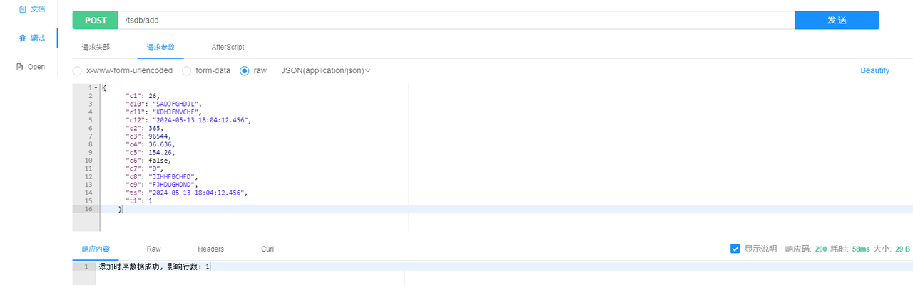
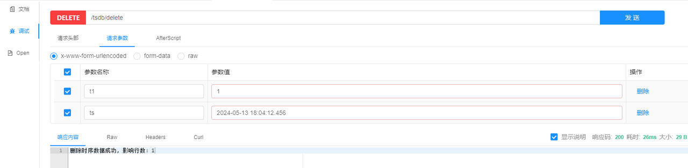
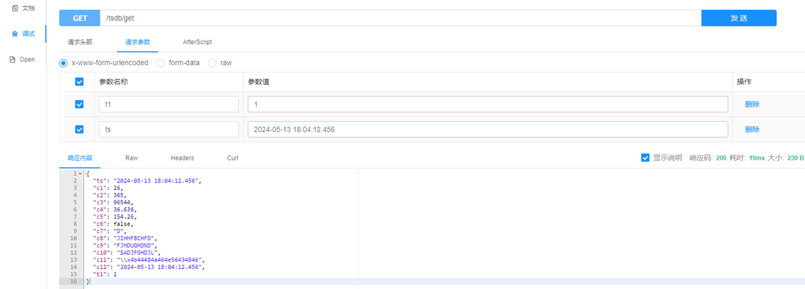
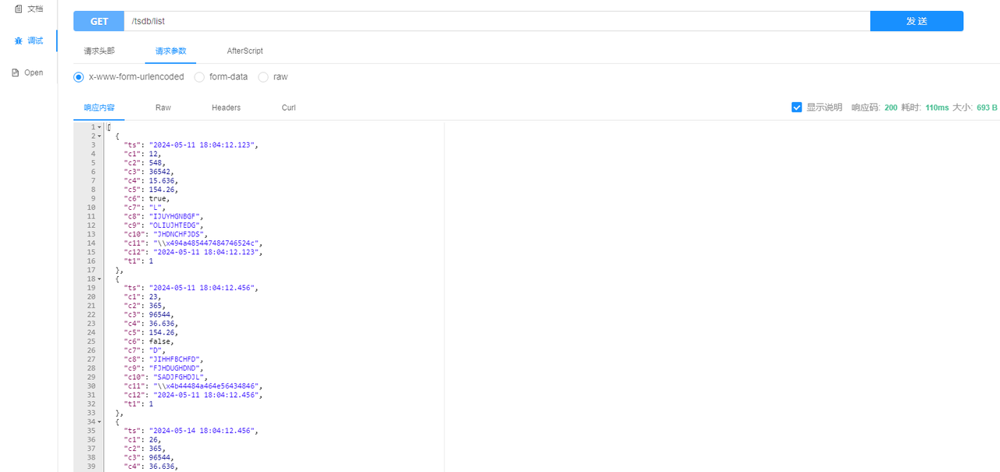
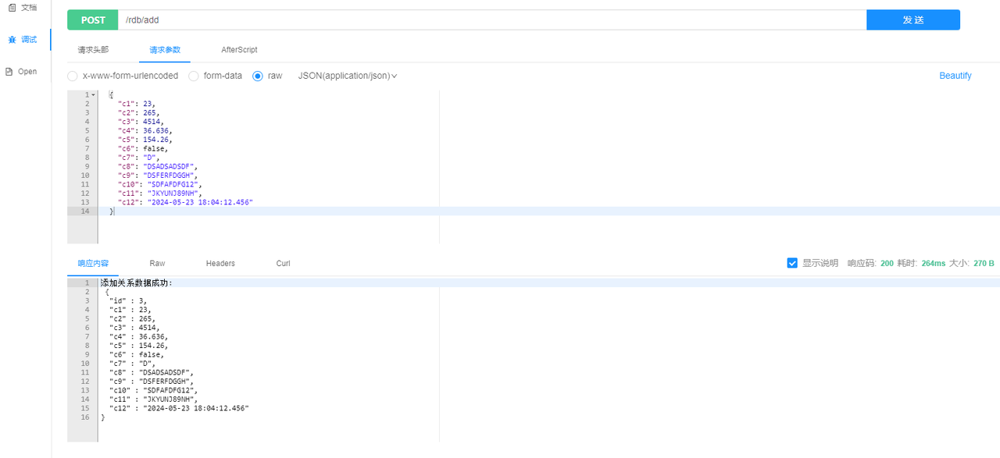
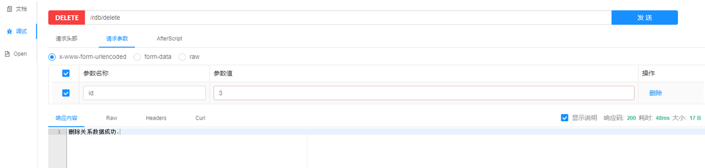
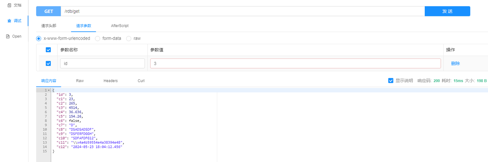
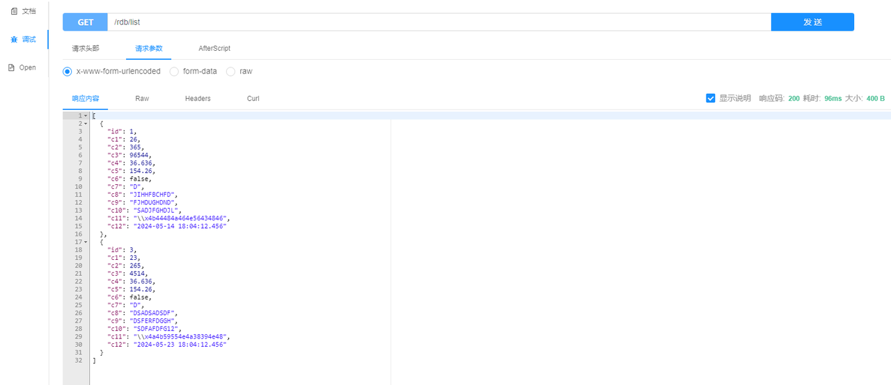

# 使用 Hibernate 连接 KWDB 数据库

Hibernate 是一个广泛使用的 ORM 框架，简化了 Java 应用程序中的数据库持久化操作。开发者可以使用 Java 对象与数据库交互，而不需要编写大量的 SQL 代码。

KWDB 开发了适用于 KWDB 的 `Dialect`，定义了 KWDB 数据库特有的 SQL 方言，使 Hibernate 能够生成与 KWDB 兼容的 SQL 查询。

KWDB 支持开发人员通过在 SpringBoot 项目中集成 JPA、KaiwuDB JDBC 和 Lombok 等工具，使用 Hibernate 框架协议来连接 KWDB 数据库，执行数据查询、写入和删除操作。

## 前提条件

- [安装 openJDK](https://openjdk.org/install/)（1.8 及以上版本）。
- [安装 Maven](https://maven.apache.org/install.html)（3.6 及以上版本）。
- 安装 KWDB 2.0.4 及以上版本、配置数据库认证方式、创建数据库。
- 创建具有表级别及以上操作权限的用户。
- 获取 KaiwuDB JDBC 驱动包。
- 获取 KWDB 开发适配的 Hibernate Core 5.6.16 安装包。

## 配置连接

步骤：

1. 在 Hibernate 安装包所在目录，创建 `pom.xml`文件，引入 JPA、Hibernate 和 KaiwuDB JDBC 依赖信息。

   示例：

   ```xml
   <?xml version="1.0" encoding="UTF-8"?>
   <project xmlns="http://maven.apache.org/POM/4.0.0"
            xmlns:xsi="http://www.w3.org/2001/XMLSchema-instance"
            xsi:schemaLocation="http://maven.apache.org/POM/4.0.0 http://maven.apache.org/xsd/maven-4.0.0.xsd">
     <modelVersion>4.0.0</modelVersion>
   
     <parent>
       <groupId>org.springframework.boot</groupId>
       <artifactId>spring-boot-starter-parent</artifactId>
       <version>2.3.2.RELEASE</version>
       <relativePath/>
     </parent>
   
     <groupId>com.kaiwudb.hibernate</groupId>
     <artifactId>kwdb-hibernate</artifactId>
     <version>1.0</version>
   
     <name>kwdb-hibernate</name>
     <packaging>pom</packaging>
     <description>This program is use kaiwudb jdbc test hibernate framework example.</description>
   
     <properties>
       <project.build.sourceEncoding>UTF-8</project.build.sourceEncoding>
       <project.reporting.outputEncoding>UTF-8</project.reporting.outputEncoding>
       <maven.compiler.encoding>UTF-8</maven.compiler.encoding>
       <maven.compiler.source>8</maven.compiler.source>
       <maven.compiler.target>8</maven.compiler.target>
       <maven.compiler.version>3.8.1</maven.compiler.version>
       <java.version>1.8</java.version>
     </properties>
   
     <modules>
       <module>relational</module>
       <module>time-series</module>
     </modules>
   
     <dependencies>
       <dependency>
         <groupId>org.springframework.boot</groupId>
         <artifactId>spring-boot-starter</artifactId>
       </dependency>
       <dependency>
         <groupId>org.springframework.boot</groupId>
         <artifactId>spring-boot-starter-web</artifactId>
       </dependency>
       <dependency>
         <groupId>org.springframework.boot</groupId>
         <artifactId>spring-boot-starter-test</artifactId>
         <scope>test</scope>
       </dependency>
       <!-- jpa -->
       <dependency>
         <groupId>org.springframework.boot</groupId>
         <artifactId>spring-boot-starter-data-jpa</artifactId>
         <exclusions>
           <exclusion>
             <groupId>org.hibernate</groupId>
             <artifactId>hibernate-core</artifactId>
           </exclusion>
         </exclusions>
       </dependency>
       <!-- hibernate-core -->
       <dependency>
         <groupId>org.hibernate</groupId>
         <artifactId>hibernate-core</artifactId>
         <version>5.6.16.RELEASE</version>
       </dependency>
       <!-- kaiwudb-jdbc-->
       <dependency>
         <groupId>com.kaiwudb</groupId>
         <artifactId>kaiwudb-jdbc</artifactId>
         <version>2.2.0</version>
       </dependency>
       <!-- mockito-core -->
       <dependency>
         <groupId>org.mockito</groupId>
         <artifactId>mockito-core</artifactId>
         <version>2.19.1</version>
         <scope>test</scope>
       </dependency>
     </dependencies>
   </project>
   ```

2. 如果 KaiwuDB JDBC 无法正常加载使用，运行以下命令，将 KaiwuDB JDBC 驱动安装到本地 Maven 仓库中。

   ```shell
   mvn install:install-file "-Dfile=../kaiwudb-jdbc-2.2.0.jar" "-DgroupId=com.kaiwudb" "-DartifactId=kaiwudb-jdbc" "-Dversion=2.2.0" "-Dpackaging=jar"
   ```

3. 将 Hibernate 安装到本地 Maven 仓库中。

   示例：

   ```shell
   mvn install:install-file "-Dfile=../hibernate-core-5.6.16.RELEASE.jar" "-DpomFile=../hibernate-core-5.6.16.RELEASE.pom" "-DgroupId=org.hibernate -DartifactId=hibernate-core" "-Dversion=5.6.16.RELEASE" "-Dpackaging=jar"
   ```

## 配置示例

配置数据库连接和使用涉及以下步骤：

1. 配置数据源：指定数据库方言和其他连接属性。时序库中还需要禁用事务管理。
2. 定义实体类：用于映射数据库中的表结构和数据类型。实体类通常使用 JPA 注解来指定表名和字段映射。
3. 定义数据访问接口：定义与数据库的交互，包括查询、更新等操作。
4. 定义 Service 接口及实现：Service 层封装了数据访问操作，为上层应用提供统一的业务逻辑接口和处理方法。
5. 定义 Controller 层：Controller 层负责接收用户的请求，并调用相应的 Service 方法处理业务逻辑。处理完的结果将会被返回给用户。

KWDB 时序库和关系库在配置和使用上有所不同，以下章节分别提供了时序库和关系库的配置示例。

### 时序库

1. 在 `resources` 目录下的 `application.yml` 文件中配置数据源，指定方言包并禁用事务管理。
    ::: warning 提示
    KWDB 只支持显式事务内执行时序数据的查询以及写入，不支持显式事务内执行时序数据的 DDL 操作。如果未关闭事务管理就对时序数据引擎进行操作，数据库可能报不支持事务的错误。
    :::
   示例：

   ```yaml
   spring:
     datasource:
       driver-class-name: com.kaiwudb.Driver
       url: jdbc:kaiwudb://127.0.0.1:26257/test_tsdb
       username: <user_name>
       password: <password>
     jpa:
       properties:
         # 禁用事务管理
         javax.persistence.transactionType: RESOURCE_LOCAL
       open-in-view: false
       hibernate:
         ddl-auto: update
       show-sql: true
       database-platform: org.hibernate.dialect.KaiwuDBDialect
   server:
     port: 9001
   ```

2. 在 `entity` 目录下定义映射表结构的实体类，例如 `TsdbEntity.java`。

   示例：

   示例中，@Table 标签中的 name 名称 `tsdb_table` 为对应的时序表名称，每列字段对应目前 KWDB 支持的各种数据类型；`t1` 列作为 KWDB 时序表的主标签列使用。

   ```java
   @Data
   @Entity
   @Table(name = "tsdb_table")
   public class TsdbEntity {
     @Id
     @JsonFormat(shape = JsonFormat.Shape.STRING, pattern = "yyyy-MM-dd HH:mm:ss.SSS", timezone = "GMT+8")
     private Timestamp ts;
     private Short c1;
     private Integer c2;
     private Long c3;
     private Float c4;
     private Double c5;
     private Boolean c6;
     private String c7;
     private String c8;
     private String c9;
     private String c10;
     private String c11;
     @JsonFormat(shape = JsonFormat.Shape.STRING, pattern = "yyyy-MM-dd HH:mm:ss.SSS", timezone = "GMT+8")
     private Timestamp c12;
     private Integer t1;
   }
   ```

3. 在 `repository` 目录下定义数据访问层。

    示例：

    ```java
    @Repository
    public interface TsdbEntityRepository extends JpaRepository<TsdbEntity, Timestamp> {

      TsdbEntity findByT1AndTs(@Param("t1") int t1, @Param("ts") Timestamp ts);

      List<TsdbEntity> findAll();

    }
    ```

4. 定义 Service 接口及实现。

   1. 在 `service` 目录下定义 Service 层接口。

      示例：

      ```java
      public interface TsdbService {
      
        int insert(TsdbEntity entity);
      
        int delete(int t1, String ts);
      
        TsdbEntity findByT1AndTs(int t1, String ts) throws Exception;
      
        List<TsdbEntity> findList();
      
      }
      ```

   2. 在 `service/impl` 目录下定义 Service 实现类。

      ::: warning 说明
      KWDB 只支持显式事务内执行时序数据的查询以及写入，但不保证时序引擎的事务性，也不保证跨模查询结果的一致性。而 JPA 要求对事务的管理，对于 DML 语法的 `INSERT` 和 `DELETE` 操作，需通过使用 JdbcTemplate 来实现。
      :::
      示例：

      ```java
      @Service
      class TsdbServiceImpl implements TsdbService {

        @Autowired
        private JdbcTemplate jdbcTemplate;
        @Autowired
        private TsdbEntityRepository repository;

        @Override
        public int insert(TsdbEntity entity) {
          String sql = "INSERT INTO tsdb_table (ts, c1, c2, c3, c4, c5, c6, c7, c8, c9, c10, c11, c12, t1) VALUES (?, ?, ?, ?, ?, ?, ?, ?, ?, ?, ?, ?, ?, ?)";
          return jdbcTemplate.update(sql, entity.getTs(), entity.getC1(), entity.getC2(), entity.getC3(), entity.getC4(), entity.getC5(), entity.getC6(), entity.getC7(), entity.getC8(), entity.getC9(), entity.getC10(), entity.getC11(), entity.getC12(), entity.getT1());
        }

        @Override
        public int delete(int t1, String ts) {
          String sql = "DELETE FROM tsdb_table WHERE t1 = ? AND ts = ?";
          return jdbcTemplate.update(sql, t1, ts);
        }

        @Override
        public TsdbEntity findByT1AndTs(int t1, String ts) throws Exception {
          SimpleDateFormat sdf = new SimpleDateFormat("yyyy-MM-dd HH:mm:ss.SSS");
          return repository.findByT1AndTs(t1, new Timestamp(sdf.parse(ts).getTime()));
        }

        @Override
        public List<TsdbEntity> findList() {
          return repository.findAll();
        }

      }
      ```

5. 在 `controller` 目录下定义 Controller 层。

    示例：

    ```java
    @RestController
    @RequestMapping("tsdb")
    public class TsdbController {
      @Autowired
      private TsdbService service;

      @PostMapping("add")
      public String add(@RequestBody TsdbEntity entity) {
        try {
          if (entity == null) {
            return "获取时序数据失败！";
          }
          if (entity.getTs() == null || entity.getT1() == null) {
            return "时间列和Tag列不允许为空！";
          }
          int rows = service.insert(entity);
          if (rows < 1) {
            return "添加时序数据失败！";
          }
          return "添加时序数据成功, 影响行数: " + rows;
        } catch (Exception e) {
          return e.getMessage();
        }
      }

      @DeleteMapping("delete")
      public String delete(@RequestParam(value = "t1") Integer t1, @RequestParam(value = "ts") String ts) {
        try {
          int rows = service.delete(t1, ts);
          if (rows < 1) {
            return "删除时序数据失败！";
          }
          return "删除时序数据成功, 影响行数: " + rows;
        } catch (Exception e) {
          return e.getMessage();
        }
      }

      @GetMapping("get")
      public TsdbEntity get(@RequestParam(value = "t1") Integer t1, @RequestParam(value = "ts") String ts) throws Exception {
        return service.findByT1AndTs(t1, ts);
      }

      @GetMapping("list")
      public List<TsdbEntity> list() {
        return service.findList();
      }

    }
    ```

6. 验证操作。
   - 添加数据
      
   - 删除数据
      
   - 查询指定主标签和时间的数据详情
      
   - 查询全部数据集合
      

### 关系库

1. 在 `application.yml` 文件配置数据源，指定使用的方言包。

   示例：

   ```yaml
   spring:
     datasource:
       driver-class-name: com.kaiwudb.Driver
       url: jdbc:kaiwudb://127.0.0.1:26257/test_rdb
       username: <user_name>
       password: <password>
     jpa:
       open-in-view: false
       hibernate:
         ddl-auto: update
       show-sql: true
       database-platform: org.hibernate.dialect.KaiwuDBDialect
   server:
     port: 9002
   ```

2. 在 `entity` 目录下定义映射表结构的实体类，例如 `RdbEntity.java`。

    示例：
  
    示例中，@Table 标签中的 `name` 指定了对应的关系表名称 `rdb_table`，表内字段对应了目前 KWDB 支持的大部分数据类型。其中 `id` 字段使用 SEQUENCE 自动生成，因此需要添加以下两个注解来指定使用的 SEQUENCE：

    ```shell
    @SequenceGenerator(name = "sequence", sequenceName = "rdb_table_id", allocationSize = 1)
    @GeneratedValue(strategy = GenerationType.SEQUENCE, generator = "sequence")
    ```

    ```java
    @Data
    @Entity
    @Table(name = "rdb_table")
    @SequenceGenerator(name = "sequence", sequenceName = "rdb_table_id", allocationSize = 1)
    public class RdbEntity {
      @Id
      @GeneratedValue(strategy = GenerationType.SEQUENCE, generator = "sequence")
      private Integer id;
      private Short c1;
      private Integer c2;
      private Long c3;
      private Float c4;
      private Double c5;
      private Boolean c6;
      private String c7;
      private String c8;
      private String c9;
      private String c10;
      private String c11;
      @JsonFormat(shape = JsonFormat.Shape.STRING, pattern = "yyyy-MM-dd HH:mm:ss.SSS", timezone = "GMT+8")
      private Timestamp c12;
    }
    ```

    其中创建示例中的关系表和 SEQUENCE 的语法如下：

    ```sql
    CREATE SEQUENCE rdb_table_id START 1 INCREMENT 1;

    CREATE TABLE test_rdb.rdb_table
    (
        id  int PRIMARY KEY DEFAULT nextval('rdb_table_id'),
        c1  smallint,
        c2  int,
        c3  bigint,
        c4  float4,
        c5  float8,
        c6  bool,
        c7  char(1),
        c8  nchar(10),
        c9  varchar(10),
        c10 nvarchar(10),
        c11 bytes,
        c12 timestamp
    );
    ```

3. 在 `repository` 目录下定义数据访问层。

    示例：

    ```java
    @Repository
    public interface RdbEntityRepository extends JpaRepository<RdbEntity, Integer> {

      @Override
      <S extends RdbEntity> S saveAndFlush(S entity);

      @Override
      void deleteInBatch(Iterable<RdbEntity> list);

      RdbEntity getById(@Param("id") Integer id);

      List<RdbEntity> findAll();

    }
    ```

4. 定义 Service 接口及实现。

   1. 在 `service` 目录下定义 Service 层接口。

      示例：

      ```java
      public interface RdbService {

        RdbEntity save(RdbEntity entity);

        void delete(List<RdbEntity> list);

        RdbEntity findById(Integer id);

        List<RdbEntity> findList();

      }
      ```

   2. 在 `service/impl` 目录下定义 Service 实现类。

      示例：

      ```java
      @Service
      class RdbServiceImpl implements RdbService {
      
        @Autowired
        private RdbEntityRepository repository;
      
        @Override
        public RdbEntity save(RdbEntity entity) {
          return repository.saveAndFlush(entity);
        }
      
        @Override
        public void delete(List<RdbEntity> list) {
          repository.deleteInBatch(list);
        }
      
        @Override
        public RdbEntity findById(Integer id) {
          return repository.getById(id);
        }
      
        @Override
        public List<RdbEntity> findList() {
          return repository.findAll();
        }
      
      }
         ```

5. 在 `controller` 目录下定义 Controller 层。

    示例：

    ```java
    @RestController
    @RequestMapping("rdb")
    public class RdbController {
      @Autowired
      private RdbService service;

      @PostMapping("add")
      public String add(@RequestBody RdbEntity entity) {
        try {
          if (entity == null) {
            return "获取关系数据失败！";
          }
          return "添加关系数据成功:\n " + Json.pretty(service.save(entity));
        } catch (Exception e) {
          return e.getMessage();
        }
      }

      @DeleteMapping("delete")
      public String delete(@RequestParam(value = "id") Integer id) {
        try {
          RdbEntity entity = service.findById(id);
          if (entity == null) {
            return "关系数据不存在.";
          }
          service.delete(Collections.singletonList(entity));
          return "删除关系数据成功.";
        } catch (Exception e) {
          return e.getMessage();
        }
      }

      @GetMapping("get")
      public RdbEntity get(@RequestParam(value = "id") Integer id) throws Exception {
        return service.findById(id);
      }

      @GetMapping("list")
      public List<RdbEntity> list() {
        return service.findList();
      }

    }
    ```

6. 验证操作。
   - 添加数据
    
   - 删除数据
    
   - 查询指定时间的数据
      
   - 查询全部数据集合
      