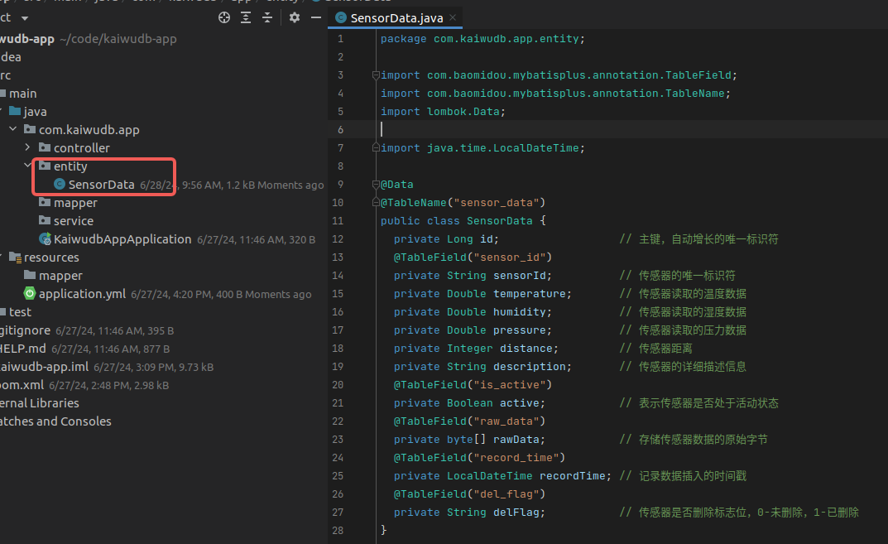

# 使用 MyBatis-Plus 连接 KWDB 数据库

[MyBatis-Plus](https://baomidou.com/getting-started/) 基于 MyBatis 进行扩展，提供了许多便捷功能，例如，条件构造器、分页插件、代码生成器等，有助于提高开发效率。

本文演示了如何在 Maven 管理的 Spring Boot 项目中，整合 KWDB 数据库，通过 MyBatis-Plus 实现数据访问和管理。MyBatis-Plus 使用时的常见问题可参见 [Mybatis 和 Mybatis-Plus](../../../faqs/faqs.md#mybatis-和-mybatis-plus)。

本示例使用了以下软件：

- JDK：OpenJDK 1.8.0_402
- Maven：Apache Maven 3.6.3
- Spring Boot：2.7.18
- MyBatis-Plus：com.baomidou:mybatis-plus-boot-starter:3.5.5  

## 前提条件

- [安装 openJDK](https://openjdk.org/install/)（1.8 及以上版本）。
- [安装 Maven](https://maven.apache.org/install.html)（3.6 及以上版本）。
- 安装 KWDB 数据库、配置数据库认证方式、创建数据库。
- 创建具有表级别及以上操作权限的用户。
- 获取 KaiwuDB JDBC 驱动包。

以下示例假设已在 KWDB 中创建了关系库 `kaiwudb_app` 和关系表 `sensor_data`。

1. 创建关系库。

    ```SQL
    CREATE DATABASE kaiwudb_app;
    ```

2. 创建关系表。

    ```SQL
    CREATE TABLE IF NOT EXISTS kaiwudb_app.sensor_data (
        id SERIAL PRIMARY KEY,
        sensor_id VARCHAR(20) NOT NULL,
        temperature DOUBLE,
        humidity DOUBLE,
        pressure DOUBLE,
        distance INT,
        description VARCHAR(255),
        is_active BOOLEAN DEFAULT true,
        raw_data BYTEA,
        record_time TIMESTAMP DEFAULT NOW(),
        del_flag CHAR(1)
    );
    ```

## 环境搭建

### 初始化应用项目

1. 在 IntelliJ IDEA 中创建 Spring Boot 项目，配置 JDK 8 环境:

    ::: warning 说明
    由于官网默认 JDK 最低版本为 JDK 17，需要先将 Server URL 地址更换为阿里云服务：start.aliyun.com，再设置 Java 版本。
    :::

   

2. 选择要加载的依赖项，完成项目创建:

    

3. 将项目 `/src/main/resources` 目录下的 `application.properties` 修改为更常用的 `application.yml` 文件。
    

### 引入依赖

1. 在项目的 `pom.xml` 文件，引入 MyBatis-Plus 依赖：

    ::: warning 提示

    MyBatis-Plus 依赖版本建议不低于 3.4.3。

    :::


    ```xml
    <!--  https://mvnrepository.com/artifact/com.baomidou/mybatis-plus-boot-starter  -->
    <dependency>
      <groupId>com.baomidou</groupId>
      <artifactId>mybatis-plus-boot-starter</artifactId>
      <version>3.5.5</version>
    </dependency>
    ```

2. 在项目的 `pom.xml` 文件，引入 KaiwuDB JDBC 依赖。

    ```xml
    <!-- KaiwuDB JDBC 2.2.0 -->
    <dependency>
      <groupId>com.kaiwudb</groupId>
      <artifactId>kaiwudb-jdbc</artifactId>
      <version>2.2.0</version>
    </dependency>
    ```

3. 如果 KaiwuDB JDBC 无法正常加载使用，运行以下命令，将 KaiwuDB JDBC 驱动安装到本地 Maven 仓库中。

   ```shell
   mvn install:install-file "-Dfile=../kaiwudb-jdbc-2.2.0.jar" "-DgroupId=com.kaiwudb" "-DartifactId=kaiwudb-jdbc" "-Dversion=2.2.0" "-Dpackaging=jar"
   ```

## 配置连接

1. 在 `application.yml` 文件中设置数据库的连接信息等参数。

    ```yaml
    spring:
      datasource:
        url: jdbc:kaiwudb://127.0.0.1:26257/kaiwudb_app  # 数据库连接 URL
        username: <user_name>                             # 数据库用户名
        password: <password>                    # 数据库密码
        driver-class-name: com.kaiwudb.Driver     # 驱动类名
    ```

2. 在 `application.yml` 中配置 MyBatis-Plus 的 Mapper 扫描路径、配置全局参数、注入自定义 SQL 拦截器等参数。

    ```yaml
    mybatis-plus:
      configuration:
        map-underscore-to-camel-case: true  # 开启驼峰命名自动映射
        log-impl: org.apache.ibatis.logging.stdout.StdOutImpl  # 开启日志打印
        type-aliases-package: com.kaiwudb.app.entity  # 实体类路径
        mapper-locations: classpath:mapper/*.xml  # Mapper 映射文件路径
    ```

## 配置数据增删改查操作

以下示例以物联网中常用传感器设备为例，展示如何实现数据的增、删、改、查操作。

### 创建实体类

1. 在 `entity` 目录下创建记录传感器数据的实体类 `SensorData`，加入 `@Data` 和 `@TableName` 注解，从而自动为实体类的字段生成 `getter`、`setter`、`equals`、`canEqual`、`hashCode` 和 `toString` 方法，指定实体类对应的数据表名称。

    ```java
    package com.kaiwudb.app.entity;

    import com.baomidou.mybatisplus.annotation.TableField;
    import com.baomidou.mybatisplus.annotation.TableName;
    import lombok.Data;

    import java.time.LocalDateTime;

    @Data
    @TableName("sensor_data")
    public class SensorData {
      private Long id;                  // 主键，自动增长的唯一标识符
      @TableField("sensor_id")
      private String sensorId;          // 传感器的唯一标识符
      private Double temperature;       // 传感器读取的温度数据
      private Double humidity;          // 传感器读取的湿度数据
      private Double pressure;          // 传感器读取的压力数据
      private Integer distance;         // 传感器距离
      private String description;       // 传感器的详细描述信息
      @TableField("is_active")
      private Boolean active;           // 表示传感器是否处于活动状态
      @TableField("raw_data")
      private byte[] rawData;           // 存储传感器数据的原始字节
      @TableField("record_time")
      private LocalDateTime recordTime; // 记录数据插入的时间戳
      @TableField("del_flag")
      private String delFlag;           // 传感器是否删除标志位，0-未删除，1-已删除
    }
    ```

    结果如下：

    

### 创建 Mapper 接口

1. 在 `mapper` 目录下创建 `SensorDataMapper`，继承 `BaseMapper` 接口，使用 `@Mapper` 和 `@Repository` 注解，以快速实现常见的数据插入、更新、删除和查询等操作。

    ```Java
    package com.kaiwudb.app.mapper;

    import com.baomidou.mybatisplus.core.mapper.BaseMapper;
    import com.kaiwudb.app.entity.SensorData;
    import org.apache.ibatis.annotations.Mapper;
    import org.springframework.stereotype.Repository;

    @Mapper
    @Repository
    public interface SensorDataMapper extends BaseMapper<SensorData> {
      // 自定义SQL方法
    }
    ```

    结果如下：

    

### （可选）自定义 SQL 方法

1. 根据需要在 `SensorDataMapper` 自定义 SQL 方法，比如按照 `record_time` 查询数据的接口：

    ```java
    List<SensorData> selectListBetweenTime(
        @Param("beginTime") LocalDateTime beginTime,
        @Param("endTime") LocalDateTime endTime);
    ```

    结果如下：

    

2. 在 `resources` 目录下新建 `mapper` 目录，新建 `SensorDataMapper.xml` 文件，添加以下内容：

    ::: warning 说明
    `select` 标签中的 `id` 为 `selectListBetweenTime` 的 SQL 语法，对应 mapper 文件中的 `selectListBetweenTime` 接口。
    :::

    ```xml
    <?xml version="1.0" encoding="UTF-8"?>
    <!DOCTYPE mapper PUBLIC "-//mybatis.org//DTD Mapper 3.0//EN" "http://mybatis.org/dtd/mybatis-3-mapper.dtd">
    <mapper namespace="com.kaiwudb.app.mapper.SensorDataMapper">
      <select id="selectListBetweenTime" resultType="com.kaiwudb.app.entity.SensorData">
        SELECT *
        FROM sensor_data
        WHERE record_time BETWEEN #{beginTime} AND #{endTime}
      </select>
    </mapper>
    ```

    结果如下：

    

### 创建接口服务类和实现类

1. 在 `service` 目录下创建 `SensorDataService` 接口服务类和对应的实现类 `SensorDataServiceImpl`，使用自定义的 `SensorDataMapper` 数据访问接口类进行数据的增改删查操作，其中数据查询接口扩展了多种查询方式，包括：按 ID 查询、按 sensorId 查询、按时间范围查询和查询全部数据；

- `SensorDataService` 接口服务类

  ```java
  package com.kaiwudb.app.service;

  import com.kaiwudb.app.entity.SensorData;

  import java.util.List;

  public interface SensorDataService {
    int insertSensorData(SensorData data);

    int updateSensorData(SensorData data);

    int deleteById(Long id);

    SensorData findById(Long id);

    List<SensorData> findBySensorId(String sensorId);

    List<SensorData> findByRecordTime(String beginTime, String endTime);

    List<SensorData> findAll();
  }
  ```

  结果如下：
  

- `SensorDataServiceImpl` 接口服务实现类

  ```java
  package com.kaiwudb.app.service.impl;

  import com.baomidou.mybatisplus.core.conditions.query.QueryWrapper;
  import com.kaiwudb.app.entity.SensorData;
  import com.kaiwudb.app.mapper.SensorDataMapper;
  import com.kaiwudb.app.service.SensorDataService;
  import org.springframework.beans.factory.annotation.Autowired;
  import org.springframework.stereotype.Service;

  import java.time.LocalDateTime;
  import java.time.format.DateTimeFormatter;
  import java.util.List;

  @Service
  public class SensorDataServiceImpl implements SensorDataService {
    @Autowired
    private SensorDataMapper sensorDataMapper;

    @Override
    public int insertSensorData(SensorData data) {
      return sensorDataMapper.insert(data);
    }

    @Override
    public int updateSensorData(SensorData data) {
      return sensorDataMapper.updateById(data);
    }

    @Override
    public int deleteById(Long id) {
      return sensorDataMapper.deleteById(id);
    }

    @Override
    public SensorData findById(Long id) {
      return sensorDataMapper.selectById(id);
    }

    @Override
    public List<SensorData> findBySensorId(String sensorId) {
      return sensorDataMapper.selectList(new QueryWrapper<SensorData>().eq("sensor_id", sensorId));
    }

    @Override
    public List<SensorData> findByRecordTime(String beginTime, String endTime) {
      LocalDateTime beginDateTime = LocalDateTime.parse(beginTime, DateTimeFormatter.ofPattern("yyyy-MM-dd HH:mm:ss.SSS"));
      LocalDateTime endDateTime = LocalDateTime.parse(endTime, DateTimeFormatter.ofPattern("yyyy-MM-dd HH:mm:ss.SSS"));
      return sensorDataMapper.selectListBetweenTime(beginDateTime, endDateTime);
    }

    @Override
    public List<SensorData> findAll() {
      return sensorDataMapper.selectList(null);
    }
  }
  ```

  结果如下：

  

### 创建控制器

1. 在 `controller` 目录下创建 `SensorDataController` 控制器来处理 HTTP 请求，实现对传感器数据的增、改、删、查等操作。

    ```java
    package com.kaiwudb.app.controller;

    import com.kaiwudb.app.entity.SensorData;
    import com.kaiwudb.app.service.SensorDataService;
    import org.springframework.beans.factory.annotation.Autowired;
    import org.springframework.format.annotation.DateTimeFormat;
    import org.springframework.web.bind.annotation.DeleteMapping;
    import org.springframework.web.bind.annotation.GetMapping;
    import org.springframework.web.bind.annotation.PathVariable;
    import org.springframework.web.bind.annotation.PostMapping;
    import org.springframework.web.bind.annotation.PutMapping;
    import org.springframework.web.bind.annotation.RequestBody;
    import org.springframework.web.bind.annotation.RequestMapping;
    import org.springframework.web.bind.annotation.RequestParam;
    import org.springframework.web.bind.annotation.RestController;

    import java.util.List;

    @RestController
    @RequestMapping("/sensor-data")
    public class SensorDataController {
      @Autowired
      private SensorDataService sensorDataService;

      @PostMapping("/add")
      public int addSensorData(@RequestBody SensorData data) {
        return sensorDataService.insertSensorData(data);
      }

      @PutMapping("/update")
      public int updateSensorData(@RequestBody SensorData data) {
        return sensorDataService.updateSensorData(data);
      }

      @DeleteMapping("/{id}")
      public int deleteSensorDataById(@PathVariable Long id) {
        return sensorDataService.deleteById(id);
      }

      @GetMapping("/{id}")
      public SensorData getSensorDataById(@PathVariable Long id) {
        return sensorDataService.findById(id);
      }

      @GetMapping("/by-sensor-id/{sensorId}")
      public List<SensorData> getSensorDataBySensorId(@PathVariable String sensorId) {
        return sensorDataService.findBySensorId(sensorId);
      }

      @GetMapping("/by-timestamp")
      public List<SensorData> getSensorDataByRecordTime(
        @RequestParam("beginTime") @DateTimeFormat(pattern = "yyyy-MM-dd HH:mm:ss.SSS") String beginTime,
        @RequestParam("endTime") @DateTimeFormat(pattern = "yyyy-MM-dd HH:mm:ss.SSS") String endTime) {
        return sensorDataService.findByRecordTime(beginTime, endTime);
      }

      @GetMapping("/all")
      public List<SensorData> getAllSensorData() {
        return sensorDataService.findAll();
      }
    }
    ```

    结果如下：
    

### 设置主程序类文件

1. 在根目录下创建名为 `KaiwudbAppApplication` 的主程序类文件，设置通过 `public static void main(String[] args)` 方法启动应用程序, 添加运行时需加载的配置类注解等。

    ```java
    package com.kaiwudb.app;

    import org.springframework.boot.SpringApplication;
    import org.springframework.boot.autoconfigure.SpringBootApplication;

    @SpringBootApplication(scanBasePackages = "com.kaiwudb.app")
    public class KaiwudbAppApplication {
      public static void main(String[] args) {
        SpringApplication.run(KaiwudbAppApplication.class, args);
      }
    }
    ```

    结果如下：

    

### 启动应用程序

1. 在项目中找到名为 `KaiwudbAppApplication` 的主程序，单击右键，选择 `Run'KaiwudbAppApplication'` 来启动应用程序：

    

    启动成功后，控制台显示如下结果：

    

### 访问操作示例

启动应用程序后，就可以通过 Postman 工具以 HTTP 请求的方式来访问调用接口，对 KWDB 数据库中的数据进行增删改查等操作：

- 增加数据：

  以下示例显示成功插入 1 条数据
  

- 修改数据

  以下示例显示成功修改 1 条数据
  

- 删除数据

  以下示例显示成功删除 1 条数据
  

- 查询数据

  - 按 sensorId 查询数据

    以下示例显示 `sensorId` 为 `sensor002` 的全部数据
  

  - 按时间范围查询

    以下示例显示在查询时间范围内的全部数据
  