# 使用 MyBatis 连接 KWDB 数据库

[MyBatis](https://mybatis.org/mybatis-3/index.html) 是开源 Java 应用持久层框架，支持定制化 SQL、存储过程以及高级映射。MyBatis 避免了几乎所有的 JDBC 代码，简化了参数设置及结果集处理，用户通过简单的 XML 或注解配置，即可将接口和 Java 的 POJOs 对象映射到数据库中的记录。

本文档介绍了如何基于 SpringBoot + Maven 项目使用 MyBatis 连接 KWDB。用户完成配置后，可以基于 MyBatis 框架的应用程序开发流程，编写应用程序对 KWDB 数据库进行操作。

MyBatis 使用时的常见问题可参见 [Mybatis 和 Mybatis-Plus](../../../faqs/faqs.md#mybatis-和-mybatis-plus)。

## 前提条件

- [安装 openJDK](https://openjdk.org/install/)（1.8 及以上版本）。
- [安装 Maven](https://maven.apache.org/install.html)（3.6 及以上版本）。
- 安装 KWDB 数据库、配置数据库认证方式、创建数据库。
- 创建具有表级别及以上操作权限的用户。
- 获取 KaiwuDB JDBC 驱动包。

以下示例假设已在 KWDB 中创建了时序库、时序表、关系库和关系表。

1. 创建时序库和时序表。

    ```SQL
    CREATE TS DATABASE test_ts_mybatis;

    CREATE TABLE test_ts_mybatis.ts_table
    (
        ts  TIMESTAMPTZ NOT NULL,
        c1  INT,
        c2  FLOAT4,
        c3  FLOAT8,
        c4  BOOL,
        c5  CHAR(1),
        c6  NCHAR(10),
        c7  VARCHAR(10),
        c8  NVARCHAR(10),
        c9  VARBYTES(10),
        c10 TIMESTAMP
    ) TAGS (
        t1 INT NOT NULL,
        t2 FLOAT4,
        t3 VARCHAR(10)
    ) PRIMARY TAGS (t1);
    ```

2. 创建关系库和关系表。

    ```SQL
    CREATE DATABASE test_mybatis;

    CREATE TABLE test_mybatis.rel_table
    (
        id  INT PRIMARY KEY,
        c1  INT,
        c2  FLOAT,
        c3  DOUBLE,
        c4  BOOLEAN,
        c5  CHAR(1),
        c6  NCHAR(10),
        c7  VARCHAR(10),
        c8  NVARCHAR(10),
        c9  BYTES,
        c10 TIMESTAMP
    );
    ```

## 环境搭建

### 初始化应用项目

1. 在 IntelliJ IDEA 中创建 Spring Boot 项目，配置 JDK 8 环境。

    ::: warning 说明

    由于官网默认 JDK 最低版本为 JDK 17，需要先将 Server URL 地址更换为阿里云服务：start.aliyun.com，再设置 Java 版本。

    :::

    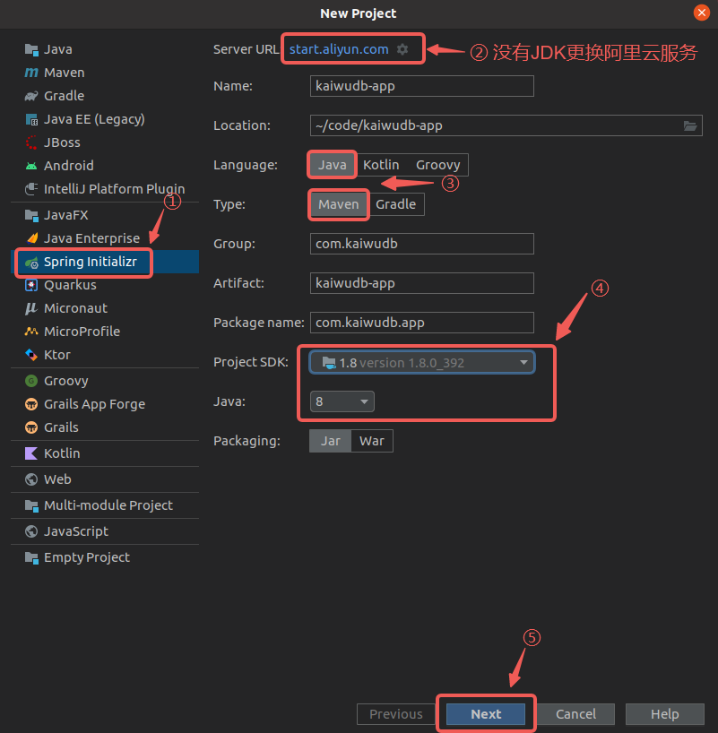

2. 选择需要加载的依赖项，完成项目创建。

    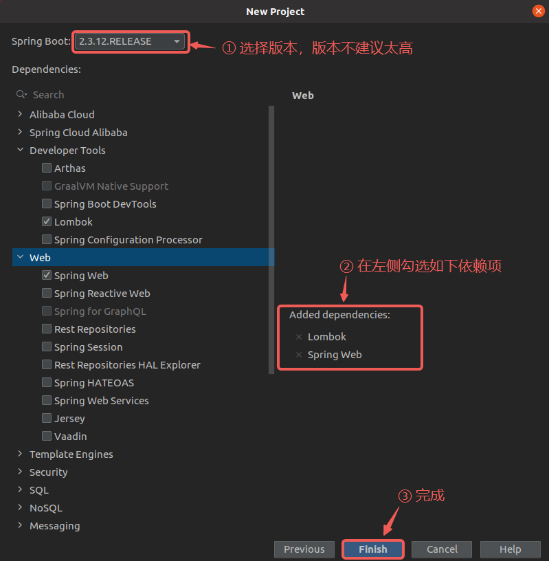

3. 将项目 `/src/main/resources` 目录下的 `application.properties` 修改为更常用的 `application.yml` 文件。

    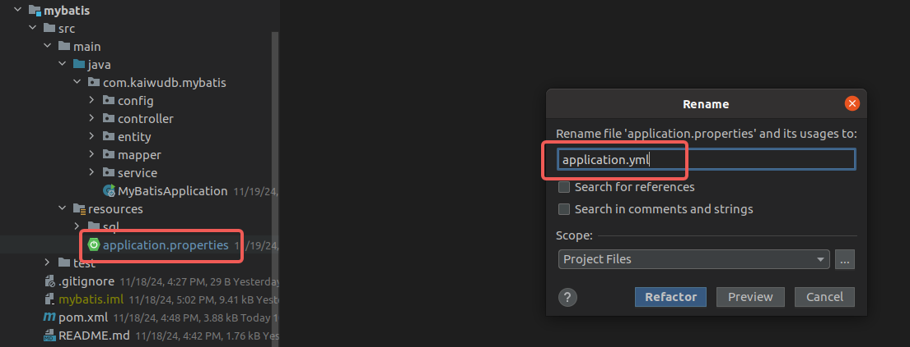

### 引入依赖

1. 在项目的 `pom.xml` 文件，引入 MyBatis 依赖。

    ```XML
    <!-- mybatis-spring-boot-starter -->
    <dependency>
      <groupId>org.mybatis.spring.boot</groupId>
      <artifactId>mybatis-spring-boot-starter</artifactId>
      <version>2.3.2</version>
    </dependency>
    ```

2. 在项目的 `pom.xml` 文件，引入 KaiwuDB JDBC 依赖。

    ```XML
    <!-- KaiwuDB JDBC 2.2.0 -->
    <dependency>
      <groupId>com.kaiwudb</groupId>
      <artifactId>kaiwudb-jdbc</artifactId>
      <version>2.2.0</version>
    </dependency>
    ```

3. 如果 KaiwuDB JDBC 无法正常加载使用，运行以下命令，将 KaiwuDB JDBC 驱动安装到本地 Maven 仓库中。

      ```Shell
      mvn install:install-file "-Dfile=../kaiwudb-jdbc.2.0.4.1.jar" "-DgroupId=com.kaiwudb" "-DartifactId=kaiwudb-jdbc" "-Dversion=2.0.4.1" "-Dpackaging=jar"
      ```

## 配置连接

1. 在 `application.yml` 文件中设置数据库的数据源及服务启动时的端口信息。

    ```YAML
    spring:
      # 时序库数据源配置
      tsdb-datasource:
        driver-class-name: com.kaiwudb.Driver
        jdbc-url: jdbc:kaiwudb://127.0.0.1:26257/test_ts_mybatis
        username: <user_name>
        password: <password>      
      # 关系库数据源配置
      rdb-datasource:
        driver-class-name: com.kaiwudb.Driver
        jdbc-url: jdbc:kaiwudb://127.0.0.1:26257/test_mybatis
        username: <user_name>
        password: <password>
    # 服务启动端口配置
    server:
      port: 9000
    ```

2. 在项目 `src/main/java/com/kaiwudb/mybatis/config` 目录下分别配置对应 `application.yml` 文件中配置的数据源配置类。

     - 时序数据源配置类

        ```Java
        @Configuration
        @MapperScan(basePackages = "com.kaiwudb.mybatis.mapper.tsdb", sqlSessionTemplateRef = "tsSqlSessionTemplate")
        public class TsDatabaseConfig {
          @Bean(name = "tsDataSource")
          @ConfigurationProperties(prefix = "spring.tsdb-datasource")
          public DataSource tsDataSource() {
            return DataSourceBuilder.create().build();
          }

          @Bean(name = "tsJdbcTemplate")
          public JdbcTemplate tsJdbcTemplate(@Qualifier("tsDataSource") DataSource tsDataSource) {
            return new JdbcTemplate(tsDataSource);
          }

          @Bean(name = "tsSqlSessionFactory")
          public SqlSessionFactory tsSqlSessionFactory(@Qualifier("tsDataSource") DataSource tsDataSource) throws Exception {
            SqlSessionFactoryBean bean = new SqlSessionFactoryBean();
            bean.setDataSource(tsDataSource);
            return bean.getObject();
          }

          @Bean(name = "tsTransactionManager")
          public DataSourceTransactionManager tsTransactionManager(@Qualifier("tsDataSource") DataSource tsDataSource) {
            return new DataSourceTransactionManager(tsDataSource);
          }

          @Bean(name = "tsSqlSessionTemplate")
          public SqlSessionTemplate tsdbSqlSessionTemplate(@Qualifier("tsSqlSessionFactory") SqlSessionFactory tsSqlSessionFactory) {
            return new SqlSessionTemplate(tsSqlSessionFactory);
          }
        }
        ```

     - 关系库数据源配置类

        ```Java
        @Configuration
        @MapperScan(basePackages = "com.kaiwudb.mybatis.mapper.rdb", sqlSessionTemplateRef = "sqlSessionTemplate")
        public class DatabaseConfig {
          @Primary
          @Bean(name = "dataSource")
          @ConfigurationProperties(prefix = "spring.rdb-datasource")
          public DataSource dataSource() {
            return DataSourceBuilder.create().build();
          }

          @Primary
          @Bean(name = "jdbcTemplate")
          public JdbcTemplate jdbcTemplate(@Qualifier("dataSource") DataSource dataSource) {
            return new JdbcTemplate(dataSource);
          }

          @Primary
          @Bean(name = "sqlSessionFactory")
          public SqlSessionFactory sqlSessionFactory(@Qualifier("dataSource") DataSource dataSource) throws Exception {
            SqlSessionFactoryBean bean = new SqlSessionFactoryBean();
            bean.setDataSource(dataSource);
            return bean.getObject();
          }

          @Primary
          @Bean(name = "transactionManager")
          public DataSourceTransactionManager transactionManager(@Qualifier("dataSource") DataSource dataSource) {
            return new DataSourceTransactionManager(dataSource);
          }

          @Primary
          @Bean(name = "sqlSessionTemplate")
          public SqlSessionTemplate sqlSessionTemplate(@Qualifier("sqlSessionFactory") SqlSessionFactory sqlSessionFactory) {
            return new SqlSessionTemplate(sqlSessionFactory);
          }
        }
        ```

## 配置数据增删改查操作

在 SpringBoot+MyBatis 应用程序中，用户调用接口访问及操作数据时，内部数据传递流程如下图所示：

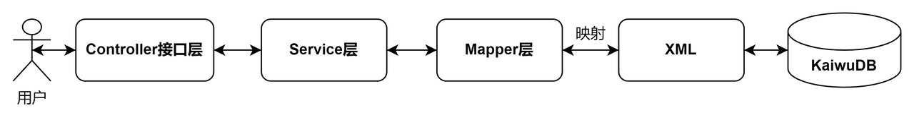

SpringBoot 集成 KaiwuDB JDBC 和 MyBatis 后，用户可以使用 MyBatis 编写实体类、Mapper 接口、接口服务及实现类、控制器，实现与 KWDB 的数据信息交互及操作使用。

### 时序数据

#### 创建实体类

在 `src/main/java/com/kaiwudb/mybatis/entity` 目录下创建时序表实体类 `TimeSeriesEntity`，实体类是数据库中的表在应用程序内的映射，用户需要结合数据库中表的实际信息在应用程序中定义实体类。

KWDB 时序数据库对应的实体类定义包含列信息和标签信息，用户可以参考以下内容定义 KWDB 时序表相关的实体类。

```Java
@Data
@NoArgsConstructor
@AllArgsConstructor
public class TimeSeriesEntity {
  @JsonFormat(shape = JsonFormat.Shape.STRING, pattern = "yyyy-MM-dd HH:mm:ss.SSS", timezone = "GMT+8")
  private Timestamp ts;
  private Integer c1;
  private Float c2;
  private Double c3;
  private Boolean c4;
  private String c5;
  private String c6;
  private String c7;
  private String c8;
  private String c9;
  @JsonFormat(shape = JsonFormat.Shape.STRING, pattern = "yyyy-MM-dd HH:mm:ss.SSS", timezone = "GMT+8")
  private Timestamp c10;
  private Integer t1;
  private Float t2;
  private String t3;
}
```

结果如下：

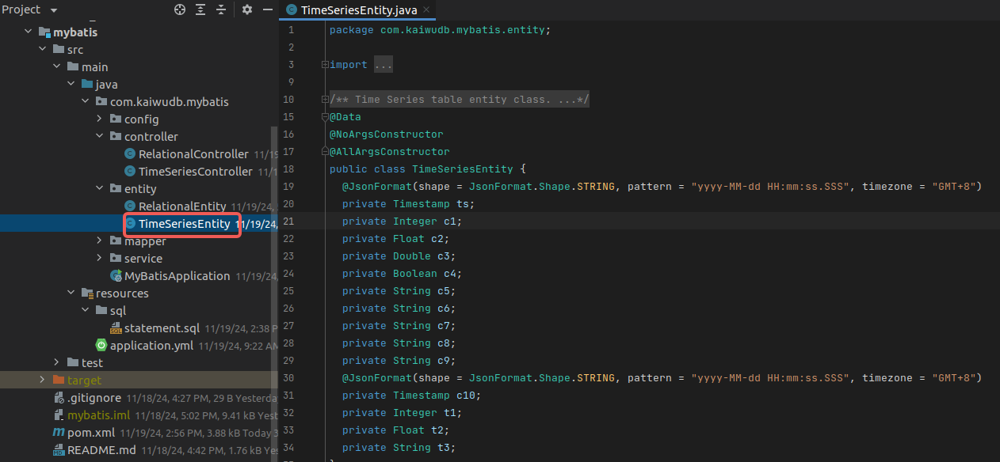

#### 创建Mapper接口

在 `src/main/java/com/kaiwudb/mybatis/mapper/tsdb` 目录下创建 `TimeSeriesMapper` 接口类，定义时序数据库的操作接口，使用 `@Mapper` 和 `@Repository` 注解，以快速实现常见的数据插入、更新、删除和查询等操作。

```Java
@Mapper
@Repository
public interface TimeSeriesMapper {
  @Insert("INSERT INTO ts_table (ts, c1, c2, c3, c4, c5, c6, c7, c8, c9, c10, t1, t2, t3) VALUES (#{ts}, #{c1}, #{c2}, #{c3}, #{c4}, #{c5}, #{c6}, #{c7}, #{c8}, #{c9}, #{c10}, #{t1}, #{t2}, #{t3})")
  int insert(TimeSeriesEntity entity);

  @Delete("DELETE FROM ts_table WHERE ts=#{timestamp}")
  int deleteByTimeStamp(@Param("timestamp") Timestamp timestamp);

  @Select("SELECT * FROM ts_table WHERE ts BETWEEN #{beginTime} AND #{endTime}")
  List<TimeSeriesEntity> selectListBetweenTime(
    @Param("beginTime") Timestamp beginTime,
    @Param("endTime") Timestamp endTime);

  @Select("SELECT * FROM ts_table")
  List<TimeSeriesEntity> selectList();
}
```

结果如下：

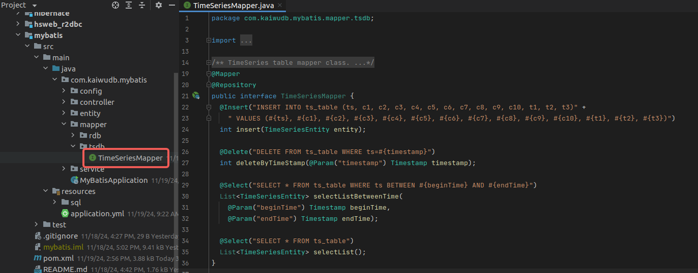

::: warning 说明

- Mapper接口文件中的方法实现除了使用注解方式外，还可以通过使用XML映射文件的方式自定义SQL语句来实现对数据库中数据的操作。
- KWDB 创建时序表的 SQL 语法与标准 SQL 语法不同，不支持使用 ORM 映射方式创建时序表。
- KWDB 不支持自增 ID（AUTO_INCREMENT），因此 MyBatis 不支持使用 `@ID` 标签。

:::

#### 创建接口服务及实现类

在 `src/main/java/com/kaiwudb/mybatis/service` 目录下创建 `TimeSeriesService` 接口服务类和对应的实现类 `TimeSeriesServiceImpl`，主要用于实现业务逻辑和数据访问层的交互；使用 `TimeSeriesMapper` 数据访问接口类进行时序数据的增改删查操作，其中时序数据查询接口扩展了多种查询方式，包括：按时间范围查询和查询全部时序数据。

- `TimeSeriesService` 接口服务类

  ```Java
  public interface TimeSeriesService {
    int insert(TimeSeriesEntity entity);

    int deleteByTimeStamp(String timestamp);

    List<TimeSeriesEntity> findByTimeStamp(String beginTime, String endTime);

    List<TimeSeriesEntity> findAll();
  }
  ```

  结果如下：

  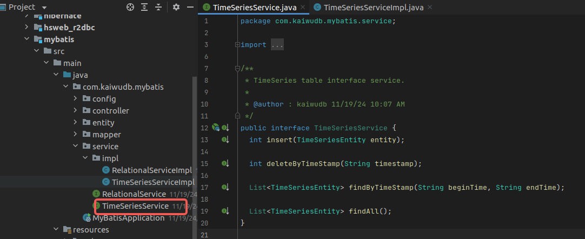

- `TimeSeriesServiceImpl` 接口服务实现类

  ```Java
  @Service
  public class TimeSeriesServiceImpl implements TimeSeriesService {
    @Autowired
    private TimeSeriesMapper mapper;

    @Override
    public int insert(TimeSeriesEntity entity) {
      return mapper.insert(entity);
    }

    @Override
    public int deleteByTimeStamp(String timestamp) {
      LocalDateTime dateTime = LocalDateTime.parse(timestamp, DateTimeFormatter.ofPattern("yyyy-MM-dd HH:mm:ss.SSS"));
      return mapper.deleteByTimeStamp(Timestamp.valueOf(dateTime));
    }

    @Override
    public List<TimeSeriesEntity> findByTimeStamp(String beginTime, String endTime) {
      LocalDateTime beginDateTime = LocalDateTime.parse(beginTime, DateTimeFormatter.ofPattern("yyyy-MM-dd HH:mm:ss"));
      LocalDateTime endDateTime = LocalDateTime.parse(endTime, DateTimeFormatter.ofPattern("yyyy-MM-dd HH:mm:ss"));
      return mapper.selectListBetweenTime(Timestamp.valueOf(beginDateTime), Timestamp.valueOf(endDateTime));
    }

    @Override
    public List<TimeSeriesEntity> findAll() {
      return mapper.selectList();
    }
  }
  ```

  结果如下：

  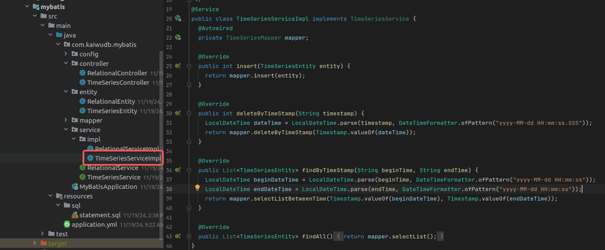

#### 创建控制器

在 `src/main/java/com/kaiwudb/mybatis/controller` 目录下创建 `TimeSeriesController` 控制器来处理用户的 HTTP 请求，并处理相应的业务逻辑，将用户的请求转发给 Service 层处理，实现对时序数据的增、改、删、查等操作，并将处理结果返回给用户。

```Java
@RestController
@RequestMapping("/time-series")
public class TimeSeriesController {
  @Autowired
  private TimeSeriesService service;

  @PostMapping("/add")
  public int add(@RequestBody TimeSeriesEntity entity) {
    return service.insert(entity);
  }

  @DeleteMapping("/{timestamp}")
  public int deleteByTimeStamp(@PathVariable @DateTimeFormat(pattern = "yyyy-MM-dd HH:mm:ss.SSS") String timestamp) {
    return service.deleteByTimeStamp(timestamp);
  }

  @GetMapping("/by-timestamp")
  public List<TimeSeriesEntity> getListByTime(
    @RequestParam("beginTime") @DateTimeFormat(pattern = "yyyy-MM-dd HH:mm:ss") String beginTime,
    @RequestParam("endTime") @DateTimeFormat(pattern = "yyyy-MM-dd HH:mm:ss") String endTime) {
    return service.findByTimeStamp(beginTime, endTime);
  }

  @GetMapping("/all")
  public List<TimeSeriesEntity> getAll() {
    return service.findAll();
  }
}
```

结果如下：

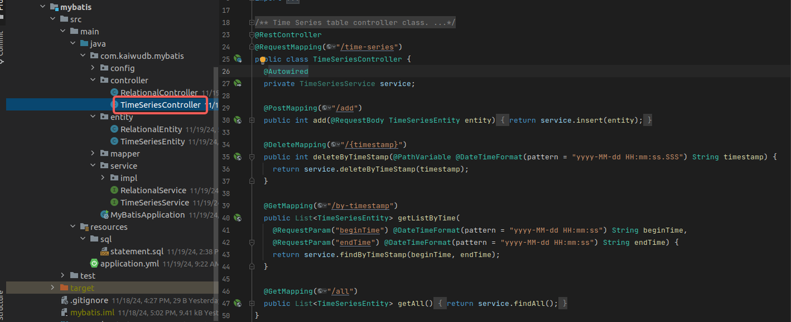

### 关系数据

#### 创建实体类

在 `src/main/java/com/kaiwudb/mybatis/entity` 目录下创建关系表实体类 `RelationalEntity`，实体类是数据库中的表在应用程序内的映射，用户需要结合数据库中表的实际信息在应用程序中定义实体类。

KWDB 关系数据库对应的实体类定义仅包含列信息，用户可以参考以下内容定义 KWDB 关系表相关的实体类。

```Java
@Data
@NoArgsConstructor
@AllArgsConstructor
public class RelationalEntity {
  private Integer id;
  private Integer c1;
  private Float c2;
  private Double c3;
  private Boolean c4;
  private String c5;
  private String c6;
  private String c7;
  private String c8;
  private String c9;
  @JsonFormat(shape = JsonFormat.Shape.STRING, pattern = "yyyy-MM-dd HH:mm:ss.SSS", timezone = "GMT+8")
  private Timestamp c10;
}
```

结果如下：

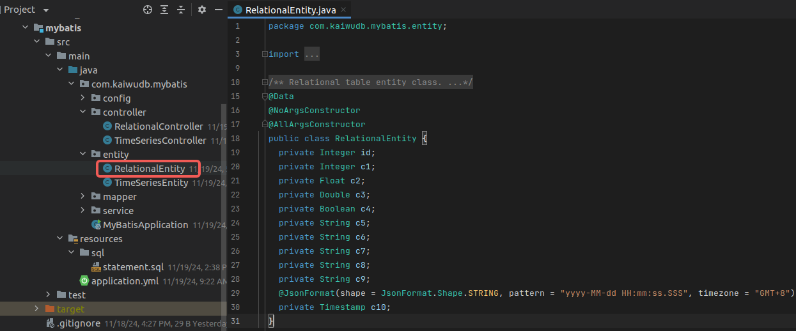

#### 创建 Mapper 接口

在 `src/main/java/com/kaiwudb/mybatis/mapper/rdb`目录下创建 `RelationalMapper `接口类，用于定义关系数据库的操作接口，使用 `@Mapper` 和 `@Repository` 注解，以快速实现常见的数据插入、更新、删除和查询等操作。

```Java
@Mapper
@Repository
public interface RelationalMapper {
  @Insert("INSERT INTO rel_table (id, c1, c2, c3, c4, c5, c6, c7, c8, c9, c10)" +
    " VALUES (#{id}, #{c1}, #{c2}, #{c3}, #{c4}, #{c5}, #{c6}, #{c7}, #{c8}, #{c9}, #{c10})")
  int insert(RelationalEntity entity);

  @Update("UPDATE rel_table SET c1=#{c1}, c2=#{c2}, c3=#{c3}, c4=#{c4}, c5=#{c5}," +
    " c6=#{c6}, c7=#{c7}, c8=#{c8}, c9=#{c9}, c10=#{c10} WHERE id=#{id}")
  int update(RelationalEntity entity);

  @Delete("DELETE FROM rel_table WHERE id=#{id}")
  int deleteById(Integer id);

  @Select("SELECT * FROM rel_table WHERE id=#{id}")
  RelationalEntity selectById(Integer id);

  @Select("SELECT * FROM rel_table WHERE c10 BETWEEN #{beginTime} AND #{endTime}")
  List<RelationalEntity> selectListBetweenTime(
    @Param("beginTime") Timestamp beginTime,
    @Param("endTime") Timestamp endTime);

  @Select("SELECT * FROM rel_table")
  List<RelationalEntity> selectList(Integer id);
}
```

结果如下：

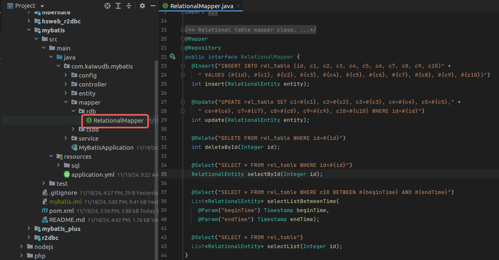

::: warning 说明

- Mapper接口文件中的方法实现除了使用注解方式外，还可以通过使用XML映射文件的方式自定义SQL语句来实现对数据库中数据的操作。
- KWDB 不支持自增 ID（AUTO_INCREMENT），因此 MyBatis 不支持使用 `@ID` 标签。

:::

#### 创建接口服务及实现类

在 `src/main/java/com/kaiwudb/mybatis/service` 目录下创建 `RelationalService` 接口服务类和对应的实现类 `RelationalServiceImpl`，主要用于实现业务逻辑和数据访问层的交互；使用 `RelationalMapper` 数据访问接口类进行关系数据的增改删查操作，其中关系数据查询接口扩展了多种查询方式，包括：按 ID 查询、按时间范围查询和查询全部关系数据。

- `RelationalService` 接口服务类

  ```Java
  public interface RelationalService {
    int insert(RelationalEntity entity);

    int update(RelationalEntity entity);

    int deleteById(Integer id);

    RelationalEntity findById(Integer id);

    List<RelationalEntity> findByTimeStamp(String beginTime, String endTime);

    List<RelationalEntity> findAll();
  }
  ```

  结果如下：

  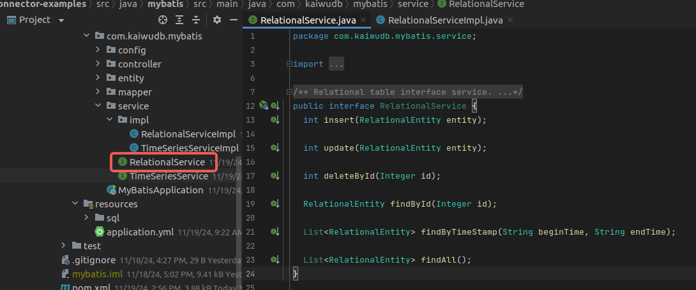

- `RelationalServiceImpl`接口服务实现类

  ```Java
  @Service
  public class RelationalServiceImpl implements RelationalService {
    @Autowired
    private RelationalMapper mapper;

    @Override
    public int insert(RelationalEntity entity) {
      return mapper.insert(entity);
    }

    @Override
    public int update(RelationalEntity entity) {
      return mapper.update(entity);
    }

    @Override
    public int deleteById(Integer id) {
      return mapper.deleteById(id);
    }

    @Override
    public RelationalEntity findById(Integer id) {
      return mapper.selectById(id);
    }

    @Override
    public List<RelationalEntity> findByTimeStamp(String beginTime, String endTime) {
      LocalDateTime beginDateTime = LocalDateTime.parse(beginTime, DateTimeFormatter.ofPattern("yyyy-MM-dd HH:mm:ss"));
      LocalDateTime endDateTime = LocalDateTime.parse(endTime, DateTimeFormatter.ofPattern("yyyy-MM-dd HH:mm:ss"));
      return mapper.selectListBetweenTime(Timestamp.valueOf(beginDateTime), Timestamp.valueOf(endDateTime));
    }

    @Override
    public List<RelationalEntity> findAll() {
      return mapper.selectList(null);
    }
  }
  ```

  结果如下：

  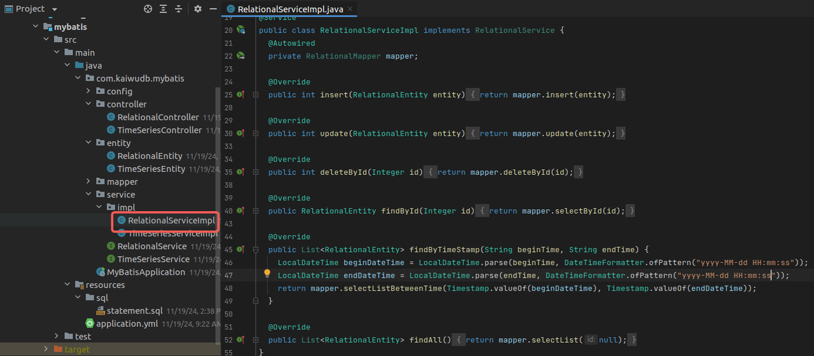

#### 创建控制器

在 `src/main/java/com/kaiwudb/mybatis/controller` 目录下创建 `RelationalController` 控制器来处理用户的 HTTP 请求，并处理相应的业务逻辑，将用户的请求转发给 Service 层处理，实现对关系数据的增、改、删、查等操作，并将处理结果返回给用户。

```Java
@RestController
@RequestMapping("/relational")
public class RelationalController {
  @Autowired
  private RelationalService service;

  @PostMapping("/add")
  public int add(@RequestBody RelationalEntity entity) {
    return service.insert(entity);
  }

  @PutMapping("/update")
  public int update(@RequestBody RelationalEntity entity) {
    return service.update(entity);
  }

  @DeleteMapping("/{id}")
  public int deleteById(@PathVariable Integer id) {
    return service.deleteById(id);
  }

  @GetMapping("/{id}")
  public RelationalEntity getById(@PathVariable Integer id) {
    return service.findById(id);
  }

  @GetMapping("/by-timestamp")
  public List<RelationalEntity> getListByTime(
    @RequestParam("beginTime") @DateTimeFormat(pattern = "yyyy-MM-dd HH:mm:ss") String beginTime,
    @RequestParam("endTime") @DateTimeFormat(pattern = "yyyy-MM-dd HH:mm:ss") String endTime) {
    return service.findByTimeStamp(beginTime, endTime);
  }

  @GetMapping("/all")
  public List<RelationalEntity> getAll() {
    return service.findAll();
  }
}
```

结果如下：

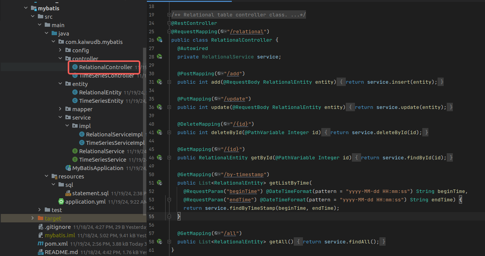

### 设置主程序类

在根目录下创建名为 `MyBatisApplication` 的主程序类文件，设置通过 `public static void main(String[] args)` 方法启动应用程序, 添加运行时需加载的配置类注解等。

```Java
@SpringBootApplication(scanBasePackages = "com.kaiwudb.mybatis")
@Configuration
public class MyBatisApplication extends SpringBootServletInitializer {
  public static void main(String[] args) {
    SpringApplication.run(MyBatisApplication.class, args);
  }

  @Override
  protected SpringApplicationBuilder configure(SpringApplicationBuilder builder) {
    return builder.sources(MyBatisApplication.class);
  }
}
```

结果如下：

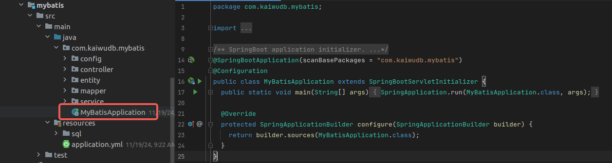

### 启动应用程序

在项目中找到名为 `MyBatisApplication` 的主程序，单击右键，选择 `Run'MyBatisApplication'` 来启动应用程序。

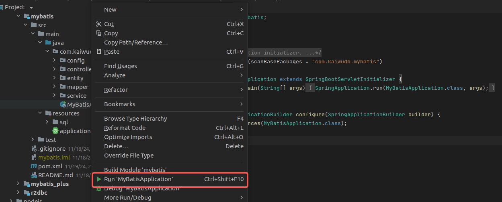

启动成功后，控制台显示如下结果：

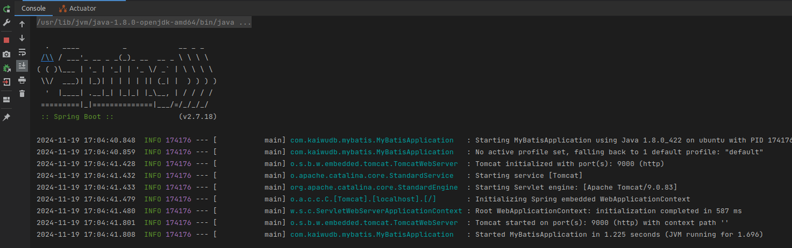

### 访问操作示例

启动应用程序后，就可以通过 Postman 工具以 HTTP 请求的方式来访问调用接口，对 KWDB 数据库中的时序和关系数据进行增删改查等操作，以下时序数据为例：

- 添加时序数据

  以下示例显示成功插入 1 条时序数据。

  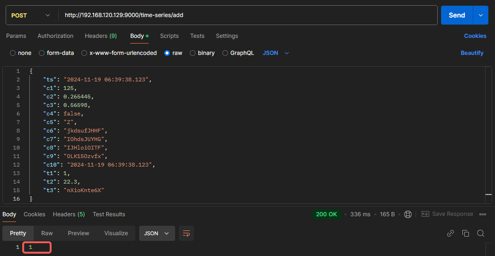

- 删除时序数据

  以下示例显示成功删除 1 条时序数据。

  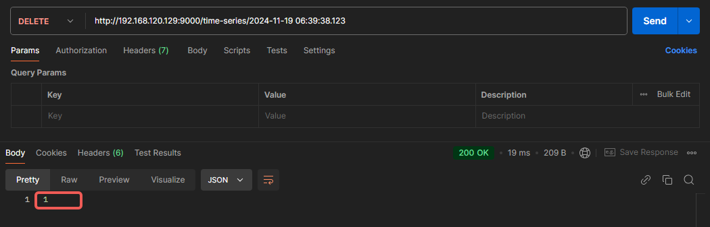

- 查询时序数据

  以下示例显示在查询时间范围内的全部时序数据。

  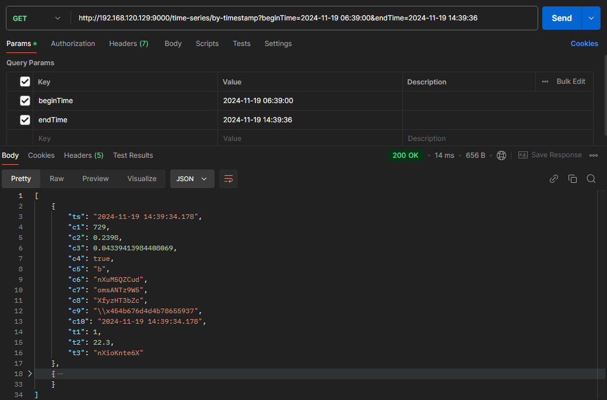
