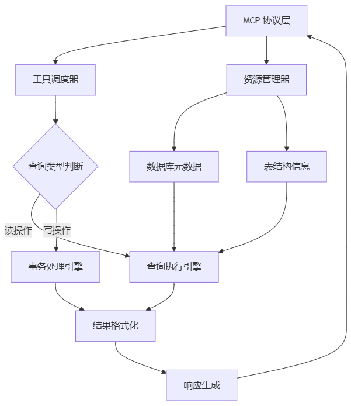
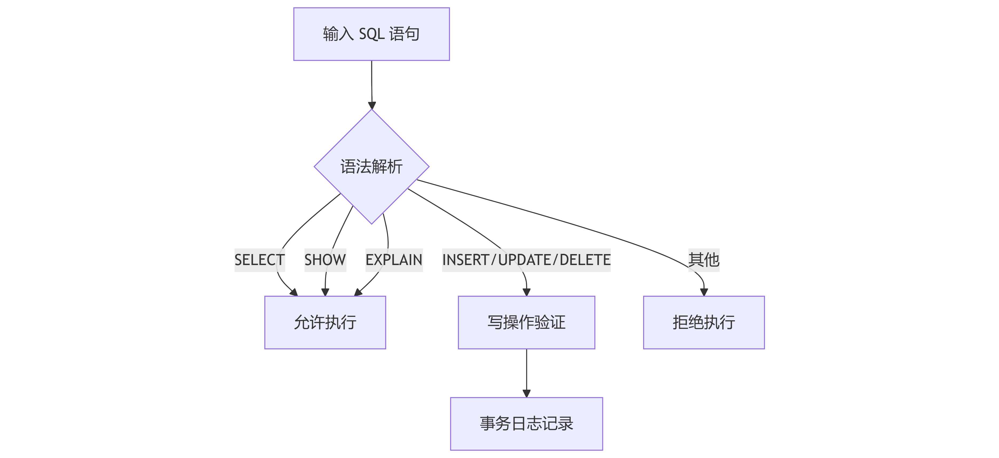
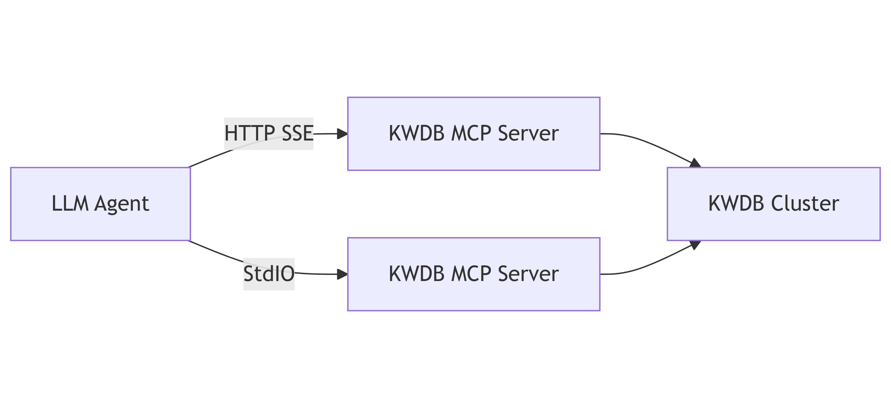
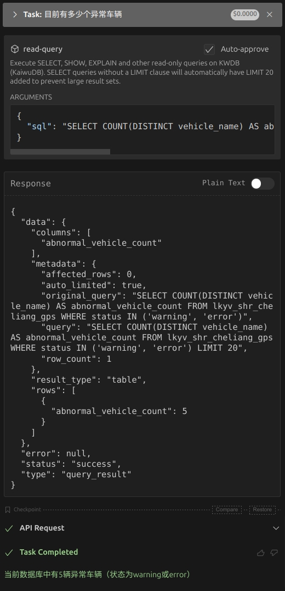

# 使用 KWDB MCP Server 连接 KWDB

KWDB MCP Server 是一个基于 [MCP](https://modelcontextprotocol.io/introduction)（Model Context Protocol，模型上下文协议）协议的服务器实现，它通过 MCP 协议提供一套工具和资源，用于与 KWDB 数据库交互和提供商业智能功能。KWDB MCP Server 支持读取、写入、查询、修改数据以及执行 DDL 操作。

## KWDB MCP Server 概述

### 架构设计

KWDB MCP Server 的核心流程包括以下几个部分：

- 协议解析：处理 MCP 标准输入或 HTTP SSE 请求。
- 工具路由：根据工具类型（read/write）分发处理请求。
- 查询预处理：自动添加 `LIMIT` 语法检查。
- 结果封装：采用统一 JSON 响应格式。



### 功能特性

- **读取操作**：支持 `SELECT`、`SHOW`、`EXPLAIN` 和其他只读查询。
- **写入操作**：支持 `INSERT`、`UPDATE`、`DELETE` DML 操作和 `CREATE`、`DROP`、`ALTER` DDL 操作。
- **数据库信息**：获取数据库信息，包括数据库中所有的表及其架构。
- **语法指南**：根据提示，访问 KWDB 支持的综合 SQL 语法指南。
- **标准化 API 响应**：所有 API 响应遵循一致的 JSON 结构。
    ```json
    {
      "status": "success",  // 或 "error"
      "type": "query_result",  // 响应类型
      "data": { ... },  // 响应数据
      "error": null  // 错误信息，成功时为 null
    }
    ```
- **自动 LIMIT**：自动为没有 `LIMIT` 子句的 `SELECT` 查询语句添加 `LIMIT 20` 子句，防止生成大型结果集。

### 安全性

KWDB MCP Server 实现以下安全性能。

- 提供单独的读取和写入操作工具。
- 验证查询结果，确保与预期的操作类型匹配。
- 输出未授权操作的错误消息。



### MCP Resources

MCP Resources 指 KWDB MCP Server 暴露的数据和内容，供 MCP 客户端读取并作为 LLM 上下文。下表列出 KWDB MCP Server 支持的 Resources。

| Resources      | URI 格式                         | 描述                                    | 示例                        |
|----------------|----------------------------------|---------------------------------------|-----------------------------|
| 数据库产品信息 | `kwdb://product_info`            | 数据库产品信息，包括版本和功能。          | `kwdb://product_info/`      |
| 数据库元信息   | `kwdb://db_info/{database_name}` | 目标数据库的信息，包括引擎类型、注释和表。 | `kwdb://db_info/db_shig`    |
| 表结构信息     | `kwdb://table/{table_name}`      | 目标表的架构，包括列和示例查询。          | `kwdb://table/user_profile` |

### MCP Tools

MCP Tools 指 KWDB MCP Server 暴露的可执行功能，供 LLM 调用以与外部系统交互。KWDB MCP Server 提供以下 Tools。

#### 读查询（read-query）

KWDB MCP Server 支持执行 `SELECT`、`SHOW`、`EXPLAIN` 和其他只读查询，从数据库中读取数据。用户只需要提供一个 SQL 查询语句作为输入，`read_query` 函数就会返回查询结果，结果以对象数组的形式呈现。此外，KWDB MCP Server 也支持为没有 `LIMIT` 子句的 `SELECT` 查询自动添加 `LIMIT 20`，避免生成大型结果集。

示例：

```sql
-- 查看表数据。
SELECT * FROM users LIMIT 10;
-- 查看数据库中已创建的表。
SHOW TABLES;
-- 执行 SQL 查询，生成包含查询详细信息的文件。
EXPLAIN ANALYZE SELECT * FROM orders WHERE user_id = 1;
```

#### 写查询（write-query）

KWDB MCP Server 支持执行数据修改查询，包括 DML 和 DDL 操作。

示例：

```sql
-- 插入数据。
INSERT INTO users (name, email) VALUES ('John Doe', 'john@example.com');
-- 更新数据。
UPDATE users SET email = 'new-email@example.com' WHERE id = 1;
-- 删除数据。
DELETE FROM users WHERE id = 1;
-- 创建表。
CREATE TABLE products (id SERIAL PRIMARY KEY, name TEXT, price DECIMAL);
-- 修改表。
ALTER TABLE products ADD COLUMN description TEXT;
-- 删除表
DROP TABLE products;
```

### MCP Prompts

MCP Prompts 指 KWDB MCP Server 定义的可复用提示模板，引导 LLM 交互。下表列出 KWDB MCP Server 支持的 Prompts。

| 类别       | Prompts              | 描述                                                              |
|----------|----------------------|-----------------------------------------------------------------|
| 数据库描述 | `db_description`     | KWDB 数据库的综合描述，包括其功能、特性和用例。                      |
| 语法指南   | `syntax_guide`       | KWDB 数据库的综合语法指南，包括常见查询示例和最佳实践。                   |
| 集群管理   | `cluster_management` | KWDB 集群管理的综合指南，包括节点管理、负载均衡和监控。              |
| 数据迁移   | `data_migration`     | 数据迁移到 KWDB 数据库和从 KWDB 数据库迁移的指南，包括导入/导出方法和最佳实践。 |
| 安装部署   | `installation`       | 在各种环境中安装和部署 KWDB 数据库的分步指南。                           |
| 性能调优   | `performance_tuning` | 优化 KWDB 数据库性能的指南，包括查询优化、索引策略和系统级调优。           |
| 故障排查   | `troubleshooting`    | 诊断和解决常见 KWDB 数据库问题和错误的指南。                             |
| 备份与恢复 | `backup_restore`     | 备份和恢复 KWDB 数据库的综合指南，包括策略、工具和最佳实践。         |
| DBA 模板   | `dba_template`       | 提示词编写模板。                                                   |

## 集成 LLM Agent

KWDB MCP Server 可与任何支持 MCP 协议的 LLM Agent 配合使用。LLM Agent 通过 HTTP SSE 传输协议或 StdIO 标准输入/输出协议连接 KWDB MCP Server，然后连接 KWDB 数据库，执行创建、插入和查询操作。

::: warning 说明
本节示例使用 [Cline](https://cline.bot)，但类似步骤也适用于其他兼容 MCP 协议的 LLM Agent。有关支持 MCP 协议的 LLM Agent 的详细信息，参见 [MCP 官方文档](https://modelcontextprotocol.io/clients)。
:::



### 前提条件

- 已安装 Visual Studio Code。
- 已在 Visual Studio Code 安装 Cline 插件。
- 已下载并解压缩 KWDB MCP Server 安装包。<!--待添加文档链接-->
- 已安装和运行 KWDB 数据库、配置数据库认证方式、创建数据库。有关详细信息，参见 [KWDB 官方文档](../../../deployment/bare-metal/bare-metal-deployment.md)。
- 已创建具有表级别及以上操作权限的用户。有关详细信息，参见[创建用户](../../../sql-reference/db-mgmt/user-mgmt-sql.md#创建用户)。

### 配置 Cline 连接 KWDB MCP Server

#### 标准 I/O 模式

1. 在 Visual Studio Code 右侧边栏，单击 Cline 图标。
2. 在 Cline 插件的顶部导航栏中，单击 **MCP Servers** 图标。
3. 选择 **Installed** 页签，然后单击页面底部的 **Configure MCP Servers**。

    

4. 在弹出的页面中，添加并保存 KWDB MCP Server 配置。

    ```json
    "mcpServers": {
      "kwdb-server": {
        "command": "/path/to/bin/kwdb-mcp-server",
        "args": [
          "postgresql://<username>:<password>@<host>:<port>/<database_name>"
        ],
        "disabled": false,
        "autoApprove": []
      }
    }
    ```

    参数说明：

    - `command`：指定在命令行中通过什么命令执行操作。
    - `args`：一个数组，包含传递给 `command` 的参数。
    - `username`：连接 KWDB 数据库的用户名。
    - `password`：身份验证时使用的密码。
    - `hostname`：KWDB 数据库的 IP 地址。
    - `port`：KWDB 数据库的连接端口。
    - `database_name`：需要访问的 KWDB 数据库名称。
    - `sslmode`：SSL 模式。支持的取值包括 `disable`、`allow`、`prefer`、`require`、`verify-ca` 和 `verify-full`。有关 SSL 模式相关的详细信息，参见 [SSL 模式参数](../java/connect-jdbc.md#ssl-模式参数)。

5. 选择 **Installed** 页签，单击 KWDB MCP Server 旁边的重启按钮，或者单击页面底部的 **Restart Server**。

#### SSE 模式

1. 进入 KWDB MCP Server 安装目录，启动 KWDB MCP Server。

    ```bash
    </path/to/bin/kwdb-mcp-server> -t sse -addr ":8080" -base-url "http://localhost:8080" "postgresql://<username>:<password>@<host>:<port>/<database_name>?sslmode=disable"
    ```

    参数说明：
    - `-t` 或 `-transport`：传输类型，支持设置为 `stdio` 或 `sse`。
      - `stdio`：标准输入/输出模式
      - `sse`：SSE 模式
    - `-addr`：KWDB MCP Server 的监听端口，默认为 `:8080`。
    - `-base-url`：KWDB MCP Server 的 IP 地址，默认为 `http://localhost:8080`。
    - `username`：连接 KWDB 数据库的用户名。
    - `password`：身份验证时使用的密码。
    - `hostname`：KWDB 数据库的 IP 地址。
    - `port`：KWDB 数据库的连接端口。
    - `database_name`：需要访问的 KWDB 数据库名称。
    - `sslmode`：SSL 模式。支持的取值包括 `disable`、`allow`、`prefer`、`require`、`verify-ca` 和 `verify-full`。有关 SSL 模式相关的详细信息，参见 [SSL 模式参数](../java/connect-jdbc.md#ssl-模式参数)。

2. 配置 Cline 连接 KWDB MCP Server。
   1. 在 Visual Studio Code 右侧边栏，单击 Cline 图标。
   2. 在 Cline 插件的顶部导航栏中，单击 **MCP Servers** 图标。
   3. 选择 **Installed** 页签，然后单击页面底部的 **Configure MCP Servers**。
   4. 在弹出的页面中，添加并保存 KWDB MCP Server 配置。

        ```json
        "mcpServers": {
          "kwdb-server-sse": {
            "url": "http://localhost:8080/sse",
            "disabled": false,
            "autoApprove": []
          }
        }
        ```

        参数说明：
        - `url`：KWDB MCP Server 的 IP 地址，默认为 `http://localhost:8080/sse`。

3. 选择 **Installed** 页签，单击 KWDB MCP Server 旁边的重启按钮，或者单击页面底部的 **Restart Server**。

### 验证

以下示例假设已经创建一个名为 `lkyv_shr_cheliang_gps` 的表并写入相关数据。

在 Cline 页面，用户输入一个问题：“目前有多少个异常车辆”。大模型将其转化为可执行的 SQL 语句：

```sql
SELECT COUNT(DISTINCT vehicle_name) AS abnormal_vehicle_count FROM lkyv_shr_cheliang_gps WHERE status IN ('warning', 'error') LIMIT 20;
```

运行结果如下所示：



从上图中可以看出，Cline 调取 KWDB MCP Server 的 read-query 工具，统计表中 `status` 列值为 `warning` 和 `error` 的数据。最后再由 Cline 中配置的大模型来汇总数据。

## 故障排查

### 数据库连接失败

如果无法连接 KWDB 数据库，请从以下几个方便排查问题：

- 检查数据库连接字符串是否正确。
- 检查用户主机是否可以正常访问 KWDB 数据库。
- 检查数据库用户是否具有足够的权限。
- 检查 LLM Agent 中 KWDB MCP Server 配置中数据库的连接地址否正确。
- 检查是否阻塞端口的现有 `kwdb-mcp-server` 进程。

### SSE 模式相关问题

| 问题       | 处理策略                                                                                 |
|----------|--------------------------------------------------------------------------------------|
| 连接被拒绝 | 确保 KWDB MCP Server 正常运行并监听指定地址。                                             |
| CORS 错误  | 如果通过 Web 浏览器访问 KWDB 数据库，确保 KWDB MCP Server 的基础 URL 与数据库的 URL 匹配。 |
| 网络问题   | 检查防火墙规则或网络配置，确认是否阻止连接。                                               |
| 数据库连接 | 确保 KWDB MCP Server 可以正常访问数据库。                                                 |

### 错误码

下表列出 KWDB MCP Server 相关的错误码。

| 错误码    | 错误原因   | 处理策略            |
|-----------|--------|-----------------|
| KWDB-4001 | 语法错误   | 返回具体错误位置    |
| KWDB-4002 | 权限不足   | 中断执行并告警      |
| KWDB-4003 | 连接超时   | 重试机制（最多 3 次） |
| KWDB-4004 | 资源不存在 | 返回 404 状态码     |
