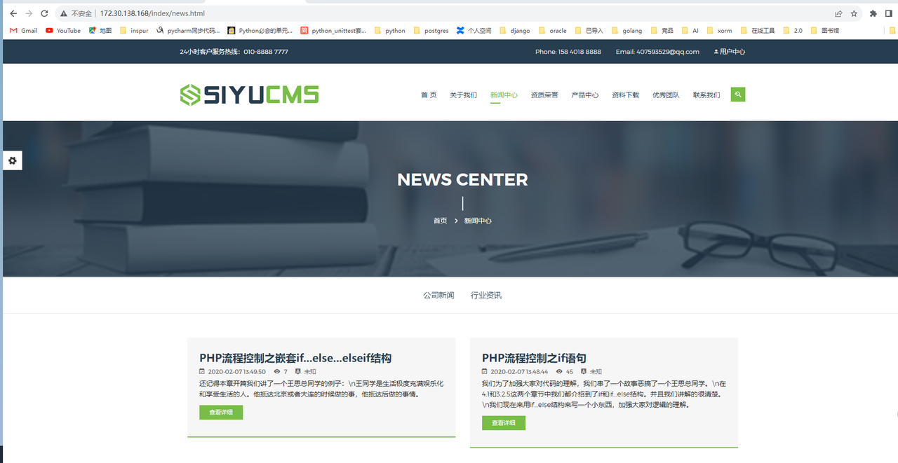

# 使用 ThinkPHP 连接 KWDB

ThinkPHP 是一个免费开源，快速、简单的面向对象的轻量级 PHP 开发框架，是为了敏捷 WEB 应用开发和简化企业应用开发而诞生的。

本示例演示了如何通过 ThinkPHP 连接 KWDB，执行 SQL 语句。

## 前提条件

- 安装和运行 KWDB 数据库、配置数据库认证方式、创建数据库。
- 创建具有表级别及以上操作权限的用户。
- 安装 [ThinkPHP](https://doc.thinkphp.cn/v6_1/anzhuangThinkPHP.html)。

## 配置示例

### 安装 PHP

1. 安装 PHP：

    ```bash
    sudo apt install php7.4
    ```

2. 安装 PHP-PGSQL 扩展：

    ```bash
    sudo apt install php-pgsql
    ```

3. 修改 `/etc/php/7.4/mods-available/php.ini` 文件，启用扩展：

    ```ini
    extension=pdo.so
    ```

### 安装和配置 Apache

1. 安装 Apache：

    ```bash
    sudo apt install apache2
    ```

2. 禁用 Apache 默认站点配置。Ubuntu 安装的 Apache 中可能存在默认站点配置 `000-default.conf`，可以通过以下命令禁用：

    ```bash
    sudo a2dissite 000-default
    ```

3. 创建 `thinkphp6.conf` 配置文件：

    ```bash
    sudo vim /etc/apache2/sites-available/thinkphp6.conf
    ```

4. 在 `thinkphp6.conf` 配置文件中启用新站点配置：

    ```apache
    <VirtualHost *:80>
        ServerAdmin webmaster@localhost
        ServerName yourdomain.com
        ServerAlias www.yourdomain.com

        DocumentRoot /root/test/thinkphp-test/tp6/public

        <Directory "/root/test/thinkphp-test/tp6/public">
            AllowOverride All
            Require all granted
        </Directory>

        ErrorLog ${APACHE_LOG_DIR}/error.log
        CustomLog ${APACHE_LOG_DIR}/access.log combined
    </VirtualHost>
    ```

5. 检查 Apache URL 重写模块是否已启用：

    ```bash
    sudo a2query -m rewrite
    ```

6. 如未启用，执行以下命令：

    ```bash
    sudo a2enmod rewrite
    sudo systemctl reload apache2
    ```

7. 启动 Apache 服务：

    ```bash
    sudo systemctl start apache2
    ```  

### 使用第三方 TP6 项目并引入配置文件

1. 克隆 TP6 项目：

    ```bash
    git clone https://gitee.com/ruoshuiyx/tp6.git
    ```

2. 修改 `.env` 配置文件中的数据库设置。

    ```env
    [DATABASE]
    TYPE=kwdb
    HOSTNAME= <database_ip>
    DATABASE= defaultdb
    USERNAME= <user_name>
    PASSWORD= <password>
    HOSTPORT= 26800
    CHARSET= utf8
    DEBUG= true
    PREFIX= tp_
    ```

3. 在 `app/admin/service/Backup.php` 文件中添加以下函数：

    ```php
    private static function _show_status_stmt($table = null)
    {
        if (is_null($table)) {
            return "SELECT t.*, c.* FROM information_schema.tables AS t
                    JOIN kwdb_internal.tables AS c ON t.table_catalog = c.database_name
                    AND t.table_schema = c.schema_name
                    AND t.table_name = c.name
                    WHERE t.table_schema NOT IN ('information_schema', 'pg_catalog', 'crdb_internal')
                    ORDER BY t.table_catalog, t.table_schema, t.table_name;";
        } else {
            return "SELECT t.*, c.* FROM information_schema.tables AS t
                    JOIN kwdb_internal.tables AS c ON t.table_catalog = c.database_name
                    AND t.table_schema = c.schema_name
                    AND t.table_name = c.name
                    WHERE t.table_schema NOT IN ('information_schema', 'pg_catalog', 'crdb_internal')
                    AND t.table_name = '" . $table . "'
                    ORDER BY t.table_catalog, t.table_schema, t.table_name;";
        }
    }
    ```

4. 修改 `app/admin/service/Backup.php` 文件中的 dataList 接口：

    ```php
    public function dataList($table = null, $type = 1)
    {
        $db = self::connect();
        $stmt = self::_show_status_stmt($table);
        $list = $db->query($stmt);
        return array_map('array_change_key_case', $list);
    }
    ```

5. 修改 `app/common.php` 文件, 将 `$tags = explode(',', $info[$v['field']]);` 修改为 `$tags = explode(',', $info[$v['field']][0]);`

6. 修改 `app/common/model/Admin.php` 文件，注释掉 `open_code` 代码块：

    ```php
    public static function checkLogin()
    {
        // 查找所有系统设置表数据
        $system = \app\common\model\System::find(1);

        $username = Request::param("username");
        $password = Request::param("password");

        // $open_code = $system['code'];
        // if($open_code){
        //     $code = Request::param("vercode");
        //     if(!captcha_check($code)){
        //         $data = ['error' => '1', 'msg' => '验证码错误'];
        //         return json($data);
        //     }
        // }
        // }
        $result = self::where(['username' => $username, 'password' => md5($password)])->find();
    ...    
    ```

7. 修改 `config/database.php` 配置文件，配置数据库连接：

    ```php
    <?php

    return [
        // 默认使用的数据库连接配置
        'default'         => env('database.driver', 'kwdb'),

        // 自定义时间查询规则
        'time_query_rule' => [],

        // 自动写入时间戳字段
        // true为自动识别类型 false关闭
        // 字符串则明确指定时间字段类型 支持 int timestamp datetime date
        'auto_timestamp'  => true,

        // 时间字段取出后的默认时间格式
        'datetime_format' => 'Y-m-d H:i:s',

        // 时间字段配置 配置格式：create_time,update_time
        'datetime_field'  => '',

        // 数据库连接配置信息
        'connections'     => [
            'kwdb' => [
                // 数据库类型
                'type'            => env('database.type', 'kwdb'),
                // 服务器地址
                'hostname'        => env('database.hostname', '10.110.10.155'),
                // 数据库名
                'database'        => env('database.database', 'defaultdb'),
                // 用户名
                'username'        => env('database.username', 'u1'),
                // 密码
                'password'        => env('database.password', 'Znbase@123'),
                // 端口
                'hostport'        => env('database.hostport', '26800'),
                // 数据库连接参数
                'params'          => [],
                // 数据库编码默认采用utf8
                'charset'         => env('database.charset', 'utf8'),
                // 数据库表前缀
                'prefix'          => env('database.prefix', ''),

                // 数据库部署方式:0 集中式(单一服务器),1 分布式(主从服务器)
                'deploy'          => 0,
                // 数据库读写是否分离 主从式有效
                'rw_separate'     => false,
                // 读写分离后 主服务器数量
                'master_num'      => 1,
                // 指定从服务器序号
                'slave_no'        => '',
                // 是否严格检查字段是否存在
                'fields_strict'   => true,
                // 是否需要断线重连
                'break_reconnect' => false,
                // 监听SQL
                'trigger_sql'     => env('app_debug', true),
                // 开启字段缓存
                'fields_cache'    => false,
            ],

            // 更多的数据库配置信息
        ],
    ];
    ```

8. 修改 `public/index.php` 文件，引入 `kwdb.php`：

    ```php
    require __DIR__ . '/builder/kwdb.php';
    require __DIR__ . '/connector/kwdb.php';
    ```

9. 在 `tp6/public/builder` 目录下创建 `kwdb.php` 文件。

    ```php
    <?php
    // +----------------------------------------------------------------------
    // | ThinkPHP [ WE CAN DO IT JUST THINK ]
    // +----------------------------------------------------------------------
    // | Copyright (c) 2006~2019 http://thinkphp.cn All rights reserved.
    // +----------------------------------------------------------------------
    // | Licensed ( http://www.apache.org/licenses/LICENSE-2.0 )
    // +----------------------------------------------------------------------
    // | Author: liu21st <liu21st@gmail.com>
    // +----------------------------------------------------------------------
    declare (strict_types = 1);

    namespace think\db\builder;

    use think\db\Builder;
    use think\db\Query;
    use think\db\Raw;

    /**
    * kwdb数据库驱动
    */
    class kwdb extends Builder
    {
        /**
        * INSERT SQL表达式
        * @var string
        */
        protected $insertSql = 'INSERT INTO %TABLE% (%FIELD%) VALUES (%DATA%) %COMMENT%';

        /**
        * INSERT ALL SQL表达式
        * @var string
        */
        protected $insertAllSql = 'INSERT INTO %TABLE% (%FIELD%) %DATA% %COMMENT%';

        /**
        * limit分析
        * @access protected
        * @param  Query     $query        查询对象
        * @param  mixed     $limit
        * @return string
        */
        public function parseLimit(Query $query, string $limit): string
        {
            $limitStr = '';

            if (!empty($limit)) {
                $limit = explode(',', $limit);
                if (count($limit) > 1) {
                    $limitStr .= ' LIMIT ' . $limit[1] . ' OFFSET ' . $limit[0] . ' ';
                } else {
                    $limitStr .= ' LIMIT ' . $limit[0] . ' ';
                }
            }

            return $limitStr;
        }

        /**
        * 字段和表名处理
        * @access public
        * @param  Query     $query     查询对象
        * @param  mixed     $key       字段名
        * @param  bool      $strict   严格检测
        * @return string
        */
        public function parseKey(Query $query, $key, bool $strict = false): string
        {
            if (is_int($key)) {
                return (string) $key;
            } elseif ($key instanceof Raw) {
                return $this->parseRaw($query, $key);
            }

            $key = trim($key);

            if (strpos($key, '->') && false === strpos($key, '(')) {
                // JSON字段支持
                [$field, $name] = explode('->', $key);
                $key            = '"' . $field . '"' . '->>\'' . $name . '\'';
            } elseif (strpos($key, '.')) {
                [$table, $key] = explode('.', $key, 2);

                $alias = $query->getOptions('alias');

                if ('__TABLE__' == $table) {
                    $table = $query->getOptions('table');
                    $table = is_array($table) ? array_shift($table) : $table;
                }

                if (isset($alias[$table])) {
                    $table = $alias[$table];
                }

                if ('*' != $key && !preg_match('/[,\"\*\(\).\s]/', $key)) {
                    $key = '"' . $key . '"';
                }
            }

            if (isset($table)) {
                $key = $table . '.' . $key;
            }

            return $key;
        }

        /**
        * 随机排序
        * @access protected
        * @param  Query     $query        查询对象
        * @return string
        */
        protected function parseRand(Query $query): string
        {
            return 'RANDOM()';
        }

    }
    ```

10. 在 `tp6/public/connector` 目录下创建 `kwdb.php` 文件。

    ```php
    <?php
    // +----------------------------------------------------------------------
    // | ThinkPHP [ WE CAN DO IT JUST THINK ]
    // +----------------------------------------------------------------------
    // | Copyright (c) 2006~2019 http://thinkphp.cn All rights reserved.
    // +----------------------------------------------------------------------
    // | Licensed ( http://www.apache.org/licenses/LICENSE-2.0 )
    // +----------------------------------------------------------------------
    // | Author: liu21st <liu21st@gmail.com>
    // +----------------------------------------------------------------------

    namespace think\db\connector;

    use PDO;
    use think\db\PDOConnection;

    /**
    * kwdb数据库驱动
    */
    class kwdb extends PDOConnection
    {

        /**
        * 默认PDO连接参数
        * @var array
        */
        protected $params = [
            PDO::ATTR_CASE              => PDO::CASE_NATURAL,
            PDO::ATTR_ERRMODE           => PDO::ERRMODE_EXCEPTION,
            PDO::ATTR_ORACLE_NULLS      => PDO::NULL_NATURAL,
            PDO::ATTR_STRINGIFY_FETCHES => false,
        ];

        /**
        * 解析pdo连接的dsn信息
        * @access protected
        * @param  array $config 连接信息
        * @return string
        */
        protected function parseDsn(array $config): string
        {
            $dsn = 'pgsql:dbname=' . $config['database'] . ';host=' . $config['hostname'];

            if (!empty($config['hostport'])) {
                $dsn .= ';port=' . $config['hostport'];
            }

            return $dsn;
        }

        /**
        * 取得数据表的字段信息
        * @access public
        * @param  string $tableName
        * @return array
        */
        public function getFields(string $tableName): array
        {
            [$tableName] = explode(' ', $tableName);
            // $sql         = 'select fields_name as "field",fields_type as "type",fields_not_null as "null",fields_key_name as "key",fields_default as "default",fields_default as "extra" from table_msg(\'' . $tableName . '\');';
    //        $sql = "SELECT pg_catalog.pg_attribute.attname AS field, pg_catalog.pg_attribute.attnum AS fields_index, pg_catalog.pgsql_type ( pg_type.typname::VARCHAR ) AS type,CASE WHEN ( pg_catalog.pg_attribute.atttypmod - 4 > 0 ) THEN pg_catalog.pg_attribute.atttypmod - 4 ELSE NULL END AS fields_length,CASE WHEN pg_catalog.pg_attribute.attnotnull THEN 'NOT NULL' ELSE '' END AS null, pg_catalog.pg_attrdef.adsrc AS default, pg_catalog.pg_attrdef.adsrc AS extra, pg_catalog.pg_description.description AS fields_comment,COALESCE(( SELECT CONSTRAINT_NAME FROM information_schema.key_column_usage WHERE table_schema = 'public' AND TABLE_NAME = '". $tableName ."' AND COLUMN_NAME = pg_catalog.pg_attribute.attname),'') AS key FROM pg_catalog.pg_attribute INNER JOIN pg_catalog.pg_class ON pg_catalog.pg_attribute.attrelid = pg_catalog.pg_class.OID INNER JOIN pg_catalog.pg_type ON pg_catalog.pg_attribute.atttypid = pg_type.OID LEFT OUTER JOIN pg_catalog.pg_attrdef ON pg_catalog.pg_attrdef.adrelid = pg_catalog.pg_class.OID AND pg_catalog.pg_attrdef.adnum = pg_catalog.pg_attribute.attnum LEFT OUTER JOIN pg_catalog.pg_description ON pg_catalog.pg_description.objoid = pg_catalog.pg_class.OID AND pg_catalog.pg_description.objsubid = pg_catalog.pg_attribute.attnum WHERE pg_catalog.pg_attribute.attnum > 0 AND pg_catalog.pg_attribute.attisdropped <> 't' AND pg_catalog.pg_class.OID=(SELECT pg_class.OID FROM pg_class INNER JOIN pg_namespace ON ( pg_class.relnamespace = pg_namespace.OID AND LOWER (pg_namespace.nspname) = 'public') WHERE pg_class.relname = '". $tableName ."') ORDER BY pg_catalog.pg_attribute.attnum;";
            $sql = "SELECT 
        c.column_name AS field,
        c.ordinal_position AS fields_index,
        c.data_type AS type,
        CASE 
            WHEN c.character_maximum_length IS NOT NULL THEN c.character_maximum_length
            WHEN c.numeric_precision IS NOT NULL THEN c.numeric_precision
            ELSE NULL 
        END AS fields_length,
        CASE WHEN c.is_nullable = 'NO' THEN 'NOT NULL' ELSE '' END AS null,
        c.column_default AS default,
        c.column_default AS extra,
        COALESCE(
            (SELECT d.description 
            FROM pg_catalog.pg_description d
            JOIN pg_catalog.pg_class cl ON d.objoid = cl.oid
            JOIN pg_catalog.pg_namespace n ON cl.relnamespace = n.oid
            WHERE cl.relname = '$tableName' 
            AND n.nspname = 'public' 
            AND d.objsubid = c.ordinal_position), '') AS fields_comment,
        COALESCE(
            (SELECT kcu.constraint_name 
            FROM information_schema.key_column_usage kcu 
            WHERE kcu.table_schema = 'public' 
            AND kcu.table_name = '$tableName' 
            AND kcu.column_name = c.column_name), '') AS key
    FROM 
        information_schema.columns c
    JOIN 
        information_schema.tables t ON c.table_schema = t.table_schema AND c.table_name = t.table_name
    WHERE 
        c.table_schema = 'public'
        AND c.table_name = '$tableName'
    ORDER BY 
        c.ordinal_position;";

            $pdo    = $this->getPDOStatement($sql);
            $result = $pdo->fetchAll(PDO::FETCH_ASSOC);
            $info   = [];

            if (!empty($result)) {
                foreach ($result as $key => $val) {
                    $val = array_change_key_case($val);

                    $info[$val['field']] = [
                        'name'    => $val['field'],
                        'type'    => $val['type'],
                        'notnull' => (bool) ('' !== $val['null']),
                        'default' => $val['default'],
                        'primary' => !empty($val['key']),
                        'autoinc' => (0 === strpos($val['extra'], 'nextval(')),
                    ];
                }
            }

            return $this->fieldCase($info);
        }

        /**
        * 取得数据库的表信息
        * @access public
        * @param  string $dbName
        * @return array
        */
        public function getTables(string $dbName = ''): array
        {
            $sql    = "select tablename as Tables_in_test from pg_tables where  schemaname ='public'";
            $pdo    = $this->getPDOStatement($sql);
            $result = $pdo->fetchAll(PDO::FETCH_ASSOC);
            $info   = [];

            foreach ($result as $key => $val) {
                $info[$key] = current($val);
            }

            return $info;
        }

        protected function supportSavepoint(): bool
        {
            return true;
        }
    }
    ```
11. 修改项目自带的 SQL 文件，改为 KWDB 支持的 SQL 语句格式。

### 验证数据库连接

1. 访问 Apache 服务，确保数据库连接成功并且网页能够正常访问。

    