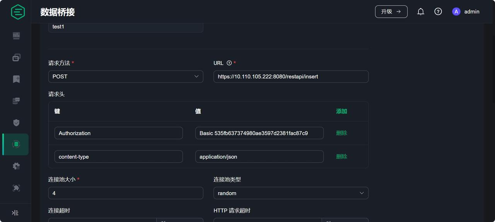
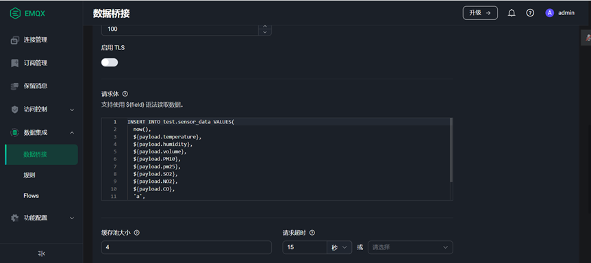
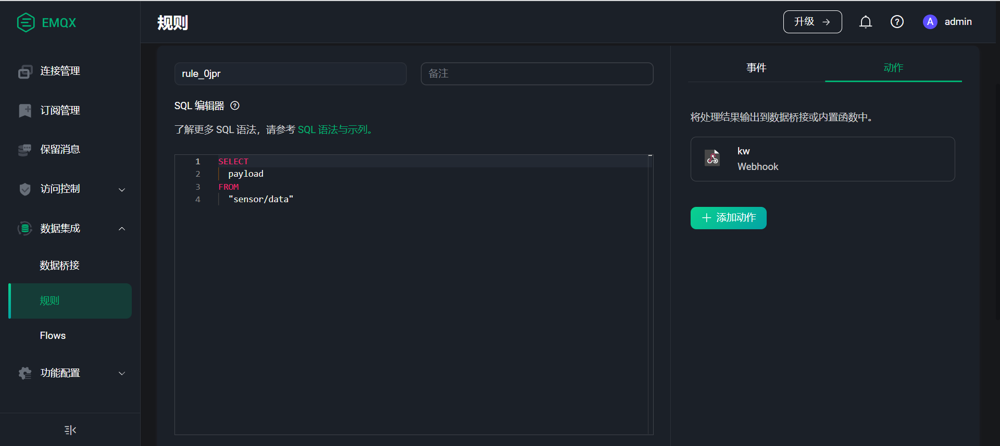
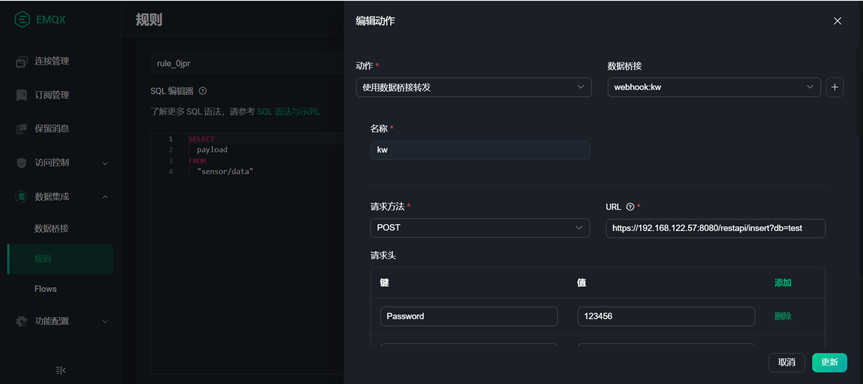

# EMQX 读写数据

[EMQX](https://www.emqx.io/) 是一款开源的高可用分布式 MQTT 消息服务器。KWDB 支持通过 RESTful API 将 EMQX 管理的数据同步写入到 KWDB 数据库。KWDB RESTful API 提供了 Insert 接口，该接口通过发送包含 INSERT 语句的 HTTP 请求，将来自 EMQX 的数据插入 KWDB 数据库的表中。有关 Insert API 接口的请求信息，参见 [Insert 接口](../connect-kaiwudb/connect-restful-api.md#insert-接口)。

用户需要基于 Insert 接口请求信息，在 EMQX Dashboard 配置面向 KWDB 的连接和请求信息，以便 EMQX 在收到数据时，将数据同步写入到 KWDB 数据库。

## 配置 EMQX

### 前提条件

- 安装 KWDB 数据库，创建数据库以及具有表级别及以上操作权限的用户。
- 在 KWDB 数据库创建需要插入数据的目标表，且发送 API 请求的用户拥有目标表的 INSERT 权限。
- 获取用户登录所需的令牌。
    ::: warning 说明
    默认情况下，系统生成的令牌有效期为 `60` 分钟。如果两次数据上报的间隔超过 `60` 分钟，用户需要在令牌过期前生成新的令牌，或者根据业务需求通过 `SET CLUSTER SETTING server.rest.timeout=<value>` SQL 语句设置令牌的有效期。可配置范围为 `[1, 2^63-1]`，单位为分钟。如果数据上报间隔总是小于 `60` 分钟，系统会自动对令牌进行延期。
    :::
    ```shell
    curl -L -k -H "Username:<user_name>" -H "Password:<password>" -X GET <node_ip>:8080/restapi/login
    ```
- 安装并启动 EMQX。具体安装和启动步骤，参见 [EMQX 官方文档](https://www.emqx.io/)。

### 配置步骤

本章及以 EMQX5.0.19 版本为例，介绍如何在 EMQX Dashboard 配置连接和请求信息。不同版本的界面、配置方式和功能可能有所不同。

1. 登录 EMQX Dashboard。默认端口为 `18083`，默认用户名和密码为 `admin` 和 `public`。
2. 在左侧导航栏，单击**数据集成** > **数据桥接**，然后单击**创建**，创建 Webhook 数据桥接类型。
3. 在**数据桥接**页面，配置请求方法、URL、用户令牌等信息。

    

4. 在**数据桥接**页面的请求体对话框中，输入 SQL 语句。

    

5. 在左侧导航栏，单击**数据集成** > **数据桥接**，然后单击**新建**。

6. 在**创建规则**页面，输入 SQL 语句，然后单击**添加动作**。

    

7. 在**添加动作**页面，选择 `使用数据桥接转发` 和并选择已创建的数据桥接。

    

有关 EMQX 规则和资源的更多详细信息，参见 [EMQX 官方文档](https://www.emqx.io/docs/en/v4.4/rule/rule-engine.html#publish-message)。
