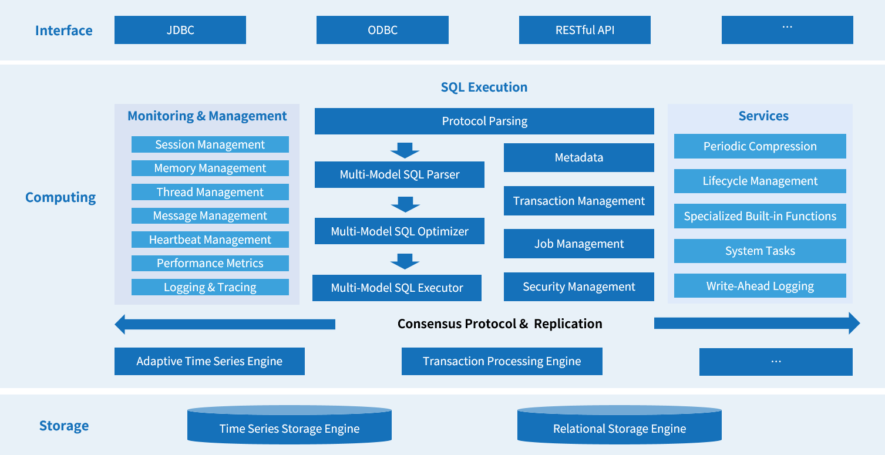

# Product Architecture

KWDB takes a different approach from traditional databases by offering multi-model data management, allowing you to store various types of data in a single, unified system. This flexibility enables businesses to seamlessly integrate and manage data from different departments and applications, making it possible to support a wide range of services under one roof.

The architecture of KWDB is illustrated below:

- **Data Storage**: KWDB uses a hybrid storage system that combines the best of row and column storage, working with both SSDs and HDDs to give you flexibility in how your data is stored.

- **Data Replication**: KWDB is built on a Shared-Nothing architecture, meaning each node operates independently. Using the Raft consensus protocol, we ensure your data is replicated across multiple nodes, keeping it safe and accessible even in the event of a failure.

- **Computation and Execution**: KWDB intelligently handles your data by automatically selecting the best way to store and process different data models while providing you with a simple, unified interface. Here’s what’s under the hood:
  
  - **Adaptive Time-Series Engine**: This purpose-built engine is optimized for time-series data, supporting complex queries and multi-dimensional aggregation. KWDB provides 5-30x compression capability, and compressed data can be used directly without decompression.
  
  - **Transaction Processing Engine**: Our robust engine manages distributed transactions with Multi-Version Concurrency Control (MVCC), while providing all the essential database features including comments, views, constraints, indexes, and sequences.

- **System Management**: KWDB provides comprehensive management capabilities, incorporating essential features such as connection management, authentication, access control, and resource management - all designed for both power and usability.

- **Ecosystem Tools and Compatibility**: KWDB comes with visual tools to help you manage and monitor your databases. Additionally, it works seamlessly with industry-standard tools such as [EMQX](https://www.emqx.io/), [Kafka](https://kafka.apache.org/), and [Telegraf](https://github.com/influxdata/telegraf).