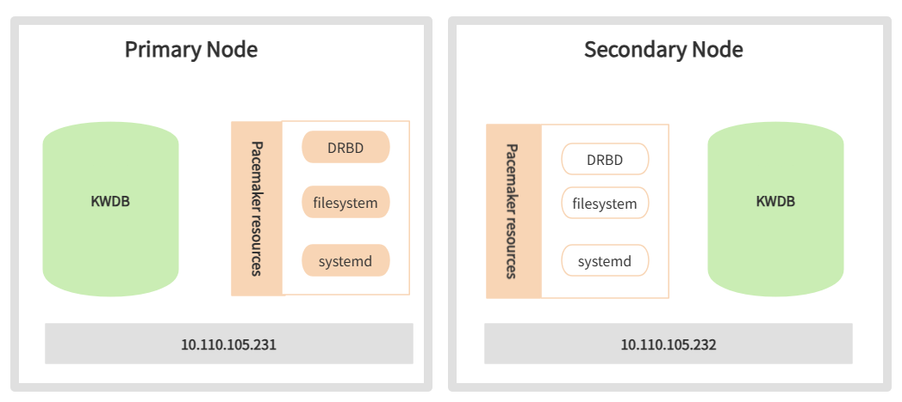

# DRBD-based High Availability Solution

IoT business scenarios require extremely high database availability. When hardware failures occur or scheduled maintenance is needed, the system must quickly switch to a backup machine to ensure continuous business operations—continuously receiving data from devices and monitoring their operating status. A robust high availability solution is essential to meet these business continuity requirements.

When evaluating business continuity capabilities, two critical metrics must be considered:

- **RTO (Recovery Time Objective):** The time required for the system to resume providing services after a planned or unplanned downtime event. For example, RTO=0 means zero business interruption during a downtime event, while RTO=1 minute means the system can resume operations within 1 minute.
- **RPO (Recovery Point Objective):** The amount of data potentially lost during downtime, typically measured in seconds. For example, RPO=0 means no data loss, while RPO=1 second means users may lose at most the last second of data before shutdown.

Ideally, systems should achieve RTO=0 and RPO=0, meaning business operations continue without interruption or data loss under any circumstances. However, this requires careful consideration of hardware redundancy, additional software components, and increased resource usage during system design.

A more realistic approach is to align your high availability solution with actual business needs by setting reasonable RTO and RPO targets. KWDB recommends establishing separate targets for planned and unplanned scenarios. Since responding to unplanned downtime is more costly—though far less frequent than planned maintenance—you can set stricter RTO and RPO metrics for planned downtime while allowing more flexibility for unplanned events.

High availability solutions typically comprise several key technical components: system monitoring and health checks, cluster high availability strategy management, cluster resource orchestration, automation script execution, and data replication. Among these, data replication is the most fundamental component. For KWDB, minimizing data loss through robust replication technology is the primary objective.

KWDB cluster deployments provide built-in high availability with automatic failover and strong data consistency. For more information, see [Multi-Replica Cluster High Availability](../db-operation/cluster-ha.md#multi-replica-cluster-high-availability).

For single-node deployments, KWDB leverages DRBD (Distributed Replicated Block Device), an open-source solution that handles data replication between primary and secondary nodes. System monitoring and health checks are managed by Pacemaker, one of the most successful open-source high availability projects in the Linux-HA ecosystem. Pacemaker uses heartbeat services and cluster communication to build high availability clusters that continuously monitor resource status and orchestrate instance migration and failover operations.

## Solution Architecture

The architecture of the DRBD-based high availability solution is shown below:



Key technical considerations:

- Each primary and secondary node uses a block device of equal capacity for DRBD replication.
- Primary and secondary nodes must share identical deployment configurations, including the same user data directory specified by `data_root` in the `deploy.cfg` file.
- The DRBD device is mounted to the user data directory, with data replicated synchronously through DRBD.
- CA certificates and other files outside the user data directory must be manually copied from the primary to the secondary node (not required for in-secure deployments).
- KWDB startup and shutdown are managed through `systemd` services.
- Pacemaker manages DRBD devices, file systems, and `systemd` services as cluster resources, monitoring their status and controlling operations.

## Technology Introduction

Distributed Replicated Block Device (DRBD) is a software-based, shared-nothing replication storage solution that mirrors block devices (hard disks, partitions, logical volumes, etc.) between hosts.

DRBD has the following characteristics:

- **Real-time replication**: Data is replicated continuously as applications modify it.
- **Transparent operation**: Applications don't need to know that data is stored across multiple hosts.
- **Flexible replication modes**: DRBD supports both synchronous and asynchronous replication. In synchronous mode, applications receive write completion notifications only after all connected hosts complete the write. In asynchronous mode, applications receive notifications when local writes complete (typically before data is transmitted to other nodes).


KWDB's primary-secondary high availability solution prioritizes rapid failover within a data center over remote disaster recovery. Therefore, we recommend synchronous replication protocols to maintain data consistency across nodes.

## Deployment Preparation

### Environment Requirements

In addition to meeting the standard KWDB environment requirements for [bare-metal installation](../quickstart/install-kaiwudb/quickstart-bare-metal.md) or [container installation](../quickstart/install-kaiwudb/quickstart-docker.md), the DRBD-based high availability solution requires:

- Network: Gigabit or 10-Gigabit Ethernet
- DRBD: version 9.11.0
- Pacemaker: version 2.0.3

### Configure IP Addresses and Hostnames

Steps:

1. Configure the IP addresses and hostnames of the primary and secondary nodes in the `/etc/hosts` file on each node.

   Example:

   ```shell
   your-master-host-ip   ha-node01
   your-backup-host-ip   ha-node02
   ```

### Configure Passwordless SSH Login

Steps:

1. Log in to the primary node and generate a public-private key pair:

    ```shell
    ssh-keygen -f ~/.ssh/id_rsa -N ""
    ```

    Parameters:

    - `-f`: The key pair filename.
    - `-N`: The key password. Set to empty for passwordless login.

2. Distribute the public key to the secondary node:

   ```shell
   ssh-copy-id -f -i ~/.ssh/id_rsa.pub -o StrictHostKeyChecking=no <secondary_node> 
   ```

3. Verify passwordless login from the primary node to the secondary node:

   ```shell
   ssh <secondary_node>
   ```

4. Log in to the secondary node and configure passwordless SSH login to the primary node using the same method.

### Disable Related Services

Steps:

1. Check the `/bin/sh` file:

   ```shell
   ls -al /bin/sh
   ```

2. Reconfigure the `dash` shell on both nodes, selecting `no`:

   ```shell
   sudo dpkg-reconfigure dash
   ```

3. Stop and disable the `multipathd.socket`, `multipath-tools`, and `multipath` services on both nodes:

   ```shell
   systemctl stop multipathd.socket
   systemctl disable multipathd.socket
   systemctl stop multipath-tools.service
   systemctl disable multipath-tools.service
   systemctl stop multipath
   systemctl disable multipath
   ```

## Deployment

This section uses Ubuntu 20.04, DRBD 9.11.0, Pacemaker 2.0.3, and pcs 0.10.4 to demonstrate the deployment process.

Command formats may vary when using different versions of Linux, DRBD, or Pacemaker.

### Set Up the Pacemaker Cluster

Prerequisites:

- Both nodes are in the same subnet, and an unassigned IP address is available for the virtual IP (VIP).
- Both nodes have NTP time synchronization configured. **Tip:** Use the chrony package for NTP setup.
- Passwordless SSH authentication is set up between the nodes.

Steps:

1. Install Pacemaker, corosync, and pcs packages on both nodes. The installation automatically creates the `hacluster` user.

   ```shell
   apt install pacemaker corosync pcs
   ```

2. Set up user authorization:

   1. Set a password for the `hacluster` user on both nodes:

         ```shell
         passwd hacluster 
         ```

   2. On any node, remove the default cluster created during installation:

         ```shell
         pcs cluster destroy 
         ```

   3. On any node, authorize cluster management and enter password when prompted:

         ```shell
         pcs host auth <primary_node> <secondary_node> -u hacluster 
         ```

         Example:

         ```shell
         pcs host auth ha-node01 ha-node02 -u hacluster 
         ```

3. On any node, create and start the cluster:

   ```shell
   pcs cluster setup <cluster_name> <primary_node> <secondary_node> --start --enable --force
   ```

   Parameters:

   - `cluster_name`: Cluster name.
   - `primary_node`: Hostname of the primary node.
   - `secondary_node`: Hostname of the secondary node.
   - `--start`: Start the cluster immediately.
   - `--enable`: Enable automatic startup on boot.
   - `--force`: Remove previous cluster configurations.

    Example output:

   ```shell
   root@ha-node01:~# pcs cluster setup ha-cluster ha-node01 ha-node02 --start --enable --force
   No addresses specified for host 'ha-node01', using 'ha-node01'
   No addresses specified for host 'ha-node02', using 'ha-node02'
   Destroying cluster on hosts: 'ha-node01','ha-node02'...
   ha-node01: Successfully destroyed cluster
   ha-node02: Successfully destroyed cluster
   Requesting remove 'pcsd settings' from 'ha-node01','ha-node02'
   ha-node01: successful removal of the file 'pcsd settings'
   ha-node02: successful removal of the file 'pcsd settings'
   Sending 'corosync authkey', 'pacemaker authkey' to 'ha-node01','ha-node02'
   ha-node01: successful distribution of the file 'corosync authkey'
   ha-node01: successful distribution of the file 'pacemaker authkey'
   ha-node02: successful distribution of the file 'corosync authkey'
   ha-node02: successful distribution of the file 'pacemaker authkey'
   Sending 'corosync.conf' to 'ha-node01','ha-node02'
   ha-node01: successful distribution of the file 'corosync.conf'
   ha-node02: successful distribution of the file 'corosync.conf'
   Cluster has been successfully set up.
   Enabling cluster on hosts:'ha-node01','ha-node02'...
   ha-node01: Cluster enabled
   ha-node02: Cluster enabled
   Starting cluster on hosts: 'ha-node01','ha-node02'...
   ```

4. On any node, disable STONITH and configure quorum policy for two-node operation:

   ```shell
   pcs property set stonith-enabled=false
   pcs property set no-quorum-policy=ignore
   ```

5. On any node, verify cluster status:

   ```shell
   pcs status
   ```

   Example output:

   ```shell
   root@ha-node01:~# pcs status
   Cluster name: ha-cluster
   Cluster Summary:
      * Stack: corosync
      * Current DC: ha-node01 (version 2.0.4-4b1f869f0f) - partition with quorum
      * Last updated: Tue Sep 26 03:49:28 2023
      * Last change: Tue Sep 26 03:48:20 2023 by root via cibadmin on ha-node01
      * 2 nodes configured
      * 0 resource instances configured
      
   Node List:
      * Online: [ ha-node01 ha-node02 ]
      
   Full List of Resources:
      * No resources
      
   Daemon Status:
      corosync: active/enabled
      pacemaker: active/enabled
      pcsd: active/enabled
   ```

6. On any node, create the virtual IP resource (ClusterIP):

   ```shell
   pcs resource create ClusterIP ocf:heartbeat:IPaddr2 ip=<virtual_ip_address> cidr_netmask=24 op monitor interval=30s
   ```

   Parameters:

   - `virtual_ip_address`: The virtual IP address to use.

7. (Optional) Verify the resource was created successfully:

      ```shell
      pcs resource
      ```

      Example output:

      ```shell
      root@ha-node01:/etc# pcs resource
      ClusterIP      (ocf::heartbeat:IPaddr2):       Started ha-node01
      ```

8. (Optional) Use `arp -vn` to verify the virtual IP's MAC address matches the primary node's network interface.

9. On any node, test resource migration by simulating a failover. Pacemaker will automatically migrate ClusterIP to the secondary node.

      1. Put the primary node in standby:

         ```shell
         pcs node standby <primary_node>
         ```

      2. After migration completes, restore the primary node:

         ```shell
         pcs node unstandby <primary_node>
         ```

10. (Optional) Verify resource migration:

      ```shell
      pcs resource
      ```

     Example output:

      ```shell
      root@ha-node02:~# pcs resource
      ClusterIP      (ocf::heartbeat:IPaddr2):       Started ha-node02
      ```

### Establish DRBD Replication

Prerequisites:

- Block devices of equal capacity (hard disks, partitions, or logical volumes) are prepared on both nodes.
- If using disks or disk partitions (e.g., `/dev/sdd`), obtain the stable identifier from `/dev/disk/by-id/` using the `udevadm info` command, as disk names may change after system restarts.

   ```shell
   udevadm info /dev/sdd
   ...
   E: DEVLINKS= .../dev/disk/by-id/scsi-36f80f41ffaf5a00028e0acde21f326ff
   E: TAGS=:systemd:
   ```

Steps:

1. Install DRBD software on both nodes:

   ::: warning Note
   When prompted, select "No configuration" for the configuration type.
   :::

   ```shell
   apt install drbd-utils 
   ```

2. Configure DRBD parameters on both nodes:

   1. Navigate to the DRBD configuration directory:

      ```shell
      cd /etc/drbd.d
      ```

   2. Edit the `global_common.conf` file to define DRBD's global and default parameters.

      Example:

      ```shell
      # DRBD is the result of over a decade of development by LINBIT.
      # In case you need professional services for DRBD or have
      # feature requests visit http://www.linbit.com
       
      global {
              usage-count no;
              # minor-count dialog-refresh disable-ip-verification
              # cmd-timeout-short 5; cmd-timeout-medium 121; cmd-timeout-long 600;
      }
       
      common {
              protocol C;
       
              handlers {
                      # These are EXAMPLE handlers only.
                      # They may have severe implications,
                      # like hard resetting the node under certain circumstances.
                      # Be careful when choosing your poison.
       
                      # pri-on-incon-degr "/usr/lib/drbd/notify-pri-on-incon-degr.sh; /usr/lib/drbd/notify-emergency-reboot.sh; echo b > /proc/sysrq-trigger ; reboot -f";
                      # pri-lost-after-sb "/usr/lib/drbd/notify-pri-lost-after-sb.sh; /usr/lib/drbd/notify-emergency-reboot.sh; echo b > /proc/sysrq-trigger ; reboot -f";
                      # local-io-error "/usr/lib/drbd/notify-io-error.sh; /usr/lib/drbd/notify-emergency-shutdown.sh; echo o > /proc/sysrq-trigger ; halt -f";
                      # fence-peer "/usr/lib/drbd/crm-fence-peer.sh";
                      # split-brain "/usr/lib/drbd/notify-split-brain.sh root";
                      # out-of-sync "/usr/lib/drbd/notify-out-of-sync.sh root";
                      # before-resync-target "/usr/lib/drbd/snapshot-resync-target-lvm.sh -p 15 -- -c 16k";
                      # after-resync-target /usr/lib/drbd/unsnapshot-resync-target-lvm.sh;
              }
       
              startup {
                      # wfc-timeout degr-wfc-timeout outdated-wfc-timeout wait-after-sb
              }
       
              options {
                      # cpu-mask on-no-data-accessible
              }
       
              disk {
                      # size on-io-error fencing disk-barrier disk-flushes
                      # disk-drain md-flushes resync-rate resync-after al-extents
                      # c-plan-ahead c-delay-target c-fill-target c-max-rate
                      # c-min-rate disk-timeout
                      on-io-error detach;
                      no-disk-flushes;
                      no-md-flushes;
              }
       
              net {
                      # protocol timeout max-epoch-size max-buffers
                      # connect-int ping-int sndbuf-size rcvbuf-size ko-count
                      # allow-two-primaries cram-hmac-alg shared-secret after-sb-0pri
                      # after-sb-1pri after-sb-2pri always-asbp rr-conflict
                      # ping-timeout data-integrity-alg tcp-cork on-congestion
                      # congestion-fill congestion-extents csums-alg verify-alg
                      # use-rle
                      sndbuf-size 512k;
                      max-buffers 8000;
                      max-epoch-size 8000;
                      unplug-watermark 1024;
                      cram-hmac-alg "sha1";
                      shared-secret "justaverificationtest";
                      #after-sb-0pri disconnect;
                      #after-sb-1pri disconnect;
                      #after-sb-2pri disconnect;
                      after-sb-0pri discard-zero-changes;
                      after-sb-1pri discard-secondary;
                      after-sb-2pri disconnect;
                      rr-conflict   disconnect;  
              }
       
              syncer {
                      rate 330M;
                      al-extents 517;
                      verify-alg crc32c;
              }
      }
      ```

   3. Create a resource configuration file (e.g., `drbd3.res`) to define the replicated block device:

      Example:

      ```shell
      resource drbd3 {     ## Must match the filename
              on ha-node01 {     ## Primary node hostname
              device /dev/drbd3;    ## Custom device name
              disk /dev/sde;     ## Disk identifier for synchronization
              address your-primary-host-ip:port;    ## Primary node IP address
              meta-disk internal;
              }
              on ha-node02 {    ## Secondary node hostname
              device /dev/drbd3;    ## Custom device name
              disk /dev/sde;      ## Disk identifier for synchronization
              address your-secondary-host-ip:port;    ## Secondary node IP address
              meta-disk internal;
              }
      }
      ```

3. Initialize metadata on both nodes:

   Example:

   ```shell
   drbdadm create-md drbd3
   drbdadm adjust all
   ```

4. On the primary node, start initial replication. This initiates data synchronization, which may take considerable time depending on storage size.

   ::: warning Warning
   This command overwrites all data on the secondary node. Only execute during initial setup.
   ：：：

   ```shell
   drbdadm -- --overwrite-data-of-peer primary drbd3
   ```

5. (Optional) Monitor replication progress.

   Example:

   ```shell
   drbdadm status drbd3
   ```

   Example output during replication:

   ```shell
   root@ha-node01:/etc/drbd.d# drbdadm status drbd3
   drbd3 role:Secondary
      disk:Inconsistent
      peer role:Primary
   replication:SyncTarget peer-disk:UpToDate done:24.90
   
   root@ha-node02:/etc/drbd.d# drbdadm status drbd3
   drbd3 role:Primary
      disk:UpToDate
      peer role:Secondary congested:yes
   replication:SyncSource peer-disk:Inconsistent done:25.28
   ```

   Example output when complete:

   ```shell
   root@ha-node01:/etc/drbd.d# drbdadm status drbd3
   drbd3 role:Secondary
      disk:UpToDate
      peer role:Primary
   replication:Established peer-disk:UpToDate
   
   root@ha-node02:/etc/drbd.d# drbdadm status drbd3
   drbd3 role:Primary
      disk:UpToDate
      peer role:Secondary
   replication:Established peer-disk:UpToDate
   ```

6. After replication completes, create a file system on the primary node's block device. Once created, you can mount and use the file system.

   Example:

   ```shell
   mkfs.ext4 /dev/drbd3
   ```

### Deploy the High Availability Environment

1. Create the database directory on both nodes.

   Example:

   ```shell
   mkdir -p /var/lib/kaiwudb
   ```

2. Mount the file system on the active resource node.

   Example:

   ```shell
   mount /dev/drbd3 /var/lib/kaiwudb
   ```

3. On any node, create DRBD resources in the Pacemaker cluster for unified management.

   Example:

   ```shell
   pcs resource create KaiwuData ocf:linbit:drbd drbd_resource="drbd3" op monitor interval=10s #Create resource named KaiwuData, specify DRBD resource name as drbd3, monitor every 10 seconds
   pcs resource promotable KaiwuData promoted-max=1 promoted-node-max=1 clone-max=2 clone-node-max=1 notify=true #Enable resource mobility, specify promotable and cloneable node counts
   pcs resource refresh KaiwuData #Refresh resource status
   ```

4. On any node, verify DRBD resource status in the Pacemaker cluster.

   ::: warning Note
   If the resource status appears incorrect, check DRBD status using `drbdadm status`. If issues persist, restart the DRBD service with `systemctl restart drbd`.
   :::

   Example output:

   ```shell
   pcs resource
   * Clone Set: KaiwuData-clone [KaiwuData] (promotable):
   * Promoted: [ ha-node02 ]
   * Stopped: [ ha-node01 ] 
   ```

5. On any node, define the Filesystem resource and its dependencies. Pacemaker will manage mount operations during failover.

   Example:

   ```shell
   pcs resource create KaiwuFS ocf:heartbeat:Filesystem device="/dev/drbd3" directory="/var/lib/kaiwudb" fstype="ext4" # Create filesystem resource named KaiwuFS
   pcs constraint colocation add KaiwuFS with KaiwuData-clone INFINITY with-rsc-role=Master # Add colocation constraint
   pcs constraint order promote KaiwuData-clone then start KaiwuFS # Add startup order constraint
   ```

6. Install KWDB on the secondary node:

   1. Verify the secondary node is currently active for DRBD and Filesystem resources. If the primary node is active, migrate resources first:

      1. Put the primary node in standby:

         ```shell
         pcs node standby <primary_node>
         ```

      2. After migration completes, restore the primary node:

         ```shell
         pcs node unstandby <primary_node>
         ```

   2. Deploy KWDB. For detailed instructions, see [Single-node Bare Metal Deployment](../quickstart/install-kaiwudb/quickstart-bare-metal.md) or [Single-node Container Deployment](../quickstart/install-kaiwudb/quickstart-docker.md).

      ::: warning Warning

      - Set the `data_root` parameter in the `deploy.cfg` file to match the KaiwuFS filesystem directory.
      - After installation, delete all files in `data_root`—they'll be replicated from the primary node via DRBD.

      :::

7. Install KWDB on the primary node:

   1. Ensure the primary node is active for DRBD and Filesystem resources.

   2. Deploy KWDB using the same instructions as Step 6.

   3. Configure the certificate to allow access from the secondary node IP and VIP. 

      ::: warning Note
      Skip this step if using in-secure deployment.
      :::

      1. Delete the existing `node.crt` and `node.key` files in the `/etc/kaiwudb/certs` directory.

      2. Generate a new certificate that includes the secondary node and virtual IP addresses:

         ```shell
         kwbase cert create-node <primary_node_ip> <secondary_node_ip> <virtual_ip> 127.0.0.1 0.0.0.0 localhost --certs-dir=/etc/kaiwudb/certs --ca-key=ca.key
         ```

      3. Copy certificates to the secondary node:

         ```shell
         scp /etc/kaiwudb/certs/* ha-node02:/etc/kaiwudb/certs/
         ```

8. On any node, define the KWDB database resource and its dependencies in Pacemaker:

      Example:

      ```shell
      pcs resource create KaiwuDB systemd:kaiwudb.service op monitor on-fail=restart #Create new resource
      pcs resource defaults migration-threshold=2 #Set resource defaults
      pcs resource meta KaiwuDB failure-timeout=10s #Set resource metadata
      pcs constraint colocation add KaiwuDB with KaiwuFS INFINITY #Set colocation constraint
      pcs constraint order start KaiwuFS then start KaiwuDB #Set startup order constraint
      pcs resource group add KaiwuDBGrp KaiwuFS KaiwuDB #Create resource group for unified management
      ```

9. On any node, link the virtual IP to the database resource:

      Example:

      ```shell
      pcs constraint colocation add ClusterIP with KaiwuDB INFINITY 
      ```

10. On any node, verify the cluster setup.

     1. Check cluster status using `pcs status`:

         Example output:

         ```shell
         root@ha-node01: ~# pcs status
         Cluster name: ha-cluster
         Cluster Summary:
         * Stack: corosync
         * Current DC: ha-node01 (version 2.0.3-4b1f869fof) - partition with quorum
         * Last updated: Mon Jul 1 16:15:01 2024
         * Last change: Mon Jul 1 10:58:57 2024 by root via cibadmin on ha-node02
         * 2 nodes configured
         * 5 resource instances configured
         
         Node List:
         * Online: [ ha-node01 ha-node02 ]

         Full List of Resources:
         * ClusterIP (ocf::heartbeat:IPaddr2):   Started ha-node01 
         * Clone Set: KaiwuData-clone [KaiwuData] (promotable):
         * Masters: [ ha-node01 ]
         * Slaves: [ ha-node02 ]
         * Resource Group: KaiwuDBGrp:
         * KaiwuFS (ocf::heartbeat:Filesystem): Started ha-node01
         * KaiwuDB (systemd:kaiwudb.service):  Started ha-node01

         Daemon Status:
         corosync: active/enabled
         pacemaker: active/enabled
         pcsd: active/enabled
         ```

     2. Verify resource dependencies using `pcs constraint`. For more Pacemaker commands, see the [Pacemaker Documentation](https://clusterlabs.org/pacemaker/doc/).

## Solution Verification

Steps:

1. Connect to KWDB. For instructions, see [Connect to KWDB](../quickstart/overview.md).

2. Test basic database operations: create, read, update, and delete.

3. Simulate a failover by putting the primary node in standby:

   ```shell
   pcs node standby <primary_node>
   ```

4. Wait about 40 seconds, then check cluster status:

   Example output:

   ```shell
   root@ha-node01: ~# pcs status
   Cluster name: ha-cluster
   Cluster Summary:
   * Stack: corosync
   * Current DC: ha-node01 (version 2.0.3-4b1f869fof) - partition with quorum
   * Last updated: Mon Jul 1 16:15:01 2024
   * Last change: Mon Jul 1 10:58:57 2024 by root via cibadmin on ha-node02
   * 2 nodes configured
   * 5 resource instances configured

   Node List:
   * Online: [ ha-node02 ]

   Full List of Resources:
   * ClusterIP (ocf::heartbeat:IPaddr2):   Started ha-node02
   * Clone Set: KaiwuData-clone [KaiwuData] (promotable):
   * Masters: [ ha-node02 ]
   * Stopped: [ ha-node01 ]
   * Resource Group: KaiwuDBGrp:
   * KaiwuFS (ocf::heartbeat:Filesystem): Started ha-node02
   * KaiwuDB (systemd:kaiwudb.service):  Started ha-node02

   Daemon Status:
   corosync: active/enabled
   pacemaker: active/enabled
   pcsd: active/enabled
   ```

5. Bring the primary node back online:

   Example:

   ```shell
   pcs node unstandby ha-node01
   ```

6. (Optional) Check cluster status again:

   Example output:

   ```shell
   root@ha-node01: ~# pcs status
   Cluster name: ha-cluster
   Cluster Summary:
   * Stack: corosync
   * Current DC: ha-node01 (version 2.0.3-4b1f869fof) - partition with quorum
   * Last updated: Mon Jul 1 16:15:01 2024
   * Last change: Mon Jul 1 10:58:57 2024 by root via cibadmin on ha-node02
   * 2 nodes configured
   * 5 resource instances configured
   
   Node List:
   * Online: [ ha-node01 ha-node02 ]

   Full List of Resources:
   * ClusterIP (ocf::heartbeat:IPaddr2):   Started ha-node02
   * Clone Set: KaiwuData-clone [KaiwuData] (promotable):
   * Masters: [ ha-node02 ]
   * Slaves: [ ha-node01 ]
   * Resource Group: KaiwuDBGrp:
   * KaiwuFS (ocf::heartbeat:Filesystem): Started ha-node02
   * KaiwuDB (systemd:kaiwudb.service):  Started ha-node02

   Daemon Status:
   corosync: active/enabled
   pacemaker: active/enabled
   pcsd: active/enabled
   ```

7. Connect to the database via the secondary node.

8. Run database operations and verify no data loss occurred during failover.

9. Switch back to the primary node and verify all data is intact.

## Appendix

### Common Pacemaker Commands

- **Cluster management**

  - Create cluster:

       ```shell
       pcs cluster setup <cluster_id> ...
       ```

  - Destroy cluster:

       ```shell
       pcs cluster destroy <cluster_id>
       ```

- **Node management:**

  - Put node in standby:

       ```shell
       pcs node standby <node_id>
       ```

  - Bring node online:

       ```shell
       pcs node unstandby <node_id>
       ```

- **Resource management**

  - Create resource:

       ```shell
       pcs resource create <resource_id> ...
       ```

  - Remove resource:

       ```shell
       pcs resource remove <resource_id>
       ```

- **Constraint management**

  - Configure resource dependencies:

       ```shell
       pcs constraint colocation ...
       ```

### Common DRBD Commands

- **Using drbdadm**

  - Initialize replication (overwrites all data on secondary node):

       ```shell
       drbdadm -- --overwrite-data-of-peer primary <resource_id>
       ```

  - Check DRBD status:

       ```shell
       drbdadm status <resource_id>
       ```

- **Monitor with drbdmon**

   ```shell
   drbdmon
   ```
