# Basic Concepts

## General Database Concepts

### Database

The concept of a database can be understood in both narrow and broad senses.

In the **narrow sense**, a database refers to a large-capacity electronic filing system that organizes, stores, and manages data according to a specific logical structure. A database can contain multiple tables, each storing specific types of data, such as text, numbers, images, and more. Users can write, query, update, or delete data within tables according to their needs.

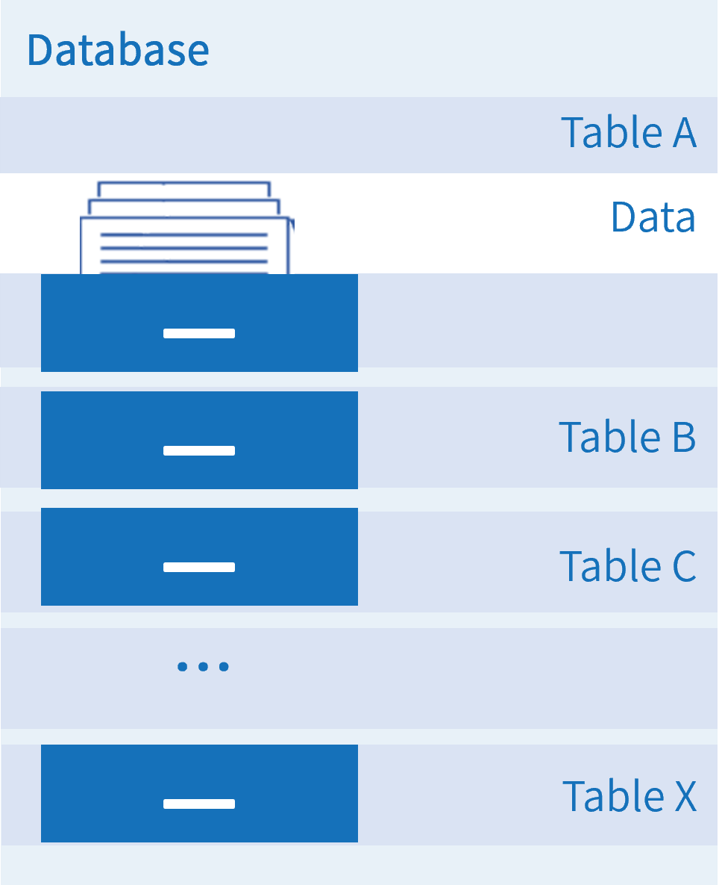

In the **broad sense**, a database typically refers to a database system, which includes both the database itself and the database management system. In this layered architecture, the database management system sits at the upper level and provides services to applications, while the database sits at the lower level and interfaces with underlying data sources (such as text, numbers, and images) by utilizing fundamental resources including computing power, network connectivity, and storage.

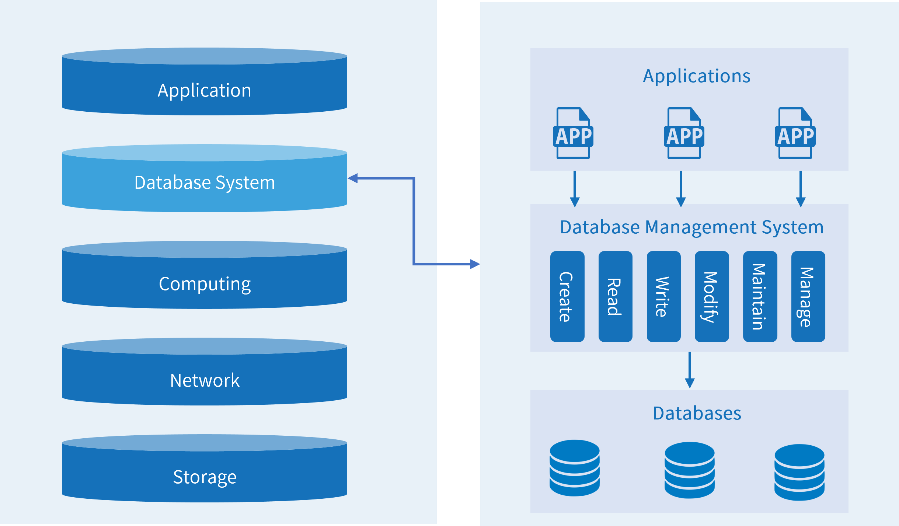

**Database Management System**: A comprehensive software system used to create, manage, and maintain databases. A database management system consists of core kernel components and driver components, where the kernel includes management, storage, computing, and network components.

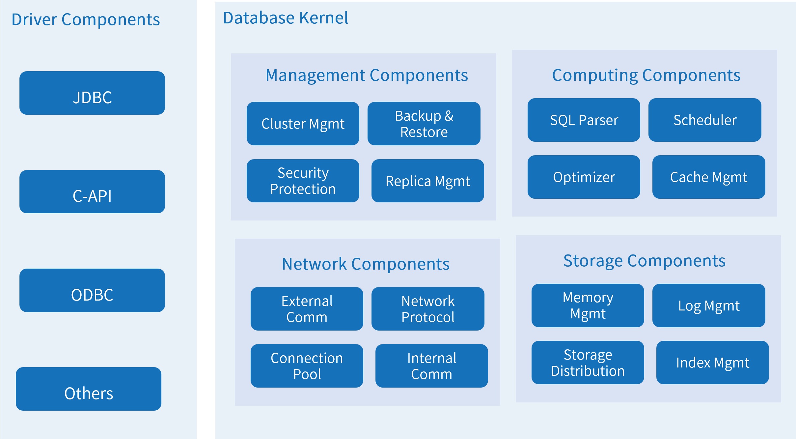

### Database Types

Databases can be classified in different ways. Common classification criteria include data models, architecture, and deployment models. A single database may belong to different categories depending on the classification criteria used.

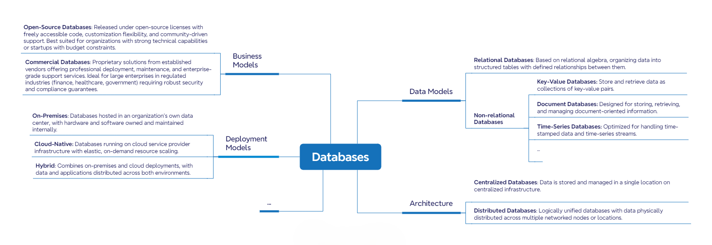

### Database Users

Anyone who accesses a database through an application is a database user. Database users can be categorized based on how they interact with the database.

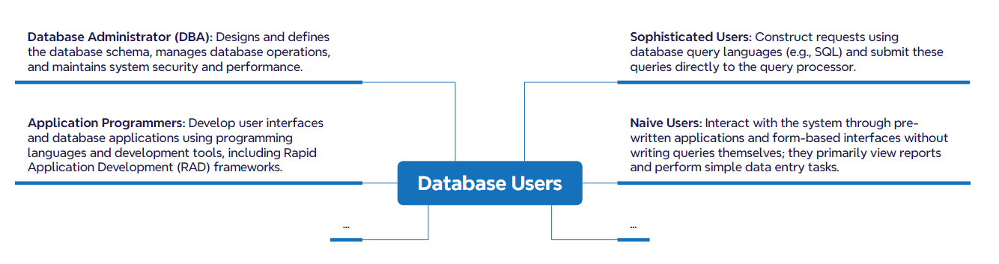

### Database Instance

A database instance refers to the in-memory processes and background threads of a running database that manage connections and execute database operations. Users access and use the database by connecting to an instance. After the database starts, data files are attached to the instance to perform data access and management operations.

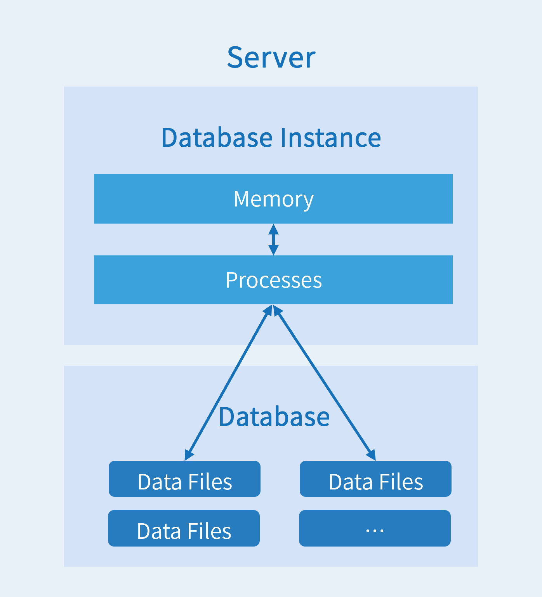

### Database Objects

Database objects are the collective term for various entities and structures within a database used to store and reference data.
The following table lists common database objects and their functions:

| Object Name                     | Function  |
| -------------------------- | ------------------------------------------------------------------------------------------- |
| TABLE                      | The basic structure used to store data.                                                                                                                                                 |
| VIEW                       | Presents table data from different perspectives; it is a logical virtual table and does not store data itself.                                                                     |
| INDEX                      | Contains pointers to data values in specified table columns, functioning like a book's table of contents to accelerate queries.                            |
| SEQUENCE                   | Generates unique integers.                                                                                                                                   |
| STORED PROCEDURE, FUNCTION | A set of SQL statements designed to accomplish specific functions. Once compiled, stored procedures and functions can be called repeatedly, reducing development workload. |

### SQL

SQL (Structured Query Language) is a standardized programming language for managing and manipulating databases. SQL statements are categorized by their function and purpose:

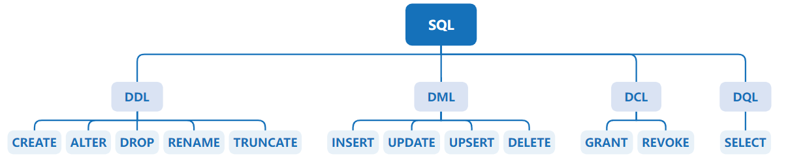

- **Data Definition Language (DDL)**: Used to define or modify table structures, data types, table relationships, constraints, and other initialization tasks, typically used when creating tables. Common statement keywords include:
  - CREATE: Creates database objects.
  - ALTER: Modifies existing database objects.
  - DROP: Deletes existing database objects.
  - RENAME: Renames existing database objects.
  - TRUNCATE: Clears data from existing database objects.

- **Data Manipulation Language (DML)**: Used to add, delete, and update database records, and to verify data integrity. Common statement keywords include:
  - INSERT: Inserts data into a table.
  - UPDATE: Updates existing data in a table.
  - UPSERT: Updates or inserts data in a table.
  - DELETE: Deletes data from a table.

- **Data Control Language (DCL)**: Used to grant or revoke database access privileges. Common statement keywords include:
  - GRANT: Grants specified privileges.
  - REVOKE: Revokes specified privileges.

- **Data Query Language (DQL)**: Used to query database records; can also be classified as DML. Common statement keywords include:
  - SELECT: Retrieves data from the database.

## KWDB Basic Concepts

### KWDB Multi-Model Database

KWDB is a multi-model database that integrates two core engines: an adaptive time-series engine and a transaction processing engine. It supports creating both time-series databases and relational databases simultaneously within the same instance, enabling integrated processing of multi-model data.

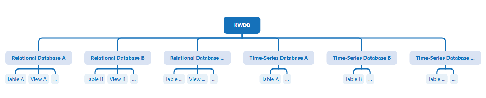

### Relational Database

- **Relational Database**: A database object used to store and manage relational data. One or more relational databases can be created within the same database instance. Each relational database includes objects such as relational tables, views, and indexes.

- **Relational Table**: A table created within a relational database (also referred to as a base table). Multiple relational tables can be created within each relational database, where each column in the table represents a field and each row represents a record.

  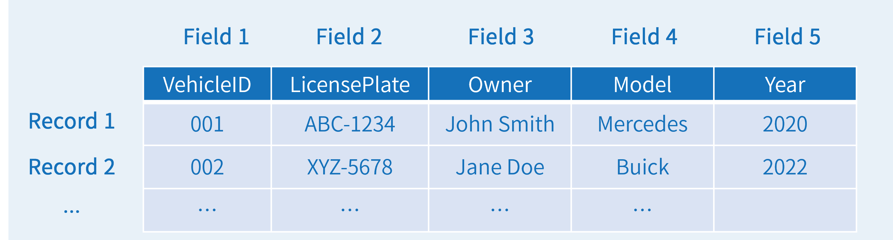

- **Field**: Each field includes two attributes: field name and data type. The field name and data type must be specified when creating the table. Some data types support length constraints.

  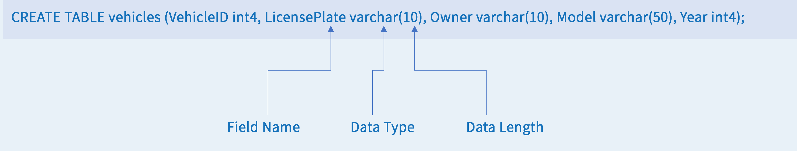

### Time-Series Database

- **Time-Series Database**: A database object used to store and manage time-series data. One or more time-series databases can be created within the same database instance. A time-series database contains only time-series tables.

- **Time-Series Table**: A table created within a time-series database. Multiple time-series tables can be created within each time-series database. In addition to fields, time-series tables must also include timestamp columns and tags. Timestamp columns record the time of data collection, tags record static attributes of the monitored entities, and fields record their real-time data.

  

- **Tags**: Tags can be further subdivided into primary tags and non-primary tags. Primary tags are used to distinguish between different entities. Each table must specify at least one primary tag. For example, the primary tag for sensors could be `sensor_id` since each sensor has a unique identifier. Primary tags must be specified during table creation and cannot be modified or deleted subsequently.

  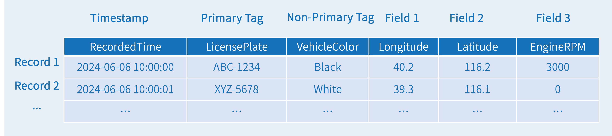

    This example shows how to define tags and primary tags.

  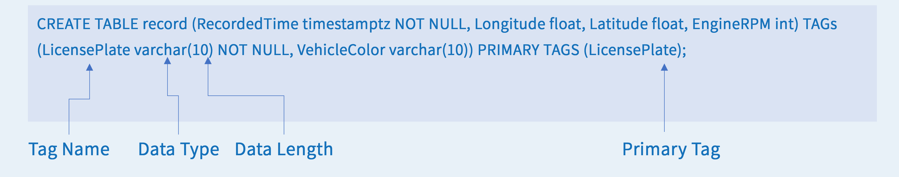