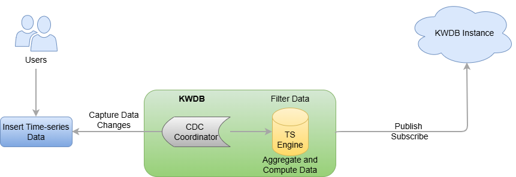

# Stream Computing

KWDB provides the out-of-box real-time stream computing service, which is designed to streamingly process time-series data as it is ingested in real time. You can employ SQL statements to define the data source for stream computing, the computation rules to be applied, data filtering conditions, and the target table for writing results. Stream computing is primarily used in the following scenarios:

- ​Intelligent Downsampling​​: Stream computing can downsample the raw data collected at high frequencies (e.g., 1,000 points per second) in real time (e.g., retaining only one point per second) and save the results into another time-series table. You can synchronize the downsampled data to a KWDB instance through the publish-subscribe service.
- Accelerate real-time decision-making by precomputing reptitive queries​: Stream computing can perform real-time precomputation for repetitive queries and store the results in a new time-series table. You can quickly retrieve computed results by directly querying the precomputed time-series table.

Stream computing offers a lightweight solution for complex stream processing systems. Without relying on any external components, it delivers efficient real-time stream computing capabilities in high-throughput time-series data writing scenarios.

## How It Works

Stream computing utilizes a Change Data Capture (CDC) mechanism to collect written time-series data in real time, and uses SQL statements to define real-time stream transformations. Once data is written to the source table of the stream computing process, the system automatically processes it according to the defined rules and writes the results to the target table.

Stream computing includes data filtering, scalar function calculations, and window aggregations (supporting sliding windows, session windows, and state windows). Its source table is a time-series table, while the target table can be either a time-series table or a relational table. After a stream is created, newly inserted data is subjected to user-defined filtering and transformation rules before being written to the target table. If historical data exists in the source table, you can select the processing method through parameters during the stream creation. Additionally, KWDB's stream computing can handle out-of-order data writes through stream parameters, which you can adjust according to your specific business requirements.

## Limitations

- Do not support multiple time-series tables, time-series databases, or relational tables.
- Do not support high availability in distributed clusters.
- Do not support synchronizing DDL operations. You must manually stop the stream before performing DDL operations, and then restart the stream.
- Do not support specifying data deduplication rules.
- For the `stream_query` parameter of the stream:
  - If the target table is a time-series table, the `select_list` option must meet all constrains on the time-series table (including the non-null timestamp-typed column and all Primary Tag columns).
    - If no alias is specified, the system inserts data into the target table based on the sequence of the columns specified in the `select_list` option.
    - If aliases are specified, the aliases should be identical to the column names in the target table and the target table should contain all non-null columns (including data columns and tag columns). If you need to specify aliases, all columns should have an alias.
    - To stop and resume a stream, KWDB records the begin time (`window_start`) and end time (`window_end`) of each aggregate window to the target table as the first two output columns and takes the begin time of the window as the time to insert data into the target table.
  - When filtering data using the `WHERE` clause, the captured data might not contain common Tag data. Therefore, the system needs to read common Tag data from the time-series table in real time. This may bring additional performance overhead.
  - When dividing a data set using the `GROUP BY` clause
    - The `GROUP BY` clause must contain window functions (`SESSION_WINDOW,` `STATE_WINDOW`, `TIME_WINDOW`, `EVENT_WINDOW`, and `COUNT_WINDOW`) or the `Timebucket` function. All the window functions and the `Timebucket` function must be used with all Primary Tag columns.
    - The window functions only support `GROUP BY [<ptag>,]` and `group_window_function`.
    - Do not support using the `GROUP BY` clause for parts of Primary Tag columns, common Tag columns, or data columns.
    - When recomputing expired data using the `count_window` function, the inserted expired data will have an effect on all following windows. Therefore, the query result may be inconsistent with those that is queried by the `SELECT` statement in a streaming computing job.
  - Support computing data using functions (time functions and character functions), which works like the simple `SELECT` statement. The functions can follow any option of the `stream_query` parameter, including the `select_list` clause or `WHERE` clause.
  - Do not support the `ORDER BY` clause. If you use the `ORDER BY` clause on the non timestamp-typed columns or use the reverted `ORDER BY` clause on the timestamp-typed columns, the system fails to perform aggregate computing before inserting data into the source table.
  - Do not support the `LIMIT` or `OFFSET` clause to specify the maximum number of returned rows.
  - Do not support the `DISTINCT` clause.
  - Do not support the sub-query. When the source table of the current stream is a time-series table, you can not perform sub-query on the source table through the stream.

- Stream target: If the data types of the `stream_query` output columns are inconsistent with the data types of the target table, the system returns an error. This table lists the relationship between the data types of the `stream_query` output columns and the data types of the target table (time-series table or relational table).

    | `stream_query` output columns | Target Table (Time-series) | Target Table (Relational) | Description |
    | --- | --- | --- | --- |
    | TimestampFamily | TIMESTAMP | TIMESTAMP | N/A |
    |  | TIMESTAMPTZ | TIMESTAMPTZ | - When the target table is a time-series table, data types can be automatically converted.   - When the target table is a relational table, data types are incompatible. In this case, ensure that the source and target tables have the same timestamp format.|
    | TimestampTZFamily | TIMESTAMP | TIMESTAMP | - When the target table is a time-series table, data types can be automatically converted.   - When the target table is a relational table, data types are incompatible. In this case, ensure that the source and target tables have the same timestamp format. |
    |  | TIMESTAMPTZ | TIMESTAMPTZ | N/A |
    | IntFamily | INT8 | DECIMAL | - When the target table is a time-series table, data types are forced converted to INT8.   - When the target table is a relational table, data types are forced converted to DECIMAL.|
    | FloatFamily | FLOAT8 | DECIMAL | - When the target table is a time-series table, data types are forced converted to FLOAT8.   - When the target table is a relational table, data types are forced converted to DECIMAL.|
    | DecimalFamily | - INT8  - FLOAT8 | DECIMAL | - When the target table is a time-series table, data types are forced converted to INT8 or FLOAT8. For INT8-typed, the data length might be truncated. For FLOAT8-typed, the data length might be truncated or the precision is lost.  - When the target table is a relational table, data types are forced converted to DECIMAL.|
    | StringFamily | - VARCHAR  - NVARCHAR | STRING | - When the target table is a time-series table, data types are forced converted to VARCHAR or NVARCHAR. For VARCHAR-typed, the column width must meet the minimum length requirements of the stream and the data cannot contain any Unicode character. Otherwilse, data might be lost after conversion. For NVARCHAR-typed, the column width must meet the minimum length requirements of the stream. Otherwilse, data might be lost after conversion.   - When the target table is a relational table, data types are forced converted to SRTING.|
    | BoolFamily | N/A | BOOL | - When the target table is a time-series table, data types cannot be converted.   - When the target table is a relational table, data types are forced converted to BOOL.|
    | BytesFamily | N/A | N/A | - When the target table is a time-series table, data types cannot be converted.   - When the target table is a relational table, data types cannot be converted. |
    | DateFamily | N/A | N/A | - When the target table is a time-series table, data types cannot be converted.   - When the target table is a relational table, data types cannot be converted. |

## Main Features

- Stream computing objects
  - Support creating a stream for a time-series table, including the historical data and the new data inserted by the `INSERT` statment.
  - The target table can be a time-series table or a relational table.
  - Support writing the stream computing results into a time-series table or a relational table.
  - Support defining multiple streams on a time-series table or writing results of multiple streams into a single table.
  - Support filtering time-series data using the `WHERE` clause.
  - Support grouping and performing aggregate computation on data using the `GROUP BY` clause.
  - Support perform inter-column and inter-row computation on data, including logical, mathematical, and aggregate computation.
- Triggering modes of stream computing
  - For non-window computation, stream computing is triggered as soon as data is inserted.
  - For window functions and `Timebucket` function, if the real-time data meets windown conditions, the aggregate window is closed properly and stream computing is triggered. If the real-time data does not meet windown conditions, the aggregate window cannot be closed properly. If the delay time (such as 10s) expires, stream computing is triggered forcely.
- Stream computing configurations
  - Processing policy for pending data: When you resume a stopped stream, the the system checks whether there is any pending data (The data that is not processed) and uses the ​minimum data feed watermark to compute the volume of pending data. If there is any pending data, the system gets and deals with historical data synchronously and then deals with real-time data. If there is any window function, when receiving data sent in the first window function, the system asynchronously deals with historical data and the data that are not dealt before the first real-time data window.
  - Processing policy for historical data: By default, the stream does not process historical data. To deal with historical data, you can set the `PROCESS_HISTORY` parameter to `on` when you create the stream.
  - Processing policy for out-of-order data: When creating a stream, you can specify how long a stream waits for data through the `SYNC_TIME` parameter. By default, it is set to `1m`. Only the out-of-order data that exceeds this time can be computed by the stream.
  - Processing policy for expired data: The expired data refers to the data that is inserted into a closed aggregate window. You can configure how to process these expired data through the `IGNORE_EXPIRED` parameter. When the `IGNORE_EXPIRED` parameter is set to `on`, the system abandons expired data. When the `IGNORE_EXPIRED` parameter is set to `off`, the system re-queries and loads all the data of the related window, re-computes the data, and then updates the results to the target table. If the expired data is inserted into a window, the system re-computes data in this window. If the expired data is inserted between two windows, the system re-computes all the data in these two windows.
- Stream management: For details about stream management, see [Streams](../sql-reference/other-sql-statements/stream-sql.md).
  - Support enabling and disabling the stream computing service.
  - Support viewing the existing streams, including the stream name, the target table name, the stream parameters, the time to create the stream, the creator, the current status, the begin time, the end time, and the error messages if any.
  - Support deleting the specified streams. If the target stream is running, the stream cannot be removed untill it is completed.
