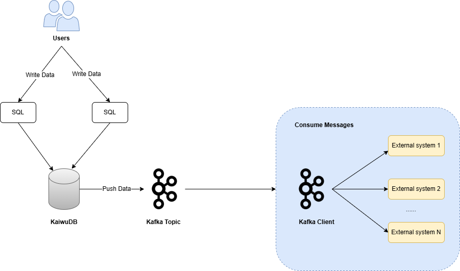

# Real-time Data Feed

KWDB provides the out-of-box real-time data feed service. The real-time data feed service detects data changes of critical services in KWDB and sends the changes as a message to Kafka topics for downstream processing purposes. After enabling the real-time data feed service, KWDB automatically captures the new data inserted by the `INSERT` statement, filters data based on flexible rules, and sends filtered data to Kafka topics in JSON format.

## How It Works

KWDB creates pipes using the `CREATE PIPE` statement to push incremental data in a single time-series table to Kafka topics in real time. Using any Kafka client, you can consume data from Kafka topics and then write the data to the third-party Kafka message components or other databases.



## Limitations

- Do not support pushing historical data of time-series tables.
- Do not support pushing multiple time-series tables, time-series databases, or relational databases.
- Do not support pushing data that are generated through the `DELETE`, `UPDATE`, or `DDL` statements.
- Do not support filtering data for common Tag columns.
- Do not support aggregate functions, type casting, sorting rules, system column reference, or non-immutable built-in functions.
- Do not support filtering data using `BETWEEN ... AND`.

## Main Features

- Data feed objects
  - Support pushing the new data inserted by the `INSERT` statement for a single time-series table, not including the historical data of the time-series table.
  - Support creating a pipe with the `WHERE` clause to push data to Kafka topics.
  - Support creating a pipe with the `WITH` keyword to specify parameters used to push data to Kafka topics.
- Data filtering rules: KWDB supports setting simple row-level filtering rules on data to be pushed to Kafka topics, including:
  - Support the equals (`=`) operation on a single Primary Tag column as well as AND and OR operations on up to 4 Primary Tag columns.
  - Support operations on data columns using the greater than sign (`>`), the less than sign (`<`), the equals sign (`=`), the greater than or equal to sign (`>=`), the less than or equal to sign (`<=`), the not equal sign (`!=`), as well as `IS NULL` and `IS NOT NULL` values.
  - Support AND and OR operations between Primary Tag columns and data columns.
  - Support filtering data based on the timestamp.
- Data feed configurations
  - KWDB asynchronously sends the data changes as a message to Kafka topics. If the target destination is ineligible, KWDB returns an error. Here is an example for connection to Kafka:

    ```bash
    kafka://{kafka_cluster_address}:{port}?topic_name={topic_name}&tls_enabled=true&ca_cert={ca_cert}&sasl_enabled=true&sasl_user={sasl_user}&sasl_password={sasl_password}
    ```

    - `kafka_cluster_address`: The IP address of the Kafka cluster.
    - `port`: the port ID. By default, it is set to `9093`.
    - `topic_name`: the topic name to which messages will be sent.
    - Kafka authentication and its parameters
      - `tls_enabled`: if `true`, enable Transport Layer Security (TLS) on the connection to Kafka. This should be used with the `ca_cert` parameter.
      - `ca_cert`: the Base64-encoded CA certificate for TLS authentication. **Note**: To encode your CA certificate, run the `base64 -w 0 ca.cert` command.
      - `client_cert`: the Base64-encoded PEM certificate for TLS authentication. This should be used with the `client_key` parameter.
      - `client_key`: the Base64-encoded PEM key for TLS authentication. This should be used with the `client_cert` parameter.
      - `sasl_enabled`: if `true`, the authentication protocol can be set to SCRAM or PLAIN. This requires the `sasl_user` and `sasl_password` parameters.
      - `sasl_user`: the SASL username.
      - `sasl_password`: the SASL password.

  - Currently, KWDB only supports pushing one or multiple JSON-format messages to Kafka topics. Here are examples for normally-pushed and supplementally-pushed messages:
    - Normally-pushed messages (The message type is `insert`.)

        ```json
        {
          "change": [
            {
              "kind": "insert",
              "database": "benchmark",
              "schema": "public",
              "table": "cpu",
              "columnnames": ["k_timestamp", "hostname", "max_usage_user" ],
              "columntypes": [ "integer", "text", "integer" ],
              "columnvalues": [
                [ 173441827100000, "www.example1.com", 77],
                [ 173441827200000, "www.example1.com", 80],
                [ 173441827300000, "www.example1.com", 65]
              ]
            }
          ]
        }
        ```

    - Supplementally-pushed messages after restart (The message type is `snapshot`.)

        ```json
        {
          "change": [
            {
              "kind": "snapshot",
              "database": "benchmark",
              "schema": "public",
              "table": "cpu",
              "columnnames": ["k_timestamp", "hostname", "max_usage_user" ],
              "columntypes": [ "integer", "text", "integer" ],
              "columnvalues": [
                [ 173441827100000, "www.example1.com", 77],
                [ 173441827200000, "www.example1.com", 80],
                [ 173441827300000, "www.example1.com", 65]
              ]
            }
          ]
        }
        ```

  - You can set the maximum data feed retries globally. When this threshold is exceeded, KWDB stops pushing data to Kafka topics. Currently, it is set to `5`. You can use the `SET CLUSTER SETTING ts.pipe.sink_max_retries` command to set it to another value.

- Resumable transfer

    During real-time data feed, KWDB tracks the progress using the ​maximum timestamp of pushed data (i.e., the ​minimum data feed watermark in the time-series table) as a replication marker. If the real-time data feed service is stopped and later restarted, data ingested during the downtime remains unpushed (referred to as "pending data"). This pending data, similar to historical data, cannot be processed through the real-time data feed service. When restarting the real-time data feed service, the system checks the volume of pending data based on the replication marker. If the data volume does not exceed the ​built-in threshold, the system reads and pushes this data volume. Otherwise, the system fails to restart the real-time data feed service and returns an error. In this case, you can modify some filtering rules to skip pushing a part of data volume and then use the import and export methods to replicate this data volume to the target Kafka topics.

    ::: warning Note
    
    - Due to uncertainty and inconsistent delays between ​data timestamps (when data is generated) and ​ingestion timestamps (when data is stored), resumable transfer may result in ​duplicate push of certain data volumes.
    - Resumable transfer is ​only supported in single-cluster environments and does not support ​high availability (HA) configurations in distributed clusters.
    
    :::

- Real-time data feed job management
  - Support enabling and disabling the real-time data feed service.
  - Support resuming to push the pending data based on the replication marker when restarting the real-time data feed service.
  - Support viewing the existing data feed jobs, including the job name, the data to be pushed, the time to create the job, the creator, the current status, the begin time, the end time, and the error messages if any.
  - Support deleting the specified data feed jobs. If a data feed job is running, the system will stop or remove the job after it completes.

    For details about real-time data feed job management, see [Pipes](../../en/sql-reference/other-sql-statements/pipe-sql.md).
