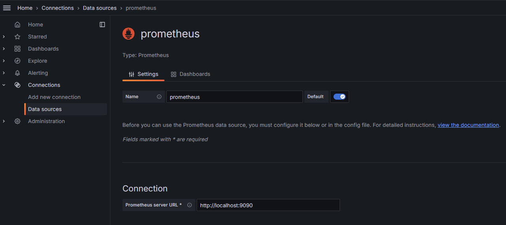
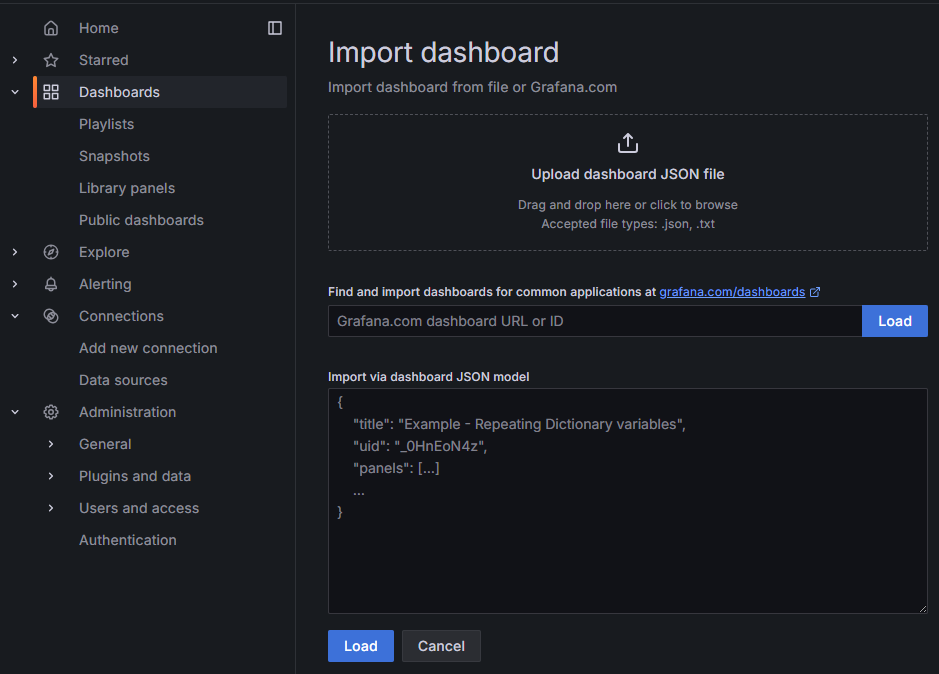

# Deployment

KWDB uses [Prometheus](https://prometheus.io/) to collect and store monitoring and performance metrics for your cluster and uses [Grafana](https://grafana.com/grafana) to visualize these data in the dashboards. This document describes how to deploy Prometheus and Grafana.

## Deploy Prometheus

1. [Download](https://prometheus.io/download/) the latest Prometheus for your platform and then extract it to a local directory.

    This example extracts Prometheus v2.53.0.

    ```shell
    tar -zxvf prometheus-2.53.0.linux-amd64.tar.gz
    ```

2. Create a folder named `rules` under the `prometheus-2.53.0.linux-amd64` directory.
3. [Download](https://gitee.com/kwdb/kwdb/tree/master/kwbase/monitoring/rules) configuration files of the Prometheus alerting rules and aggregation rules and store them to the `rules` folder.

    KWDB provides the `alerts.rules.yml` and `aggregation.rules.yml` configuration files under the `monitoring/rules` directory. For detailed configurations about alerting rules and aggregation rules, see [Prometheus Alerting Rules](https://prometheus.io/docs/prometheus/latest/configuration/alerting_rules/) and [Prometheus Aggregation Rules](https://prometheus.io/docs/practices/rules/#aggregation).

    - `alerts.rules.yml`: The configuration file of the Prometheus alerting rules.
    - `aggregation.rules.yml`: The configuration file of the Prometheus aggregation rules.

4. Configure Prometheus.

    ```shell
    cd prometheus-2.53.0.linux-amd64 &&
    vi prometheus.yml
    ```

    Here is an example configuration file. You can change the parameters and their values as required.

    ```yaml
    # Prometheus configuration for KWDB clusters.
    # Requires prometheus 2.X
    #
    # Run with:
    # $ prometheus -config.file=prometheus.yml
    global:
      scrape_interval: 10s
      evaluation_interval: 10s

    rule_files:
    - "rules/alerts.rules.yml"
    - "rules/aggregation.rules.yml"

    scrape_configs:
      - job_name: 'kwdb'
        metrics_path: '/_status/vars'
        # Insecure mode:
        scheme: 'http'
        # Secure mode:
        # scheme: 'https'
        tls_config:
          insecure_skip_verify: true

        static_configs:
        - targets: ['localhost:8080', 'localhost:8081', 'localhost:8082']
          labels:
            cluster: 'my-kwdb-cluster'
    ```

    Parameters:

    - `global`: Global configurations about the Prometheus Server.
      - `scrape_interval`: Sepcify how frequently the Prometheus Server scrapes data.
      - `evaluation_interval`: Sepcify how frequently the Prometheus Server evaluates rules. Prometheus uses rules to create new time series and generate alarms.
    - `rule_files`: Specify the path to the rule files loaded by the Prometheus Server.
    - `scrape_configs`: Specify a set of targets and parameters describing how to scrape them. In general, one scrape configuration specifies a single job. Targets may be statically configured via the `static_configs` parameter or dynamically discovered using one of the supported service-discovery mechanisms.
      - `job_name`: Specify the job name assigned to scraped metrics.
      - `metrics_path`: Specify the HTTP resource path on which to fetch metrics from targets.
      - `scheme`: Configure the protocol scheme used for requests.
      - `tls_config`: Configure the request's TLS settings.
      - `static_configs`: Specify a list of labeled statically configured targets for this job.

    For details about all Prometheus configurations, see [Prometheus Documentation](https://prometheus.io/docs/prometheus/latest/configuration/configuration/).

5. Start Prometheus.

    ```shell
    ./prometheus --config.file=prometheus.yml
    ```

    By default, Prometheus is started on port `9090`. You can use the `--web.listen-address` parameter to change the listening port as required. This example changes the listening port ID to `8091`.

    ```shell
    ./prometheus --config.file=prometheus.yml --web.listen-address=:8091
    ```

    To view all CLI parameters supported by Prometheus, run the `./prometheus -h` command.

6. Log in to Prometheus.

    By default, you can access Prometheus through `http://localhost:9090` after starting Prometheus.

## Deploy Grafana

1. Download the latest Grafana for your platform and then extract it to a local directory.

    This example downloads Grafana v11.1.0.

    ```shell
    wget https://dl.grafana.com/enterprise/release/grafana-enterprise-11.1.0.linux-amd64.tar.gz
    tar -zxvf grafana-enterprise-11.1.0.linux-amd64.tar.gz
    ```

2. Start Grafana.

    ```shell
    cd grafana-v11.1.0/bin
    ./grafana-server
    ```

## Configure Grafana

### Add Prometheus Data Source

1. Log in to Grafana.

    By default, you can access Grafana through `http://localhost:3000` using the default username and password (Both are `admin`).

2. From the left-side menu, click **Connections** > **Data sources**.
3. At the **Data sources** window, click **Add data source**, and then select **Prometheus**.

    

4. Configure the Prometheus.

    - `Name`: The name of the Prometheue data source.
    - `Prometheus server URL`: The IP address of the Prometheus Server.
    - Configure other options as required.

5. Click **Save & test**.

### Import Grafana Dashboards

By default, KWDB provides the following metric dashboards under the [`monitoring/grafana-dashboards`](https://gitee.com/kwdb/kwdb/tree/master/kwbase/monitoring/grafana-dashboards) directory. After importing these metric dashboards into Grafana, you can monitor the KWDB cluster.

- Overview: Show critial metrics for your cluster or for the specific node.
- Hardware: Show hardware-related metrics.
- Runtime: Show runtime-related metrics.
- SQL: Show SQL-related metrics.
- Storage: Show storage-related metrics.
- Replication: Show replication-related metrics.
- Distribution: Show distribution-related metrics.
- Queue: Show queue-related metrics.
- Slow query: Show metrics about slow queries.

To import KWDB metric databoards, follow these steps.

1. From the left-side menu, click **Dashboards**.
2. At the **Dashboard** window, click **New** and then select **Import** from the drop-down list.
3. Select the target metric dashboards and then click **Load**.

    

    ::: warning Note

    By default, KWDB provides the following metric dashboards under the [`monitoring/grafana-dashboards`](https://gitee.com/kwdb/kwdb/tree/master/kwbase/monitoring/grafana-dashboards) directory. Here lists the file names of these metric dashboards.

    - Overview: `1.KaiwuDB_Console_Overview.json`
    - Hardware: `2.KaiwuDB_Console_Hardware.json`
    - Runtime: `3.KaiwuDB_Console_Runtime.json`
    - SQL: `4.KaiwuDB_Console_SQL.json`
    - Storage: `5.KaiwuDB_Console_Storage.json`
    - Replication: `6.KaiwuDB_Console_Replication.json`
    - Distribution: `7.KaiwuDB_Console_Distribution.json`
    - Queue: `8.KaiwuDB_Console_Queue.json`
    - Slow query: `9.KaiwuDB_Console_Slow_Query.json`

    :::

4. (Optional) From the left-side menu, click **Dashboards** and then select any metric dashboard to view related metrics.
