# View Metrics Using Grafana

Grafana supports viewing metrics for your cluster or for the specific node, including the overall metrics, as well as metrics about the hardware, runtime, SQL, storage, replication, distribution, queues, and slow queries.

## Overview

The **Overview** page shows critical metrics for your cluster or for the specific node.

- **SQL Queries**

    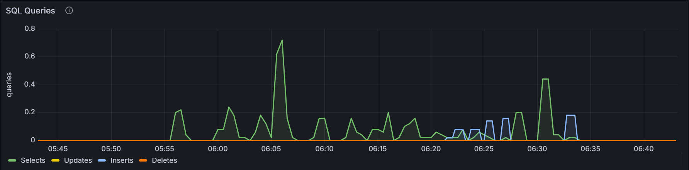

    In the node view, the graph shows the 10-second moving average of the number of `SELECT`, `INSERT`, `UPDATE`, `DELETE` queries issued by SQL clients and successfully executed per second on the node. In the cluster view, the graph shows the sum of the per-node averages, that is, an aggregate estimation of the current query load over the cluster, assuming the last 10 seconds of activity per node are representative of this load.

- **Service Latency: SQL 99th Percentile**

    Service latency is calculated as the time between when the cluster receives a query and finishes executing the query. This time does not include returning results to the client.

    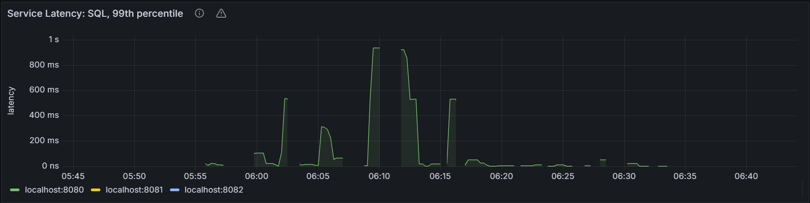

    In the node view, the graph shows the 99th percentile of service latency for the node. It means that this node executed 99% of queries within this time. In the cluster view, the graph shows the 99th percentile of service latency across all nodes in the cluster. It means that the node executed 99% of queries within this time.

- **Replicas per Node**

    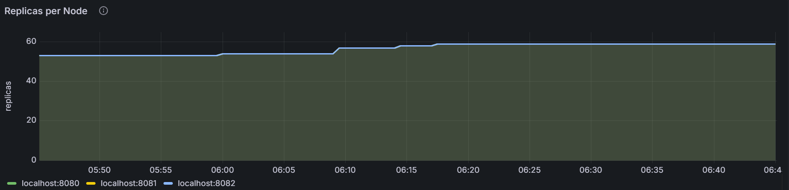

    The graph shows the number of replicas for the specific node or for all nodes in the cluster.

- **Capacity**

    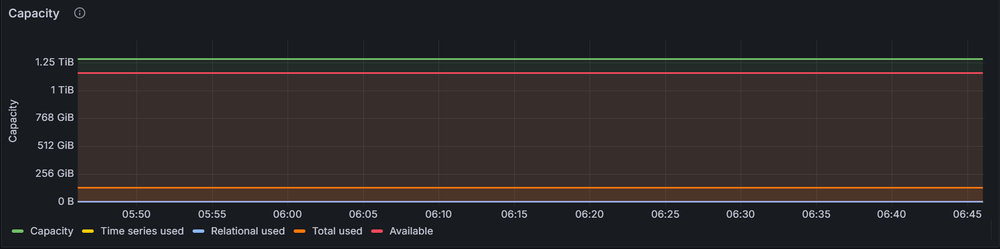

    The graph shows the storage capacity for the cluster.

## Hardware

- **CPU Usage**

    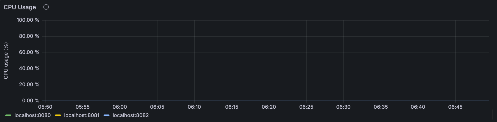

    The graph shows the percentage of CPU utilization of the KWDB process for the specific node or for all nodes in the cluster.

- **Memory Usage**

    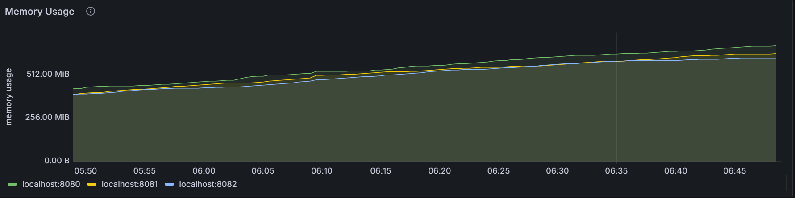

    The graph shows the memory usage of the KWDB process for the specific node or for all nodes in the cluster.

- **Disk Read Bytes**

    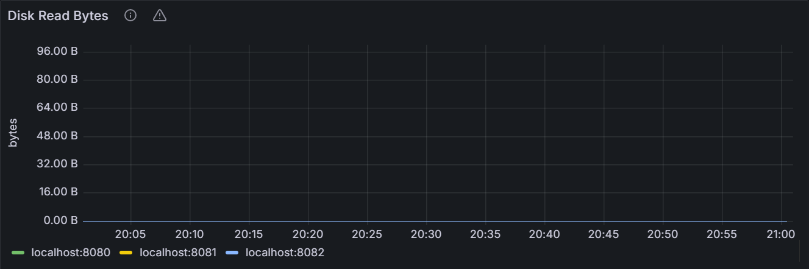

    The graph shows the rate to read data from the disk of all processes (including the KWDB process) for the specific node or for all nodes in the cluster. The sampling value is an average value of the Read Per Second (RPS) over `10` seconds.

- **Disk Write Bytes**

    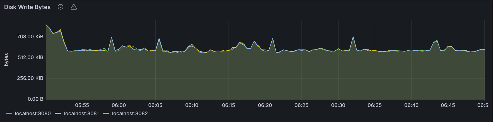

    The graph shows the rate to write data into the disk of all processes (including the KWDB process) for the specific node or for all nodes in the cluster. The sampling value is an average value of the Write Per Second (WPS) over `10` seconds.

- **Disk Read Ops**

    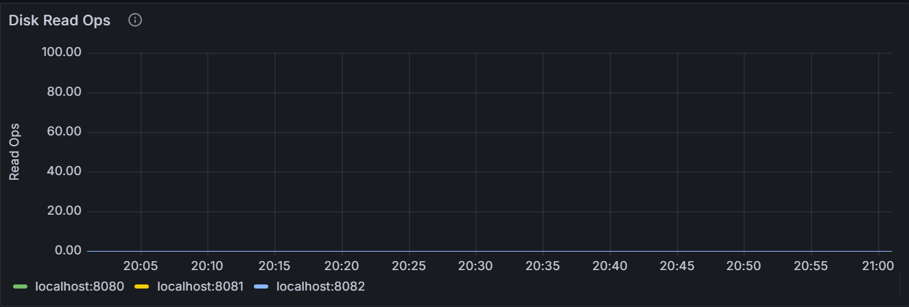

    The graph shows the rate to read data from the disk of all processes (including the KWDB process) for the specific node or for all nodes in the cluster. The sampling value is an average value of the Opeartions Per Second (OPS) over `10` seconds.

- **Disk Write Ops**

    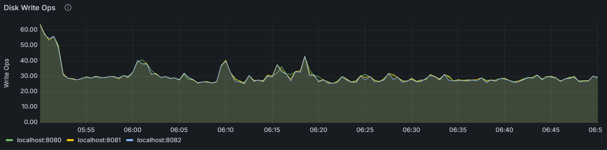

    The graph shows the rate to write data into the disk of all processes (including the KWDB process) for the specific node or for all nodes in the cluster. The sampling value is an average value of the Opeartions Per Second (OPS) over `10` seconds.

- **Disk IPOS In Progress**

    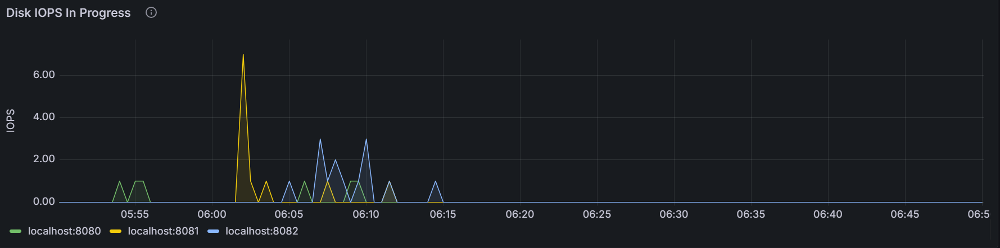

    The graph shows the number of requests in queues to read or write by all processes (including the KWDB process) for the specific node or for all nodes in the cluster. The sampling value is averaged over `10` seconds.

- **Available Disk Capacity**

    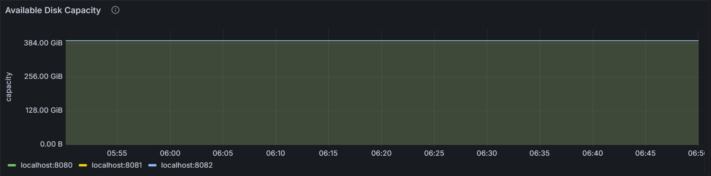

    The graph shows the available storage capacity for the specific node or for all nodes in the cluster.

- **Network Bytes Received**

    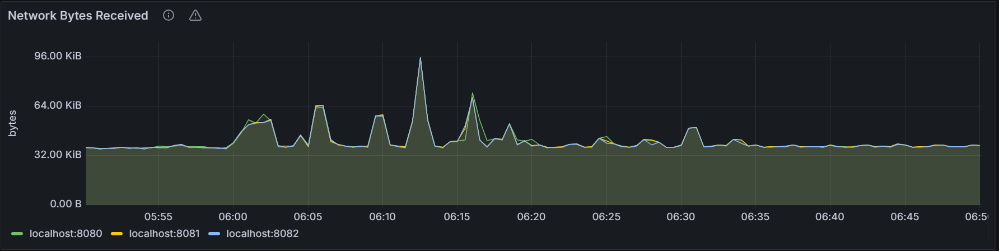

    The graph shows the total number of bytes received per second by all processes (including the KWDB process) for the specific node or for all nodes in the cluster. The sampling value is averaged over `10` seconds.

- **Network Bytes Sent**

    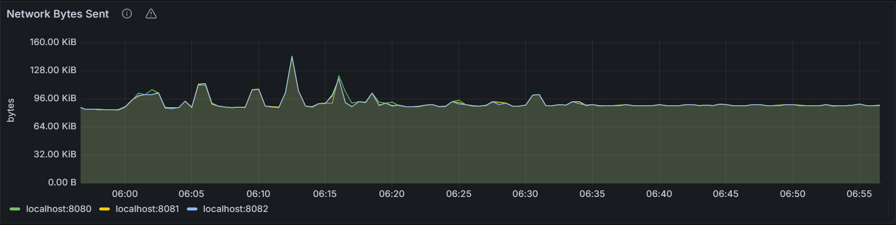

    The graph shows the total number of bytes sent per second by all processes (including the KWDB process) for the specific node or for all nodes in the cluster. The sampling value is averaged over `10` seconds.

## Runtime

- **Live Node Count**

    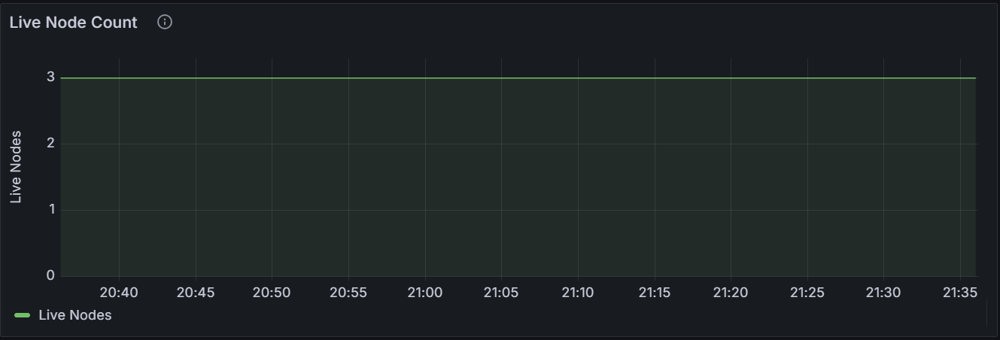

    The graph shows the number of live nodes in the cluster. A dip in the graph indicates that there are abnormal or unavailable nodes in the cluster.

- **Memory Usage**

    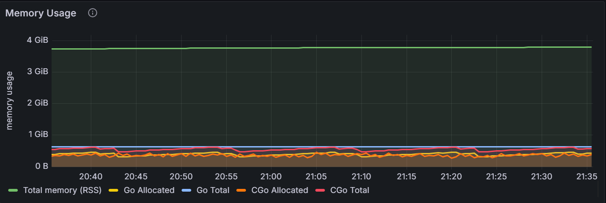

    The graph shows the memory usage for the specific node or for all nodes in the cluster.

    Hover over the chart to see more information about the metrics.

    | Metric    | Description                                |
    |-----------|--------------------------------------------|
    | RSS       | The total memory in use by KWDB.        |
    | Go Total  | The total memory managed by the Go layer.  |
    | CGo Total | The total memory managed by the CGo layer. |

- **Kmalloc memory request**

    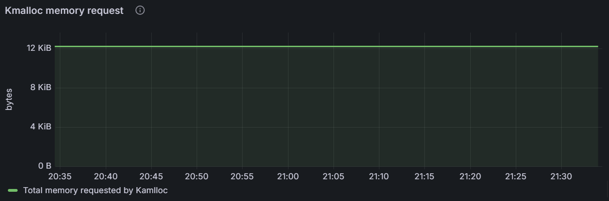

    The graph shows the Kmalloc memory request size for the specific node or the total Kmalloc memory request size for all nodes in the cluster.

- **Memory Map virtual size**

    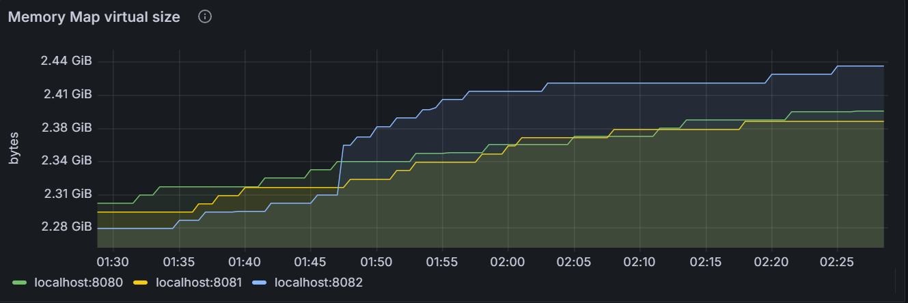

    The graph shows the virtual Memory Map size for the specific node or the total virtual Memory Map size for all nodes in the cluster.

- **Memory Map physical size**

    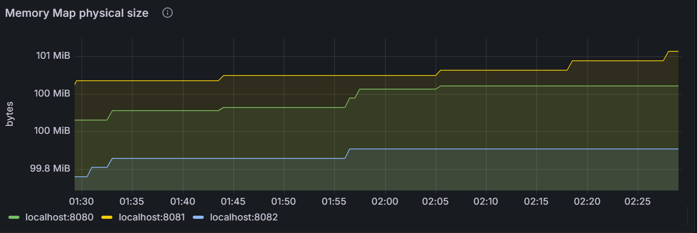

    The graph shows the physical Memory Map size for the specific node or the total physical Memory Map size for all nodes in the cluster.

- **Memory Map range count**

    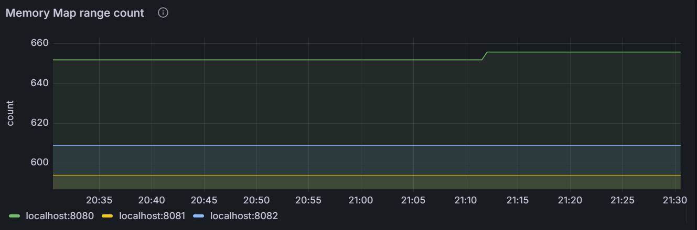

    The graph shows the number of virtual memory chunks that are consecutivedly turned on by all processes for the specific node or for all nodes in the cluster. For the specific node, the size of each virtual memory chunk may be different. Therefore, the total virtual Memory Map size occupied by the specific node is the sum of the size of all memory chunks. And the total virtual Memory Map size occupied by the cluster is the sum of the total virtual Memory Map size occupied by each node in the cluster.

- **Goroutine Count**

    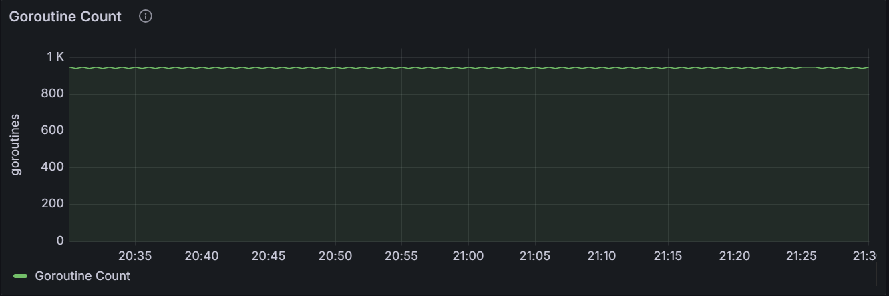

    The graph shows the number of current Goroutine for the specific node or for all nodes in the cluster.

- **GC Runs**

    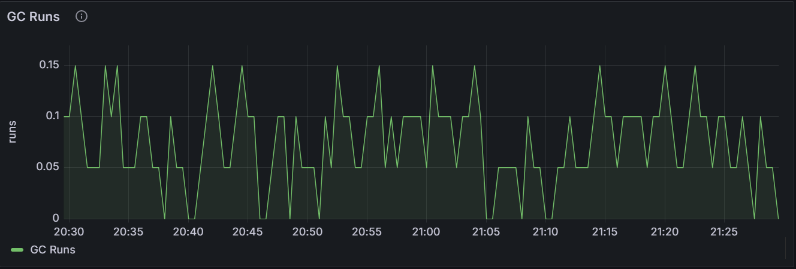

    The graph shows the number of GC runs for the specific node or for all nodes in the cluster.

- **GC Pause Time**

    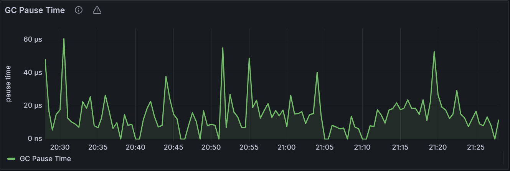

    In the node view, the graph shows the GC blocking time for the specific node. In the cluster view, the graph shows the total GC blocking time for all nodes in the cluster.

- **CPU Time**

    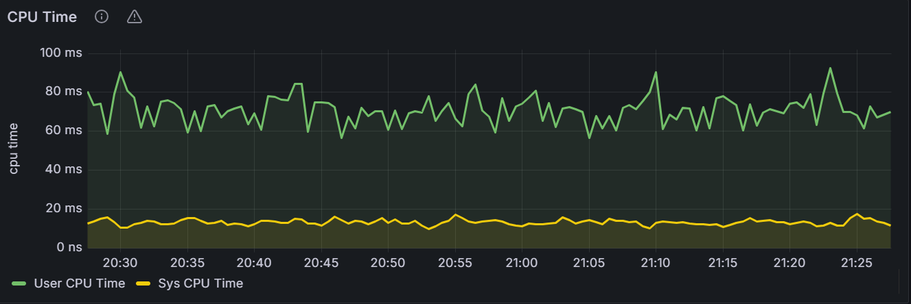

    In the node view, the graph shows the CPU time of KWDB user-level processes and related system-level operations for the specific node. In the cluster view, the graph shows the total CPU time of KWDB user-level processes and related system-level operations for all nodes in the cluster.

- **Clock Offset**

    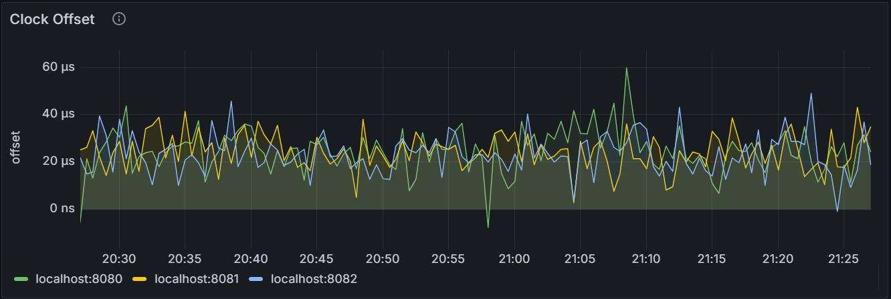

    In the node view, the graph shows the average value of the clock offset between the specified node and other nodes in the cluster. In the cluster view, the graph shows the average value of the clock offset between each node and other nodes in the cluster.

## SQL

- **Total SQL Connections**

    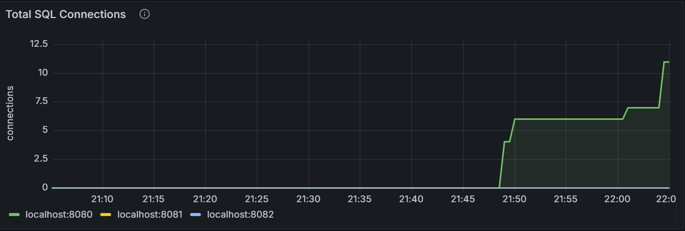

    The graph shows the total number of SQL connections for the specific node or for all nodes in the cluster, including both successfully-established SQL connections and failed SQL connections caused by incorrect passwords or the maximum number of failed login attempts.

- **Successful SQL Connections**

    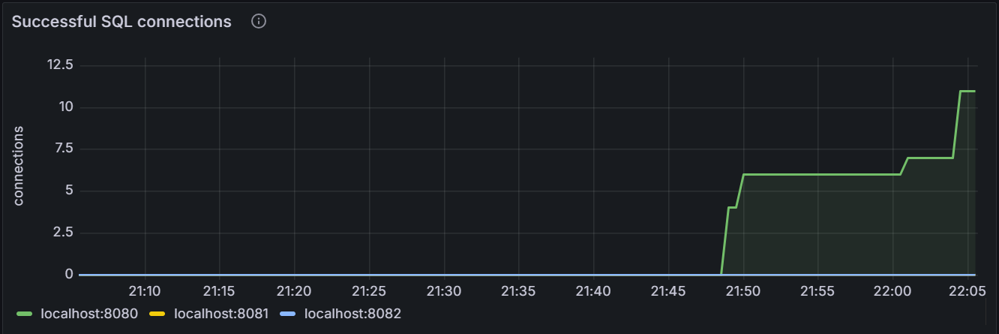

    The graph shows the number of successfully-established SQL connections for the specific node or for all nodes in the cluster.

- **SQL Byte Traffic**

    The **SQL Byte Traffic** view associates the number of SQL queries to the byte traffic, which is especially suitable for monitoring batch-insert operations or analytical SQL queries that return a large amount of data.

    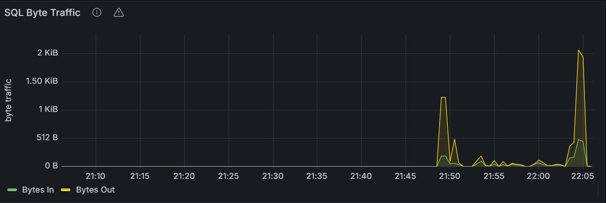

    In the node view, the graph shows the current byte throughput in unit of Bytes Per Second (BPS) between all the connected SQL clients and the specific node. In the cluster view, the graph shows the aggregate client throughput across all nodes in the cluster.

- **SQL Queries**

    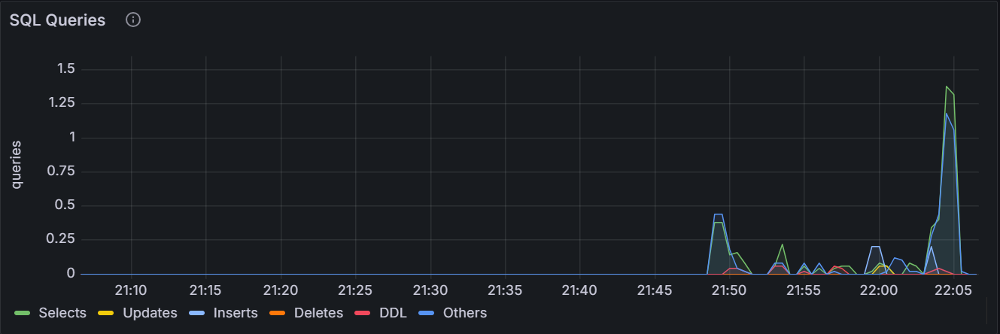

    In the node view, the graph shows the 10-second moving average of the number of `SELECT`, `INSERT`, `UPDATE`, `DELETE` queries issued by SQL clients and successfully executed per second on the node. In the cluster view, the graph shows the sum of the per-node averages, that is, an aggregate estimation of the current query load over the cluster, assuming the last 10 seconds of activity per node are representative of this load.

- **SQL Query Errors**

    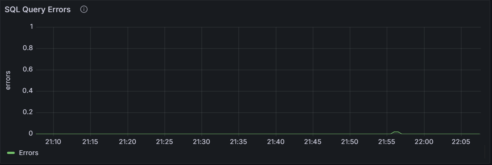

    The graph shows the number of SQL statements that fail to return plans or run for the specific node or for all nodes in the cluster. The sampling value is averaged over `10` seconds.

- **Active Distributed SQL Queries**

    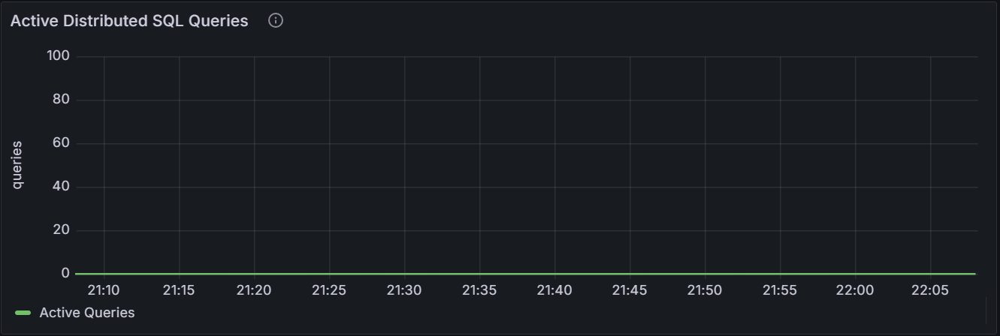

    The graph shows the number of distributed SQL queries running for the specific node or for all nodes in the cluster.

- **Active Flows for Distributed SQL Queries**

    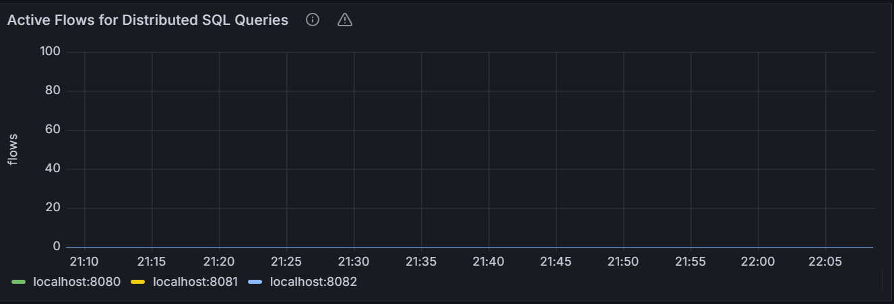

    The graph shows the number of flows that help perform current distributed SQL queries for the specific node or for all nodes in the cluster.

- **Service Latency: SQL 99th Percentile**

    Service latency is calculated as the time between when the cluster receives a query and finishes executing the query. This time does not include returning results to the client.

    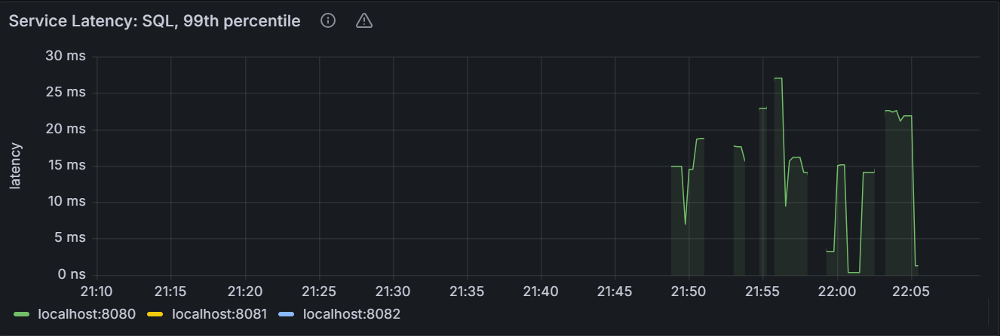

    In the node view, the graph shows the 99th percentile of service latency for the node. It means that this node executed 99% of queries within this time. In the cluster view, the graph shows the 99th percentile of service latency across all nodes in the cluster. It means that the node executed 99% of queries within this time.

- **Service Latency: SQL 90th Percentile**

    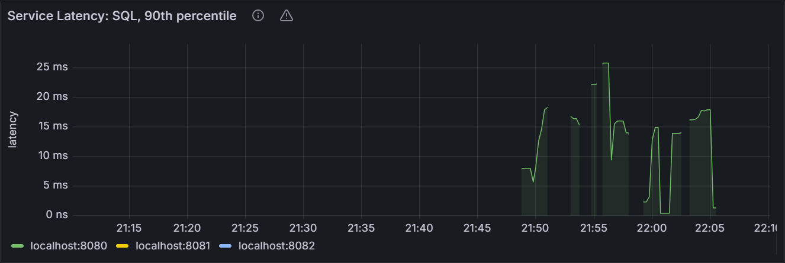

    In the node view, the graph shows the 90th percentile of service latency for the node. It means that this node executed 90% of queries within this time. In the cluster view, the graph shows the 90th percentile of service latency across all nodes in the cluster. It means that the node executed 90% of queries within this time.

- **KV Execution Latency: 99th Percentile**

    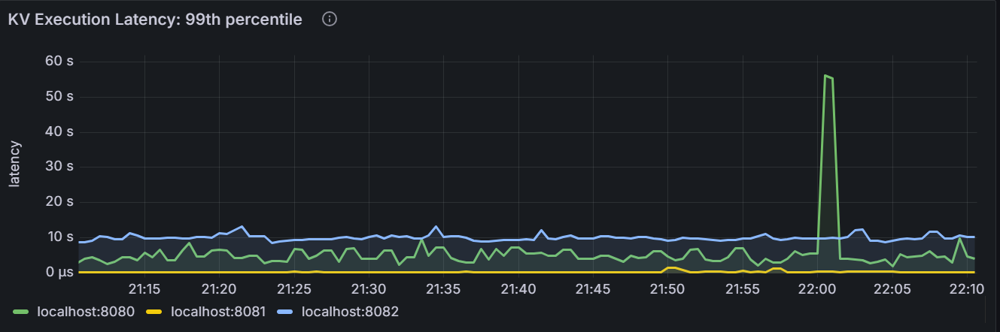

    In the node view, the graph shows the 99th percentile of KV execution latency for the node. It means that this node executed 99% of requests over the last minute. In the cluster view, the graph shows the 99th percentile of KV execution latency for each node in the cluster. It means that the node executed 99% of requests over the last minute.

- **KV Execution Latency: 90th Percentile**

    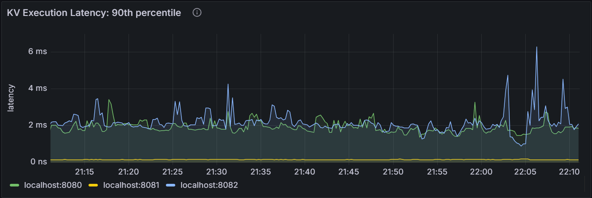

    In the node view, the graph shows the 90th percentile of KV execution latency for the node. It means that this node executed 90% of requests over the last minute. In the cluster view, the graph shows the 90th percentile of KV execution latency for each node in the cluster. It means that the node executed 90% of requests over the last minute.

- **Transactions**

    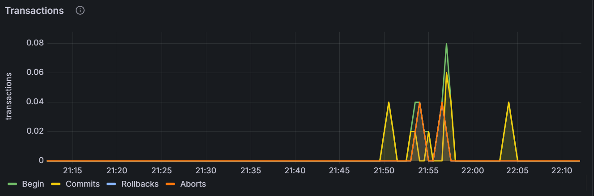

    In the node view, the graph shows the total number of transactions to begin, commit, rollback or terminate per second for the specific node. The sampling value is averaged over `10` seconds. In the cluster view, the graph shows the total number of transactions to begin, commit, rollback or terminate per second for all nodes in the cluster.

- **Transaction Execution Latency: 99th Percentile**

    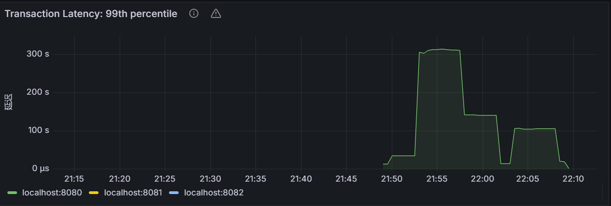

    In the node view, the graph shows the 99th percentile of transaction time over a minute for the node. It means that this node completed 99% of transactions over the last minute. In the cluster view, the graph shows the 99th percentile of transaction time over a minute for each node in the cluster. It means that the node completed 99% of transactions over the last minute.

- **Transaction Execution Latency: 90th Percentile**

    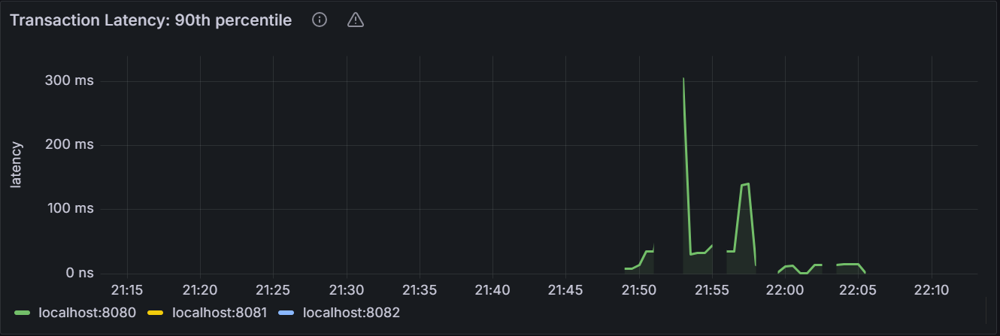

    In the node view, the graph shows the 90th percentile of transaction time over a minute for the node. It means that this node completed 90% of transactions over the last minute. In the cluster view, the graph shows the 90th percentile of transaction time over a minute for each node in the cluster. It means that the node completed 90% of transactions over the last minute.

- **Schema Changes**

    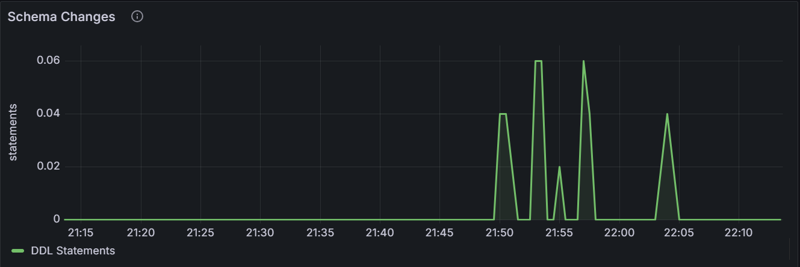

    The graph shows the total number of DDL statements per second for the specified node or for all nodes in the cluster.

## Storage

- **Capacity**

    You can decide when to add storage capacity to your cluster by monitoring the storage capacity.

    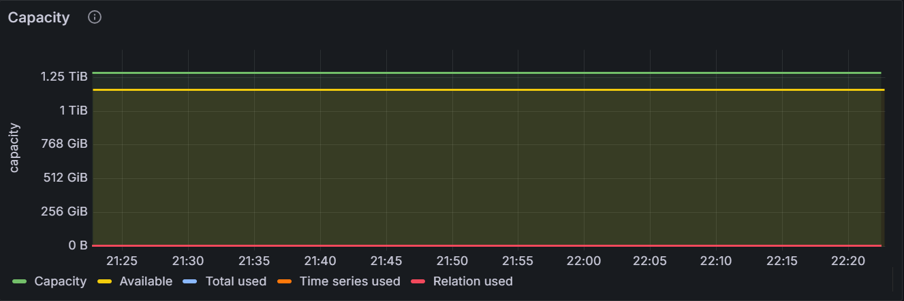

    In the node view, the graph shows the total storage capacity (the total storage capacity used by the KWDB database), the storage capacity used by the time-series database, the storage capacity used by the relational database, the total storage capacity used by both the time-series and relational databases, and the available storage capacity for the specific node. In the cluster view, the graph shows the total storage capacity, the total storage capacity used by the time-series database, the total storage capacity used by the relational database, the total storage capacity used by both the time-series and relational databases, and the total available storage capacity for all nodes in the cluster.

- **Live Bytes**

    The hot data refers to the data read by applications and the KWDB database. It does not include historical data and deleted data.

    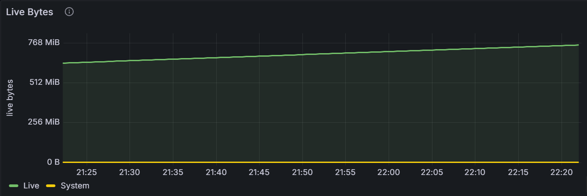

    The graph shows the volumn of data read by applications and the KWDB database for the specific node or for all nodes in the cluster. It does not include historical data and deleted data.

- **Log Commit Latency: 99th Percentile**

    The Raft log commit latency can be viewed as the measurement to perform fdatasync on the Write Ahead Log (WAL) of the storage engine.

    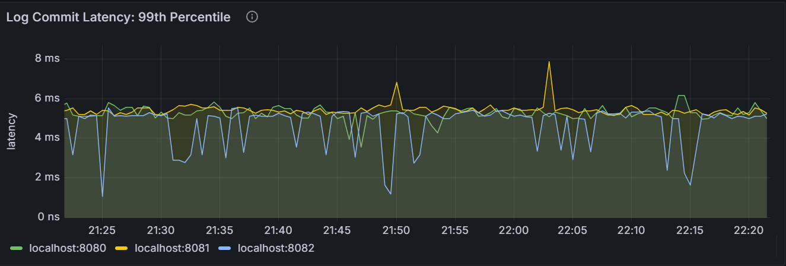

    In the node view, the graph shows the 99th percentile of Raft log commit latency for the node. It means that this node committed 99% of Raft logs within this time. In the cluster view, the graph shows the 99th percentile of Raft log commit latency across all nodes in the cluster. It means that the node committed 99% of Raft logs within this time.

- **Log Commit Latency: 50th Percentile**

    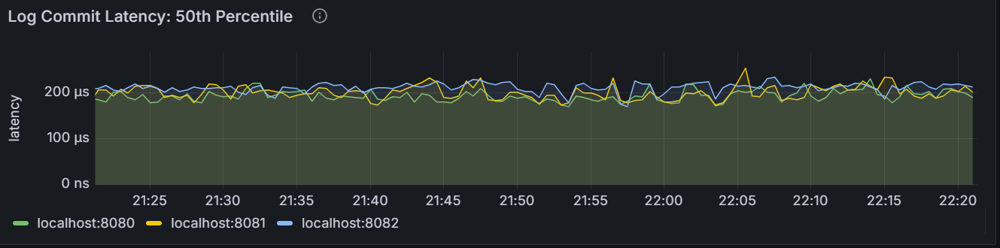

    In the node view, the graph shows the 50th percentile of Raft log commit latency for the node. It means that this node committed 50% of Raft logs within this time. In the cluster view, the graph shows the 50th percentile of Raft log commit latency across all nodes in the cluster. It means that the node committed 50% of Raft logs within this time.

- **Command Commit Latency: 99th Percentile**

    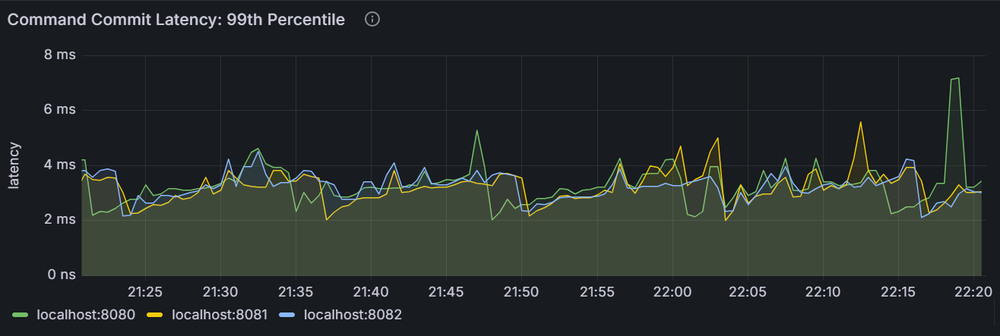

    In the node view, the graph shows the 99th percentile of Raft command commit latency for the node. It means that this node committed 99% of Raft commands within this time. In the cluster view, the graph shows the 99th percentile of Raft command commit latency across all nodes in the cluster. It means that the node committed 99% of Raft commands within this time.

- **Command Commit Latency: 50th Percentile**

    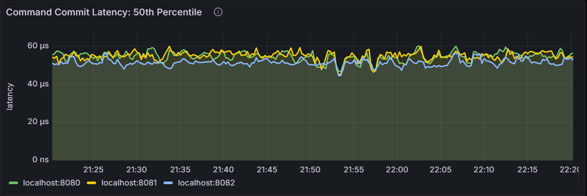

    In the node view, the graph shows the 50th percentile of Raft command commit latency for the node. It means that this node committed 50% of Raft commands within this time. In the cluster view, the graph shows the 50th percentile of Raft command commit latency across all nodes in the cluster. It means that the node committed 50% of Raft commands within this time.

- **Read Amplification**

    RocksDB read amplification is used to measure the average value of the actual read operations for each logical read on nodes.

    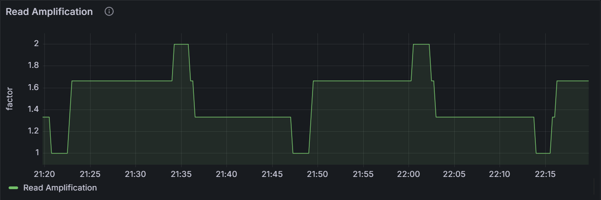

    In the node view, the graph shows the statistics of RocksDB read amplification for the specific node. In the cluster view, the graph shows the total statistics of RocksDB read amplification for all nodes in the cluster.

- **RocksDB SSTables**

    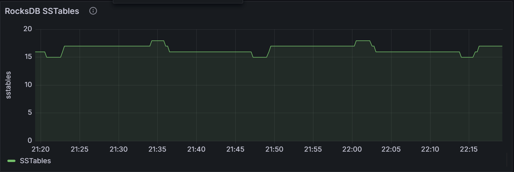

    In the node view, the graph shows the number of RocksDB SSTable for the specific node. In the cluster view, the graph shows the total number of RocksDB SSTable for all nodes in the cluster.

- **File Descriptors**

    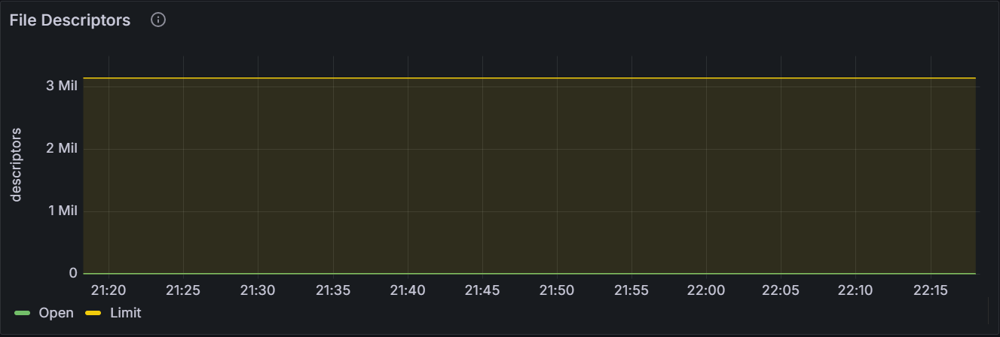

    The graph shows the number of open file descriptors and the maximum number of file descriptors for the specific node or for all nodes in the cluster.

- **Compactions/Flushes**

    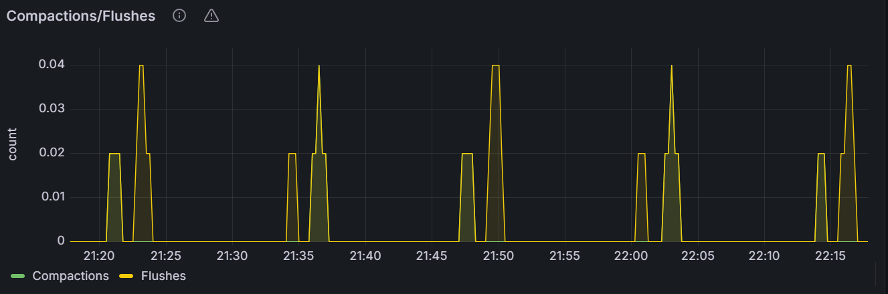

    The graph shows the number of RocksDB compactions or flushes per second for the specific node or for all nodes in the cluster.

- **Time Series Monitoring Data Sampling Writes**

    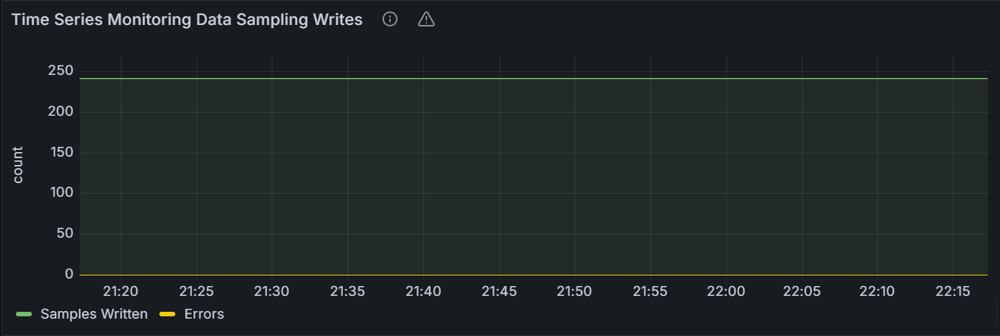

    The graph shows the number of successfully-written metrics and the number of failed-to-write metrics per second for the specific node or for all nodes in the cluster.

- **Time Series Monitoring Data Written Bytes**

    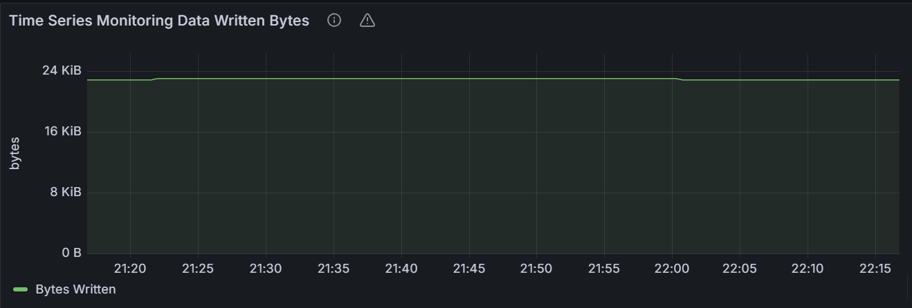

    In the node view, the graph shows the number of bytes for the metrics written per second for the specific node. In the cluster view, the graph shows the total number of bytes for the metrics written per second for all nodes in the cluster.

    ::: warning Warning
    As data are highly compressed on the disk, this view only shows the network traffic and the disk utilization when writing metrics into the disk, instead of the rate to write metrics into the disk.
    :::

## Replication

- **Ranges**

    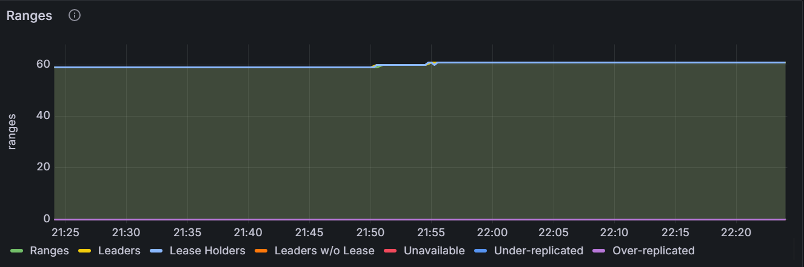

    The graph shows detailed information about ranges for the specific node or for all nodes in the cluster.

- **Replicas per Store**

    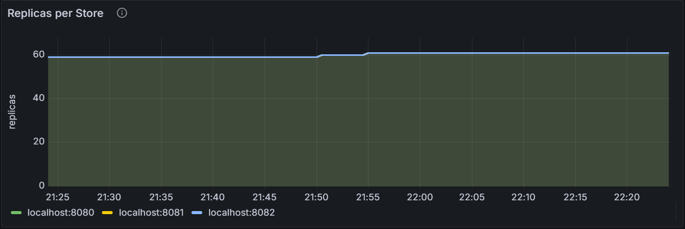

    The graph shows the number of replicas per Store for the specific node or for all nodes in the cluster.

- **Leaseholders per Store**

    The leaseholder replica refers to the replica that receives and coordinates all read and write requests for its ranges.

    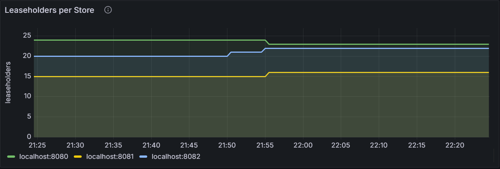

    The graph shows the number of leaseholder replicas per Store for the specific node or for all nodes in the cluster.

- **Average Queries per Store**

    The average queries per Store refers to Exponentially Weighted Moving Average (EWMA) of the the number of KV batch requests processed by the leaseholder replica per second. It records the number of KV batch requests in the last 30 minutes to help make the load re-balancing decision.

    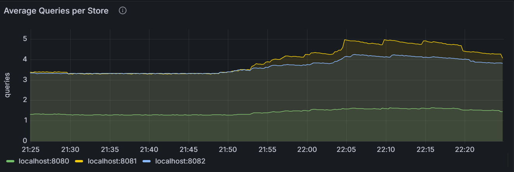

    The graph shows the average queries per Store for the specific node or for all nodes in the cluster.

- **Logical Bytes per Store**

    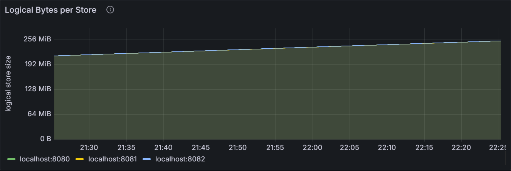

    The graph shows the number of logical bytes stored in key-value pairs for the specific node or for all nodes in the cluster. This includes historical and deleted data.

- **Replicas Quiescence**

    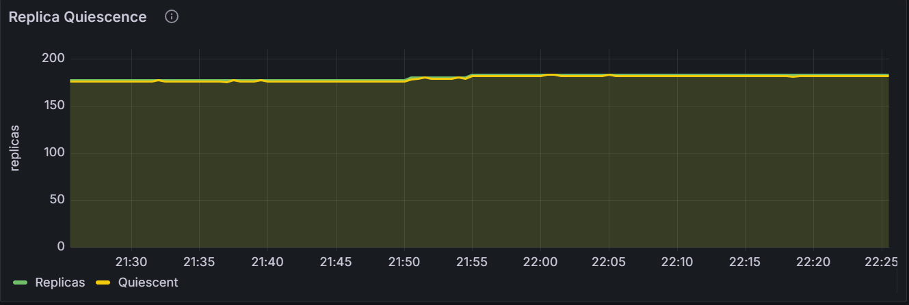

    In the node view, the graph shows the number of replicas and quiescent replicas for the specific node. In the cluster view, the graph shows the total number of replicas and quiescent replicas for all nodes in the cluster.

- **Range Operations**

    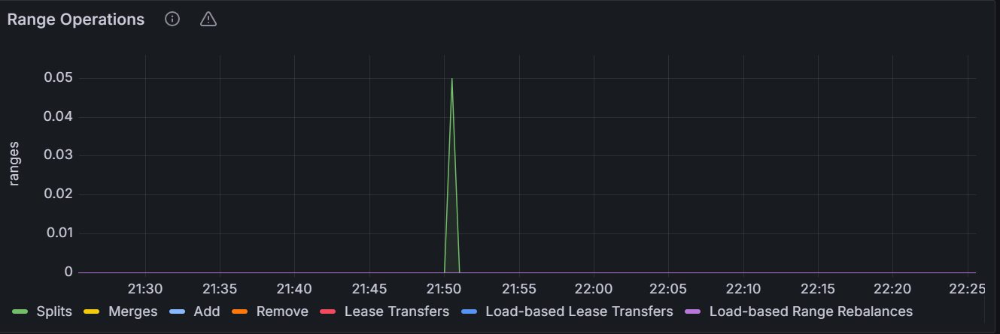

    The graph shows the number of range operations for the specific node or for all nodes in the cluster.

- **Snapshots**

    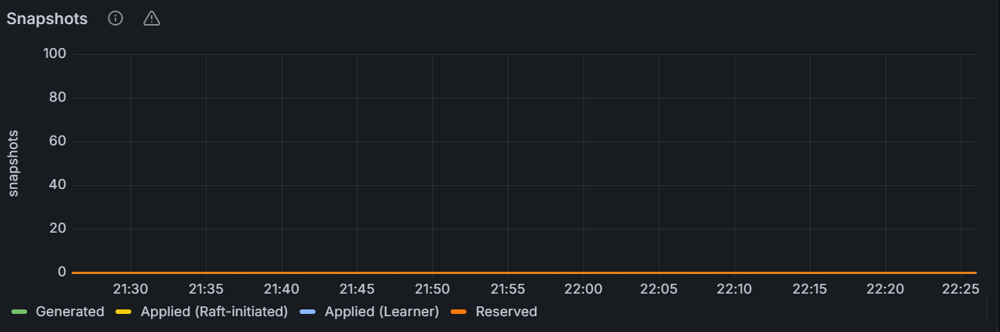

    In the node view, the graph shows the number of snapshots for the specific node. In the cluster view, the graph shows the total number of snapshots for all nodes in the cluster.

## Distribution

- **Batches**

    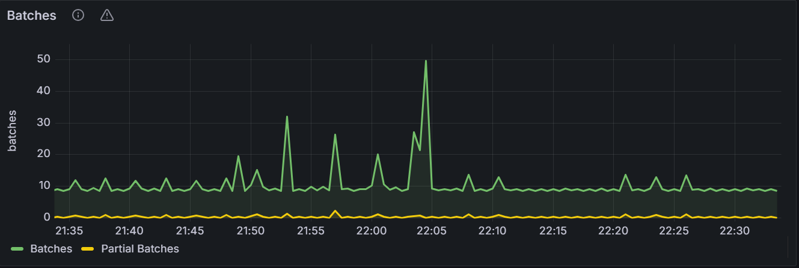

    The graph shows the number of batches for the specific node or for all nodes in the cluster.

- **RPCs**

    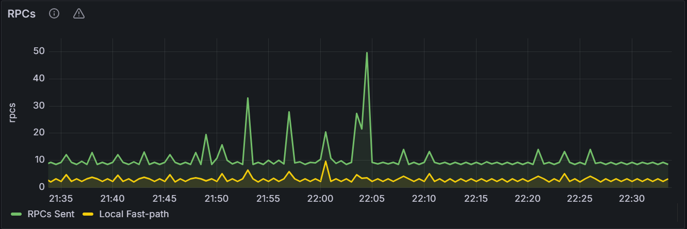

    The graph shows the number of Remote Procedure Calls (RPCs) for the specific node or for all nodes in the cluster.

- **RPC Errors**

    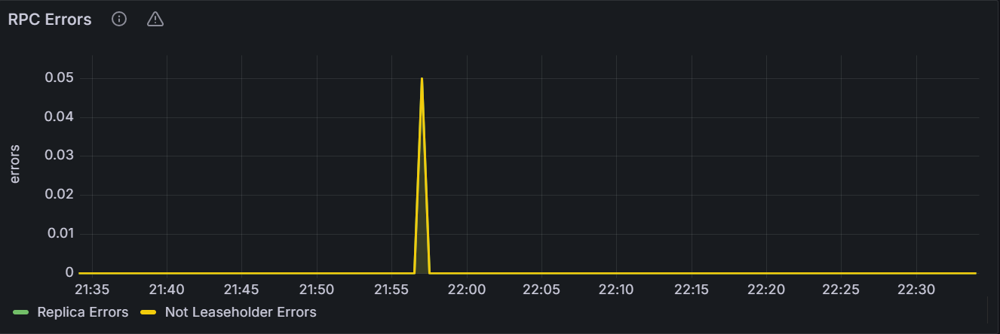

    The graph shows the number of RPC errors for the specific node or for all nodes in the cluster.

- **KV Transactions**

    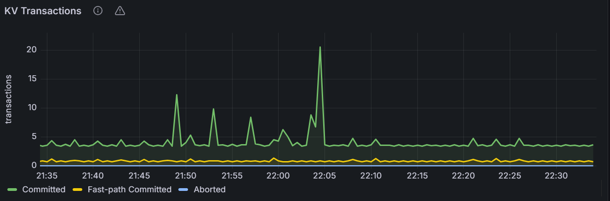

    The graph shows the number of KV transactions for the specific node or for all nodes in the cluster.

- **KV Transaction Restarts**

    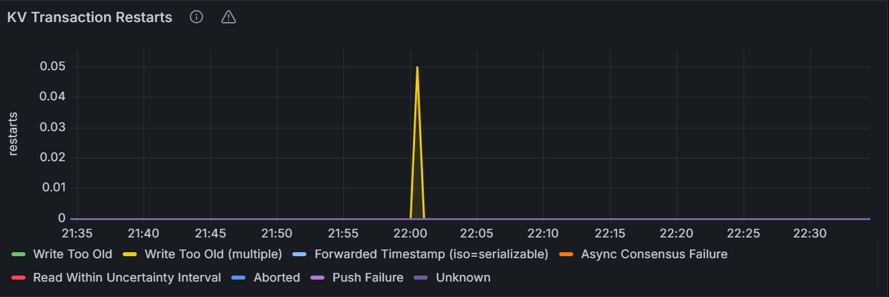

    The graph shows the number of KV transaction retries for the specific node or for all nodes in the cluster.

- **KV Transaction Durations: 99th Percentile**

    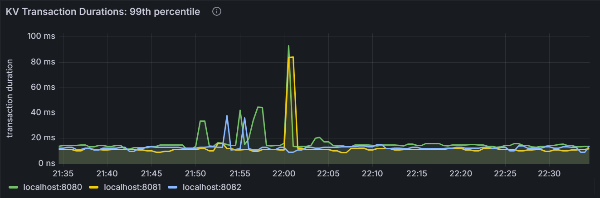

    In the node view, the graph shows the 99th percentile of transaction duration over one minute for the node. It means that this node observed 99% of transaction duration over the last minute. In the cluster view, the graph shows the 99th percentile of transaction duration across all nodes in the cluster. It means that the node observed 99% of transaction duration over the last minute.

- **KV Transaction Durations: 90th Percentile**

    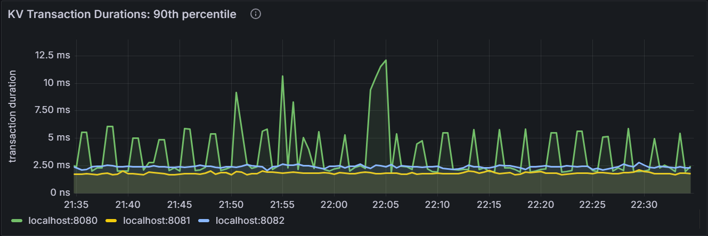

    In the node view, the graph shows the 90th percentile of transaction duration over one minute for the node. It means that this node observed 90% of transaction duration over the last minute. In the cluster view, the graph shows the 90th percentile of transaction duration across all nodes in the cluster. It means that the node observed 90% of transaction duration over the last minute.

- **Node Heartbeat Latency: 99th Percentile**

    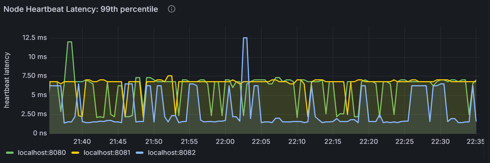

    In the node view, the graph shows the 99th percentile of heartbeat latency for the node. It means that this node observed 99% of heartbeat latency within this time. In the cluster view, the graph shows the 99th percentile of heartbeat latency across all nodes in the cluster. It means that the node observed 99% of heartbeat latency duration within this time.

- **Node Heartbeat Latency: 90th Percentile**

    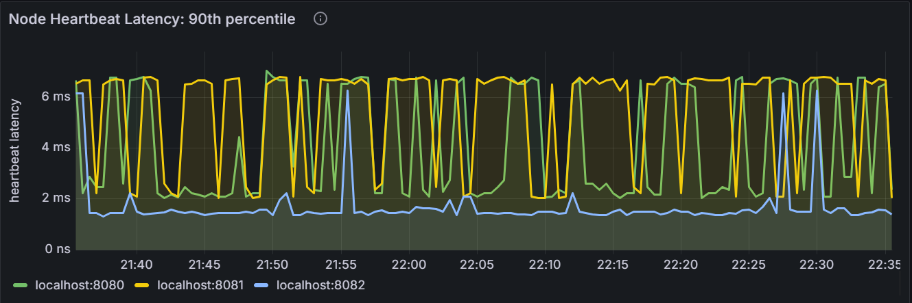

    In the node view, the graph shows the 90th percentile of heartbeat latency for the node. It means that this node observed 90% of heartbeat latency within this time. In the cluster view, the graph shows the 90th percentile of heartbeat latency across all nodes in the cluster. It means that the node observed 90% of heartbeat latency duration within this time.

## Queue

- **Queue Processing Failures**

    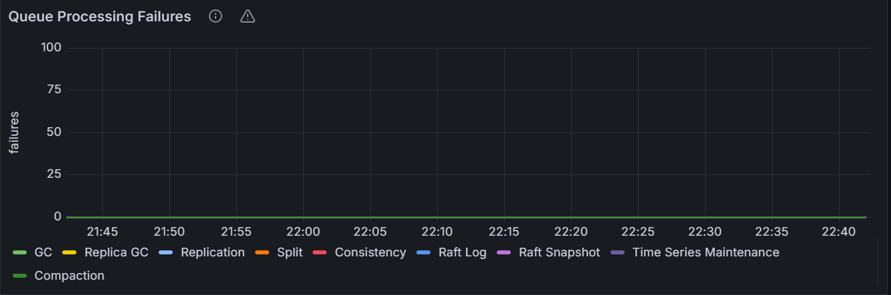

    The graph shows the number of queue processing failures for the specific node or for all nodes in the cluster.

- **Queue Processing Times**

    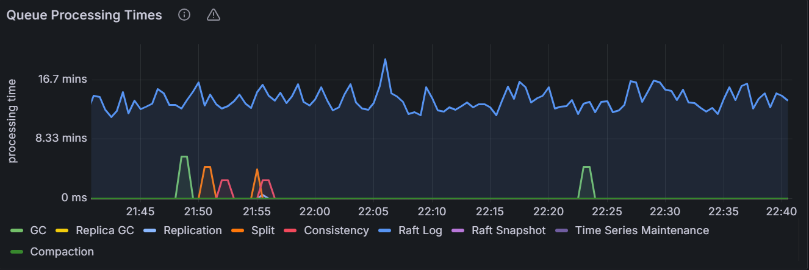

    In the node view, the graph shows the queue processing time for the specified node. In the cluster view, the graph shows the total queue processing time for all nodes in the cluster.

- **Replica GC Queue**

    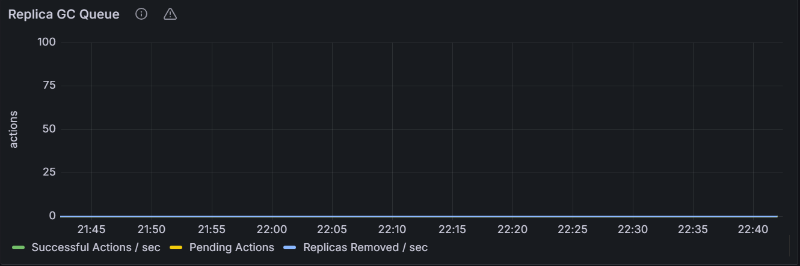

    In the node view, the graph shows the number of the replica garbage collection queues for the specified node. In the cluster view, the graph shows the total number of the replica garbage collection queues for all nodes in the cluster.

- **Replication Queue**

    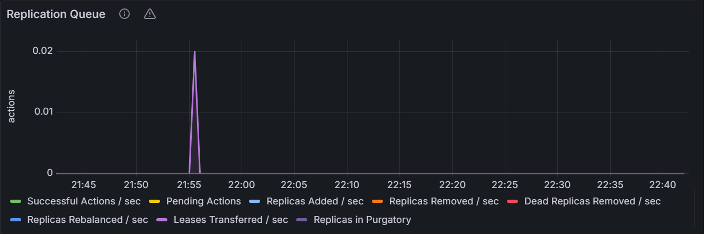

    In the node view, the graph shows the number of the replication queues for the specified node. In the cluster view, the graph shows the total number of the replication queues for all nodes in the cluster.

- **Split Queue**

    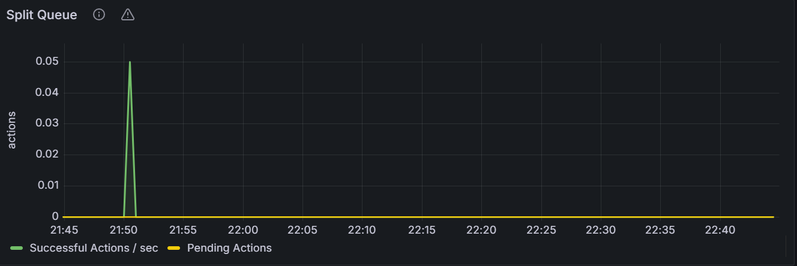

    In the node view, the graph shows the number of the split queues for the specified node. In the cluster view, the graph shows the total number of the split queues for all nodes in the cluster.

- **Merge Queue**

    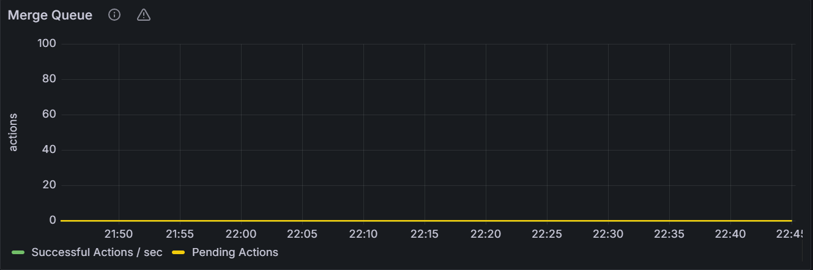

    In the node view, the graph shows the number of the merge queues for the specified node. In the cluster view, the graph shows the total number of the merge queues for all nodes in the cluster.

- **GC Queue**

    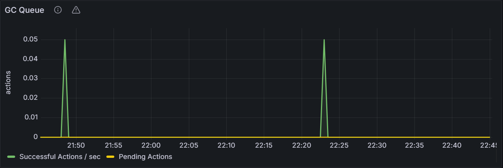

    In the node view, the graph shows the number of the garbage collection queues for the specified node. In the cluster view, the graph shows the total number of the garbage collection queues for all nodes in the cluster.

- **Raft Log Queue**

    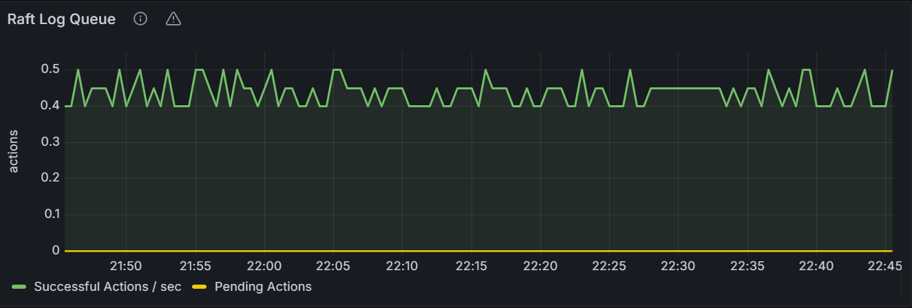

    In the node view, the graph shows the number of the Raft log queues for the specified node. In the cluster view, the graph shows the total number of the Raft log queues for all nodes in the cluster.

- **Raft Snapshot Queue**

    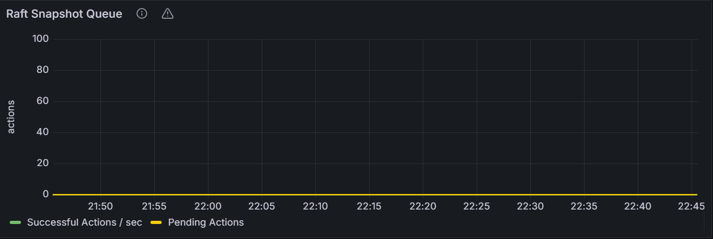

    In the node view, the graph shows the number of the Raft snapshot queues for the specified node. In the cluster view, the graph shows the total number of the Raft snapshot queues for all nodes in the cluster.

- **Consistency Checker Queue**

    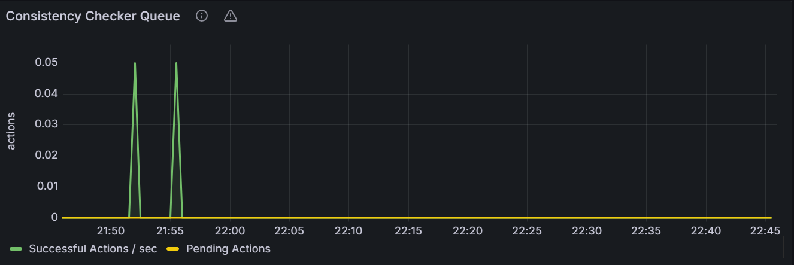

    In the node view, the graph shows the number of the consistency checker queues for the specified node. In the cluster view, the graph shows the total number of the consistency checker queues for all nodes in the cluster.

- **Metrics Monitoring Data Maintenance Queue**

    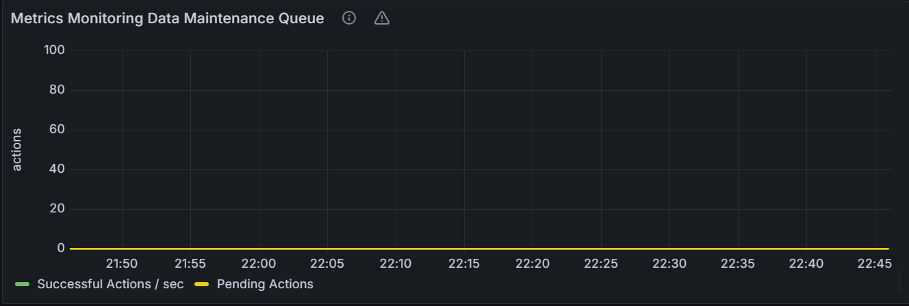

    In the node view, the graph shows the number of the Metrics monitoring maintenance queues for the specified node. In the cluster view, the graph shows the total number of the Metrics monitoring maintenance queues for all nodes in the cluster.

- **Compaction Queue**

    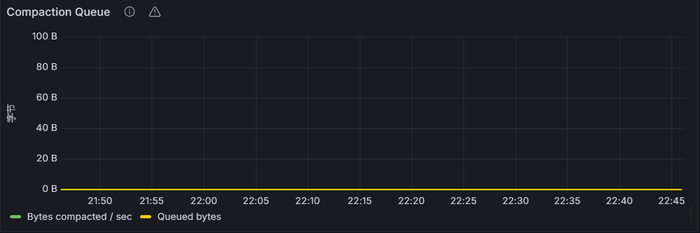

    In the node view, the graph shows the number of the completed or estimated storage bytes that are collected through RocksDB compaction for the specified node. In the cluster view, the graph shows the total number of the completed or estimated storage bytes that are collected through RocksDB compaction for all nodes in the cluster.

## Slow Query

- **Slow Raft Proposals**

    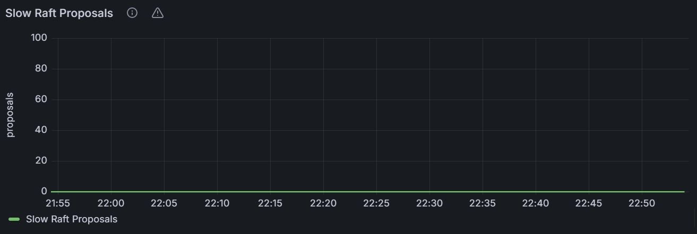

    The graph shows the number of requests that have been stuck for longer than usual while attempting to submit Raft proposals for the specific node or for all nodes in the cluster.

- **Slow DistSender RPCs**

    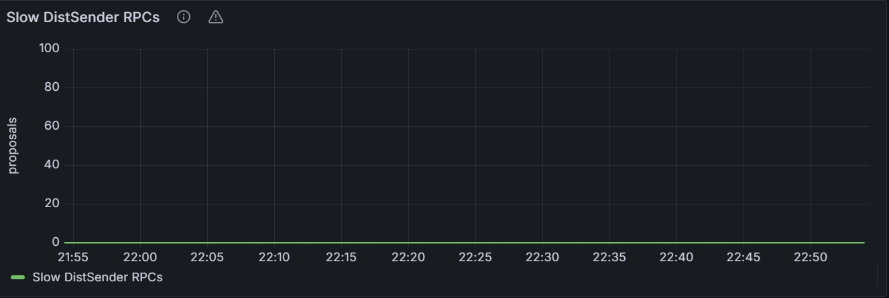

    The graph shows the number of requests that have been stucked for longer than usual while attempting to transmit PRCs between different nodes.

- **Slow Lease Acquisitions**

    In a distributed system, the lease is generally used to coordinate and synchronize operations.

    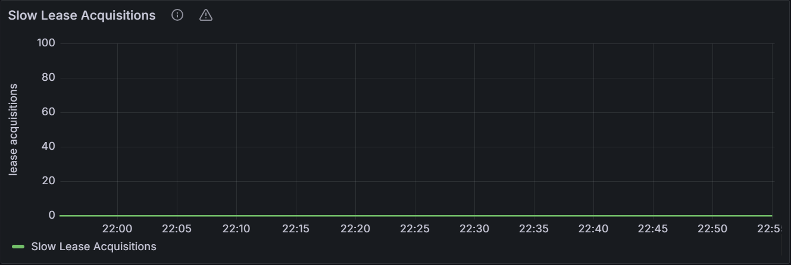

    The graph shows the number of requests that have been stuck for longer than usual while attempting to acquire a lease for the specific node or for all nodes in the cluster.

- **Slow Latch Acquisitions**

    Latch is a low-level synchronization mechanism for protecting shared resources.

    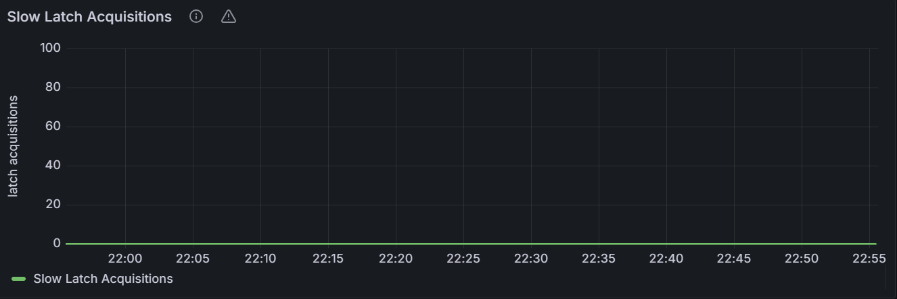

    The graph shows the number of requests that have been stuck for longer than usual while attempting to acquire a latch for the specific node or for all nodes in the cluster.
