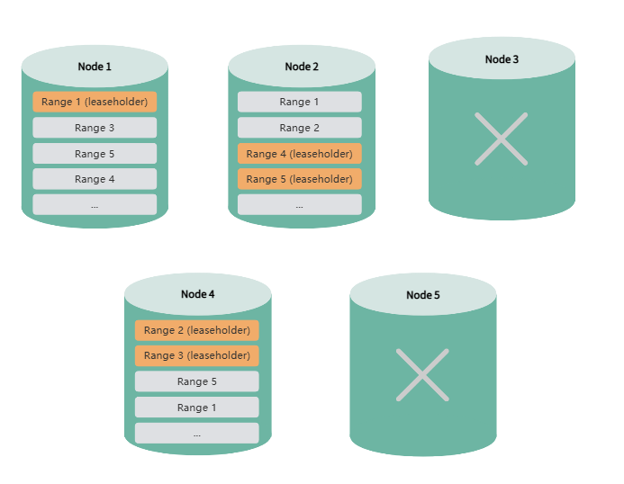

# High Availability

High Availability (HA) refers to a system's ability to switch over to a standby node or system when failures occur, ensuring continuous service availability. KaiwuDB provides multiple high availability solutions tailored to different scenarios and requirements:

**Multi-Replica Cluster**: KaiwuDB's multi-replica cluster includes built-in high availability support with automatic failover and strong data consistency. Cluster nodes maintain connections and monitor system health through regular heartbeat mechanisms, enabling prompt failure detection and automated recovery actions. For more information, see [Multi-Replica Cluster High Availability](#multi-replica-cluster-high-availability).

**Single-Node Version**: KaiwuDB single-node deployments support DRBD-based replication, an open-source solution based on DRBD (Distributed Replicated Block Device) to replicate data between master and standby nodes. For more details, see [DRBD-Based Single-Node High Availability Solution](../../best-practices/single-ha-drbd.md).

**Single-Replica Cluster**: KaiwuDB single-replica clusters do not support high availability solutions due to the lack of data redundancy.

## Multi-Replica Cluster High Availability

### Overview

KaiwuDB's multi-replica clusters are configured by default with three replicas. To ensure service continuity during node failures, the system uses a majority voting mechanism, which requires at least two replicas to remain online to guarantee data consistency and availability.

Here’s how KaiwuDB's multi-replica clusters ensure high availability with a 5-node cluster:

- **Normal Operations**: Upon cluster startup, replicas and leaseholders are evenly distributed across all nodes to ensure high data availability and load balance.

  

- **Temporary Node Unavailability**: When a node experiences problems (e.g., network delays, OS issues, disk failures) and becomes unavailable (both `is_available` and `is_live` are `false`), the system will migrate the leaseholder from the affected node. During this migration, data queries may experience temporary delays, DDL operations on tag indexes may fail, and lifecycle operations may be deferred to the next cycle.

    

- **Node Failure**: If a node exceeds the configured downtime threshold, the system will mark the node as unavailable.The system automatically creates new replicas on remaining healthy nodes. Data queries and DML operations continue uninterrupted, while DDL operations on tag indexes may fail until replicas are restored.

    

- **Node Recovery**: When a failed node returns to service, the system gradually migrates replicas and leaseholders back to the recovered node. During this process, data queries may experience temporary delays, and DDL operations on tag indexes may fail, resuming once the node is fully available.

   

- **Multiple Node Failures**: If two or more nodes fail  simultaneously, the system will not be able to maintain the required replica counts. Some data may become temporarily inaccessible and the entire cluster may become unusable.

   

::: warning Note

- **Version Upgrades**: High availability features may be affected when upgrading from KaiwuDB versions 1.x and 2.0.x to 2.0.4 using the import/export method.
- **Impact of Node Failures**:
  - Multiple node failures and rejoins may result in slower write performance.
  - Node failures or recovery processes can trigger leaseholder migrations, causing brief reads/writes lag or temporary unavailability.

:::

### Supported HA Operations

#### Node Failure Detection

By default, if a node is offline for more than 30 minutes, the system marks it as unavailable and redistributes data replicas to ensure data availability and consistency.

You can adjust this timeout period using:

```SQL
SET CLUSTER SETTING server.time_until_store_dead = <value>;
```

Set this value no lower than 75 seconds. While longer timeouts can help maintain stable performance during temporary outages, they may impact availability and DDL operations.
