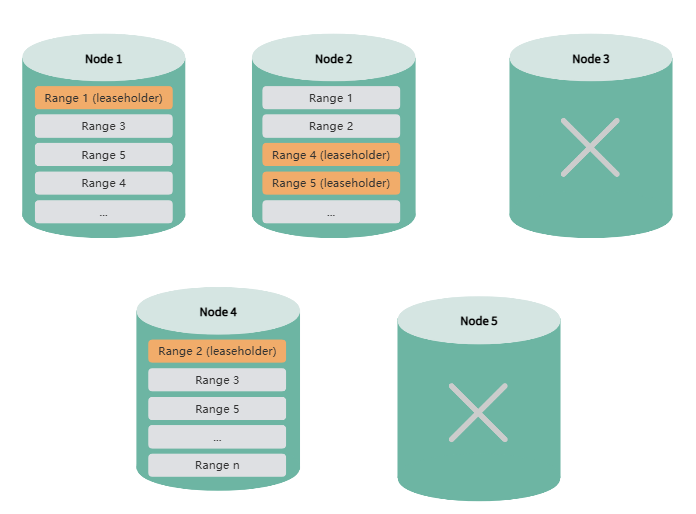

# High Availability

High Availability (HA) refers to a system's ability to switch over to a standby node or system when failures occur, ensuring continuous service availability. KWDB provides multiple high availability solutions tailored to different scenarios and requirements:

**Multi-Replica Cluster**: KWDB's multi-replica cluster includes built-in high availability support with automatic failover and strong data consistency. Cluster nodes maintain connections and monitor system health through regular heartbeat mechanisms, enabling prompt failure detection and automated recovery actions. For more information, see [Multi-Replica Cluster High Availability](#multi-replica-cluster-high-availability).

**Single-Node Version**: KWDB single-node deployments support DRBD-based replication, an open-source solution based on DRBD (Distributed Replicated Block Device) to replicate data between master and standby nodes. For more details, see [DRBD-Based Single-Node High Availability Solution](../../best-practices/single-ha-drbd.md).

**Single-Replica Cluster**: KWDB single-replica clusters do not support high availability solutions due to the lack of data redundancy.

## Multi-Replica Cluster High Availability

### Overview

KWDB multi-replica clusters provide high availability capabilities with automatic failover and strong data consistency. Nodes in the cluster maintain connections and monitor status through regular heartbeat mechanisms to detect failures promptly and take appropriate action.

KWDB multi-replica clusters use 3 replicas by default, ensuring data consistency and availability through the RAFT protocol. Therefore, at least 2 replicas must remain available for the cluster to function properly.

### Basic Concepts

| Concept | Description |
| :--- | :--- |
| Range | KWDB stores all user data (tables, indexes, etc.) and nearly all system data in a sorted map of key-value pairs. This keyspace is divided into contiguous segments called ranges, where each range contains a specific subset of keys. Any given key belongs to exactly one range. Ranges are the smallest unit for cluster high availability and data migration. |
| Replica | Each user data range has 3 replicas by default to ensure high availability. During data migration, entire replicas are moved together rather than being split or partially migrated. |
| Leaseholder | The primary replica for each range, responsible for handling read and write requests for that range. Leaseholders are elected through the RAFT protocol to ensure data consistency. |
| Node Status | Cluster nodes in KWDB can have the following states:<br>- **Live Node**: Default state indicating normal operation<br>- **Suspect Node**: Nodes without network connection for 1 minute are marked as suspect<br>- **Dead Node**: Nodes without network connection for the configured timeout (default 30 minutes) are marked as dead, triggering the replica rebalancing mechanism<br><br>**Note:** You can view node status through the KWDB monitoring platform or the `kwbase node status` command. |

### High Availability Mechanisms

The following sections use a 5-node cluster as an example to demonstrate how KWDB multi-replica clusters achieve high availability.

#### Normal Operations

When the KWDB cluster starts, range replicas are evenly distributed across all nodes to ensure high data availability and load balancing.


#### Single Node Failure

When a single node goes offline, if that node holds leaseholders for certain ranges, the system automatically elects new leaseholders from replicas on other nodes to ensure continuous data service and consistency.

During leaseholder re-election, the cluster continues to provide normal service, and both DDL and DML operations execute normally. For query operations, only queries accessing the failed node will fail. Applications can immediately retry the query, and the system will respond normally.


After a node is offline for more than 1 minute, the system marks it as a suspect node. When the offline duration reaches the configured threshold (default 30 minutes), the system marks it as a dead node. When the remaining node count is still greater than the replica count (e.g., 4 nodes remaining with 3 replicas), the system automatically rebalances missing replicas to ensure high data availability. During replica rebalancing, data queries, DDL, and DML operations are not affected. You can also disable automatic replica rebalancing through cluster parameters and re-enable it when system load is lower.

::: warning Note
If you previously set replica constraints using the `CONFIGURE ZONE` statement and the constraint rules include the suspect node, it may affect replica rebalancing. In this case, you need to reconfigure the constraint rules to remove the suspect node, and replica rebalancing will resume.
:::


When a suspect or dead node recovers, the system automatically performs data synchronization to bring it up to date. During node recovery, data queries, DDL, and DML operations are not affected.

#### Multiple Node Failures

##### Sequential Failures

If two nodes fail sequentially, and replica rebalancing is completed before the second node fails, the system can still operate normally after the second failure.

**Note:** In a 5-node, 3-replica cluster with automatic replica rebalancing disabled, the system cannot tolerate consecutive node failures.


##### Simultaneous Failures

If two or more nodes fail simultaneously, and the remaining node count is less than or equal to the replica count, the system cannot rebalance missing replicas. This may result in partial data becoming inaccessible or even render the entire cluster unusable.



::: warning Note

- High availability features may be affected when upgrading from KWDB 2.0 to 2.0.4 using the import/export method.
- Multiple node failures and rejoins may result in slower data writes.

:::

### High Availability Configuration

#### Configure Dead Node Detection Time

By default, the system marks a node as dead if it has been offline for more than 30 minutes. Once marked as dead, the system redistributes data replicas from that node to other nodes to maintain data availability and consistency.

You can configure the detection time using the following SQL command:

```sql
SET CLUSTER SETTING server.time_until_store_dead = '<value>';
```

The recommended minimum value is 75s.

**Note:** Increasing the detection time can reduce the long-term performance impact of node failures on the cluster, but may compromise high availability and affect DDL-related operations.

#### Control Automatic Replica Rebalancing After Node Death

When the system marks an offline node as dead, it automatically rebalances missing replicas to maintain high data availability—provided the remaining node count exceeds the replica count. You can disable automatic replica rebalancing using the following SQL command:

```sql
SET CLUSTER SETTING kv.allocator.ts_store_dead_rebalance.enabled = false;
```

**Note:** In a 5-node cluster with 3 replicas, disabling this feature prevents the system from tolerating consecutive node failures.

#### View Node Status

```shell
<kwbase_path>/kwbase node status [--host=<ip:port>] [--insecure | --certs-dir=<path>]
```

When both `is_available` and `is_live` are `true`, the node is operating normally. When both are `false`, the node is suspect or dead.

#### View Replica Rebalancing Status

Query for under-replicated or unavailable ranges:

```sql 
SELECT sum((metrics->>'ranges.unavailable')::DECIMAL)::INT AS ranges_unavailable,
        sum((metrics->>'ranges.underreplicated')::DECIMAL)::INT AS ranges_underreplicated
FROM kwdb_internal.kv_store_status;
```

#### View Replica Synchronization Status

View replica synchronization by importing the [Distribution panel](https://gitee.com/kwdb/kwdb/blob/master/kwbase/monitoring/grafana-dashboards/6.KaiwuDB_Console_Replication.json).