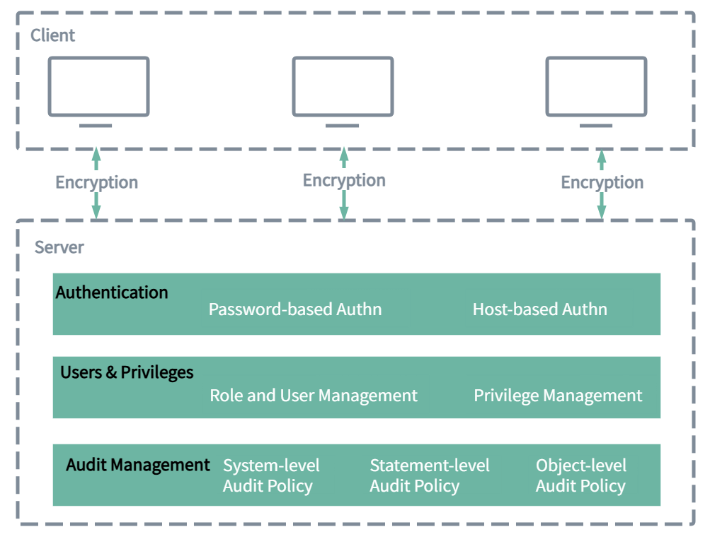

# Database Security Overview

KWDB provides a series of security features to ensure the confidentiality, integrity and availability of user data.

- **Transport Encryption**: KWDB supports encryption of data transmitted between the client and the server using the SSL/TLS protocol. This ensures that the data is not stolen or tampered during transport, improving transport security.
- **Authentication**: KWDB supports multiple authentication methods to ensure database access security.
  - Password-based authentication: It is required to provide correct username and password during login and the system will verify the credentials to allow access.
  - Host-based authentication: KWDB supports configuring host-based authentication based on certificates and passwords for specified users and specified IP address ranges through cluster parameters to precisely manage host access.
- **User and Privilege Management**: KWDB supports flexible privilege management mechanism, providing multi-level and multi-dimension privilege management functions, including:
  - Role-based privilege management: Administrators can create different roles and assign specific privileges to each role. With privilege management, users or roles are assigned to appropriate roles, thus simplifying the privilege management process and ensuring security.
  - Fine-grained object-level privilege control: KWDB allows administrators to perform fine-grained privilege control on database objects, including databases and tables. Administrators can specify exactly the types of database objects that a user or role can access and the types of operations they can perform.
  - Dynamic privilege adjustment: Administrators can adjust the privileges of users or roles at any time as needed, including granting, modifying, or revoking privileges, in a timely response to changes in business requirements or security policies to ensure system flexibility and security.
- **Audit Management**: Audit management is a core component of KWDB security management. By comprehensively logging database activities and user operations, KWDB helps monitor the security status of your database in real-time and generate detailed audit logs. These audit logs help to trace the causes of security events and strengthen the monitoring and management of the database.
