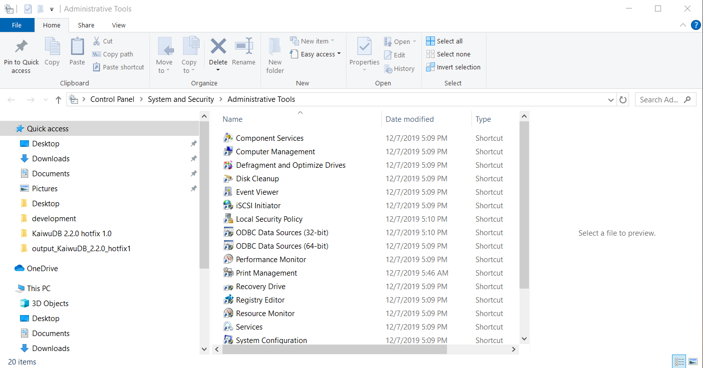

# Connect to KWDB Using PostgreSQL ODBC

Open Database Connectivity (ODBC) is a standardized application programming interface (API) that enables applications to access data across diverse database management systems. By providing a uniform interface, ODBC facilitates seamless data access and sharing across heterogeneous databases. Applications leveraging the ODBC API can connect to any ODBC-compliant database without requiring code modifications.


This section explains how to connect to KWDB using the PostgreSQL ODBC interface.

## Windows System

### Prerequisites

- [PostgreSQL ODBC driver installer](https://www.postgresql.org/ftp/odbc/releases/) obtained.
- KWDB installed and running with:
  - Properly configured database authentication
  - A database created for your connection
  - A user with appropriate privileges on tables or higher

### Install PostgreSQL ODBC Driver

1. Extract the PostgreSQL ODBC driver installation package.
2. Run `psqlodbc-setup.exe` and follow the installation prompts.

### Configure ODBC Data Source

1. Navigate to **Start** > **Control Panel** > **System and Security** > **Administrative Tools** to open the **Administrative Tools** window.

    

2. Double-click **ODBC Data Sources (64-bit)** to launch the **ODBC Data Source Administrator**.

3. Select the **User DSN** tab and click **Add**.

    

4. In the **Create New Data Source** dialog, select **PostgreSQL ANSI(x64)** and click **Finish**.

    

5. Configure the data source with the following parameters:

    

   - `Data Source`: Name of the data source.
   - `Description`: (Optional) description of the data source.
   - `Database`: Name of the KWDB database.
   - `SSL Mode`: Whether to enable SSL encryption mode. Disabled by default.
   - `Server`: IP address of the KWDB database.
   - `Port`: Connection port of the KWDB database.
   - `User Name`: Username for connecting to the database.
   - `Password`: Password used for authentication. In secure mode, SSL certificate-based authentication is recommended.

6. (Optional) Click **Test** to verify the configuration. A "Connection successful" message indicates correct configuration.

7. Click **Save** to save the configuration.

8. Click **OK** to complete the setup.

### Connection Example

#### Relational Database

The following example demonstrates how to connect to a KWDB relational database and query data using a configured data source:

```cpp{21-29}
#include <windows.h>
#include <sql.h>
#include <sqlext.h>
#include <stdio.h>

int main() {
    SQLHENV hEnv = NULL;
    SQLHDBC hDbc = NULL;
    SQLHSTMT hStmt = NULL;
    SQLRETURN retcode;
    SQLLEN id;
    SQLCHAR menuID[32];
    SQLCHAR menuName[128];

    // Allocate environment handle
    SQLAllocHandle(SQL_HANDLE_ENV, SQL_NULL_HANDLE, &hEnv);
    // Set environment attributes
    SQLSetEnvAttr(hEnv, SQL_ATTR_ODBC_VERSION, (void*)SQL_OV_ODBC3, 0);
    // Allocate connection handle
    SQLAllocHandle(SQL_HANDLE_DBC, hEnv, &hDbc);
    // Connect to the database
    SQLRETURN ret;
    ret = SQLConnect(hDbc, (SQLCHAR*)"kwdb", SQL_NTS, (SQLCHAR*)"pz", SQL_NTS, (SQLCHAR*)"123", SQL_NTS);
    if (ret != SQL_SUCCESS) {
        printf("Failed to connect the database\n\n");
    }
    else {
        printf("Connected to the database\n\n");
    }


    SQLHSTMT hStmt3 = NULL;
    SQLCHAR* create3 = (SQLCHAR*)"CREATE TABLE b(a varchar); ";
    SQLAllocHandle(SQL_HANDLE_STMT, hDbc, &hStmt3);
    ret = SQLExecDirect(hStmt3, create3, SQL_NTS);
    if (ret != SQL_SUCCESS) {
        printf("execute failed\n");
    }
    else {
        printf("execute success\n");
    }

    SQLHSTMT hStmt4 = NULL;
    SQLCHAR* query4 = (SQLCHAR*)"INSERT INTO b VALUES ('中文读取'); ";
    SQLAllocHandle(SQL_HANDLE_STMT, hDbc, &hStmt4);
    ret = SQLExecDirect(hStmt4, query4, SQL_NTS);
    if (ret != SQL_SUCCESS) {
        printf("execute failed\n");
    }
    else {
        printf("execute success\n");
    }


    SQLHSTMT hStmt9 = NULL;
    SQLCHAR* query9 = (SQLCHAR*)"select * from b;";
    // Allocate statement handle
    SQLAllocHandle(SQL_HANDLE_STMT, hDbc, &hStmt9);
    // Execute query
    ret = SQLExecDirect(hStmt9, query9, SQL_NTS);
    if (ret != SQL_SUCCESS) {
        printf("execute failed\n");
    }
    else {
        printf("execute success\n");
        ret = SQLBindCol(hStmt9, 1, SQL_C_CHAR, &menuID, sizeof(menuID), NULL);

        // Fetch data
        while ((ret = SQLFetch(hStmt9)) == SQL_SUCCESS) {
            printf("a: %s\n", menuID);
        }

        if (ret == SQL_NO_DATA) {
            printf("No more data\n");
        }
        else {
            printf("Failed to fetch data\n");
        }
    }

    // Free handles
    SQLFreeHandle(SQL_HANDLE_STMT, hStmt4);
    SQLFreeHandle(SQL_HANDLE_STMT, hStmt9);

    SQLDisconnect(hDbc);
    SQLFreeHandle(SQL_HANDLE_DBC, hDbc);
    SQLFreeHandle(SQL_HANDLE_ENV, hEnv);

    return 0;
}
```

#### Time-series Database

The time-series engine enables short-circuit write functionality by default. PostgreSQL ODBC also supports `PREPARE INSERT` statements to enhance the performance of time-series data writes.

```cpp
#include <windows.h>
#include <sql.h>
#include <sqlext.h>
#include <iostream>
#include <vector>
#include <string>
#include <iomanip>
#include <ctime>

// Validate ODBC return codes and throw exceptions on errors
void checkReturn(SQLRETURN ret, SQLHANDLE handle, SQLSMALLINT handleType, const std::string& msg) {
    if (ret != SQL_SUCCESS && ret != SQL_SUCCESS_WITH_INFO) {
        SQLCHAR sqlState[6];
        SQLCHAR message[SQL_MAX_MESSAGE_LENGTH];
        SQLSMALLINT length;
        SQLINTEGER nativeError;

        SQLGetDiagRec(handleType, handle, 1, sqlState, &nativeError, message, sizeof(message), &length);
        std::cerr << "Error: " << msg << "\nSQL State: " << sqlState << "\nMessage: " << message << std::endl;
        throw std::runtime_error(msg);
    }
}

int main() {
    SQLHENV env = nullptr;
    SQLHDBC dbc = nullptr;
    SQLHSTMT stmt = nullptr;

    try {
        // Allocate environment handle
        SQLAllocHandle(SQL_HANDLE_ENV, SQL_NULL_HANDLE, &env);
        SQLSetEnvAttr(env, SQL_ATTR_ODBC_VERSION, (void*)SQL_OV_ODBC3, 0);

        // Allocate connection handle
        SQLAllocHandle(SQL_HANDLE_DBC, env, &dbc);

        // Connect to the data source
        SQLCHAR* dsn = (SQLCHAR*)"kwdb";
        SQLCHAR* user = (SQLCHAR*)"u1";
        SQLCHAR* pass = (SQLCHAR*)"123";

        SQLRETURN ret = SQLConnect(dbc, dsn, SQL_NTS, user, SQL_NTS, pass, SQL_NTS);
        checkReturn(ret, dbc, SQL_HANDLE_DBC, "Failed to connect to data source");

        std::cout << "Connected to data source successfully." << std::endl;

        // Allocate statement handle
        SQLAllocHandle(SQL_HANDLE_STMT, dbc, &stmt);

        // Create database
        const char* createDatabaseSQL =
                "CREATE TS DATABASE tsdb";

        ret = SQLExecDirect(stmt, (SQLCHAR*)createDatabaseSQL, SQL_NTS);
        checkReturn(ret, stmt, SQL_HANDLE_STMT, "Failed to create database");
        std::cout << "Database created successfully." << std::endl;

        // Create table
        const char* createTableSQL =
                "CREATE TABLE tsdb.device_logs ("
                "    ts TIMESTAMP NOT NULL,"
                "    status_code SMALLINT,"
                "    is_online BOOLEAN,"
                "    error_count INTEGER,"
                "    device_name VARCHAR(50))"
                "TAGS ("
                "    device_id INTEGER NOT NULL,"
                "    location VARCHAR(100),"
                "    device_type VARCHAR(30)"
                ") PRIMARY TAGS (device_id)";

        ret = SQLExecDirect(stmt, (SQLCHAR*)createTableSQL, SQL_NTS);
        checkReturn(ret, stmt, SQL_HANDLE_STMT, "Failed to create table");
        std::cout << "Table created successfully." << std::endl;

        // Prepare parameterized insert statement
        const char* insertSQL =
                "INSERT INTO tsdb.device_logs VALUES (?, ?, ?, ?, ?, ?, ?, ?)";

        ret = SQLPrepare(stmt, (SQLCHAR*)insertSQL, SQL_NTS);
        checkReturn(ret, stmt, SQL_HANDLE_STMT, "Failed to prepare insert statement");

        // Define the data structure
        struct DeviceLog {
            SQL_TIMESTAMP_STRUCT ts;
            SQLSMALLINT status_code;
            SQLCHAR is_online;
            SQLINTEGER error_count;
            SQLCHAR device_name[51];
            SQLINTEGER device_id;
            SQLCHAR location[101];
            SQLCHAR device_type[31];
        };

        std::vector<DeviceLog> logs;

        // Create sample records
        DeviceLog log1 = {{2023, 6, 1, 8, 0, 0, 0}, 200, 1, 0, "", 101, "", ""};
        strncpy(reinterpret_cast<char *>(log1.device_name), "Main Server", sizeof(log1.device_name) - 1);
        strncpy(reinterpret_cast<char *>(log1.location), "Server Room", sizeof(log1.location) - 1);
        strncpy(reinterpret_cast<char *>(log1.device_type), "Server", sizeof(log1.device_type) - 1);
        logs.push_back(log1);

        DeviceLog log2 = {{2023, 6, 1, 8, 5, 0, 0}, 200, 1, 0, "", 101, "", ""};
        strncpy(reinterpret_cast<char *>(log2.device_name), "Main Server", sizeof(log2.device_name) - 1);
        strncpy(reinterpret_cast<char *>(log2.location), "Server Room", sizeof(log2.location) - 1);
        strncpy(reinterpret_cast<char *>(log2.device_type), "Server", sizeof(log2.device_type) - 1);
        logs.push_back(log2);

        DeviceLog log3 = {{2023, 6, 1, 8, 0, 0, 0}, 404, 0, 3, "", 201, "", ""};
        strncpy(reinterpret_cast<char *>(log3.device_name), "Sensor Node 1", sizeof(log3.device_name) - 1);
        strncpy(reinterpret_cast<char *>(log3.location), "Hallway", sizeof(log3.location) - 1);
        strncpy(reinterpret_cast<char *>(log3.device_type), "Sensor", sizeof(log3.device_type) - 1);
        logs.push_back(log3);

        DeviceLog log4 = {{2023, 6, 1, 8, 5, 0, 0}, 200, 1, 0, "", 201, "", ""};
        strncpy(reinterpret_cast<char *>(log4.device_name), "Sensor Node 1", sizeof(log4.device_name) - 1);
        strncpy(reinterpret_cast<char *>(log4.location), "Hallway", sizeof(log4.location) - 1);
        strncpy(reinterpret_cast<char *>(log4.device_type), "Sensor", sizeof(log4.device_type) - 1);
        logs.push_back(log4);

        DeviceLog log5 = {{2023, 6, 1, 8, 0, 0, 0}, 500, 0, 5, "", 301, "", ""};
        strncpy(reinterpret_cast<char *>(log5.device_name), "Gateway 1", sizeof(log5.device_name) - 1);
        strncpy(reinterpret_cast<char *>(log5.location), "Entrance", sizeof(log5.location) - 1);
        strncpy(reinterpret_cast<char *>(log5.device_type), "Gateway", sizeof(log5.device_type) - 1);
        logs.push_back(log5);

        // Bind parameters and execute insert
        for (auto& log : logs) {
            SQLBindParameter(stmt, 1, SQL_PARAM_INPUT, SQL_C_TYPE_TIMESTAMP, SQL_TIMESTAMP, 0, 0, &log.ts, 0, nullptr);
            SQLBindParameter(stmt, 2, SQL_PARAM_INPUT, SQL_C_SSHORT, SQL_SMALLINT, 0, 0, &log.status_code, 0, nullptr);
            SQLBindParameter(stmt, 3, SQL_PARAM_INPUT, SQL_C_BIT, SQL_BIT, 0, 0, &log.is_online, 0, nullptr);
            SQLBindParameter(stmt, 4, SQL_PARAM_INPUT, SQL_C_SLONG, SQL_INTEGER, 0, 0, &log.error_count, 0, nullptr);
            SQLBindParameter(stmt, 5, SQL_PARAM_INPUT, SQL_C_CHAR, SQL_VARCHAR, 50, 0, log.device_name, sizeof(log.device_name), nullptr);
            SQLBindParameter(stmt, 6, SQL_PARAM_INPUT, SQL_C_SLONG, SQL_INTEGER, 0, 0, &log.device_id, 0, nullptr);
            SQLBindParameter(stmt, 7, SQL_PARAM_INPUT, SQL_C_CHAR, SQL_VARCHAR, 100, 0, log.location, sizeof(log.location), nullptr);
            SQLBindParameter(stmt, 8, SQL_PARAM_INPUT, SQL_C_CHAR, SQL_VARCHAR, 30, 0, log.device_type, sizeof(log.device_type), nullptr);

            ret = SQLExecute(stmt);
            checkReturn(ret, stmt, SQL_HANDLE_STMT, "Failed to execute insert");

            SQLFreeStmt(stmt, SQL_UNBIND);
        }
        std::cout << "Data inserted successfully." << std::endl;

        //  Prepare query statement
        const char* querySQL = "SELECT * FROM tsdb.device_logs WHERE device_type = ?";
        ret = SQLPrepare(stmt, (SQLCHAR*)querySQL, SQL_NTS);
        checkReturn(ret, stmt, SQL_HANDLE_STMT, "Failed to prepare query statement");

        // Bind query parameter
        SQLCHAR deviceType[] = "Sensor";
        SQLBindParameter(stmt, 1, SQL_PARAM_INPUT, SQL_C_CHAR, SQL_VARCHAR, sizeof(deviceType)-1, 0, deviceType, sizeof(deviceType), nullptr);

        // Execute query
        ret = SQLExecute(stmt);
        checkReturn(ret, stmt, SQL_HANDLE_STMT, "Failed to execute query");

        // Bind result columns
        SQLCHAR ts[64];
        SQLSMALLINT status_code;
        SQLCHAR is_online;
        SQLINTEGER error_count;
        SQLCHAR device_name[51];
        SQLINTEGER device_id;
        SQLCHAR location[101];
        SQLCHAR device_type[31];

        SQLBindCol(stmt, 1, SQL_C_CHAR, &ts, sizeof(ts), nullptr);
        SQLBindCol(stmt, 2, SQL_C_SSHORT, &status_code, 0, nullptr);
        SQLBindCol(stmt, 3, SQL_C_BIT, &is_online, 0, nullptr);
        SQLBindCol(stmt, 4, SQL_C_SLONG, &error_count, 0, nullptr);
        SQLBindCol(stmt, 5, SQL_C_CHAR, device_name, sizeof(device_name), nullptr);
        SQLBindCol(stmt, 6, SQL_C_SLONG, &device_id, 0, nullptr);
        SQLBindCol(stmt, 7, SQL_C_CHAR, location, sizeof(location), nullptr);
        SQLBindCol(stmt, 8, SQL_C_CHAR, device_type, sizeof(device_type), nullptr);

        // Print results
        std::cout << "\nQuery results for device_type = 'Sensor':" << std::endl;
        std::cout << std::left << std::setw(20) << "Timestamp"
                  << std::setw(10) << "Status"
                  << std::setw(8) << "Online"
                  << std::setw(10) << "Errors"
                  << std::setw(15) << "Device Name"
                  << std::setw(8) << "Dev ID"
                  << std::setw(15) << "Location"
                  << std::setw(10) << "Type" << std::endl;

        while (SQLFetch(stmt) == SQL_SUCCESS) {
            std::cout << std::setw(20) << ts
                      << std::setw(10) << status_code
                      << std::setw(8) << (int)is_online
                      << std::setw(10) << error_count
                      << std::setw(15) << device_name
                      << std::setw(8) << device_id
                      << std::setw(15) << location
                      << std::setw(10) << device_type << std::endl;
        }

        std::cout << "\nAll operations completed successfully." << std::endl;
    } catch (const std::exception& e) {
        std::cerr << "Error: " << e.what() << std::endl;
        return 1;
    }

    // Free handles
    if (stmt) SQLFreeHandle(SQL_HANDLE_STMT, stmt);
    if (dbc) {
        SQLDisconnect(dbc);
        SQLFreeHandle(SQL_HANDLE_DBC, dbc);
    }
    if (env) SQLFreeHandle(SQL_HANDLE_ENV, env);

    return 0;
}
```

## Linux System

### Prerequisites

- The following software packages installed:
  - libgcc (version 9.4.0 or above)
  - [postgresql-devel](https://pkgs.org/download/postgresql-devel) (version 10.5 or above)
  - [unixODBC-devel](https://pkgs.org/download/unixODBC-devel) (version 2.3.7 or above)
- KWDB installed and running with:
  - Properly configured database authentication
  - A database created for connection
  - A user with appropriate table-level or higher privileges

### Install Required Packages

- libgcc

    Contact [KWDB Technical Support](https://www.kaiwudb.com/support/).

- postgresql-devel

    ```shell
    yum install postgresql-devel
    ```

- unixODBC-devel

    ```shell
    yum install unixODBC-devel
    ```

### Install PostgreSQL ODBC Driver

1. Download and install the driver:

    ```bash
    wget https://update.cs2c.com.cn/NS/V10/V10SP3-2403/os/adv/lic/base/x86_64/Packages/postgresql-odbc-13.00.0000-1.ky10.x86_64.rpm
    sudo rpm -ivh postgresql-odbc-13.00.0000-1.ky10.x86_64.rpm
    ```

2. Verify the installation:

    - Verify if [unixODBC](https://www.unixodbc.org/) is installed:

        ```shell
        odbcinst -j
        ```

    - Verify if the PostgreSQL ODBC driver is installed:

        ```shell
        odbcinst -q -d
        ```

    You can also examine the `/etc/odbcinst.ini` file to confirm installed drivers.

### Configure ODBC Data Source

1. Open the ODBC configuration file (`odbc.ini`):

    ```shell
    vim /etc/odbc.ini
    ```

2. Add your data source configuration:

    ```ini
    [kwdb]
    Description = PostgreSQL
    Driver = PostgreSQL
    Trace = No
    TraceFile = /tmp/pgodbc.log
    Database = defaultdb
    Servername = xx.xx.xx.xx
    UserName = user1
    Password = 123456
    Port = pppp
    ```

    - `Description`: (Optional) Description of the data source.
    - `Driver`: Name of the ODBC driver.
    - `Trace`: Whether to enable ODBC tracing. Disabled by default.
    - `TraceFile`: Path to ODBC trace log file.
    - `Database`: Name of the KWDB database.
    - `Servername`: IP address of the KWDB database.
    - `UserName`: Username for database access.
    - `Password`: Password for authentication.
    - `Port`: Port for connecting to the KWDB database.

    For more configuration options, see the [PostgreSQL ODBC documentation](https://odbc.postgresql.org/docs/config.html).

3. Verify that unixODBC recognizes your data source:

    ```shell
    odbcinst -q -s
    ```

    Expected output:

    ```shell
    [kwdb]
    ```

### Connection Example

#### Relational Database

The following example demonstrates how to connect to a KWDB database and query data using a configured data source:

1. Create a demo program file.

    The following example creates a demo file named `demo.cpp`:

    ```shell
    vim demo.cpp
    ```

2. Add the following code to `demo.cpp`:

    ```cpp{22-30}
    #include <stdio.h>
    #include <sql.h>
    #include <sqlext.h>
    #include <fstream>
    #include <string>
    
    int main() {
        SQLHENV hEnv = NULL;
        SQLHDBC hDbc = NULL;
        SQLHSTMT hStmt = NULL;
        SQLRETURN retcode;
        SQLLEN id;
        SQLCHAR menuID[32];
        SQLCHAR menuName[128];
    
        // Allocate environment handle
        SQLAllocHandle(SQL_HANDLE_ENV, SQL_NULL_HANDLE, &hEnv);
        // Set environment attributes
        SQLSetEnvAttr(hEnv, SQL_ATTR_ODBC_VERSION, (void*)SQL_OV_ODBC3, 0);
        // Allocate connection handle
        SQLAllocHandle(SQL_HANDLE_DBC, hEnv, &hDbc);
        // Connect to the database
        SQLRETURN ret;
        ret = SQLConnect(hDbc, (SQLCHAR*)"kwdb", SQL_NTS, (SQLCHAR*)"pz", SQL_NTS, (SQLCHAR*)"123", SQL_NTS);
        if (ret != SQL_SUCCESS) {
            printf("Failed to connect the database\n\n");
        }
        else {
            printf("Connected to the database\n\n");
        }


        SQLHSTMT hStmt3 = NULL;
        SQLCHAR* create3 = (SQLCHAR*)"CREATE TABLE b(a varchar); ";
        SQLAllocHandle(SQL_HANDLE_STMT, hDbc, &hStmt3);
        ret = SQLExecDirect(hStmt3, create3, SQL_NTS);
        if (ret != SQL_SUCCESS) {
            printf("execute failed\n");
        }
        else {
            printf("execute success\n");
        }
    
        SQLHSTMT hStmt4 = NULL;
        SQLCHAR* query4 = (SQLCHAR*)"INSERT INTO b VALUES ('中文读取'); ";
        SQLAllocHandle(SQL_HANDLE_STMT, hDbc, &hStmt4);
        ret = SQLExecDirect(hStmt4, query4, SQL_NTS);
        if (ret != SQL_SUCCESS) {
            printf("execute failed\n");
        }
        else {
            printf("execute success\n");
        }


        SQLHSTMT hStmt9 = NULL;
        SQLCHAR* query9 = (SQLCHAR*)"select * from b;";
        // Allocate statement handle
        SQLAllocHandle(SQL_HANDLE_STMT, hDbc, &hStmt9);
        // Execute the query
        ret = SQLExecDirect(hStmt9, query9, SQL_NTS);
        if (ret != SQL_SUCCESS) {
            printf("execute failed\n");
        }
        else {
            printf("execute success\n");
            ret = SQLBindCol(hStmt9, 1, SQL_C_CHAR, &menuID, sizeof(menuID), NULL);
    
            // Fetch data
            while ((ret = SQLFetch(hStmt9)) == SQL_SUCCESS) {
                printf("a: %s\n", menuID);
            }
    
            if (ret == SQL_NO_DATA) {
                printf("No more data\n");
            }
            else {
                printf("Failed to fetch data\n");
            }
        }
    
        // Free handles
        SQLFreeHandle(SQL_HANDLE_STMT, hStmt4);
        SQLFreeHandle(SQL_HANDLE_STMT, hStmt9);
    
        SQLDisconnect(hDbc);
        SQLFreeHandle(SQL_HANDLE_DBC, hDbc);
        SQLFreeHandle(SQL_HANDLE_ENV, hEnv);
    
        return 0;
    }
    ```

3. Compile the `demo.cpp` file using the g++ compiler:

    ```shell
    g++ demo.cpp -lodbc -o demo
    ```

    This creates a binary executable named `demo`.

4. Execute the program:

    ```shell
    ./demo
    ```

#### Time-series Database

The time-series engine enables short-circuit write functionality by default. PostgreSQL ODBC also supports `PREPARE INSERT` statements to enhance the performance of time-series data writes.

The following example demonstrates how to connect to a KWDB database and query data using a configured data source:

1. Create a demo program file.

    The following example creates a demo file named `demo1.cpp`:

    ```shell
    vim demo1.cpp
    ```

2. Add the following code to `demo1.cpp`:

    ```cpp
    #include <sql.h>
    #include <sqlext.h>
    #include <iostream>
    #include <vector>
    #include <string>
    #include <iomanip>
    #include <ctime>
    #include <cstring>

    // Validate ODBC return codes and throw exceptions on errors
    void checkReturn(SQLRETURN ret, SQLHANDLE handle, SQLSMALLINT handleType, const std::string& msg) {
        if (ret != SQL_SUCCESS && ret != SQL_SUCCESS_WITH_INFO) {
            SQLCHAR sqlState[6];
            SQLCHAR message[SQL_MAX_MESSAGE_LENGTH];
            SQLSMALLINT length;
            SQLINTEGER nativeError;

            SQLGetDiagRec(handleType, handle, 1, sqlState, &nativeError, message, sizeof(message), &length);
            std::cerr << "Error: " << msg << "\nSQL State: " << sqlState << "\nMessage: " << message << std::endl;
            throw std::runtime_error(msg);
        }
    }

    int main() {
        SQLHENV env = nullptr;
        SQLHDBC dbc = nullptr;
        SQLHSTMT stmt = nullptr;

        try {
            //  Allocate environment handle
            SQLAllocHandle(SQL_HANDLE_ENV, SQL_NULL_HANDLE, &env);
            SQLSetEnvAttr(env, SQL_ATTR_ODBC_VERSION, (void*)SQL_OV_ODBC3, 0);

            // Allocate connection handle
            SQLAllocHandle(SQL_HANDLE_DBC, env, &dbc);

            // Connect to the data source
            SQLCHAR* dsn = (SQLCHAR*)"kwdb";
            SQLCHAR* user = (SQLCHAR*)"u1";
            SQLCHAR* pass = (SQLCHAR*)"123";

            SQLRETURN ret = SQLConnect(dbc, dsn, SQL_NTS, user, SQL_NTS, pass, SQL_NTS);
            checkReturn(ret, dbc, SQL_HANDLE_DBC, "Failed to connect to data source");

            std::cout << "Connected to data source successfully." << std::endl;

            // Allocate statement handle
            SQLAllocHandle(SQL_HANDLE_STMT, dbc, &stmt);

            // Create database
            const char* createDatabaseSQL =
                    "CREATE TS DATABASE tsdb";

            ret = SQLExecDirect(stmt, (SQLCHAR*)createDatabaseSQL, SQL_NTS);
            checkReturn(ret, stmt, SQL_HANDLE_STMT, "Failed to create database");
            std::cout << "Database created successfully." << std::endl;

            // Create table
            const char* createTableSQL =
                    "CREATE TABLE tsdb.device_logs ("
                    "    ts TIMESTAMP NOT NULL,"
                    "    status_code SMALLINT,"
                    "    is_online BOOLEAN,"
                    "    error_count INTEGER,"
                    "    device_name VARCHAR(50))"
                    "TAGS ("
                    "    device_id INTEGER NOT NULL,"
                    "    location VARCHAR(100),"
                    "    device_type VARCHAR(30)"
                    ") PRIMARY TAGS (device_id)";

            ret = SQLExecDirect(stmt, (SQLCHAR*)createTableSQL, SQL_NTS);
            checkReturn(ret, stmt, SQL_HANDLE_STMT, "Failed to create table");
            std::cout << "Table created successfully." << std::endl;

            // Prepare parameterized insert statement
            const char* insertSQL =
                    "INSERT INTO tsdb.device_logs VALUES (?, ?, ?, ?, ?, ?, ?, ?)";

            ret = SQLPrepare(stmt, (SQLCHAR*)insertSQL, SQL_NTS);
            checkReturn(ret, stmt, SQL_HANDLE_STMT, "Failed to prepare insert statement");

            // Define the data structure
            struct DeviceLog {
                SQL_TIMESTAMP_STRUCT ts;
                SQLSMALLINT status_code;
                SQLCHAR is_online;
                SQLINTEGER error_count;
                SQLCHAR device_name[51];
                SQLINTEGER device_id;
                SQLCHAR location[101];
                SQLCHAR device_type[31];
            };

            std::vector<DeviceLog> logs;

            // Create sample records
            DeviceLog log1 = {{2023, 6, 1, 8, 0, 0, 0}, 200, 1, 0, "", 101, "", ""};
            strncpy(reinterpret_cast<char *>(log1.device_name), "Main Server", sizeof(log1.device_name) - 1);
            strncpy(reinterpret_cast<char *>(log1.location), "Server Room", sizeof(log1.location) - 1);
            strncpy(reinterpret_cast<char *>(log1.device_type), "Server", sizeof(log1.device_type) - 1);
            logs.push_back(log1);

            DeviceLog log2 = {{2023, 6, 1, 8, 5, 0, 0}, 200, 1, 0, "", 101, "", ""};
            strncpy(reinterpret_cast<char *>(log2.device_name), "Main Server", sizeof(log2.device_name) - 1);
            strncpy(reinterpret_cast<char *>(log2.location), "Server Room", sizeof(log2.location) - 1);
            strncpy(reinterpret_cast<char *>(log2.device_type), "Server", sizeof(log2.device_type) - 1);
            logs.push_back(log2);

            DeviceLog log3 = {{2023, 6, 1, 8, 0, 0, 0}, 404, 0, 3, "", 201, "", ""};
            strncpy(reinterpret_cast<char *>(log3.device_name), "Sensor Node 1", sizeof(log3.device_name) - 1);
            strncpy(reinterpret_cast<char *>(log3.location), "Hallway", sizeof(log3.location) - 1);
            strncpy(reinterpret_cast<char *>(log3.device_type), "Sensor", sizeof(log3.device_type) - 1);
            logs.push_back(log3);

            DeviceLog log4 = {{2023, 6, 1, 8, 5, 0, 0}, 200, 1, 0, "", 201, "", ""};
            strncpy(reinterpret_cast<char *>(log4.device_name), "Sensor Node 1", sizeof(log4.device_name) - 1);
            strncpy(reinterpret_cast<char *>(log4.location), "Hallway", sizeof(log4.location) - 1);
            strncpy(reinterpret_cast<char *>(log4.device_type), "Sensor", sizeof(log4.device_type) - 1);
            logs.push_back(log4);

            DeviceLog log5 = {{2023, 6, 1, 8, 0, 0, 0}, 500, 0, 5, "", 301, "", ""};
            strncpy(reinterpret_cast<char *>(log5.device_name), "Gateway 1", sizeof(log5.device_name) - 1);
            strncpy(reinterpret_cast<char *>(log5.location), "Entrance", sizeof(log5.location) - 1);
            strncpy(reinterpret_cast<char *>(log5.device_type), "Gateway", sizeof(log5.device_type) - 1);
            logs.push_back(log5);

            // Bind parameters and execute insert
            for (auto& log : logs) {
                SQLBindParameter(stmt, 1, SQL_PARAM_INPUT, SQL_C_TYPE_TIMESTAMP, SQL_TIMESTAMP, 0, 0, &log.ts, 0, nullptr);
                SQLBindParameter(stmt, 2, SQL_PARAM_INPUT, SQL_C_SSHORT, SQL_SMALLINT, 0, 0, &log.status_code, 0, nullptr);
                SQLBindParameter(stmt, 3, SQL_PARAM_INPUT, SQL_C_BIT, SQL_BIT, 0, 0, &log.is_online, 0, nullptr);
                SQLBindParameter(stmt, 4, SQL_PARAM_INPUT, SQL_C_SLONG, SQL_INTEGER, 0, 0, &log.error_count, 0, nullptr);
                SQLBindParameter(stmt, 5, SQL_PARAM_INPUT, SQL_C_CHAR, SQL_VARCHAR, 50, 0, log.device_name, sizeof(log.device_name), nullptr);
                SQLBindParameter(stmt, 6, SQL_PARAM_INPUT, SQL_C_SLONG, SQL_INTEGER, 0, 0, &log.device_id, 0, nullptr);
                SQLBindParameter(stmt, 7, SQL_PARAM_INPUT, SQL_C_CHAR, SQL_VARCHAR, 100, 0, log.location, sizeof(log.location), nullptr);
                SQLBindParameter(stmt, 8, SQL_PARAM_INPUT, SQL_C_CHAR, SQL_VARCHAR, 30, 0, log.device_type, sizeof(log.device_type), nullptr);

                ret = SQLExecute(stmt);
                checkReturn(ret, stmt, SQL_HANDLE_STMT, "Failed to execute insert");

                SQLFreeStmt(stmt, SQL_UNBIND);
            }
            std::cout << "Data inserted successfully." << std::endl;

            //  Prepare query statement
            const char* querySQL = "SELECT * FROM tsdb.device_logs WHERE device_type = ?";
            ret = SQLPrepare(stmt, (SQLCHAR*)querySQL, SQL_NTS);
            checkReturn(ret, stmt, SQL_HANDLE_STMT, "Failed to prepare query statement");

            // Bind query parameter
            SQLCHAR deviceType[] = "Sensor";
            SQLBindParameter(stmt, 1, SQL_PARAM_INPUT, SQL_C_CHAR, SQL_VARCHAR, sizeof(deviceType)-1, 0, deviceType, sizeof(deviceType), nullptr);

            // Execute query
            ret = SQLExecute(stmt);
            checkReturn(ret, stmt, SQL_HANDLE_STMT, "Failed to execute query");

            // Bind result columns
            SQLCHAR ts[64];
            SQLSMALLINT status_code;
            SQLCHAR is_online;
            SQLINTEGER error_count;
            SQLCHAR device_name[51];
            SQLINTEGER device_id;
            SQLCHAR location[101];
            SQLCHAR device_type[31];

            SQLBindCol(stmt, 1, SQL_C_CHAR, &ts, sizeof(ts), nullptr);
            SQLBindCol(stmt, 2, SQL_C_SSHORT, &status_code, 0, nullptr);
            SQLBindCol(stmt, 3, SQL_C_BIT, &is_online, 0, nullptr);
            SQLBindCol(stmt, 4, SQL_C_SLONG, &error_count, 0, nullptr);
            SQLBindCol(stmt, 5, SQL_C_CHAR, device_name, sizeof(device_name), nullptr);
            SQLBindCol(stmt, 6, SQL_C_SLONG, &device_id, 0, nullptr);
            SQLBindCol(stmt, 7, SQL_C_CHAR, location, sizeof(location), nullptr);
            SQLBindCol(stmt, 8, SQL_C_CHAR, device_type, sizeof(device_type), nullptr);

            // Print results
            std::cout << "\nQuery results for device_type = 'Sensor':" << std::endl;
            std::cout << std::left << std::setw(20) << "Timestamp"
                      << std::setw(10) << "Status"
                      << std::setw(8) << "Online"
                      << std::setw(10) << "Errors"
                      << std::setw(15) << "Device Name"
                      << std::setw(8) << "Dev ID"
                      << std::setw(15) << "Location"
                      << std::setw(10) << "Type" << std::endl;

            while (SQLFetch(stmt) == SQL_SUCCESS) {
                std::cout << std::setw(20) << ts
                          << std::setw(10) << status_code
                          << std::setw(8) << (int)is_online
                          << std::setw(10) << error_count
                          << std::setw(15) << device_name
                          << std::setw(8) << device_id
                          << std::setw(15) << location
                          << std::setw(10) << device_type << std::endl;
            }

            std::cout << "\nAll operations completed successfully." << std::endl;
        } catch (const std::exception& e) {
            std::cerr << "Error: " << e.what() << std::endl;
            return 1;
        }

        // Free handles
        if (stmt) SQLFreeHandle(SQL_HANDLE_STMT, stmt);
        if (dbc) {
            SQLDisconnect(dbc);
            SQLFreeHandle(SQL_HANDLE_DBC, dbc);
        }
        if (env) SQLFreeHandle(SQL_HANDLE_ENV, env);

        return 0;
    }
    ```

3. Compile the `demo1.cpp` file using the g++ compiler:

    ```shell
    g++ demo.cpp -lodbc -o demo1
    ```

    This creates a binary executable named `demo1`.

4. Execute the program:

    ```shell
    ./demo1
    ```

## Supported ODBC Interfaces

KWDB supports the following ODBC interfaces:

| Interface           | Conformance Level | Description                                                  |
| ------------------- | ----------------- | ------------------------------------------------------------ |
| `SQLAllocHandle`    | Core              | Allocates environment, connection, statement, or descriptor handles. |
| `SQLBindCol`        | Core              | Allocates storage for result columns and specifies data types. |
| `SQLBindParameter`  | Core              | Allocates storage for parameters in SQL statements. **Note**: The ODBC driver does not support multi-row parameter binding during the `prepare` operation. Using multi-row binding may cause data type conversion errors; row-by-row binding is recommended. |
| `SQLCloseCursor`    | Core              | Closes a cursor previously opened on a statement handle.     |
| `SQLColAttribute`   | Core              | Describes the attributes of columns in a result set.         |
| `SQLColumns`        | Core              | Returns a list of column names in a specified table.         |
| `SQLConnect`        | Core              | Connects to a specific driver using data source name, user ID, and password. |
| `SQLDataSources`    | Core              | Returns a list of available data sources.                    |
| `SQLDescribeCol`    | Core              | Describes columns in a result set.                           |
| `SQLDisconnect`     | Core              | Closes the connection.                                       |
| `SQLDriverConnect`  | Core              | Connects to a specific driver using a connection string or by prompting the user via connection dialog boxes. |
| `SQLDrivers`        | Core              | Returns a list of installed drivers and their attributes.    |
| `SQLExecDirect`     | Core              | Executes a statement.                                        |
| `SQLExecute`        | Core              | Executes a prepared statement.                               |
| `SQLFetch`          | Core              | Retrieves multiple rows of result data.                      |
| `SQLFreeHandle`     | Core              | Frees environment, connection, statement, or descriptor handles. |
| `SQLFreeStmt`       | Core              | Ends statement processing, discards pending results, and optionally frees all resources associated with the statement handle. |
| `SQLGetConnectAttr` | Core              | Returns the value of a connection attribute.                 |
| `SQLGetCursorName`  | Core              | Returns the name of the cursor associated with a statement handle. |
| `SQLGetData`        | Core              | Retrieves all or part of a column's data from the current row of a result set, typically used to fetch large data values. |
| `SQLGetDiagField`   | Core              | Returns diagnostic information (a single field of the diagnostic data structure). |
| `SQLGetDiagRec`     | Core              | Returns diagnostic information (multiple fields of the diagnostic data structure). |
| `SQLGetEnvAttr`     | Core              | Returns the value of an environment attribute.               |
| `SQLGetFunctions`   | Core              | Returns the supported driver functions.                      |
| `SQLGetInfo`        | Core              | Returns information about a specific driver and data source. |
| `SQLGetStmtAttr`    | Core              | Returns the value of a statement attribute.                  |
| `SQLGetTypeInfo`    | Core              | Returns information about supported data types.              |
| `SQLNativeSql`      | Core              | Returns the SQL text translated by the driver.               |
| `SQLNumParams`      | Core              | Returns the number of parameters in an SQL statement.        |
| `SQLNumResultCols`  | Core              | Returns the number of columns in a result set.               |
| `SQLParamData`      | Core              | Used with `SQLPutData` to supply parameter data at execution time, typically for large or long data values. |
| `SQLPrepare`        | Core              | Prepares an SQL statement for later execution.               |
| `SQLPutData`        | Core              | Sends part or all of a parameter’s data value, typically for large or long data values. |
| `SQLRowCount`       | Core              | Returns the number of rows affected by an insert, update, or delete operation. |
| `SQLSetConnectAttr` | Core              | Sets connection attributes.                                  |
| `SQLSetCursorName`  | Core              | Specifies a cursor name.                                     |
| `SQLSetDescField`   | Core              | Sets a single descriptor field.                              |
| `SQLSetEnvAttr`     | Core              | Sets environment attributes.                                 |
| `SQLSetStmtAttr`    | Core              | Sets statement attributes, including resetting all to default values or setting specific ones. |
| `SQLStatistics`     | Core              | Returns statistics about a single table and its associated indexes. |
| `SQLTables`         | Core              | Returns a list of table names stored in a specific data source. |
| `SQLMoreResults`    | Level 1           | Determines whether more result sets are available and initializes processing of the next set. |
| `SQLProcedures`     | Level 1           | Returns a name list of procedures stored in a specific data source. |
| `SQLSetPos`         | Level 1           | Positions the cursor within a block of fetched data and allows applications to refresh, update, or delete rows in the result set. |
| `SQLDescribeParam`  | Level 2           | Returns descriptive information for a specific parameter in a statement. |