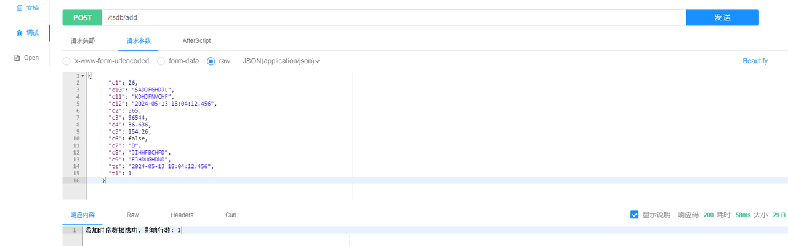
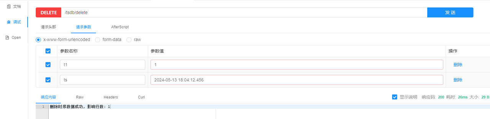
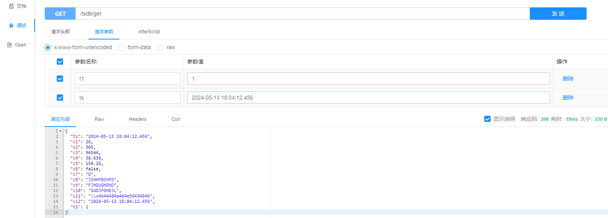
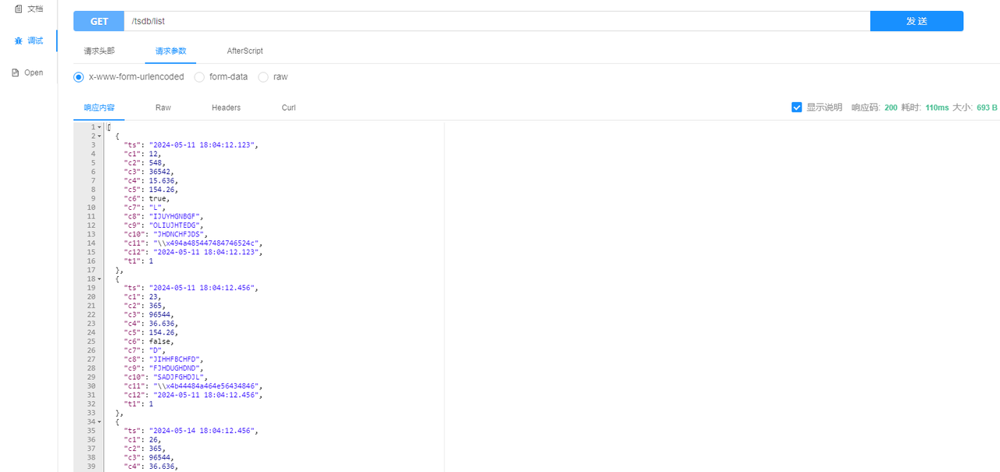
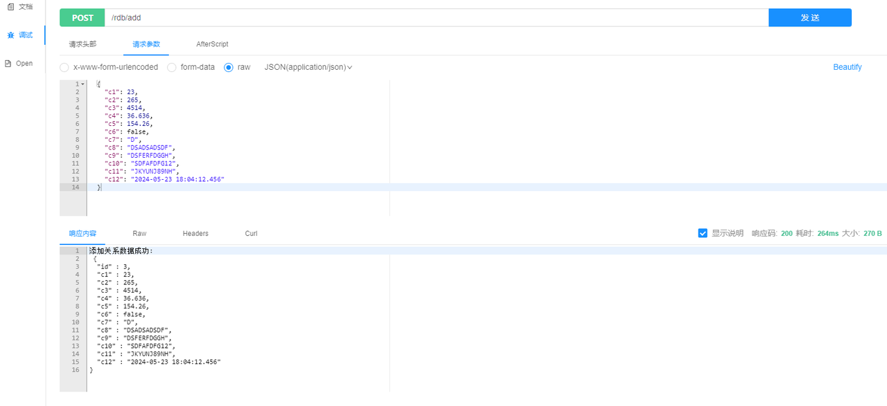
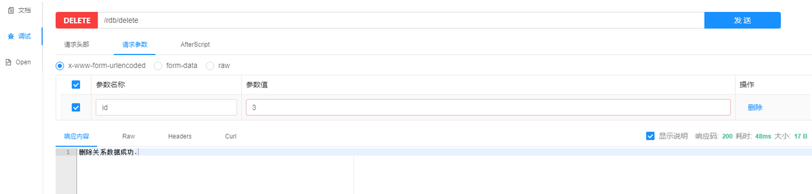
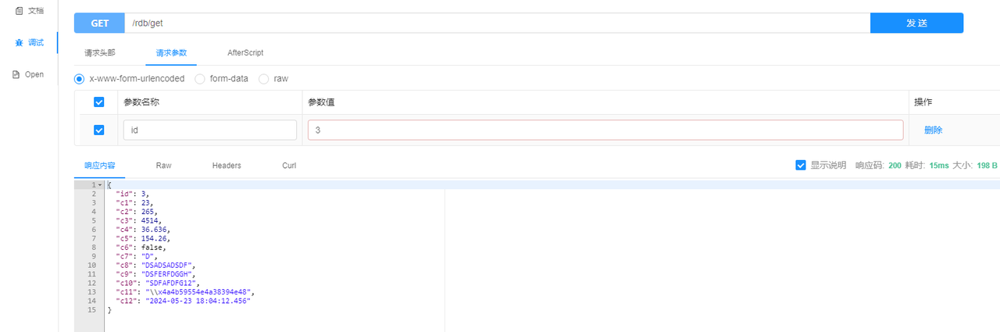
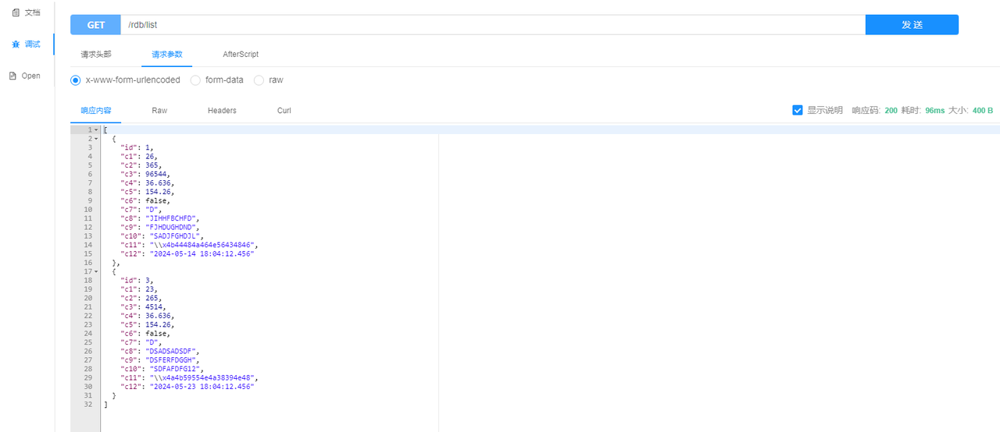

# Connect to KWDB using Hibernate

Hibernate is a widely used Object-Relational Mapping (ORM) framework that simplifies database persistence operations in Java applications. It allows developers to interact with databases using Java objects without writing extensive SQL code.

KWDB provides a dedicated Dialect specifically designed for its database system, defining its SQL dialect specifications to ensure Hibernate generates compatible SQL queries for KWDB's database engines.

With KWDB's Hibernate integration, developers can:

- Connect to KWDB databases using the familiar Hibernate framework within Spring Boot projects
- Leverage Java Persistence API (JPA) for standardized database operations
- Perform data querying, writing, and deletion operations using object-oriented paradigms
- Utilize standard Hibernate features while working with KWDB

## Prerequisites

- [OpenJDK 1.8 or higher]((https://openjdk.org/install/)) installed
- [Maven 3.6 or higher](https://maven.apache.org/install.html) installed
- [Spring Boot 2.3.2 or higher](https://spring.io/projects/spring-boot) installed
- KaiwuDB JDBC driver package obtained
- KaiwuDB-adapted Hibernate Core 5.6.16 package
- KWDB version 2.0.4 or higher installed and running with:
  - Properly configured database authentication
  - A database created for your connection
  - A user with appropriate privileges on tables or higher

## Environment Setup

1. In your project directory, create a `pom.xml` file and include the dependencies for JPA, Hibernate, and KaiwuDB JDBC driver:

   ```XML
   <?xml version="1.0" encoding="UTF-8"?>
   <project xmlns="http://maven.apache.org/POM/4.0.0"
            xmlns:xsi="http://www.w3.org/2001/XMLSchema-instance"
            xsi:schemaLocation="http://maven.apache.org/POM/4.0.0 http://maven.apache.org/xsd/maven-4.0.0.xsd">
     <modelVersion>4.0.0</modelVersion>
   
     <parent>
       <groupId>org.springframework.boot</groupId>
       <artifactId>spring-boot-starter-parent</artifactId>
       <version>2.3.2.RELEASE</version>
       <relativePath/>
     </parent>
   
     <groupId>com.kaiwudb.hibernate</groupId>
     <artifactId>kwdb-hibernate</artifactId>
     <version>1.0</version>
   
     <name>kwdb-hibernate</name>
     <packaging>pom</packaging>
     <description>This program is use kaiwudb jdbc test hibernate framework example.</description>
   
     <properties>
       <project.build.sourceEncoding>UTF-8</project.build.sourceEncoding>
       <project.reporting.outputEncoding>UTF-8</project.reporting.outputEncoding>
       <maven.compiler.encoding>UTF-8</maven.compiler.encoding>
       <maven.compiler.source>8</maven.compiler.source>
       <maven.compiler.target>8</maven.compiler.target>
       <maven.compiler.version>3.8.1</maven.compiler.version>
       <java.version>1.8</java.version>
     </properties>
   
     <modules>
       <module>relational</module>
       <module>time-series</module>
     </modules>
   
     <dependencies>
       <dependency>
         <groupId>org.springframework.boot</groupId>
         <artifactId>spring-boot-starter</artifactId>
       </dependency>
       <dependency>
         <groupId>org.springframework.boot</groupId>
         <artifactId>spring-boot-starter-web</artifactId>
       </dependency>
       <dependency>
         <groupId>org.springframework.boot</groupId>
         <artifactId>spring-boot-starter-test</artifactId>
         <scope>test</scope>
       </dependency>
       <!-- jpa -->
       <dependency>
         <groupId>org.springframework.boot</groupId>
         <artifactId>spring-boot-starter-data-jpa</artifactId>
         <exclusions>
           <exclusion>
             <groupId>org.hibernate</groupId>
             <artifactId>hibernate-core</artifactId>
           </exclusion>
         </exclusions>
       </dependency>
       <!-- hibernate-core -->
       <dependency>
         <groupId>org.hibernate</groupId>
         <artifactId>hibernate-core</artifactId>
         <version>5.6.16.RELEASE</version>
       </dependency>
       <!-- kaiwudb-jdbc-->
       <dependency>
         <groupId>com.kaiwudb</groupId>
         <artifactId>kaiwudb-jdbc</artifactId>
         <version>2.2.0</version>
       </dependency>
       <!-- mockito-core -->
       <dependency>
         <groupId>org.mockito</groupId>
         <artifactId>mockito-core</artifactId>
         <version>2.19.1</version>
         <scope>test</scope>
       </dependency>
     </dependencies>
   </project>
   ```

2. If the KaiwuDB JDBC driver cannot be loaded, run the following command to install the driver into your local Maven repository:

   ```shell
   mvn install:install-file "-Dfile=../kaiwudb-jdbc-2.2.0.jar" "-DgroupId=com.kaiwudb" "-DartifactId=kaiwudb-jdbc" "-Dversion=2.2.0" "-Dpackaging=jar"
   ```

3. Install the KaiwuDB-adapted Hibernate Core package into your local Maven repository:

   Example:

   ```Shell
   mvn install:install-file "-Dfile=../hibernate-core-5.6.16.RELEASE.jar" "-DpomFile=../hibernate-core-5.6.16.RELEASE.pom" "-DgroupId=org.hibernate -DartifactId=hibernate-core" "-Dversion=5.6.16.RELEASE" "-Dpackaging=jar"
   ```

## Database Configuration and Usage

The configuration and usage involve the following steps:

1. **Configure the data source**: Specify the database dialect and other connection properties. For time-series databases, transaction management must be disabled.

2. **Define entity classes**: These classes map to database tables and data types. Entity classes typically use JPA annotations to specify table names and field mappings.

3. **Define data access interfaces**: These interfaces define interactions with the database, including queries and updates.

4. **Define service interfaces and implementations**: The service layer encapsulates data access operations and provides unified business logic interfaces and handling methods for applications.

5. **Define the controller layer**: The controller layer handles incoming user requests, invokes the appropriate service methods to execute business logic, and returns the processed results to the user.

KWDB supports both time-series and relational databases, each with specific configuration requirements.

### Time-Series Databases

::: warning Note
For time-series data, KWDB supports explicit transactions for queries and writes, but does not support transaction-based DDL operations. To ensure proper functionality, transaction management must be disabled when working with time-series operations.
:::

1. In the `application.yml` file under the `resources` directory, configure the data source, disable transaction management, and specify the dialect package.

   Example:

   ```YAML
   spring:
     datasource:
       driver-class-name: com.kaiwudb.Driver
       url: jdbc:kaiwudb://127.0.0.1:26257/test_tsdb
       username: <user_name>
       password: <password>
     jpa:
       properties:
          Disable transaction management
         javax.persistence.transactionType: RESOURCE_LOCAL
       open-in-view: false
       hibernate:
         ddl-auto: update
       show-sql: true
       database-platform: org.hibernate.dialect.KaiwuDBDialect
   server:
     port: 9001
   ```

2. Define the entity class in the `entity` directory, for example `TsdbEntity.java`.

   Example:

   In this example, the name value in the `@Table` annotation (`tsdb_table`) corresponds to the time-series table in KWDB. Each field maps to a currently supported data type. The `t1` column serves as the primary tag column in the time-series table.

   ```Java
   @Data
   @Entity
   @Table(name = "tsdb_table")
   public class TsdbEntity {
     @Id
     @JsonFormat(shape = JsonFormat.Shape.STRING, pattern = "yyyy-MM-dd HH:mm:ss.SSS", timezone = "GMT+8")
     private Timestamp ts;
     private Short c1;
     private Integer c2;
     private Long c3;
     private Float c4;
     private Double c5;
     private Boolean c6;
     private String c7;
     private String c8;
     private String c9;
     private String c10;
     private String c11;
     @JsonFormat(shape = JsonFormat.Shape.STRING, pattern = "yyyy-MM-dd HH:mm:ss.SSS", timezone = "GMT+8")
     private Timestamp c12;
     private Integer t1;
   }
   ```

3. Define the data access layer in the `repository` directory.

   Example:

    ```Java
    @Repository
    public interface TsdbEntityRepository extends JpaRepository<TsdbEntity, Timestamp> {
   
      TsdbEntity findByT1AndTs(@Param("t1") int t1, @Param("ts") Timestamp ts);
   
      List<TsdbEntity> findAll();
   
    }
    ```

4. Define the Service interface and implementation.

   1. Define the Service interface in the `service` directory.

      Example:

      ```Java
      public interface TsdbService {
      
        int insert(TsdbEntity entity);
      
        int delete(int t1, String ts);
      
        TsdbEntity findByT1AndTs(int t1, String ts) throws Exception;
      
        List<TsdbEntity> findList();
      
      }
      ```

   2. Define the implementation in the `service/impl` directory.

      ::: warning Note

      For time-series databases, we implement `INSERT` and `DELETE` operations using `JdbcTemplate` instead of JPA because JPA requires transaction management, which is not supported for time-series DDL operations in KWDB.

      :::

      Example:

      ```Java
      @Service
      class TsdbServiceImpl implements TsdbService {
      
        @Autowired
        private JdbcTemplate jdbcTemplate;
        @Autowired
        private TsdbEntityRepository repository;
      
        @Override
        public int insert(TsdbEntity entity) {
          String sql = "INSERT INTO tsdb_table (ts, c1, c2, c3, c4, c5, c6, c7, c8, c9, c10, c11, c12, t1) VALUES (?, ?, ?, ?, ?, ?, ?, ?, ?, ?, ?, ?, ?, ?)";
          return jdbcTemplate.update(sql, entity.getTs(), entity.getC1(), entity.getC2(), entity.getC3(), entity.getC4(), entity.getC5(), entity.getC6(), entity.getC7(), entity.getC8(), entity.getC9(), entity.getC10(), entity.getC11(), entity.getC12(), entity.getT1());
        }
      
        @Override
        public int delete(int t1, String ts) {
          String sql = "DELETE FROM tsdb_table WHERE t1 = ? AND ts = ?";
          return jdbcTemplate.update(sql, t1, ts);
        }
      
        @Override
        public TsdbEntity findByT1AndTs(int t1, String ts) throws Exception {
          SimpleDateFormat sdf = new SimpleDateFormat("yyyy-MM-dd HH:mm:ss.SSS");
          return repository.findByT1AndTs(t1, new Timestamp(sdf.parse(ts).getTime()));
        }
      
        @Override
        public List<TsdbEntity> findList() {
          return repository.findAll();
        }
      
      }
      ```

5. Define the controller in the `controller` directory.

   Example:

   ```Java
   @RestController
   @RequestMapping("tsdb")
   public class TsdbController {
     @Autowired
     private TsdbService service;
   
     @PostMapping("add")
     public String add(@RequestBody TsdbEntity entity) {
       try {
         if (entity == null) {
           return ""Failed to receive time-series data!";
         }
         if (entity.getTs() == null || entity.getT1() == null) {
           return "Timestamp and tag columns cannot be null!";
         }
         int rows = service.insert(entity);
         if (rows < 1) {
           return "Failed to add time-series data!";
         }
         return "Successfully added time-series data. Rows affected: " + rows;
       } catch (Exception e) {
         return e.getMessage();
       }
     }
   
     @DeleteMapping("delete")
     public String delete(@RequestParam(value = "t1") Integer t1, @RequestParam(value = "ts") String ts) {
       try {
         int rows = service.delete(t1, ts);
         if (rows < 1) {
           return "Failed to delete time-series data!";
         }
         return "Successfully deleted time-series data. Rows affected: " + rows;
       } catch (Exception e) {
         return e.getMessage();
       }
     }
   
     @GetMapping("get")
     public TsdbEntity get(@RequestParam(value = "t1") Integer t1, @RequestParam(value = "ts") String ts) throws Exception {
       return service.findByT1AndTs(t1, ts);
     }
   
     @GetMapping("list")
     public List<TsdbEntity> list() {
       return service.findList();
     }
   
   }
   ```

6. Verification

   - Adding data
     
   - Deleting data
     
   - Querying data by the primary tag and timestamp
     
   - Querying full dataset
     

### Relational Databases

1. In the `application.yml` file under the `resources` directory, configure the data source and specify the dialect package.

   Example:

   ```YAML
   spring:
     datasource:
       driver-class-name: com.kaiwudb.Driver
       url: jdbc:kaiwudb://127.0.0.1:26257/test_rdb
       username: <user_name>
       password: <password>
     jpa:
       open-in-view: false
       hibernate:
         ddl-auto: update
       show-sql: true
       database-platform: org.hibernate.dialect.KaiwuDBDialect
   server:
     port: 9002
   ```

2. In the `entity` directory, define the entity class that maps to the relational table, for example `RdbEntity.java`.

   Example:

   In this example, the `name` value in the `@Table` annotation (`rdb_table`) corresponds to the relational table in KWDB. Each field maps to a supported data type. The `id` field uses a SEQUENCE for automatic generation, so the following annotations are required:

   ```Shell
   @SequenceGenerator(name = "sequence", sequenceName = "rdb_table_id", allocationSize = 1)
   @GeneratedValue(strategy = GenerationType.SEQUENCE, generator = "sequence")
   ```

   ```Java
   @Data
   @Entity
   @Table(name = "rdb_table")
   @SequenceGenerator(name = "sequence", sequenceName = "rdb_table_id", allocationSize = 1)
   public class RdbEntity {
     @Id
     @GeneratedValue(strategy = GenerationType.SEQUENCE, generator = "sequence")
     private Integer id;
     private Short c1;
     private Integer c2;
     private Long c3;
     private Float c4;
     private Double c5;
     private Boolean c6;
     private String c7;
     private String c8;
     private String c9;
     private String c10;
     private String c11;
     @JsonFormat(shape = JsonFormat.Shape.STRING, pattern = "yyyy-MM-dd HH:mm:ss.SSS", timezone = "GMT+8")
     private Timestamp c12;
   }
   ```

   The SQL needed to create the relational table and sequence is as follows:

   ```SQL
   CREATE SEQUENCE rdb_table_id START 1 INCREMENT 1;
   
   CREATE TABLE test_rdb.rdb_table
   (
       id  int PRIMARY KEY DEFAULT nextval('rdb_table_id'),
       c1  smallint,
       c2  int,
       c3  bigint,
       c4  float4,
       c5  float8,
       c6  bool,
       c7  char(1),
       c8  nchar(10),
       c9  varchar(10),
       c10 nvarchar(10),
       c11 bytes,
       c12 timestamp
   );
   ```

3. Define the data access layer in the `repository` directory.

   Example:

   ```Java
   @Repository
   public interface RdbEntityRepository extends JpaRepository<RdbEntity, Integer> {
   
     @Override
     <S extends RdbEntity> S saveAndFlush(S entity);
   
     @Override
     void deleteInBatch(Iterable<RdbEntity> list);
   
     RdbEntity getById(@Param("id") Integer id);
   
     List<RdbEntity> findAll();
   
   }
   ```

4. Define the Service interface and implementation.

   1. Create the Service interface in the `service` directory.

      Example:

        ```Java
        public interface RdbService {
      
          RdbEntity save(RdbEntity entity);
      
          void delete(List<RdbEntity> list);
      
          RdbEntity findById(Integer id);
      
          List<RdbEntity> findList();
      
        }
        ```

   2. Create the implementation in the `service/impl` directory.

      Example:

      ```Java
      @Service
      class RdbServiceImpl implements RdbService {
      
        @Autowired
        private RdbEntityRepository repository;
      
        @Override
        public RdbEntity save(RdbEntity entity) {
          return repository.saveAndFlush(entity);
        }
      
        @Override
        public void delete(List<RdbEntity> list) {
          repository.deleteInBatch(list);
        }
      
        @Override
        public RdbEntity findById(Integer id) {
          return repository.getById(id);
        }
      
        @Override
        public List<RdbEntity> findList() {
          return repository.findAll();
        }
      
      }
      ```

5. Define the Controller in the `controller` directory.

   Example:

   ```Java
   @RestController
   @RequestMapping("rdb")
   public class RdbController {
     @Autowired
     private RdbService service;
   
     @PostMapping("add")
     public String add(@RequestBody RdbEntity entity) {
       try {
         if (entity == null) {
           return "Failed to receive relational data!";
         }
         return "Successfully added relational data:\n " + Json.pretty(service.save(entity));
       } catch (Exception e) {
         return e.getMessage();
       }
     }
   
     @DeleteMapping("delete")
     public String delete(@RequestParam(value = "id") Integer id) {
       try {
         RdbEntity entity = service.findById(id);
         if (entity == null) {
           return "Relational data does not exist.";
         }
         service.delete(Collections.singletonList(entity));
         return "Successfully deleted relational data.";
       } catch (Exception e) {
         return e.getMessage();
       }
     }
   
     @GetMapping("get")
     public RdbEntity get(@RequestParam(value = "id") Integer id) throws Exception {
       return service.findById(id);
     }
   
     @GetMapping("list")
     public List<RdbEntity> list() {
       return service.findList();
     }
   
   }
   ```

6. Verification

   - Adding data
     
   - Deleting data
     
   - Querying data by ID
     
   - Querying full dataset
     