# Connect to KWDB Using MyBatis-Plus

[MyBatis-Plus](https://baomidou.com/en/getting-started/) is an enhancement of MyBatis that provides numerous convenient features, including conditional constructors, pagination plugins, and code generators, which significantly improve development efficiency.

This section demonstrates how to integrate KWDB with a Maven-managed Spring Boot project using MyBatis-Plus for data access and management. For frequently asked questions about using MyBatis-Plus, see [MyBatis and MyBatis-Plus](../../../faqs/faqs.md#mybatis-and-mybatis-plus).

This example uses the following tools and frameworks:

- JDK: OpenJDK 1.8.0_402
- Maven: Apache Maven 3.6.3
- Spring Boot: 2.7.18
- MyBatis-Plus: com.baomidou:mybatis-plus-boot-starter:3.5.5

## Prerequisites

- [OpenJDK 1.8 or higher](https://openjdk.org/install/) installed.
- [Maven 3.6 or higher](https://maven.apache.org/install.html) installed.
- KaiwuDB JDBC driver package obtained.
- KWDB installed and running with:
  - Properly configured database authentication
  - A database created for your connection
  - A user with appropriate privileges on tables or higher

The following example assumes you have already created a relational database and table structure. If not, run the following SQL commands:

1. Create the database.

   ```sql
   CREATE DATABASE kaiwudb_app;
   ```

2. Create the table.

   ```sql
   CREATE TABLE IF NOT EXISTS kaiwudb_app.sensor_data (
       id SERIAL PRIMARY KEY,
       sensor_id VARCHAR(20) NOT NULL,
       temperature DOUBLE,
       humidity DOUBLE,
       pressure DOUBLE,
       distance INT,
       description VARCHAR(255),
       is_active BOOLEAN DEFAULT true,
       raw_data BYTEA,
       record_time TIMESTAMP DEFAULT NOW(),
       del_flag CHAR(1)
   );
   ```

## Environment Setup

### Initializing the Project

1. Create a Spring Boot project in IntelliJ IDEA and configure the JDK 8 environment.

   ::: warning Note
   The official site defaults to JDK 17 as the minimum version. Change the Server URL to Aliyun: start.aliyun.com, and then set the Java version.
   :::

   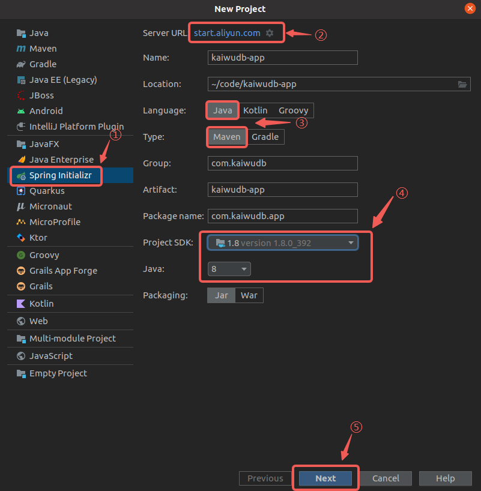

2. Select the required dependencies and complete project creation.

   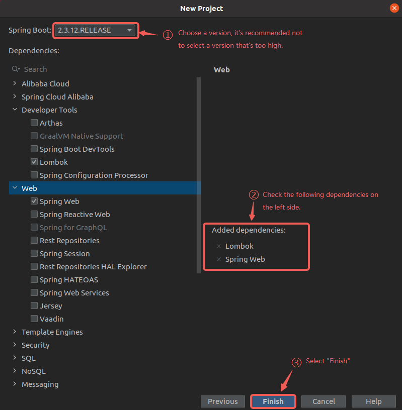

3. Rename `application.properties` in the `/src/main/resources` directory to `application.yml`.
   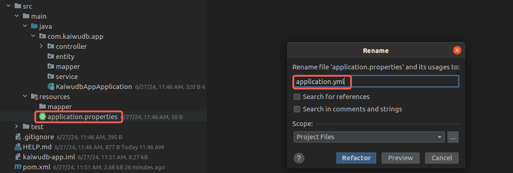

### Adding Dependencies

1. Add the MyBatis-Plus dependency to the `pom.xml` file.

   ::: tip

   It is recommended to use MyBatis-Plus version 3.4.3 or higher.

   :::

   ```xml
   <!--  https://mvnrepository.com/artifact/com.baomidou/mybatis-plus-boot-starter  -->
   <dependency>
     <groupId>com.baomidou</groupId>
     <artifactId>mybatis-plus-boot-starter</artifactId>
     <version>3.5.5</version>
   </dependency>
   ```

2. Add the KaiwuDB JDBC dependency to the `pom.xml` file.

   ```xml
   <!-- KaiwuDB JDBC 2.2.0 -->
   <dependency>
     <groupId>com.kaiwudb</groupId>
     <artifactId>kaiwudb-jdbc</artifactId>
     <version>2.2.0</version>
   </dependency>
   ```

3. If the KaiwuDB JDBC driver cannot be loaded, run the following command to install it into your local Maven repository:

   ```shell
   mvn install:install-file "-Dfile=../kaiwudb-jdbc-2.2.0.jar" "-DgroupId=com.kaiwudb" "-DartifactId=kaiwudb-jdbc" "-Dversion=2.2.0" "-Dpackaging=jar"
   ```

## Configuring the Connection

1. Configure the database connection parameters in the `application.yml` file.

   ```yaml
   spring:
     datasource:
       url: jdbc:kaiwudb://127.0.0.1:26257/kaiwudb_app  # Database connection URL
       username: <user_name>                             # Username for database connection
       password: <password>                              # Password for database connection
       driver-class-name: com.kaiwudb.Driver              # JDBC driver class name
   ```

2. In `application.yml`, configure the mapper scan path, global settings, and custom SQL interceptor parameters for MyBatis-Plus.

   ```yaml
   mybatis-plus:
     configuration:
       map-underscore-to-camel-case: true  # Enable automatic mapping for camel case
       log-impl: org.apache.ibatis.logging.stdout.StdOutImpl  # Enable logging
       type-aliases-package: com.kaiwudb.app.entity  # Entity class package
       mapper-locations: classpath:mapper/*.xml      # Mapper XML file path
   ```

## Implementing CRUD Operations

The following example uses IoT sensors to demonstrate how to implement Create, Read, Update, and Delete (CRUD) operations.

### Creating Entity Class

1. In the `entity` directory, create an entity class `SensorData` to record sensor data. Add the `@Data` and `@TableName` annotations to automatically generate methods such as `getter`, `setter`, `equals`, `canEqual`, `hashCode`, and `toString`, and specify the corresponding table name in the database:

   ```java
   package com.kaiwudb.app.entity;
   
   import com.baomidou.mybatisplus.annotation.TableField;
   import com.baomidou.mybatisplus.annotation.TableName;
   import lombok.Data;
   
   import java.time.LocalDateTime;
   
   @Data
   @TableName("sensor_data")
   public class SensorData {
     private Long id;                  // Primary key, auto-incrementing and unique identifier
     @TableField("sensor_id")
     private String sensorId;          // Unique identifier for the sensor
     private Double temperature;       // Temperature data from the sensor
     private Double humidity;          // Humidity data from the sensor
     private Double pressure;          // Pressure data from the sensor
     private Integer distance;         // Sensor distance
     private String description;       // Detailed description of the sensor
     @TableField("is_active")
     private Boolean active;           // Indicates whether the sensor is active
     @TableField("raw_data")
     private byte[] rawData;           // Raw bytes of sensor data
     @TableField("record_time")
     private LocalDateTime recordTime; // Timestamp of data insertion
     @TableField("del_flag")
     private String delFlag;           // Deletion flag: 0 - not deleted, 1 - deleted
   }
   ```

### Creating Mapper Interface

1. In the `mapper` directory, create `SensorDataMapper`, which extends the `BaseMapper` interface. Use `@Mapper` and `@Repository` annotations to implement common operations such as data insertion, update, deletion, and querying:

   ```java
   package com.kaiwudb.app.mapper;
   
   import com.baomidou.mybatisplus.core.mapper.BaseMapper;
   import com.kaiwudb.app.entity.SensorData;
   import org.apache.ibatis.annotations.Mapper;
   import org.springframework.stereotype.Repository;
   
   @Mapper
   @Repository
   public interface SensorDataMapper extends BaseMapper<SensorData> {
     // Custom SQL methods
   }
   ```

### (Optional) Defining Custom SQL Methods

1. Define custom SQL methods in `SensorDataMapper` as needed, for example, to query data by `record_time`:

   ```java
   List<SensorData> selectListBetweenTime(
       @Param("beginTime") LocalDateTime beginTime,
       @Param("endTime") LocalDateTime endTime);
   ```

   Result:

   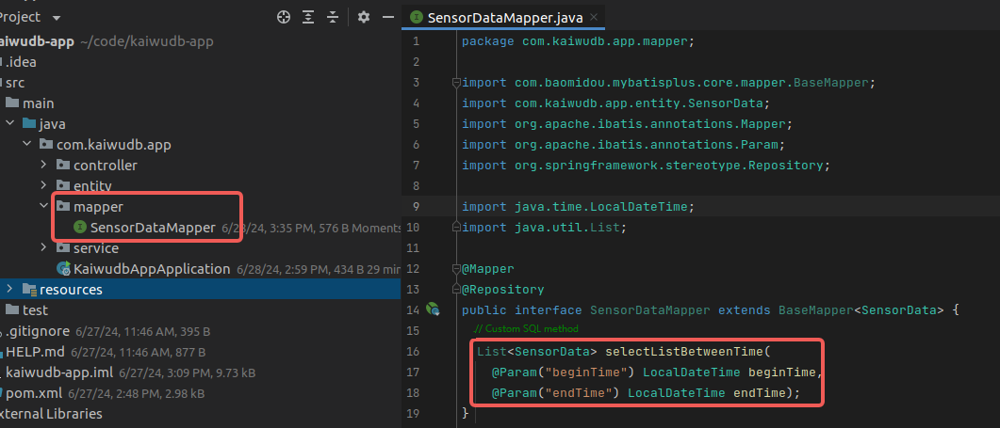

2. In the `resources` directory, create a `mapper` directory and a `SensorDataMapper.xml` file with the following content:

   ::: warning Note

   The `id` in the `select` tag corresponds to the SQL method `selectListBetweenTime` defined in the mapper interface.

   :::

   ```xml
   <?xml version="1.0" encoding="UTF-8"?>
   <!DOCTYPE mapper PUBLIC "-//mybatis.org//DTD Mapper 3.0//EN" "http://mybatis.org/dtd/mybatis-3-mapper.dtd">
   <mapper namespace="com.kaiwudb.app.mapper.SensorDataMapper">
     <select id="selectListBetweenTime" resultType="com.kaiwudb.app.entity.SensorData">
       SELECT *
       FROM sensor_data
       WHERE record_time BETWEEN #{beginTime} AND #{endTime}
     </select>
   </mapper>
   ```

   Result:

   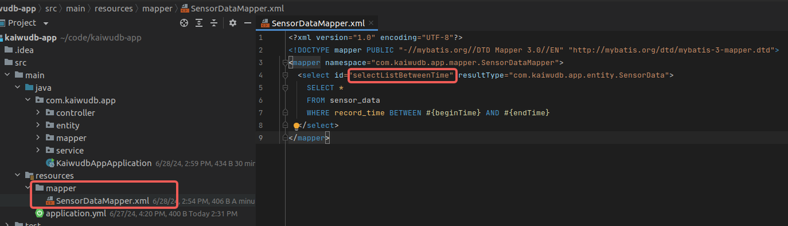

### Creating Service Interface and Implementation

1. In the `service` directory, create the `SensorDataService` interface and its implementation class `SensorDataServiceImpl`, using the custom `SensorDataMapper` interface to implement CRUD operations. The query interface supports multiple query methods: by ID, by sensorId, by time range, and querying all data.

   - `SensorDataService` interface:

     ```java
     package com.kaiwudb.app.service;
     
     import com.kaiwudb.app.entity.SensorData;
     
     import java.util.List;
     
     public interface SensorDataService {
       int insertSensorData(SensorData data);
     
       int updateSensorData(SensorData data);
     
       int deleteById(Long id);
     
       SensorData findById(Long id);
     
       List<SensorData> findBySensorId(String sensorId);
     
       List<SensorData> findByRecordTime(String beginTime, String endTime);
     
       List<SensorData> findAll();
     }
     ```

     Result:
     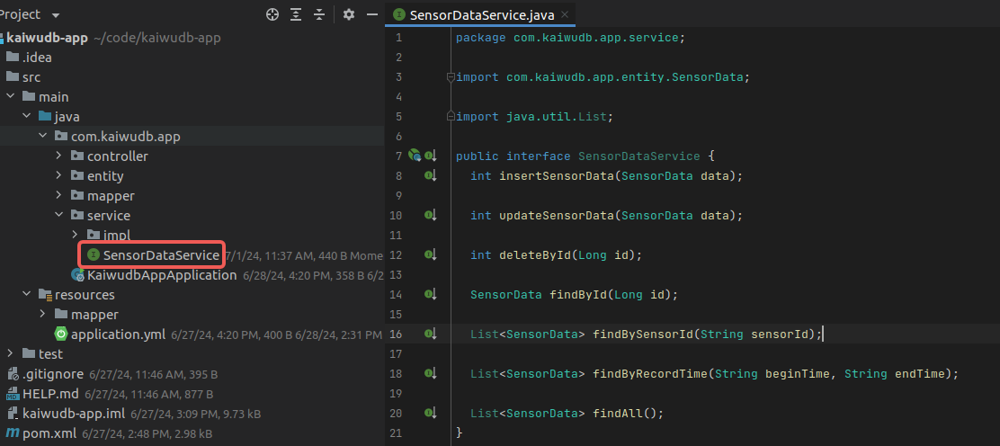

   - `SensorDataServiceImpl` implementation:

     ```java
     package com.kaiwudb.app.service.impl;
     
     import com.baomidou.mybatisplus.core.conditions.query.QueryWrapper;
     import com.kaiwudb.app.entity.SensorData;
     import com.kaiwudb.app.mapper.SensorDataMapper;
     import com.kaiwudb.app.service.SensorDataService;
     import org.springframework.beans.factory.annotation.Autowired;
     import org.springframework.stereotype.Service;
     
     import java.time.LocalDateTime;
     import java.time.format.DateTimeFormatter;
     import java.util.List;
     
     @Service
     public class SensorDataServiceImpl implements SensorDataService {
       @Autowired
       private SensorDataMapper sensorDataMapper;
     
       @Override
       public int insertSensorData(SensorData data) {
         return sensorDataMapper.insert(data);
       }
     
       @Override
       public int updateSensorData(SensorData data) {
         return sensorDataMapper.updateById(data);
       }
     
       @Override
       public int deleteById(Long id) {
         return sensorDataMapper.deleteById(id);
       }
     
       @Override
       public SensorData findById(Long id) {
         return sensorDataMapper.selectById(id);
       }
     
       @Override
       public List<SensorData> findBySensorId(String sensorId) {
         return sensorDataMapper.selectList(new QueryWrapper<SensorData>().eq("sensor_id", sensorId));
       }
     
       @Override
       public List<SensorData> findByRecordTime(String beginTime, String endTime) {
         LocalDateTime beginDateTime = LocalDateTime.parse(beginTime, DateTimeFormatter.ofPattern("yyyy-MM-dd HH:mm:ss.SSS"));
         LocalDateTime endDateTime = LocalDateTime.parse(endTime, DateTimeFormatter.ofPattern("yyyy-MM-dd HH:mm:ss.SSS"));
         return sensorDataMapper.selectListBetweenTime(beginDateTime, endDateTime);
       }
     
       @Override
       public List<SensorData> findAll() {
         return sensorDataMapper.selectList(null);
       }
     }
     ```

     Result:

     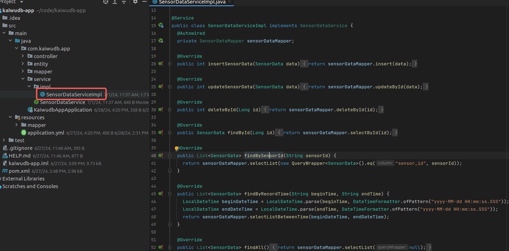

### Creating Controller

1. In the `controller` directory, create the `SensorDataController` to handle HTTP requests and implement CRUD operations for sensor data:

   ```java
   package com.kaiwudb.app.controller;
   
   import com.kaiwudb.app.entity.SensorData;
   import com.kaiwudb.app.service.SensorDataService;
   import org.springframework.beans.factory.annotation.Autowired;
   import org.springframework.format.annotation.DateTimeFormat;
   import org.springframework.web.bind.annotation.DeleteMapping;
   import org.springframework.web.bind.annotation.GetMapping;
   import org.springframework.web.bind.annotation.PathVariable;
   import org.springframework.web.bind.annotation.PostMapping;
   import org.springframework.web.bind.annotation.PutMapping;
   import org.springframework.web.bind.annotation.RequestBody;
   import org.springframework.web.bind.annotation.RequestMapping;
   import org.springframework.web.bind.annotation.RequestParam;
   import org.springframework.web.bind.annotation.RestController;
   
   import java.util.List;
   
   @RestController
   @RequestMapping("/sensor-data")
   public class SensorDataController {
     @Autowired
     private SensorDataService sensorDataService;
   
     @PostMapping("/add")
     public int addSensorData(@RequestBody SensorData data) {
       return sensorDataService.insertSensorData(data);
     }
   
     @PutMapping("/update")
     public int updateSensorData(@RequestBody SensorData data) {
       return sensorDataService.updateSensorData(data);
     }
   
     @DeleteMapping("/{id}")
     public int deleteSensorDataById(@PathVariable Long id) {
       return sensorDataService.deleteById(id);
     }
   
     @GetMapping("/{id}")
     public SensorData getSensorDataById(@PathVariable Long id) {
       return sensorDataService.findById(id);
     }
   
     @GetMapping("/by-sensor-id/{sensorId}")
     public List<SensorData> getSensorDataBySensorId(@PathVariable String sensorId) {
       return sensorDataService.findBySensorId(sensorId);
     }
   
     @GetMapping("/by-timestamp")
     public List<SensorData> getSensorDataByRecordTime(
       @RequestParam("beginTime") @DateTimeFormat(pattern = "yyyy-MM-dd HH:mm:ss.SSS") String beginTime,
       @RequestParam("endTime") @DateTimeFormat(pattern = "yyyy-MM-dd HH:mm:ss.SSS") String endTime) {
       return sensorDataService.findByRecordTime(beginTime, endTime);
     }
   
     @GetMapping("/all")
     public List<SensorData> getAllSensorData() {
       return sensorDataService.findAll();
     }
   }
   ```

   Result:
   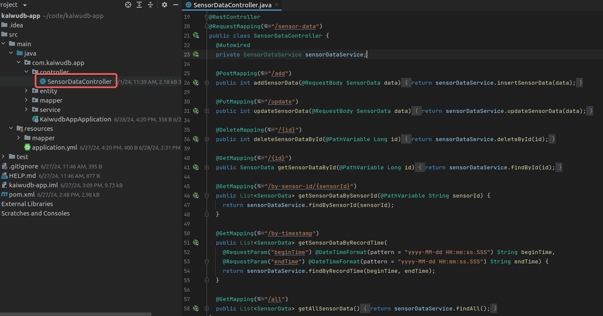

### Creating Main Application Class

1. In the root directory, create the main application class `KaiwudbAppApplication` with the `public static void main(String[] args)` method to launch the application. Add necessary configuration annotations:

   ```java
   package com.kaiwudb.app;
   
   import org.springframework.boot.SpringApplication;
   import org.springframework.boot.autoconfigure.SpringBootApplication;
   
   @SpringBootApplication(scanBasePackages = "com.kaiwudb.app")
   public class KaiwudbAppApplication {
     public static void main(String[] args) {
       SpringApplication.run(KaiwudbAppApplication.class, args);
     }
   }
   ```

   Result:
   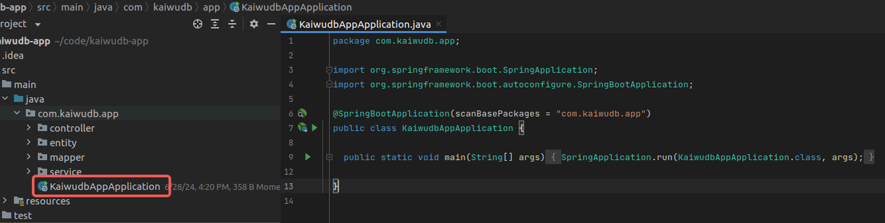

### Launching the Application

1. In the project, locate the main application class `KaiwudbAppApplication`, right-click on it, and select `Run 'KaiwudbAppApplication'` to start the application:

   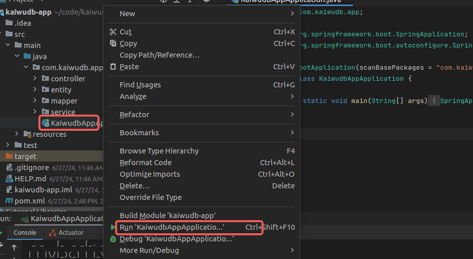

   Upon successful startup, the console will display:

   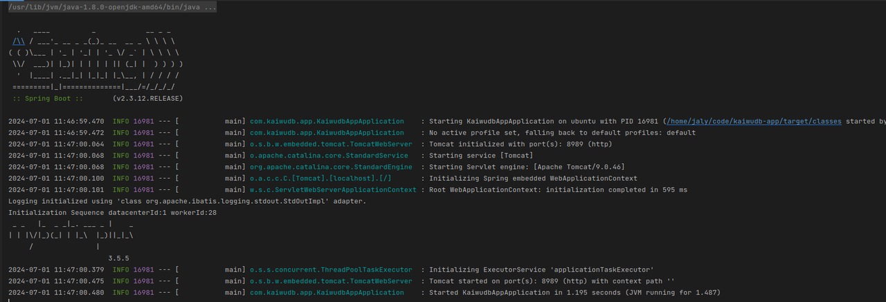

### Testing API Operations

After starting the application, you can use tools like Postman to send HTTP requests and perform CRUD operations on the KWDB database:

- Add Data:

  Example showing successful insertion of one record:
  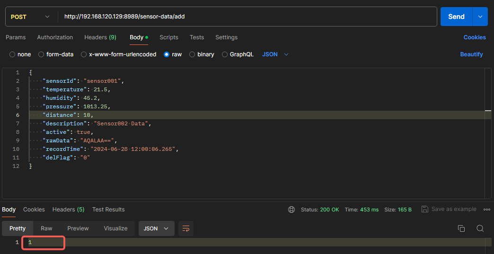

- Update Data:

  Example showing successful update of one record:
  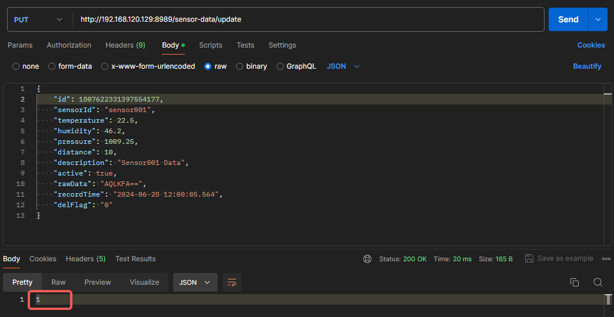

- Delete Data:

  Example showing successful deletion of one record:
  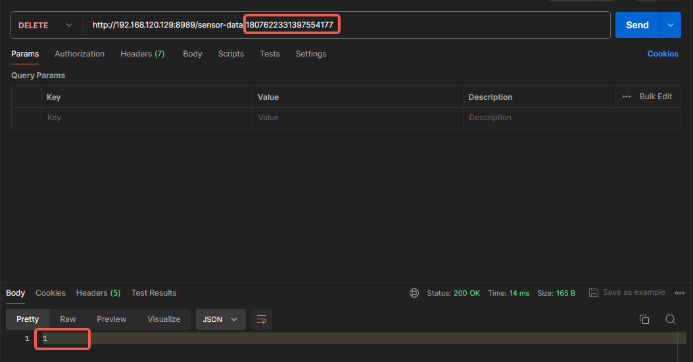

- Query Data:

  - Query by sensorId:

    Example showing all records with `sensorId` = `sensor002`:
    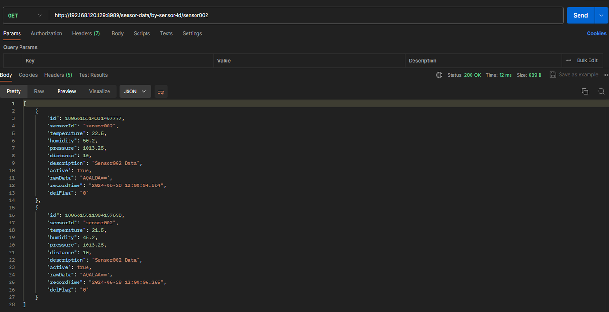

  - Query by time range:

    Example showing all records within the specified time range:
    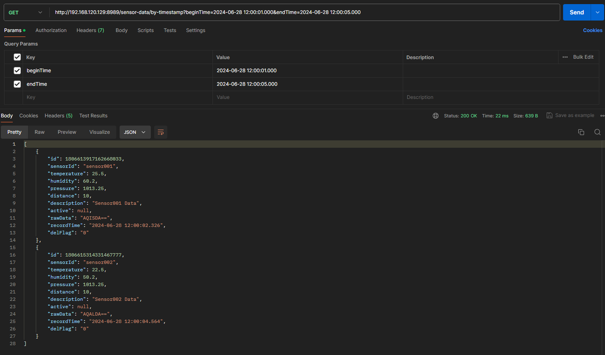