# Connect to KWDB Using MyBatis

[MyBatis](https://mybatis.org/mybatis-3/index.html) is an open-source Java persistence framework that supports custom SQL queries, stored procedures, and advanced mappings. MyBatis significantly reduces JDBC code, simplifying parameter configuration and result set handling. Using simple XML or annotation configurations, you can map Java interfaces and POJOs (Plain Old Java Objects) to database records.

This section demonstrates how to connect to KWDB using MyBatis in a Spring Boot + Maven project. Once configured, you can follow standard MyBatis development practices to build applications that interact with KWDB databases.

For frequently asked questions about using MyBatis, see [Mybatis and Mybatis-Plus](../../../faqs/faqs.md#mybatis-and-mybatis-plus).

## Prerequisites

- [OpenJDK 1.8 or higher](https://openjdk.org/install/) installed
- [Maven 3.6 or higher](https://maven.apache.org/install.html) installed
- KaiwuDB JDBC driver package obtained
- KWDB installed and running with:
  - Properly configured database authentication
  - A database created for your connection
  - A user with appropriate privileges on tables or higher

The following example assumes you have already created a relational database, a time-series database, a relational table, and a time-series table. If not,  execute the following SQL commands:

1. Create the time-series database and table.

    ```SQL
    CREATE TS DATABASE test_ts_mybatis;

    CREATE TABLE test_ts_mybatis.ts_table
    (
        ts  TIMESTAMPTZ NOT NULL,
        c1  INT,
        c2  FLOAT4,
        c3  FLOAT8,
        c4  BOOL,
        c5  CHAR(1),
        c6  NCHAR(10),
        c7  VARCHAR(10),
        c8  NVARCHAR(10),
        c9  VARBYTES(10),
        c10 TIMESTAMP
    ) TAGS (
        t1 INT NOT NULL,
        t2 FLOAT4,
        t3 VARCHAR(10)
    ) PRIMARY TAGS (t1);
    ```

2. Create the relational database and table.

    ```SQL
    CREATE DATABASE test_mybatis;
    
    CREATE TABLE test_mybatis.rel_table
    (
        id  INT PRIMARY KEY,
        c1  INT,
        c2  FLOAT,
        c3  DOUBLE,
        c4  BOOLEAN,
        c5  CHAR(1),
        c6  NCHAR(10),
        c7  VARCHAR(10),
        c8  NVARCHAR(10),
        c9  BYTES,
        c10 TIMESTAMP
    );
    ```

## Environment Setup

### Initializing the Application Project

1. Create a Spring Boot project in IntelliJ IDEA and configure it with JDK 8.

    ::: warning Note

     The official website requires JDK 17 or above by default. To use JDK 8, change the Server URL to Alibaba Cloud service: start.aliyun.com, and then set the Java version accordingly.

    :::

    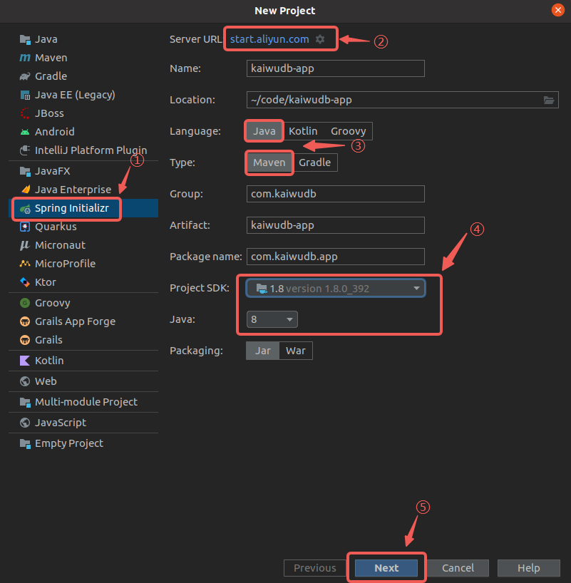

2. Select the necessary dependencies and complete the project creation.

    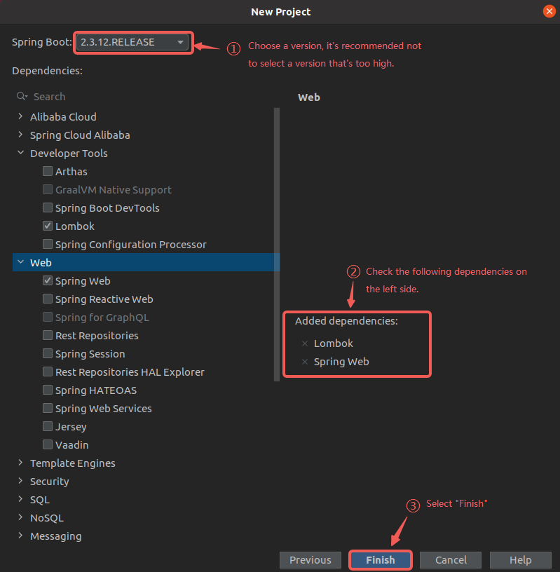

3. Rename the `application.properties` file in the `/src/main/resources` directory to `application.yml`, which is more commonly used for configuration.

    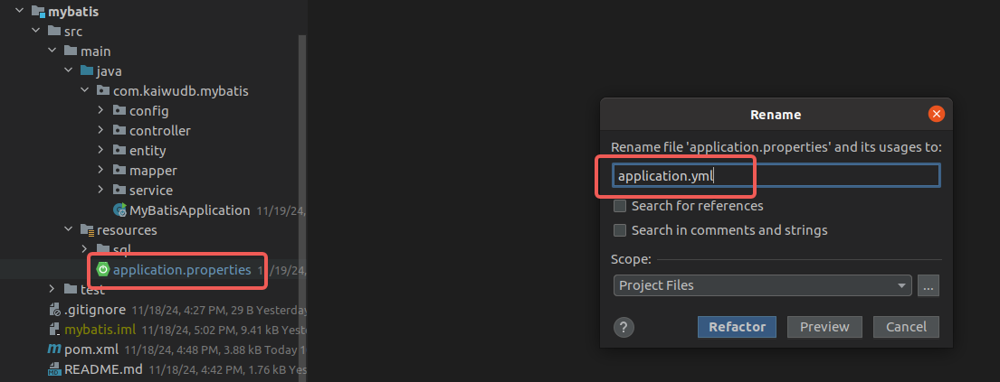

### Adding Dependencies

1. Add the MyBatis dependency to your `pom.xml` file:

    ```XML
    <!-- mybatis-spring-boot-starter -->
    <dependency>
      <groupId>org.mybatis.spring.boot</groupId>
      <artifactId>mybatis-spring-boot-starter</artifactId>
      <version>2.3.2</version>
    </dependency>
    ```

2. Add the KaiwuDB JDBC dependency to your `pom.xml` file:

    ```XML
    <!-- KaiwuDB JDBC 2.2.0 -->
    <dependency>
      <groupId>com.kaiwudb</groupId>
      <artifactId>kaiwudb-jdbc</artifactId>
      <version>2.2.0</version>
    </dependency>
    ```

3. If the KaiwuDB JDBC driver cannot be loaded, install it into your local Maven repository using the following command:

      ```Shell
      mvn install:install-file "-Dfile=../kaiwudb-jdbc.2.1.0.jar" "-DgroupId=com.kaiwudb" "-DartifactId=kaiwudb-jdbc" "-Dversion=2.2.0" "-Dpackaging=jar"
      ```

## Configuring the Connection

1. Configure the data sources and server port in the `application.yml` file:

    ```YAML
    spring:
      # Time-series data source configuration
      tsdb-datasource:
        driver-class-name: com.kaiwudb.Driver
        jdbc-url: jdbc:kaiwudb://127.0.0.1:26257/test_ts_mybatis
        username: <user_name>
        password: <password>      
      # Relational data source configuration
      rdb-datasource:
        driver-class-name: com.kaiwudb.Driver
        jdbc-url: jdbc:kaiwudb://127.0.0.1:26257/test_mybatis
        username: <user_name>
        password: <password>
    # Server startup port
    server:
      port: 9000
    ```

2. In the `src/main/java/com/kaiwudb/mybatis/config` directory, create configuration classes for each data source defined in `application.yml`.

     - Time-series data configuration class:

        ```Java
        @Configuration
        @MapperScan(basePackages = "com.kaiwudb.mybatis.mapper.tsdb", sqlSessionTemplateRef = "tsSqlSessionTemplate")
        public class TsDatabaseConfig {
          @Bean(name = "tsDataSource")
          @ConfigurationProperties(prefix = "spring.tsdb-datasource")
          public DataSource tsDataSource() {
            return DataSourceBuilder.create().build();
          }

          @Bean(name = "tsJdbcTemplate")
          public JdbcTemplate tsJdbcTemplate(@Qualifier("tsDataSource") DataSource tsDataSource) {
            return new JdbcTemplate(tsDataSource);
          }

          @Bean(name = "tsSqlSessionFactory")
          public SqlSessionFactory tsSqlSessionFactory(@Qualifier("tsDataSource") DataSource tsDataSource) throws Exception {
            SqlSessionFactoryBean bean = new SqlSessionFactoryBean();
            bean.setDataSource(tsDataSource);
            return bean.getObject();
          }

          @Bean(name = "tsTransactionManager")
          public DataSourceTransactionManager tsTransactionManager(@Qualifier("tsDataSource") DataSource tsDataSource) {
            return new DataSourceTransactionManager(tsDataSource);
          }

          @Bean(name = "tsSqlSessionTemplate")
          public SqlSessionTemplate tsdbSqlSessionTemplate(@Qualifier("tsSqlSessionFactory") SqlSessionFactory tsSqlSessionFactory) {
            return new SqlSessionTemplate(tsSqlSessionFactory);
          }
        }
        ```

     - Relational data configuration class:

        ```Java
        @Configuration
        @MapperScan(basePackages = "com.kaiwudb.mybatis.mapper.rdb", sqlSessionTemplateRef = "sqlSessionTemplate")
        public class DatabaseConfig {
          @Primary
          @Bean(name = "dataSource")
          @ConfigurationProperties(prefix = "spring.rdb-datasource")
          public DataSource dataSource() {
            return DataSourceBuilder.create().build();
          }
        
          @Primary
          @Bean(name = "jdbcTemplate")
          public JdbcTemplate jdbcTemplate(@Qualifier("dataSource") DataSource dataSource) {
            return new JdbcTemplate(dataSource);
          }
        
          @Primary
          @Bean(name = "sqlSessionFactory")
          public SqlSessionFactory sqlSessionFactory(@Qualifier("dataSource") DataSource dataSource) throws Exception {
            SqlSessionFactoryBean bean = new SqlSessionFactoryBean();
            bean.setDataSource(dataSource);
            return bean.getObject();
          }
        
          @Primary
          @Bean(name = "transactionManager")
          public DataSourceTransactionManager transactionManager(@Qualifier("dataSource") DataSource dataSource) {
            return new DataSourceTransactionManager(dataSource);
          }
        
          @Primary
          @Bean(name = "sqlSessionTemplate")
          public SqlSessionTemplate sqlSessionTemplate(@Qualifier("sqlSessionFactory") SqlSessionFactory sqlSessionFactory) {
            return new SqlSessionTemplate(sqlSessionFactory);
          }
        }
        ```

## Configuring CRUD Operations

In a SpringBoot + MyBatis application, when users invoke APIs to access and manipulate data, the internal data flow is as follows:

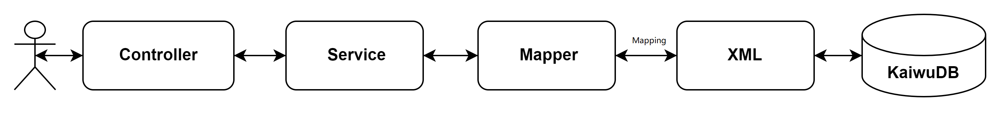

After integrating KaiwuDB JDBC and MyBatis with SpringBoot, you can define entity classes, Mapper interfaces, service interfaces and implementations, and controllers to enable interaction with KWDB.

### Time-Series Data

#### Creating an Entity Class

Create a time-series table entity class named `TimeSeriesEntity` in the `src/main/java/com/kaiwudb/mybatis/entity` directory. The entity class represents a database table within your application and should match the structure of the corresponding database table.

For KWDB time-series databases, the entity class must include both column and tag information, as demonstrated in the following example:

```Java
@Data
@NoArgsConstructor
@AllArgsConstructor
public class TimeSeriesEntity {
  @JsonFormat(shape = JsonFormat.Shape.STRING, pattern = "yyyy-MM-dd HH:mm:ss.SSS", timezone = "GMT+8")
  private Timestamp ts;
  private Integer c1;
  private Float c2;
  private Double c3;
  private Boolean c4;
  private String c5;
  private String c6;
  private String c7;
  private String c8;
  private String c9;
  @JsonFormat(shape = JsonFormat.Shape.STRING, pattern = "yyyy-MM-dd HH:mm:ss.SSS", timezone = "GMT+8")
  private Timestamp c10;
  private Integer t1;
  private Float t2;
  private String t3;
}
```

Result:

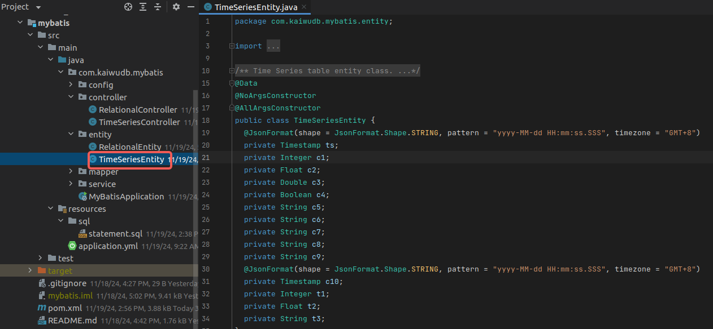

#### Creating the Mapper Interface

Create the `TimeSeriesMapper` interface in the `src/main/java/com/kaiwudb/mybatis/mapper/tsdb` directory. This interface defines operations for the time-series database. Use the `@Mapper` and `@Repository` annotations to implement common CRUD operations:

```Java
@Mapper
@Repository
public interface TimeSeriesMapper {
  @Insert("INSERT INTO ts_table (ts, c1, c2, c3, c4, c5, c6, c7, c8, c9, c10, t1, t2, t3) VALUES (#{ts}, #{c1}, #{c2}, #{c3}, #{c4}, #{c5}, #{c6}, #{c7}, #{c8}, #{c9}, #{c10}, #{t1}, #{t2}, #{t3})")
  int insert(TimeSeriesEntity entity);

  @Delete("DELETE FROM ts_table WHERE ts=#{timestamp}")
  int deleteByTimeStamp(@Param("timestamp") Timestamp timestamp);

  @Select("SELECT * FROM ts_table WHERE ts BETWEEN #{beginTime} AND #{endTime}")
  List<TimeSeriesEntity> selectListBetweenTime(
    @Param("beginTime") Timestamp beginTime,
    @Param("endTime") Timestamp endTime);

  @Select("SELECT * FROM ts_table")
  List<TimeSeriesEntity> selectList();
}
```

Result:

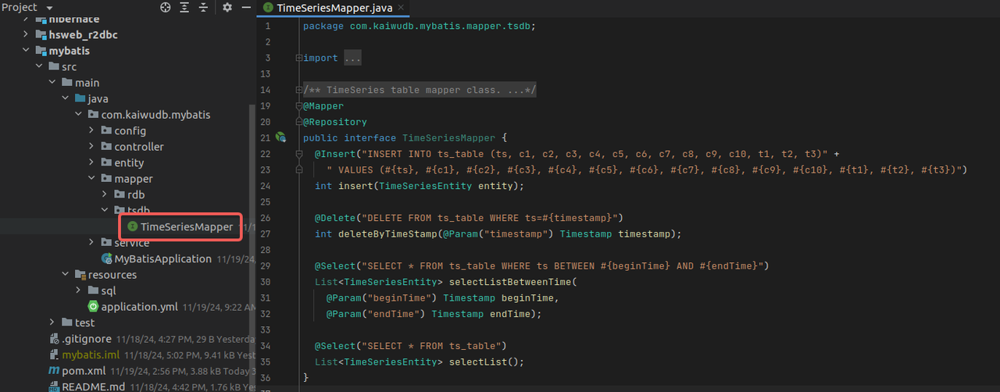

::: warning Note

- In addition to annotations, Mapper interface methods can also be implemented using XML mapping files with custom SQL statements.
- KWDB's SQL syntax for creating time-series tables differs from standard SQL and does not support ORM-based table creation.
- KWDB does not support auto-increment IDs (`AUTO_INCREMENT`), therefore the `@ID` annotation in MyBatis is not supported.

:::

#### Creating the Service Interface and Implementation Class

Create a service interface `TimeSeriesService` and its implementation `TimeSeriesServiceImpl` in the `src/main/java/com/kaiwudb/mybatis/service` directory. These classes implement business logic and interact with the data access layer. The `TimeSeriesMapper` service provides methods for inserting, deleting, and querying time-series data, supporting queries by time range or retrieving all records.

- `TimeSeriesService` service interface

  ```Java
  public interface TimeSeriesService {
    int insert(TimeSeriesEntity entity);

    int deleteByTimeStamp(String timestamp);

    List<TimeSeriesEntity> findByTimeStamp(String beginTime, String endTime);

    List<TimeSeriesEntity> findAll();
  }
  ```

  Result:

  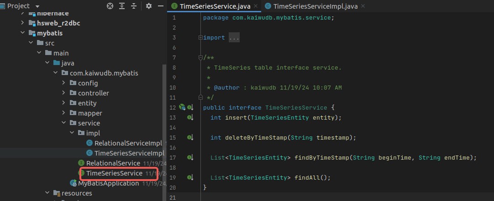

- `TimeSeriesServiceImpl` implementation

  ```Java
  @Service
  public class TimeSeriesServiceImpl implements TimeSeriesService {
    @Autowired
    private TimeSeriesMapper mapper;
  
    @Override
    public int insert(TimeSeriesEntity entity) {
      return mapper.insert(entity);
    }
  
    @Override
    public int deleteByTimeStamp(String timestamp) {
      LocalDateTime dateTime = LocalDateTime.parse(timestamp, DateTimeFormatter.ofPattern("yyyy-MM-dd HH:mm:ss.SSS"));
      return mapper.deleteByTimeStamp(Timestamp.valueOf(dateTime));
    }
  
    @Override
    public List<TimeSeriesEntity> findByTimeStamp(String beginTime, String endTime) {
      LocalDateTime beginDateTime = LocalDateTime.parse(beginTime, DateTimeFormatter.ofPattern("yyyy-MM-dd HH:mm:ss"));
      LocalDateTime endDateTime = LocalDateTime.parse(endTime, DateTimeFormatter.ofPattern("yyyy-MM-dd HH:mm:ss"));
      return mapper.selectListBetweenTime(Timestamp.valueOf(beginDateTime), Timestamp.valueOf(endDateTime));
    }
  
    @Override
    public List<TimeSeriesEntity> findAll() {
      return mapper.selectList();
    }
  }
  ```

  Result:

  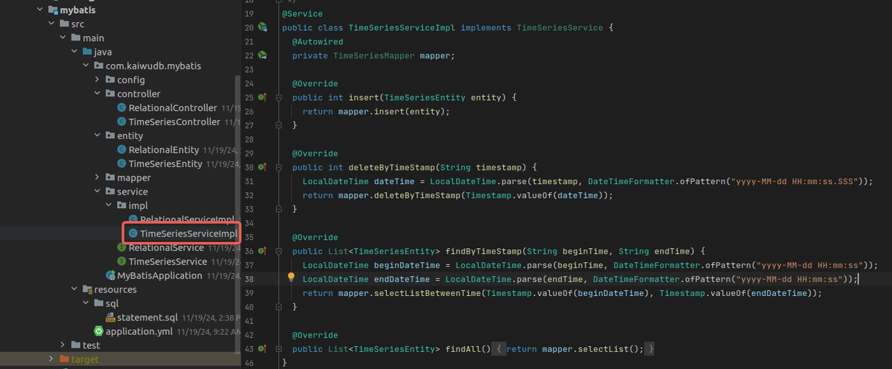

#### Creating the Controller

Create the `TimeSeriesController` class in the `src/main/java/com/kaiwudb/mybatis/controller` directory. This controller handles HTTP requests and delegates processing to the service layer, implementing operations for creating, deleting, and querying time-series data.

```Java
@RestController
@RequestMapping("/time-series")
public class TimeSeriesController {
  @Autowired
  private TimeSeriesService service;

  @PostMapping("/add")
  public int add(@RequestBody TimeSeriesEntity entity) {
    return service.insert(entity);
  }

  @DeleteMapping("/{timestamp}")
  public int deleteByTimeStamp(@PathVariable @DateTimeFormat(pattern = "yyyy-MM-dd HH:mm:ss.SSS") String timestamp) {
    return service.deleteByTimeStamp(timestamp);
  }

  @GetMapping("/by-timestamp")
  public List<TimeSeriesEntity> getListByTime(
    @RequestParam("beginTime") @DateTimeFormat(pattern = "yyyy-MM-dd HH:mm:ss") String beginTime,
    @RequestParam("endTime") @DateTimeFormat(pattern = "yyyy-MM-dd HH:mm:ss") String endTime) {
    return service.findByTimeStamp(beginTime, endTime);
  }

  @GetMapping("/all")
  public List<TimeSeriesEntity> getAll() {
    return service.findAll();
  }
}
```

Result:

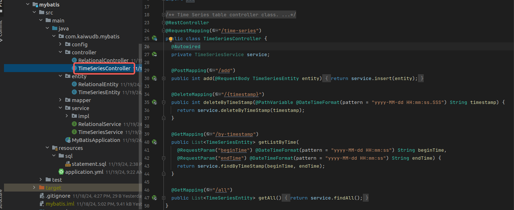

### Relational Data

#### Creating an Entity Class

Create a relational table entity class named `RelationalEntity` in the `src/main/java/com/kaiwudb/mybatis/entity` directory. The entity class represents a database table within your application and should match the structure of the corresponding database table.

For KWDB relational databases, the entity class only needs to include column information:

```Java
@Data
@NoArgsConstructor
@AllArgsConstructor
public class RelationalEntity {
  private Integer id;
  private Integer c1;
  private Float c2;
  private Double c3;
  private Boolean c4;
  private String c5;
  private String c6;
  private String c7;
  private String c8;
  private String c9;
  @JsonFormat(shape = JsonFormat.Shape.STRING, pattern = "yyyy-MM-dd HH:mm:ss.SSS", timezone = "GMT+8")
  private Timestamp c10;
}
```

Result:

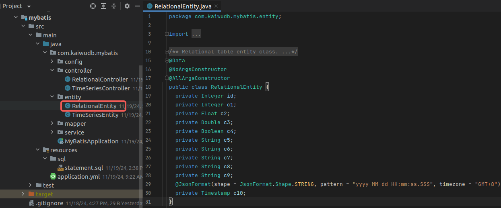

#### Creating the Mapper Interface

Create the `RelationalMapper` interface in the `src/main/java/com/kaiwudb/mybatis/mapper/rdb` directory. This interface defines operations for the relational database. Use the `@Mapper` and `@Repository` annotations to quickly implement common CRUD operations:

```Java
@Mapper
@Repository
public interface RelationalMapper {
  @Insert("INSERT INTO rel_table (id, c1, c2, c3, c4, c5, c6, c7, c8, c9, c10)" +
    " VALUES (#{id}, #{c1}, #{c2}, #{c3}, #{c4}, #{c5}, #{c6}, #{c7}, #{c8}, #{c9}, #{c10})")
  int insert(RelationalEntity entity);

  @Update("UPDATE rel_table SET c1=#{c1}, c2=#{c2}, c3=#{c3}, c4=#{c4}, c5=#{c5}," +
    " c6=#{c6}, c7=#{c7}, c8=#{c8}, c9=#{c9}, c10=#{c10} WHERE id=#{id}")
  int update(RelationalEntity entity);

  @Delete("DELETE FROM rel_table WHERE id=#{id}")
  int deleteById(Integer id);

  @Select("SELECT * FROM rel_table WHERE id=#{id}")
  RelationalEntity selectById(Integer id);

  @Select("SELECT * FROM rel_table WHERE c10 BETWEEN #{beginTime} AND #{endTime}")
  List<RelationalEntity> selectListBetweenTime(
    @Param("beginTime") Timestamp beginTime,
    @Param("endTime") Timestamp endTime);

  @Select("SELECT * FROM rel_table")
  List<RelationalEntity> selectList(Integer id);
}
```

Result:

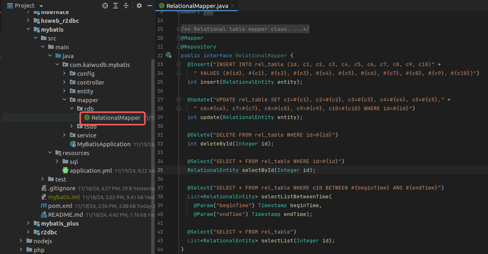

::: warning Note

- In addition to annotations, Mapper interface methods can also be implemented using XML mapping files with custom SQL statements.
- KWDB does not support auto-increment IDs (`AUTO_INCREMENT`), therefore the `@ID` annotation in MyBatis is not supported.

:::

#### Creating the Service Interface and Implementation Class

Create a service interface `RelationalService` and its implementation `RelationalServiceImpl` in the `src/main/java/com/kaiwudb/mybatis/service` directory. These classes implement business logic and interact with the data access layer. The `RelationalMapper` interface provides methods for inserting, deleting, and querying relational data, supporting querying by ID, querying by time range, and retrieving all records.

- `RelationalService` service interface class

  ```Java
  public interface RelationalService {
    int insert(RelationalEntity entity);

    int update(RelationalEntity entity);

    int deleteById(Integer id);

    RelationalEntity findById(Integer id);

    List<RelationalEntity> findByTimeStamp(String beginTime, String endTime);

    List<RelationalEntity> findAll();
  }
  ```

  Result:

  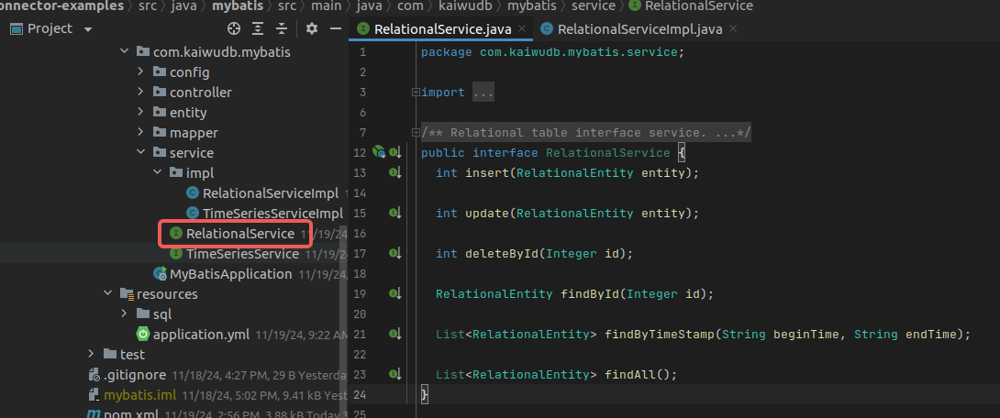

- `RelationalServiceImpl` implementation class

  ```Java
  @Service
  public class RelationalServiceImpl implements RelationalService {
    @Autowired
    private RelationalMapper mapper;
  
    @Override
    public int insert(RelationalEntity entity) {
      return mapper.insert(entity);
    }
  
    @Override
    public int update(RelationalEntity entity) {
      return mapper.update(entity);
    }
  
    @Override
    public int deleteById(Integer id) {
      return mapper.deleteById(id);
    }
  
    @Override
    public RelationalEntity findById(Integer id) {
      return mapper.selectById(id);
    }
  
    @Override
    public List<RelationalEntity> findByTimeStamp(String beginTime, String endTime) {
      LocalDateTime beginDateTime = LocalDateTime.parse(beginTime, DateTimeFormatter.ofPattern("yyyy-MM-dd HH:mm:ss"));
      LocalDateTime endDateTime = LocalDateTime.parse(endTime, DateTimeFormatter.ofPattern("yyyy-MM-dd HH:mm:ss"));
      return mapper.selectListBetweenTime(Timestamp.valueOf(beginDateTime), Timestamp.valueOf(endDateTime));
    }
  
    @Override
    public List<RelationalEntity> findAll() {
      return mapper.selectList(null);
    }
  }
  ```

  Result:

  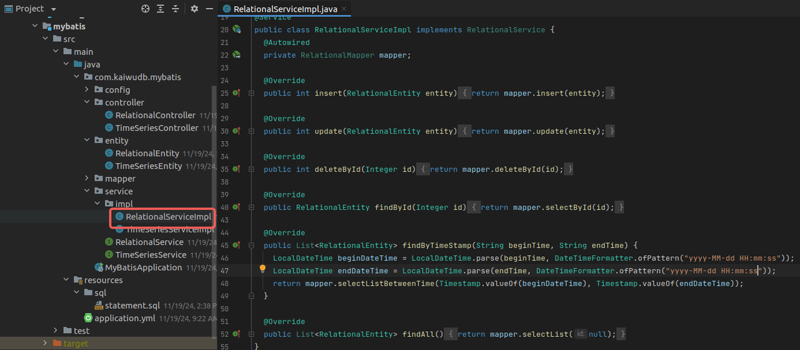

#### Creating the Controller

Create the `RelationalController` class in the `src/main/java/com/kaiwudb/mybatis/controller` directory. This controller handles HTTP requests and delegates processing to the service layer, implementing operations for creating, deleting, and querying relational data.

```Java
@RestController
@RequestMapping("/relational")
public class RelationalController {
  @Autowired
  private RelationalService service;

  @PostMapping("/add")
  public int add(@RequestBody RelationalEntity entity) {
    return service.insert(entity);
  }

  @PutMapping("/update")
  public int update(@RequestBody RelationalEntity entity) {
    return service.update(entity);
  }

  @DeleteMapping("/{id}")
  public int deleteById(@PathVariable Integer id) {
    return service.deleteById(id);
  }

  @GetMapping("/{id}")
  public RelationalEntity getById(@PathVariable Integer id) {
    return service.findById(id);
  }

  @GetMapping("/by-timestamp")
  public List<RelationalEntity> getListByTime(
    @RequestParam("beginTime") @DateTimeFormat(pattern = "yyyy-MM-dd HH:mm:ss") String beginTime,
    @RequestParam("endTime") @DateTimeFormat(pattern = "yyyy-MM-dd HH:mm:ss") String endTime) {
    return service.findByTimeStamp(beginTime, endTime);
  }

  @GetMapping("/all")
  public List<RelationalEntity> getAll() {
    return service.findAll();
  }
}
```

Result:

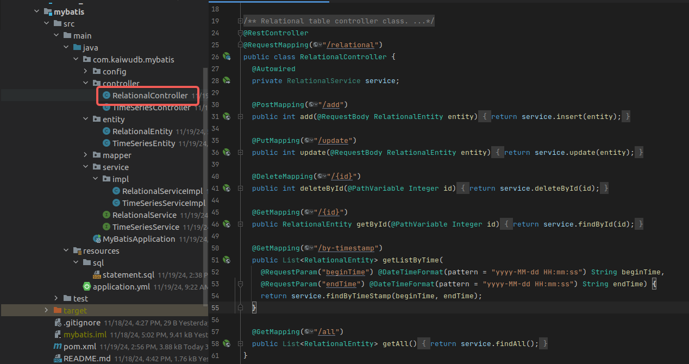

### Setting up the Main Application Class

Create a `MyBatisApplication` class in the root package to serve as the application entry point. Include the standard `main` method to bootstrap the application, and apply the necessary Spring annotations to enable component scanning and auto-configuration.

```Java
@SpringBootApplication(scanBasePackages = "com.kaiwudb.mybatis")
@Configuration
public class MyBatisApplication extends SpringBootServletInitializer {
  public static void main(String[] args) {
    SpringApplication.run(MyBatisApplication.class, args);
  }

  @Override
  protected SpringApplicationBuilder configure(SpringApplicationBuilder builder) {
    return builder.sources(MyBatisApplication.class);
  }
}
```

Result:

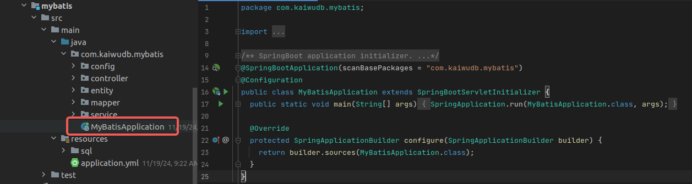

### Starting the Application

In your project, locate the main application class `MyBatisApplication`, right-click on it, and select `Run 'MyBatisApplication'` to start the application.

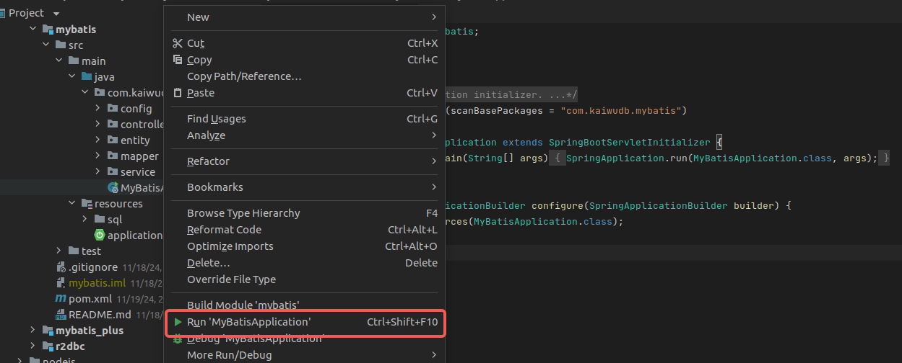

Upon successful startup, the console will display:

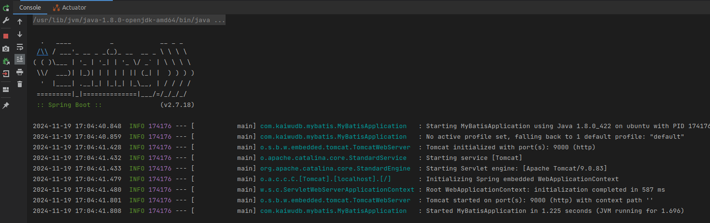

### Testing API Operations

After starting the application, you can use Postman to make HTTP requests to the API endpoints and perform CRUD operations on both time-series and relational data in KWDB. Below are examples using time-series data:

- Add Data

  Example showing successful insertion of one record:

  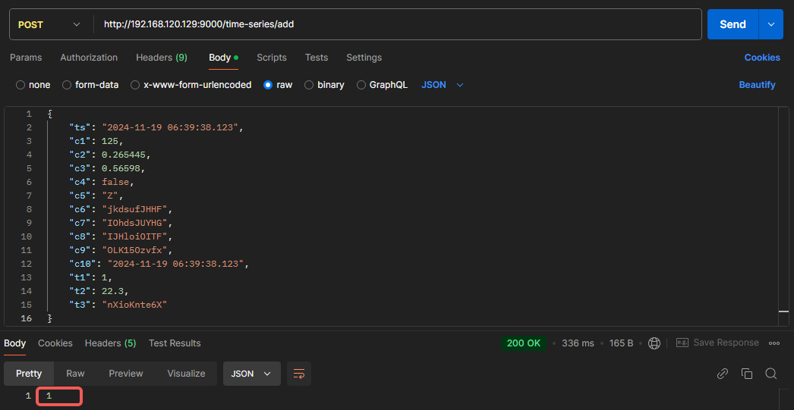

- Delete Data

  Example showing successful deletion of one record:

  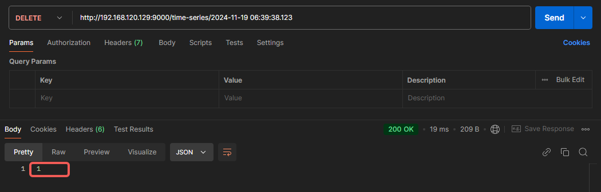

- Query Data

  Example showing all records within the specified time range:

  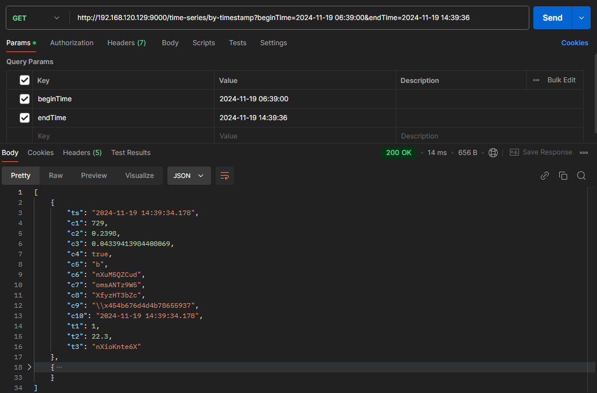
