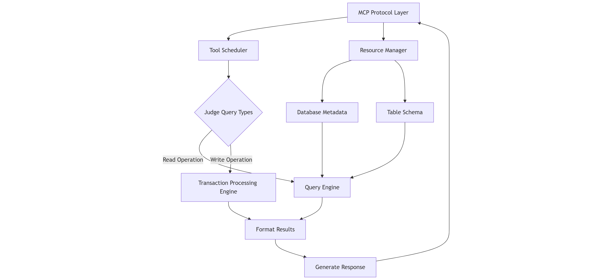
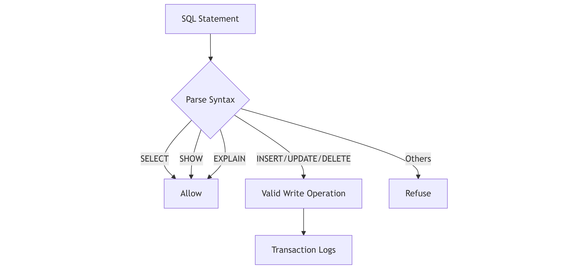
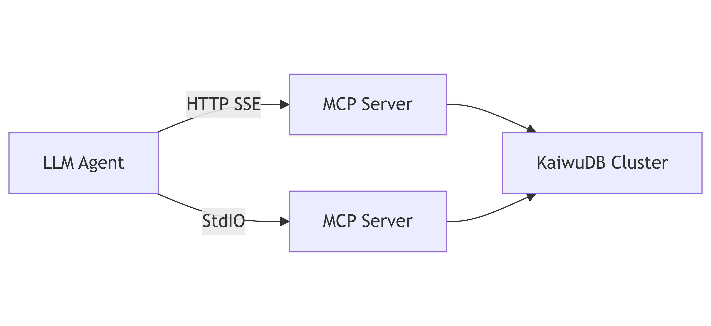

# Connect to KWDB using KWDB MCP Server

The KWDB MCP Server is a server implementation based on the [MCP](https://modelcontextprotocol.io/introduction) (Model Context Protocol) protocol, which provides a set of tools and resources for interacting with the KWDB database and providing business intelligence functionality through the MCP protocol. The KWDB MCP Server supports reading, writing, querying, modifying data, and performing DDL operations.

## KWDB MCP Server Overview

### Architecture

The core process of the KWDB MCP Server consists of the following components:

- Parse MCP protocol: deal with MCP StdIO or HTTP SSE requests.
- Schedule MCP Tools: distribute API requests based on the types of MCP Tools.
- Prepare queries: automatically add the `LIMIT 20` clause for SQL queries without a `LIMIT` clause.
- Format query results: adopt a consistent JSON format for all API responses.



### Features

- **Read Operations**: execute `SELECT`, `SHOW`, `EXPLAIN`, and other read-only queries.
- **Write Operations**: execute `INSERT`, `UPDATE`, `DELETE`, and `CREATE`, `DROP`, `ALTER` DDL operations.
- **Database Information**: get information about the database, including tables and their schemas.
- **Syntax Guide**: access a comprehensive syntax guide for KWDB through Prompts.
- **Standard API Response**: provide a consistent JSON structure for all API responses.
    ```json
    {
      "status": "success",  // or "error"
      "type": "query_result",  // response type
      "data": { ... },  // response data
      "error": null  // errors, if successful, it is set to null
    }
    ```
- **Automatic LIMIT**: prevent large result sets by automatically adding the `LIMIT 20` clause to `SELECT` queries without a `LIMIT` clause.

### Security

The KWDB MCP Server provides the following security measures:

- Provide separate tools for read and write operations.
- Valid queries to ensure that they match the expected operation type.
- Print clear error messages for unauthorized operations.



### MCP Resources

MCP Resources allow the KWDB MCP Server to expose data and content that can be read by MCP clients and used as context for LLM interactions. The KWDB MCP Server provides the following MCP Resources:

| Resources           | URI Format                       | Description                                                                            | Example                     |
|---------------------|----------------------------------|----------------------------------------------------------------------------------------|-----------------------------|
| Product information | `kwdb://product_info`            | Product information, including the version and supported features                      | `kwdb://product_info/`      |
| Database metadata   | `kwdb://db_info/{database_name}` | Information about a specific database, including the engine type, comments, and tables | `kwdb://db_info/db_shig`    |
| Table schema        | `kwdb://table/{table_name}`      | Schema of a specific table, including columns and example queries                      | `kwdb://table/user_profile` |

### MCP Tools

The MCP Tools enable the KWDB MCP Server to expose executable functionality to MCP clients. Through MCP Tools, LLMs can interact with external systems. The KWDB MCP Server provides the following MCP Tools.

#### read-query

The KWDB MCP Server executes the `SELECT`, `SHOW`, `EXPLAIN` statements, and other read-only queries to read data from the database. The `read_query` function returns the query results in a format of array for your SQL statement. In addition, the KWDB MCP Server will automatically add the `LIMIT 20` clause to `SELECT` queries without a `LIMIT` clause to prevent large result sets.

Examples:

```sql
-- Query table data.
SELECT * FROM users LIMIT 10;

-- List all created tables.
SHOW TABLES;

-- Execute a SQL query and generate details about the SQL query.
EXPLAIN ANALYZE SELECT * FROM orders WHERE user_id = 1;
```

#### write-query

The KWDB MCP Server executes data modification queries, including DML and DDL operations.

Examples:

```sql
-- Insert data into the table.
INSERT INTO users (name, email) VALUES ('John Doe', 'john@example.com');

-- Update data in the table.
UPDATE users SET email = 'new-email@example.com' WHERE id = 1;

-- Remove data from the table.
DELETE FROM users WHERE id = 1;

-- Create a table.
CREATE TABLE products (id SERIAL PRIMARY KEY, name TEXT, price DECIMAL);

-- Add a column to a table.
ALTER TABLE products ADD COLUMN description TEXT;

-- Remove a table.
DROP TABLE products;
```

### MCP Prompts

MCP Prompts enable the KWDB MCP Server to define reusable prompt templates and workflows that MCP clients can easily surface to users and LLMs. They provide a powerful way to standardize and share common LLM interactions. The KWDB MCP Server provides the following MCP Prompts:

| Type                 | Prompt Name          | Description                                                                                                          |
|----------------------|----------------------|----------------------------------------------------------------------------------------------------------------------|
| Database description | `db_description`     | A comprehensive description of KWDB database, including core functions, supported features, and use cases.           |
| Syntax guide         | `syntax_guide`       | A comprehensive syntax guide for KWDB, including examples of common queries and best practices.                      |
| Cluster management   | `cluster_management` | A comprehensive guide for managing KWDB clusters, including node management, load balancing, and monitoring.         |
| Data migration       | `data_migration`     | A guide for migrating data to and from KWDB, including import/export methods and best practices.                     |
| Installation         | `installation`       | A step-by-step guide for installing and deploying KWDB in various environments.                                      |
| Performance tunning  | `performance_tuning` | A guide for optimizing KWDB performance, including query optimization, indexing strategies, and system-level tuning. |
| Troubleshooting      | `troubleshooting`    | A guide for diagnosing and resolving common KWDB issues and errors.                                                  |
| Backup and restore   | `backup_restore`     | A comprehensive guide for backing up and restoring KWDB databases, including strategies, tools, and best practices.  |
| DBA templates        | `dba_template`       | Templates and guidelines for MCP Prompts writing.                                                                    |

## Integrate with LLM Agents

The KWDB MCP Server can work with any LLM Agent that supports the MCP protocol. The LLM Agent connects to the KWDB MCP Server via the HTTP SSE or the StdIO transport protocol, and then connects to the KWDB database to create tables, insert and query data.

::: warning Note
This document uses [Cline](https://cline.bot) for an example. But these steps are also suitable for other MCP-compatible LLM Agents. For details about LLM Agents that support the MCP protocol, see the [MCP Documentation Website](https://modelcontextprotocol.io/clients).
:::



### Prerequisites

- Install the Visual Studio Code.
- Install the Cline extension in the Visual Studio Code.
- [Download](https://gitee.com/kwdb/kwdb-mcp-server/releases) and decompress the KWDB MCP Server installation package.
- Install and start KWDB, configure the authentication method, and create a database. For details, see the [KWDB Documentation Website]().<!--Update links later-->
- Create a user with appropriate privileges on tables and databases. For details, see [Create Users]().<!--Update links later-->

### Configure KWDB MCP Server in Cline

#### StdIO Mode

1. From the left sidebar of the Visual Studio Code, click the Cline icon.
2. On the top navigation bar of the Cline extension, click the **MCP Servers** icon.
3. Select the **Installed** tab and then click **Configure MCP Servers** at the bottom of that pane. Cline will open a new settings window.

    

4. Add and save the KWDB MCP Server configurations.

    ```json
    "mcpServers": {
      "kwdb-server": {
        "command": "/path/to/bin/kwdb-mcp-server",
        "args": [
          "postgresql://<username>:<password>@<host>:<port>/<database_name>"
        ],
        "disabled": false,
        "autoApprove": []
      }
    }
    ```

    Parameters:

    - `command`: specify the coomand used to perform the operations.
    - `args`: an array, including the parameters sent to the `command` parameter.
    - `username`: the username used to connect to the KWDB database
    - `password`: the password for the username
    - `hostname`: the IP address of the KWDB database
    - `port`: the port of the KWDB database
    - `database_name`: the name of the KWDB database
    - `sslmode`: the SSL mode, available options are `disable`, `allow`, `prefer`, `require`, `verify-ca` and `verify-full`. For details about the SSL mode, see [SSL Mode Parameters](). <!--Update links later-->

5. Select the **Installed** tab and click the **Restart** button next to the KWDB MCP server you would like to restart, or click **Restart Server** at the bottom of that pane.

#### SSE Mode

1. Enter the KWDB MCP Server installation directory and start the KWDB MCP Server.

    ```bash
    </path/to/bin/kwdb-mcp-server> -t sse -addr ":8080" -base-url "http://localhost:8080" "postgresql://<username>:<password>@<host>:<port>/<database_name>?sslmode=disable"
    ```

    Parameters:
    - `-t` or `-transport`: the transport type, available options are `stdio` or `sse`.
      - `stdio`: the StdIO mode
      - `sse`: the SSE mode
    - `-addr`: the listening port of the KWDB MCP Server. By default, it is set to `:8080`.
    - `-base-url` : the IP address of the KWDB MCP Server. By default, it is set to `http://localhost:8080`.
    - `username`: the username used to connect to the KWDB database
    - `password`: the password for the username
    - `hostname`: the IP address of the KWDB database
    - `port`: the port of the KWDB database
    - `database_name`: the name of the KWDB database
    - `sslmode`: the SSL mode, available options are `disable`, `allow`, `prefer`, `require`, `verify-ca` and `verify-full`. For details about the SSL mode, see [SSL Mode Parameters]().<!--Update links later-->

2. Configure the KWDB MCP Server in Cline.

    1. From the left sidebar of the Visual Studio Code, click the Cline icon.
    2. On the top navigation bar of the Cline extension, click the **MCP Servers** icon.
    3. Select the **Installed** tab and then click **Configure MCP Servers** at the bottom of that pane. Cline will open a new settings window.
    4. Add and save the KWDB MCP Server configurations.

        ```json
        "mcpServers": {
          "kwdb-server-sse": {
            "url": "http://localhost:8080/sse",
            "disabled": false,
            "autoApprove": []
          }
        }
        ```

        Parameters:
        - `url`: The service address of KWDB MCP Server with `/sse` path appended. The default value is `http://localhost:8080/sse`.

3. Select the **Installed** tab and click the **Restart** button next to the KWDB MCP server you would like to restart, or click **Restart Server** at the bottom of that pane.

### Verification

This example assumes that you have created a table (`lkyv_shr_cheliang_gps`) and inserted data into the table.

In Cline, input a question, like "How many abnormal vehicles". The LLM Agent will translate the question into an executable SQL statement:

```sql
SELECT COUNT(DISTINCT vehicle_name) AS abnormal_vehicle_count FROM lkyv_shr_cheliang_gps WHERE status IN ('warning', 'error') LIMIT 20;
```

The query results are shown as below:


From the query results, you can see that Cline calls the read-query MCP Tools in the KWDB MCP Server to query the table whose `status` column is set with values of `warning` or `error`. Then the LLM Agent configured in Cline summarizes the data.

## Troubleshooting

### Database Connection Failures

If you fail to connect to the KWDB database, troubleshoot the issue in the following aspects:

- Check whether the database connection string is correct.
- Check whether the user can access to the KWDB database.
- Check whether the user has appropriate privileges.
- Check whether the KWDB database address in the KWDB MCP Server configuration of the LLM Agent is correct.
- Check whether the existing `kwdb-mcp-server` process is blocked.

### SSE Mode Issues

| Issue                 | Processing Strategy                                                                                                          |
|-----------------------|------------------------------------------------------------------------------------------------------------------------------|
| Connection refused    | Ensure that the KWDB MCP Server is running and listening the specified IP address.                                           |
| CORS errors           | If you access the KWDB database from a Web browser, ensure that the KWDB MCP Server's base URL matches the KWDB database URL.|
| Network issues        | Check if firewalls or network configurations are blocking the connection.                                                    |
| Database connectivity | Ensure that the KWDB MCP Server can access the KWDB database.                                                                |

### Error Codes

This table lists error codes related to the KWDB MCP Server.

| Error Code | Reason                  | Processing Strategy                      |
|------------|-------------------------|------------------------------------------|
| KWDB-4001  | Syntax error            | Return the specific syntax error.        |
| KWDB-4002  | Insufficient privileges | Stop the execution and return a warning. |
| KWDB-4003  | Connection timeout      | Retry the operation (up to 3 times).     |
| KWDB-4004  | Resources do not exist  | Return a 404 status code.                |
