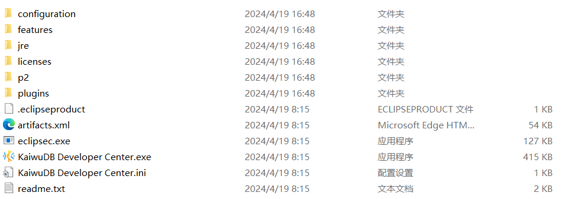
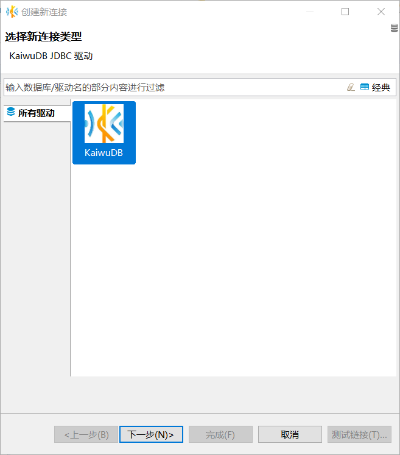
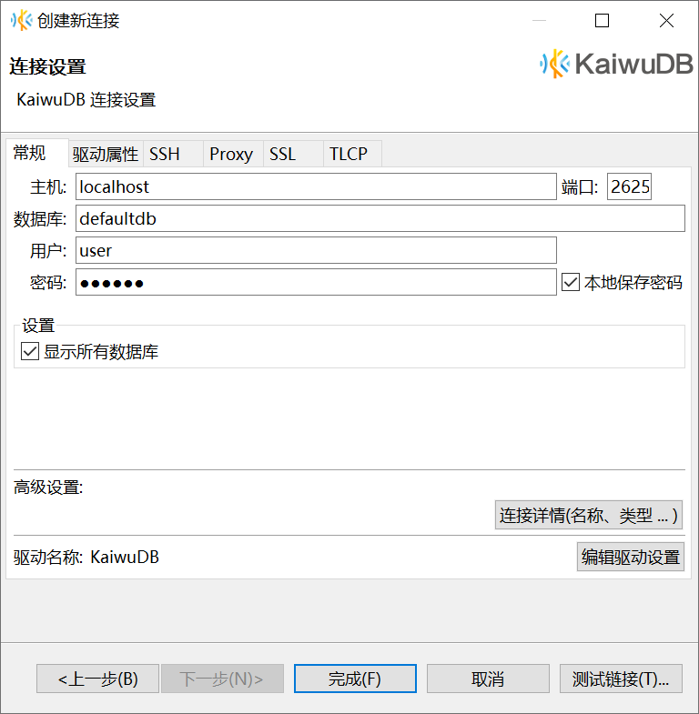
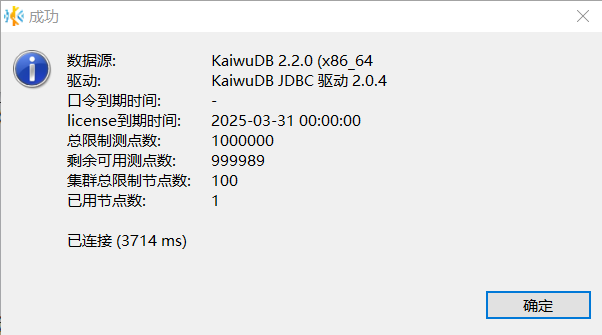
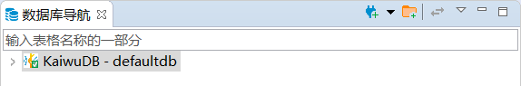
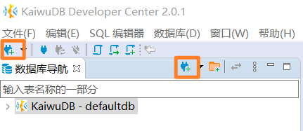
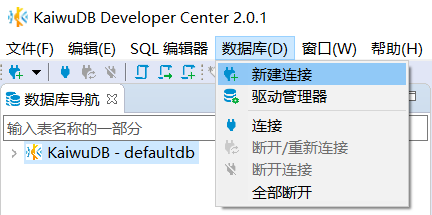

# Connect to KWDB Using KaiwuDB Developer Center

This section explains how to install and use the [KaiwuDB Developer Center](../../kaiwudb-developer-center/overview.md) to connect to KWDB. KaiwuDB Developer Center provides a user-friendly visual interface for managing your databases efficiently.

::: warning Note
The KaiwuDB Developer Center interface is currently available in Chinese only.
:::

## Install KaiwuDB Developer Center

### Preparation

Before installing the KaiwuDB Developer Center, ensure your system meets these requirements:

- **Compatible Operating Systems**
  - Windows: Version 7 or later (64-bit)
  - Linux: Kernel 2.6 or later
  - macOS: All supported versions
- **Hardware Requirements**
  - Memory: 1GB RAM or more
  - Storage: 10GB free disk space or more
- **Software Requirements**
  - KWDB: Version 2.0 or later
  - OpenJRE: Version 8 or later

The interface may differ slightly across OS versions, but the functionality remains the same.

### Steps

Follow these steps to install KaiwuDB Developer Center:

1. [Download](https://gitee.com/kwdb/kwdb/releases) the corresponding installation package for KaiwuDB Developer Center based on your operating system.

   ::: warning Note

   Due to file size limitations, you may need to download multiple installation packages.

   :::

2. Extract the installation packages to your preferred location. The extracted file structure will look like this:

   

3. Launch the application by double-clicking the executable file.

## Connect to KWDB

### Initial Setup

When you launch KaiwuDB Developer Center for the first time, or after removing all existing connections, the **创建新连接 (Create Connection)** wizard will appear automatically.

Follow these steps to create your first connection:

1. In the **创建新连接 (Create New Connection)** window, select the KaiwuDB driver and click **下一步(Next)**.

   

2. In the **常规 (General)** tab, enter the host address, port number, database name, username, and password (no password is required when using non-secure deployment mode).

   

3. (Optional) Click **测试链接 (Test Connection)** to verify your settings. A success message appears if the connection is properly configured.

   

4. Click **确定 (OK)**. The database navigation panel will refresh, showing all the databases you have permission to access.

   

### Other Collection Methods

To create a new connection at any time, you can use one of the following methods:

- **Using the Toolbar:** Click the **New Connection** button on the toolbar or the database navigation toolbar.

   

- **Using the Menu:** From the menu bar, click **数据库 (Database)**, then select **新建连接 (New Connection)** from the dropdown.

   
