# KaiwuDB Developer Center

KaiwuDB Developer Center is the official graphical management tool provided by KaiwuDB, supporting database connection, SQL editing, data visualization, and object management functions. Through an intuitive interface, users can efficiently manage and operate KWDB databases.

This article describes how to use KaiwuDB Developer Center to connect to and manage KWDB databases.

## Installing KaiwuDB Developer Center

### Supported Operating Systems

::: warning Note
Interface may vary slightly across different operating system versions, but all functions are identical.
:::

KaiwuDB Developer Center supports the following operating systems:

- Windows 7 and above 64-bit systems
- Linux kernel 2.6 and above systems
- Mac operating system (macOS)

### Environment Requirements

KaiwuDB Developer Center installation must meet the following environment requirements:

| Environment | Requirements |
|------|------|
| Hardware Environment | - Memory: 1G and above   - Disk: 10G and above |
| Software Environment | - KWDB 2.0 and above   - OpenJRE 8 and above |

### Installation Steps

To install KaiwuDB Developer Center, follow these steps:

1. Merge and extract the installation package. The file directory is as follows:

   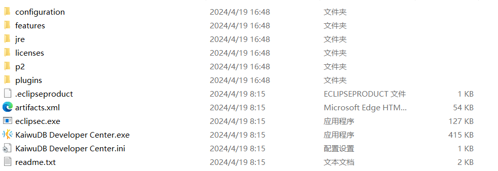

2. Double-click to run KaiwuDB Developer Center application.

## Connecting to KWDB

### First Connection

When establishing a connection for the first time or after all connections in the software have been deleted, the software will automatically display the **New Connection** wizard upon startup to guide users in establishing a connection.

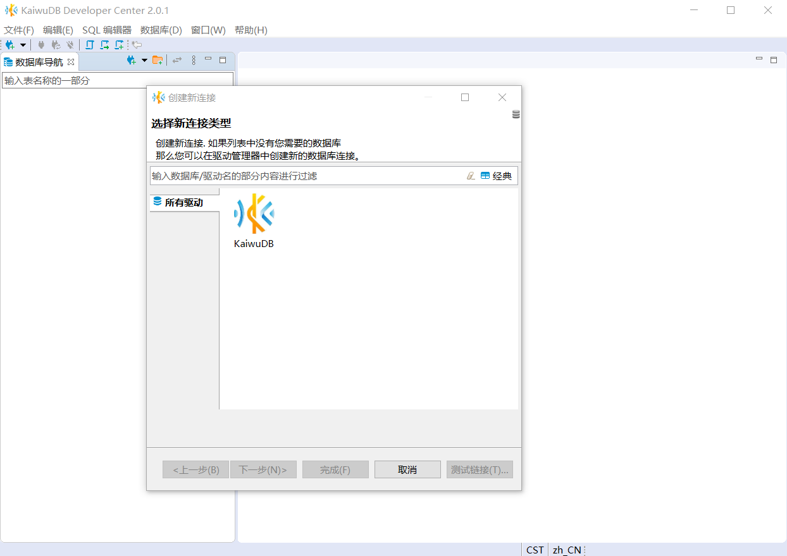

The following steps use the first connection as an example to illustrate how to connect to the database.

1. In the **Create New Connection** window, select the KWDB driver, then click **Next**.

   

2. In the **General** tab, set the host, port, and database. Select the database authentication method as needed (default is native database authentication), then complete the corresponding user and password settings (no password required if using insecure mode).

   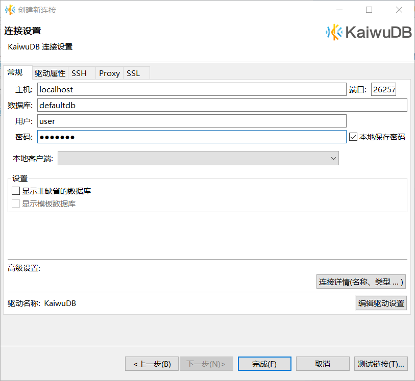

3. (Optional) Click **Test Connection** to check if the connection is successful. 

4. Click **OK**.

   The database navigation area will automatically update to display databases that the user has permission to access.

   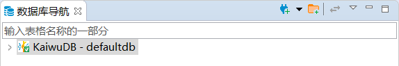

### Other Connection Methods

In other cases, if you need to create a connection, you can choose either of the following operations:

- Click the **New Connection** button in the toolbar or database navigation area toolbar:

   

- In the menu bar, click **Database**, then select **New Connection** from the dropdown menu:

   

## Managing KWDB

This section demonstrates how to use KaiwuDB Developer Center to manage KWDB databases, including:

- **Relational data operations**: Managing relatively static basic data, such as device information, user profiles, etc.
- **Time-series data operations**: Processing dynamic data that changes over time series, such as sensor readings, monitoring metrics, etc.
- **Cross-modal queries**: Achieving multi-model data fusion analysis through joint queries of relational and time-series databases.

### Relational Data Operations

#### Creating Relational Database

**Prerequisites**

User is a member of the `admin` role. By default, the `root` user belongs to the `admin` role.

**Steps**

1. In the database navigation area, right-click **Relational Database** and select **New Relational Database**:

   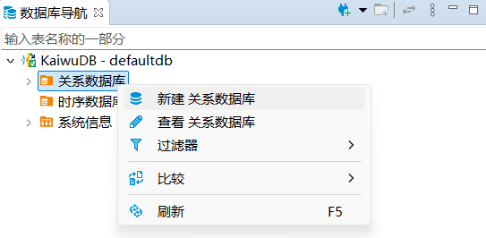

2. In the **Create Database** window, fill in the database name and click **OK**:

   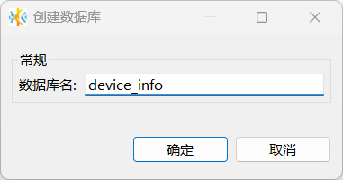

   After successful creation, the new database will automatically appear in the database navigation area, inheriting the KWDB database system's role and user settings.

#### Creating Relational Table

**Prerequisites**

User is a member of the `admin` role or has CREATE permission for the database. By default, the `root` user belongs to the `admin` role.

**Steps**

1. In the database navigation area, select the database and schema to operate on.
2. Right-click **Table** and select **New Table**:

   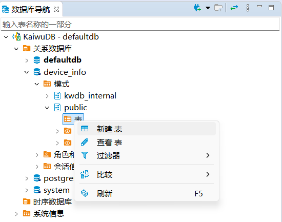

   The system will automatically create a table named `newtable` and open the object window.

3. In the object window, fill in the table name, add fields, and click **Save**:

   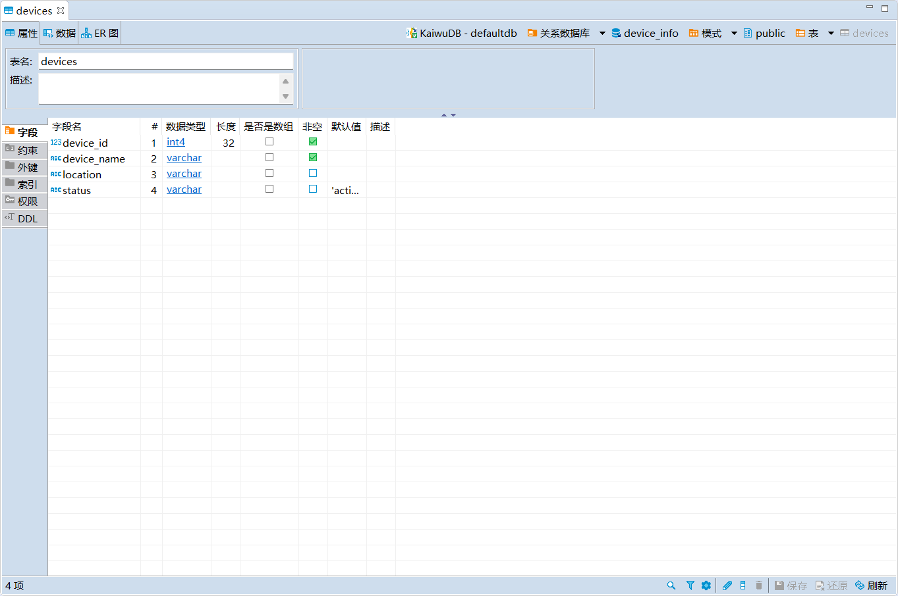

4. In the **Execute Changes** window, confirm the SQL statement is correct and click **Execute**.

#### Writing Relational Data

**Prerequisites**

User is a member of the `admin` role or has INSERT permission for the target table. By default, the `root` user belongs to the `admin` role.

**Steps**

1. In the database navigation area, double-click the table that needs to be modified.
2. In the **Data** tab, click the **Add New Row** button below the table to add corresponding data to the table:

   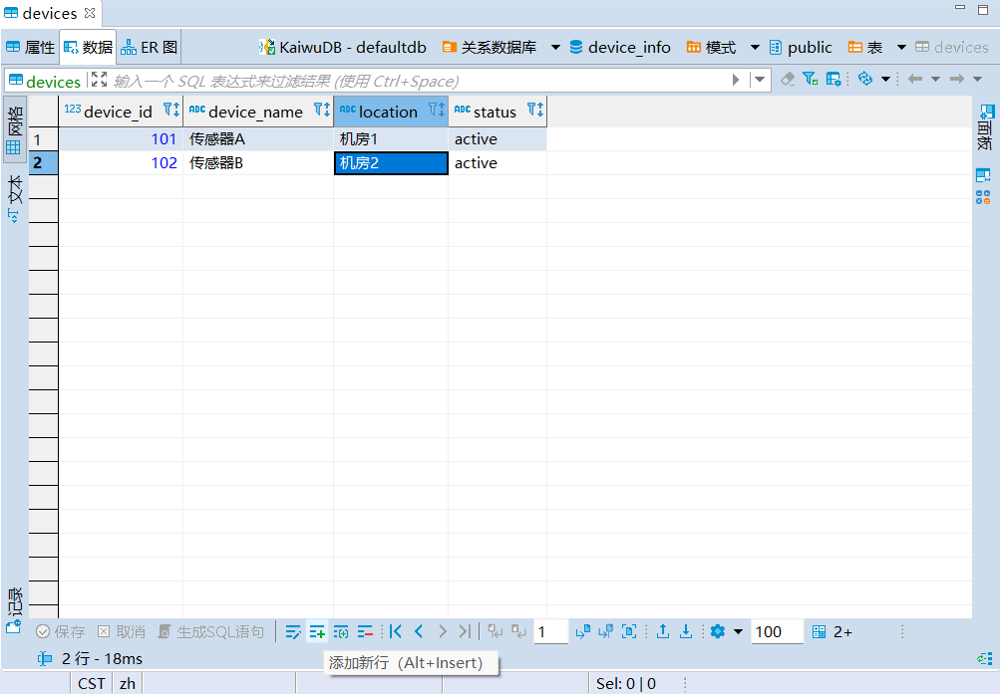

3. Click **Save**.

#### Querying Relational Data

**Prerequisites**: User is a member of the `admin` role or has SELECT permission for the target table. By default, the `root` user belongs to the `admin` role.

**Steps**: In the database navigation area, double-click the table you want to view to see the table data in the **Data** tab:

   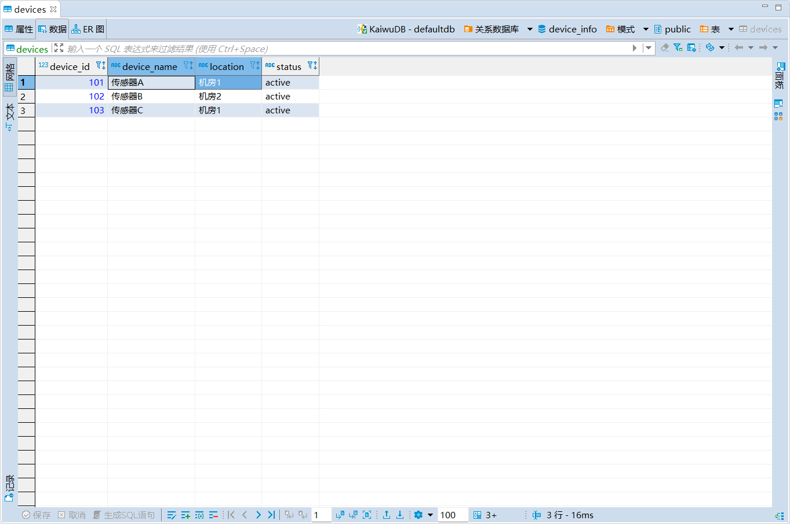

### Time-Series Data Operations

#### Creating Time-Series Database

**Prerequisites**

User is a member of the `admin` role. By default, the `root` user belongs to the `admin` role.

**Steps**

1. In the database navigation area, right-click **Time-Series Database** and select **New Time-Series Database**:

   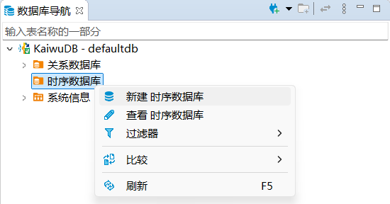

2. In the **Create Time-Series Database** window, fill in the database name and click **OK**:

   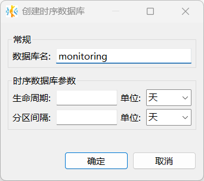

   After successful creation, the new database will automatically appear in the database navigation area, inheriting the KWDB database system's role and user settings.

#### Creating Time-Series Table

**Prerequisites**

User is a member of the `admin` role or has CREATE permission for the database. By default, the `root` user belongs to the `admin` role.

**Steps**

1. In the database navigation area, select the database and schema to operate on.
2. Right-click **Time-Series Table** and select **New Time-Series Table**:

   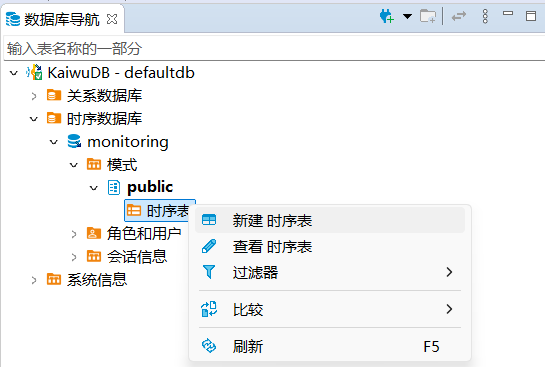

   The system will automatically create a table named `newtable` and open the object window.

3. In the **Properties** tab, fill in the table name.
4. In the **Fields** tab, modify or create new fields, setting field name, data type, length, whether non-null, default value, and description information. Note that the data type of the first field must be `timestamp` or `timestamptz` and non-null:

   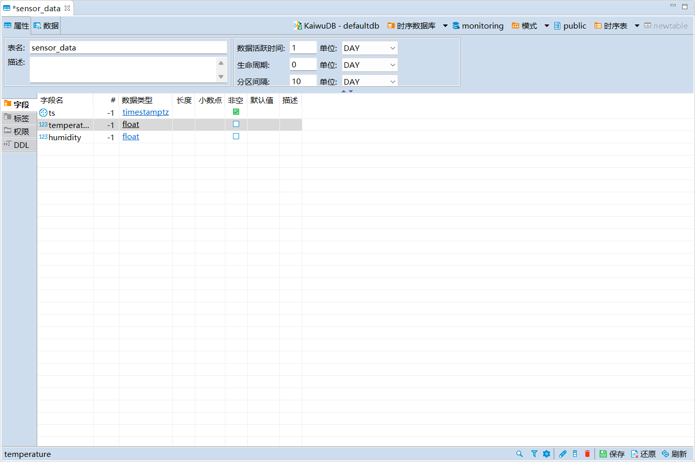

5. In the **Tags** tab, modify or add tags, setting tag name, data type, length, whether it is a primary tag, whether non-null, and description information, then click **Save**:

   ::: warning Note
   - Each time-series table must have at least one primary tag set, and the primary tag must be a non-null tag.
   - Tag names do not support Chinese characters temporarily, with a maximum length of 128 bytes.
   :::

   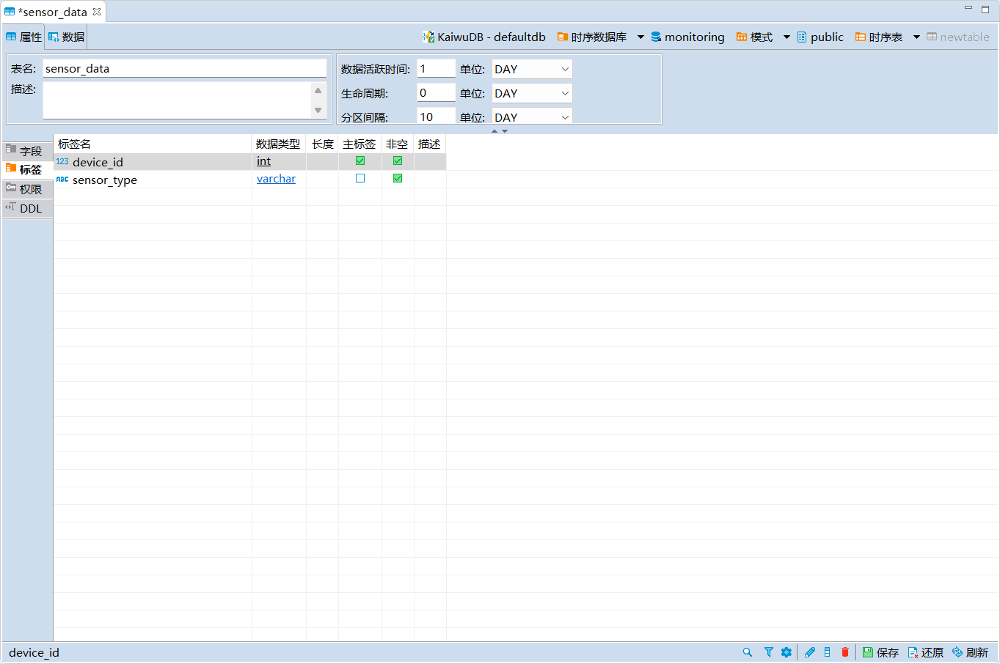

6. In the **Execute Changes** window, confirm the SQL statement is correct, then click **Execute**.

#### Writing Time-Series Data

**Prerequisites**

User is a member of the `admin` role or has INSERT permission for the target table. By default, the `root` user belongs to the `admin` role.

**Steps**

1. In the database navigation area, right-click the table that needs data editing and select **Edit Data**.
2. In the **Data** page, click the **Add New Row** button below the page to add corresponding data to the table:

   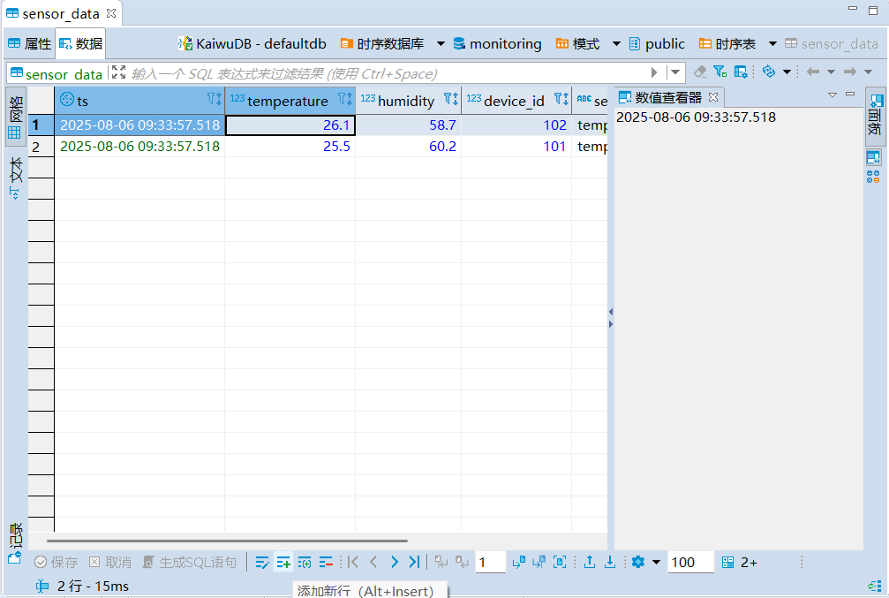

3. Click **Save**.

#### Querying Time-Series Data

**Prerequisites**

User is a member of the `admin` role or has SELECT permission for the target table. By default, the `root` user belongs to the `admin` role.

**Steps**

1. In the database navigation area, double-click the table you want to view to see the table data in the **Data** tab:

   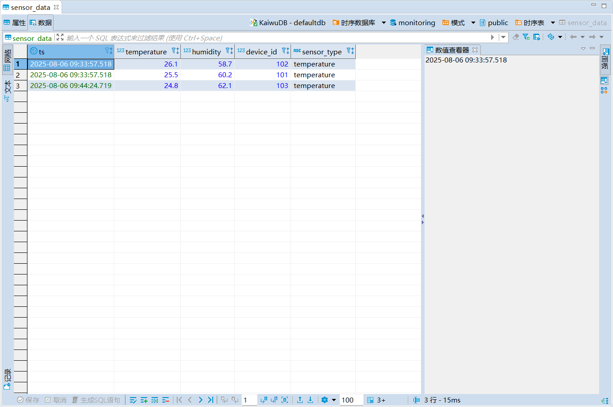

### Cross-Modal Queries

KaiwuDB Developer Center supports using the SQL editor to complete KWDB cross-modal query operations.

**Prerequisites**

User is a member of the `admin` role or has SELECT permission for the target table. By default, the `root` user belongs to the `admin` role.

**Steps**

1. Click the SQL editor in the menu bar and select **New SQL Editor**:

   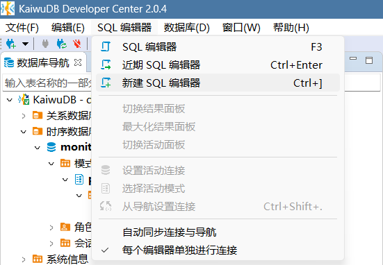

2. In the new SQL editor page, enter the cross-modal query SQL statement:

   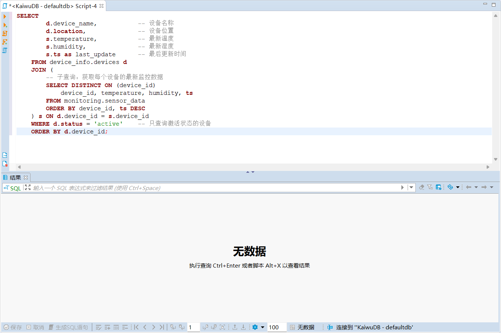

3. Click the **Execute SQL Statement** button on the left to get the query results:

   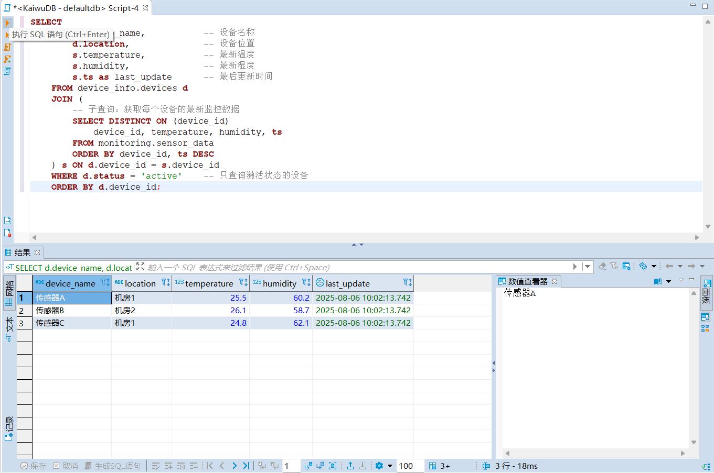
