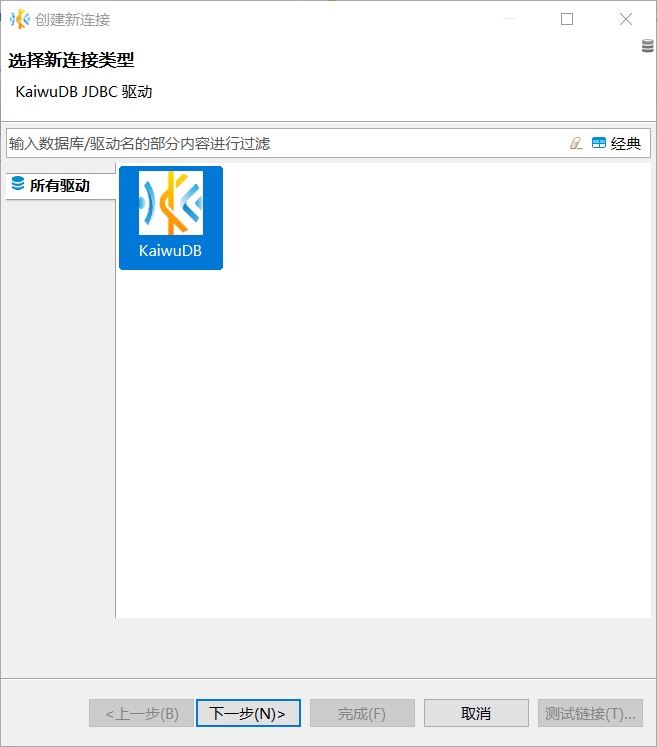
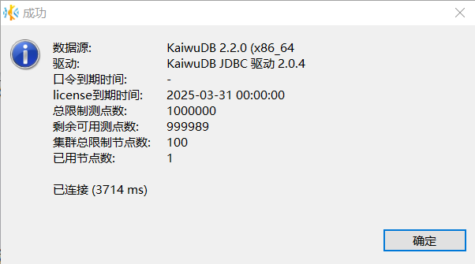
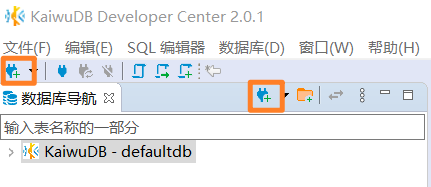
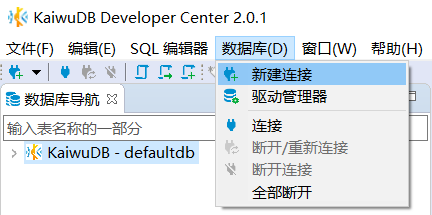

# Using KaiwuDB Developer Center

After deploying KWDB, use KaiwuDB Developer Center to connect and manage the database. This guide shows how to use this visual tool to access and manage KWDB.

::: warning Note The KaiwuDB Developer Center interface is currently available in Chinese only. :::

## Install KaiwuDB Developer Center

This section covers supported operating systems, environment requirements, and installation steps.

### Supported Operating Systems

::: warning Note
Interface appearance may vary slightly across operating systems, but functionality remains identical.
:::

KaiwuDB Developer Center supports the following operating systems:

- Windows 7 or later (64-bit)
- Linux kernel 2.6 or later
- macOS: All supported versions

### Environment Requirements

Installation of KaiwuDB Developer Center requires the following environment requirements:

| Environment | Requirements |
|------|------|
| Hardware | - RAM: 1GB or more   - Disk: 10GB or more |
| Software | - KWDB 2.0 or later   - OpenJRE 8 or later |

### Installation Steps

To install KaiwuDB Developer Center, follow these steps:

1. Extract the installation package. The directory structure is as follows:

   

2. Double-click the KaiwuDB Developer Center application to run it.

## Connect to KWDB

### First Connection

When you launch KaiwuDB Developer Center for the first time, or after removing all existing connections, the **创建新连接 (Create Connection)** wizard will appear automatically.

Follow these steps to create your first connection:

1. In the **创建新连接 (Create New Connection)** window, select the KaiwuDB driver and click **下一步(Next)**.

   

2. In the **常规 (General)** tab, enter the enter the connection details:
   - host address
   - port number
   - database name
   - username
   - password (not required for insecure deployment mode)

   

3. (Optional) Click **测试链接 (Test Connection)** to verify your configuration. A success message appears if the connection settings are correct.

   

4. Click **确定 (OK)**. The database navigation panel refreshes to display all databases you have permission to access.

   

### Additional Connection Methods

You can create new connections at any time using either of these methods:

- **Toolbar:** Click the **New Connection** button on the toolbar or the database navigation toolbar.

   

- **Menu:** Select **数据库 (Database)** from the menu bar, then click **新建连接 (New Connection)**.

   

## Manage KWDB

This section demonstrates managing KWDB using KaiwuDB Developer Center:

- **Relational Data**: Static data like device information
- **Time-Series Data**: Dynamic data like sensor readings
- **Cross-Model Queries**: Combining relational and time-series data for analysis

### Relational Data Operations

#### Create Relational Database

**Prerequisites**

User is a member of the `admin` role. By default, `root` belongs to `admin`.

**Steps**

1. In the Database Navigator, right-click **关系数据库 (Relational Databases)** and select **新建关系数据库 (Create Relational Database)**.

   

2. In the **创建数据库 (Create Database)** dialog, enter the database name and click **确定 (OK)**.

   

   After successful creation, the new database will automatically appear in the Database Navigator and inherit KWDB's role and user settings.

#### Create Relational Table

**Prerequisites**

User is a member of `admin` or has CREATE permission on the target database. By default, `root` belongs to `admin`.

**Steps**

1. In the Database Navigator, select the target database and schema.

2. Right-click **表 (Tables)** and select **新建表 (Create Table)**.

   

   The system will automatically create a table named `newtable` and open the Object window.

3. In the Object window, enter the table name, add fields, and click **保存 (Save)**.

   

4. In the **执行修改 (Persist Changes)** dialog, review the SQL statement and click **执行 (Execute)**.

#### Write Relational Data

**Prerequisites**

User is a member of `admin` or has INSERT permission on the target table. By default, `root` belongs to `admin`.

**Steps**

1. In the Database Navigator, double-click the table you want to modify.

2. In the **数据 (Data)** tab, click the **添加新行 (Add New Row)** button at the bottom to add new data.

   

3. Click **保存 (Save)**.

#### Query Relational Data

**Prerequisites**

User is a member of `admin` or has SELECT permission on the target table. By default, `root` belongs to `admin`.

**Steps**

1. In the Database Navigator, double-click the table you want to view. The table data will be displayed in the **数据 (Data)** tab.

   

### Time Series Data Operations

#### Create Time Series Database

**Prerequisites**

User is a member of the `admin` role. By default, `root` belongs to `admin`.

**Steps**

1. In the Database Navigator, right-click **时序数据库 (Time-Series Databases)** and select **新建时序数据库 (Create Time-Series Database)**.

   

2. In the **创建时序数据库 (Create Time-Series Database)** dialog, enter the database name and click **确定 (OK)**.

   

   After successful creation, the new database will automatically appear in the Database Navigator and inherit KWDB's role and user settings.

#### Create Time Series Table

**Prerequisites**

User is a member of `admin` or has CREATE permission on the target database. By default, `root` belongs to `admin`.

**Steps**

1. In the Database Navigator, select the target database and schema.

2. Right-click **时序表 (Time-Series Tables)** and select **新建时序表 (Create Time-Series Table)**.

   

   The system will automatically create a table named `newtable` and open the Object window.

3. In the **属性 (Properties)** tab, enter the table name.

4. In the **字段 (Fields)** tab, modify or create fields by specifying the field name, data type, length, null/not null constraint, default value, and description. Note that the first field must be of type `timestamp` or `timestamptz` and cannot be null.

   

5. In the **标签 (Tags)** tab, modify or add tags by specifying the tag name, data type, length, primary tag, not null constraint, and description. Then click **保存 (Save)**.

   ::: warning Note

   - Each time-series table must have at least one primary tag, and primary tags cannot be null.
   - Tag names do not currently support Chinese characters and have a maximum length of 128 bytes.

   :::

    

6. In the **执行修改 (Persist Changes)** dialog, review the SQL statement and click **执行 (Execute)**.

#### Write Time Series Data

**Prerequisites**

User is a member of `admin` or has INSERT permission on the target table. By default, `root` belongs to `admin`.

**Steps**

1. In the Database Navigator, right-click the table you want to edit and select **编辑数据 (Edit Data)**.

2. In the **数据 (Data)** tab, click the **添加新行 (Add New Row)** button at the bottom to add new data to the table.

   

3. Click **保存 (Save)**.

#### Query Time Series Data

**Prerequisites**

User is a member of `admin` or has SELECT permission on the target table. By default, `root` belongs to `admin`.

**Steps**

1. In the Database Navigator, double-click the table you want to view. The table data will be displayed in the **数据 (Data)** tab.

   

### Cross-Model Query

KaiwuDB Developer Center supports cross-model queries using the SQL editor.

**Prerequisites**

User is a member of `admin` or has SELECT permission on the target table. By default, `root` belongs to `admin`.

**Steps**

1. Click **SQL 编辑器 (SQL Editor)** in the Menu bar and select **新建 SQL 编辑器 (New SQL Editor)**.

   

2. In the new SQL Editor page, enter your cross-model query statement.

   

3. Click the **执行 SQL 语句 (Execute SQL Statement)** button on the left to run the query and retrieve the results.

   