# Manage KWDB Using KaiwuDB Developer Center

This section explains how to use the [KaiwuDB Developer Center](../../kaiwudb-developer-center/overview.md)’s graphical interface to create and manage databases and database objects in KWDB.

::: warning Note
The KaiwuDB Developer Center interface is currently available in Chinese only.
:::

## Interface Components

The user interface includes the following components:

- Menu bar
- Toolbar
- Database Navigator
- Object window
- Result window
- Status bar

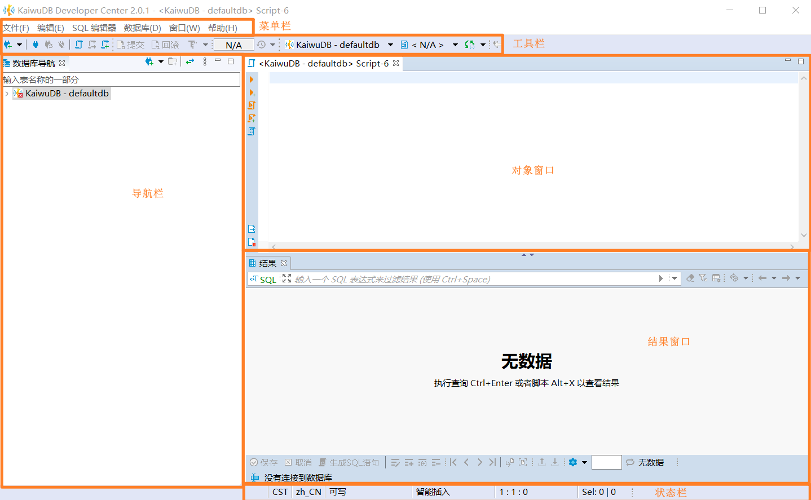

## Time-Series Data

### Creating a Time-Series Database

**Prerequisites**:

Administrator privileges

**Steps**:

1. In the Database Navigator, right-click **时序数据库 (Time-Series Databases)** and select **新建时序数据库 (Create Time-Series Database)**.

   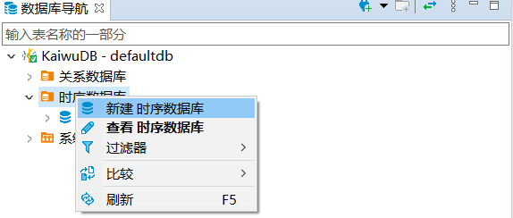

2. In the **创建时序数据库 (Create Time-Series Database)** window, enter the database name, set the lifecycle (default: 0 days - never expires) and partition interval (default: 10 days). Click **确定（OK）**.

   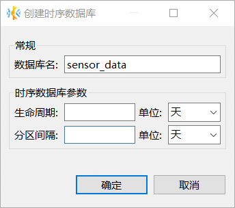

   The new database will appear in the Database Navigator and inherit KWDB role and user settings.

### Creating a Time-Series Table

**Prerequisites**:

Administrator privileges or `TABLE CREATE`/`ALL` privileges.

**Steps**:

1. Select the target database and schema in the Database Navigator.
2. Right-click **时序表 (Time-Series Tables)** and select **新建时序表 (Create Time-Series Table)**. A default table named `newtable` will be created.

   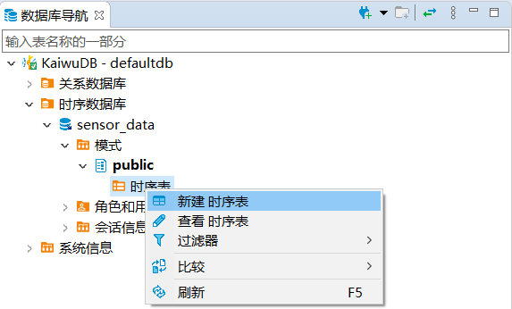

3. In the **属性 (Properties)** tab of the Object window, fill in the table name (max 128 bytes), active time (default: 1 day), lifecycle (default: 0 days - never expires), partition interval (default: 10 days), and description (optional).
4. In the **字段 (Fields)** section, create at least two fields. For each field, specify the name, data type, length (if applicable), null/not null, default value(optional), and description(optional). The first field must be `timestamp` or `timestamptz` and not null. Supported precision: 3 (milliseconds), 6 (microseconds), or 9 (nanoseconds). Default is 3 (milliseconds).

    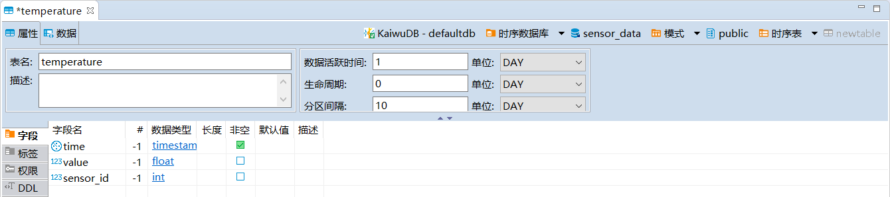

5. In the **标签 (Tags)** section, add at least one non-null primary tag. Tag names must be a maximum of 128 bytes and only support English characters. Once the tags are added, click **保存 (Save)**.
    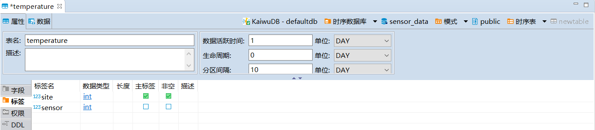

6. In the **执行修改 (Persist Changes)** window, verify the SQL statement and click **执行 (Execute)**.

### Writing Time-Series Data

**Prerequisites**:

Administrator privileges or `INSERT` privileges on the target table.

::: warning Note

- You can specify values for all columns or only for specific ones. For unspecified columns, if the column accepts `NULL`, the system will automatically use `NULL` as the default value. If the column does not accept `NULL`, the system will prompt: `Null value in column %s violates null-null constraints.`
- When entering `TIMESTAMP` or `TIMESTAMPTZ` data, use hyphens (`-`), spaces, or slashes (`/`) as the date separator and colons (`:`) as the time separator. Precision is up to microseconds (e.g., `2023-01-25 10:10:10.123`, `2023 01 25 10:10:10.123`, or `2023/01/25 10:10:10.123`).
- By default, newer data overwrites existing data with the same timestamp. You can modify this behavior using `SET CLUSTER SETTING ts.dedup.rule=[ merge | override | discard]` SQL statement. For more information, see [Cluster Settings Configuration](../../db-operation/cluster-settings-config.md).

:::

**Steps**:

1. Right-click the target table in the Database Navigator and select **编辑数据 (Edit Data)**.
2. Go to the **数据 (Data)** tab add click the **添加新行 (Add New Row)** button to add new data.
   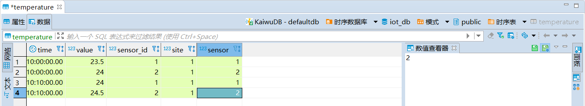

3. To view the generated SQL, click **生成SQL语句 (Generate SQL)** and then **执行 (Execute)**, or click **保存 (Save)** without SQL preview.

### Querying Time-Series Data

Double-click the target table in the Database Navigator to view the table properties and data.

::: tip
When working with tables containing many rows, use the toolbar to manage your view:

- See the total row count at a glance
- Adjust rows displayed per page (default: 100)
- Navigate between pages using the First, Previous, Next, and Last page buttons

Note: After changing the rows per page setting, click any page button to apply and refresh the pagination display.
:::

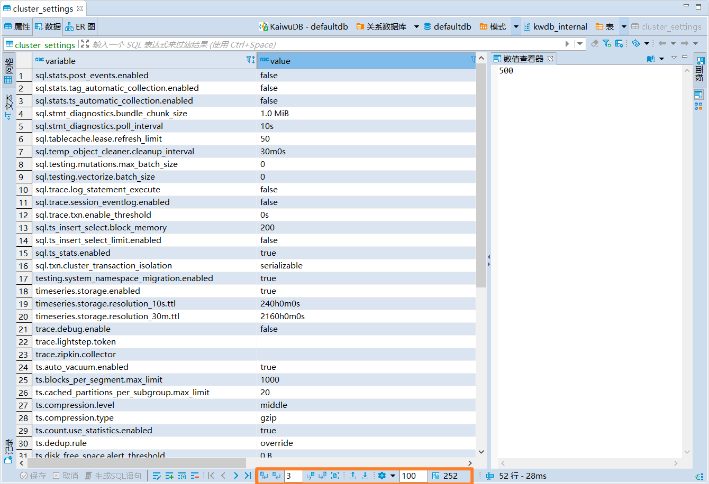

## Relational Data

### Creating a Relational Database

**Prerequisites**:

Administrator privileges.

**Steps**:

1. Right-click **关系数据库 (Relational Databases)** in the Database Navigator and select **新建关系数据库 (Create Relational Database)**.

   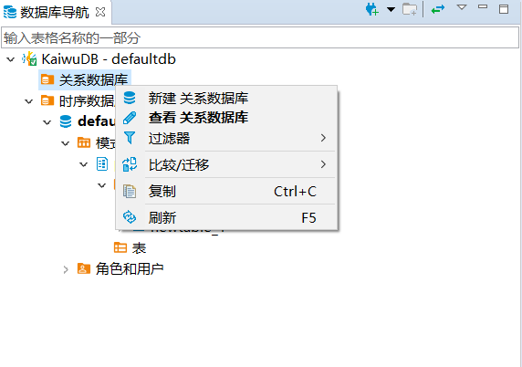

2. In the **创建数据库 (Create Database)** window, enter the database name and click **确定 (OK)**.

   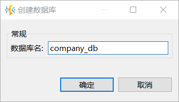

   The new database will appear in the Database Navigator and inherit KWDB's role and user settings.

### Creating a Relational Table

**Prerequisites**:

Administrator privileges or `TABLE CREATE`/`ALL` privileges.

**Steps**:

1. Select the target database and schema in the Database Navigator.

2. Right-click **表 (Tables)** and select **新建表 (Create Table)**. A default table named `newtable` will be created.

   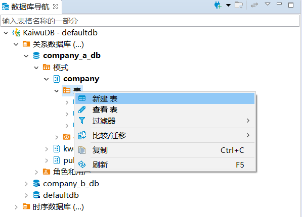

3. In the **属性 (Properties)** tab of the Object window, fill in the table name, description (optional), add fields, and click **保存 (Save)**.

   

4. In the **执行修改 (Persist Changes)** window, verify the SQL statement and click **执行 (Execute)**.

### Writing Relational Data

**Prerequisites**:

Administrator privileges or `INSERT` privileges on the target table.

**Steps**:

1. Right-click the target table in the Database Navigator and select **编辑表 (Edit Table)**.

   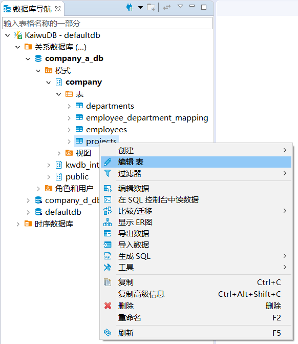

2. In the **数据 (Data)** tab, click the **添加新行 (Add New Row)** button to add new data.

   

3. To view the generated SQL, click **生成 SQL 语句 (Generate SQL)** and then **执行 (Execute)**, or click **保存 (Save)** without SQL preview.

### Querying Relational Data

Double-click the target table in the Database Navigator to view its properties, data, and ER diagram.

| Tab | Description                                                       |
| ----- | ---------------------------------------------------------- |
| Properties  | Table name, description, fields, constraints, foreign keys, indexes, permissions, and CREATE TABLE statement|
| Data  | View table data in grid or text format                             |
| ER Diagram | Graphical representation of entities, attributes, and relationships    |

::: tip
When working with tables containing many rows, use the toolbar to manage your view:

- See the total row count at a glance
- Adjust rows displayed per page (default: 100)
- Navigate between pages using the First, Previous, Next, and Last page buttons

Note: After changing the rows per page setting, click any page button to apply and refresh the pagination display.
:::

