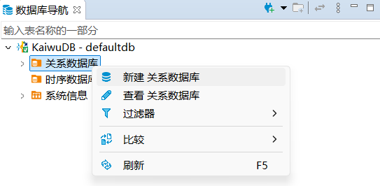
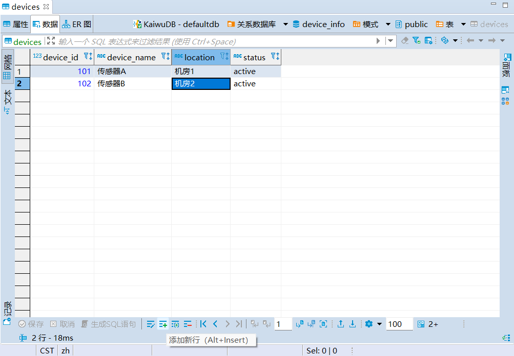
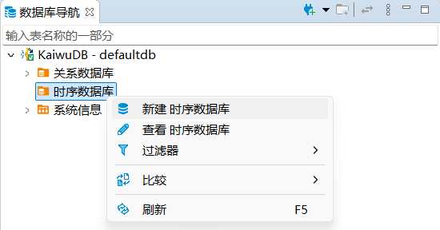
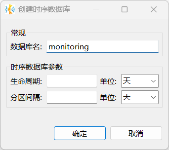
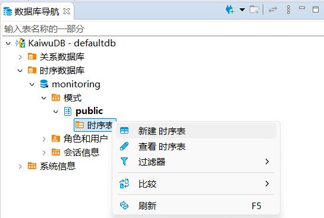
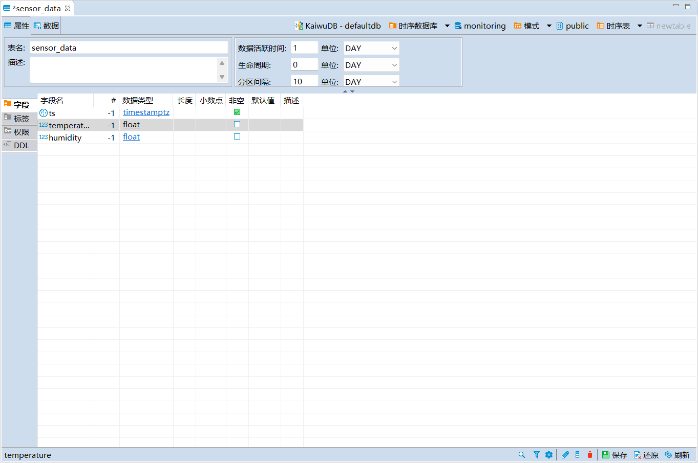
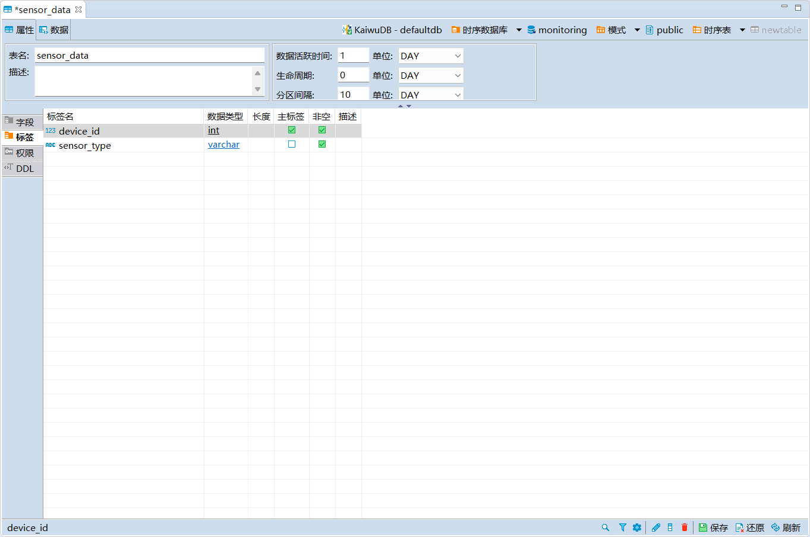
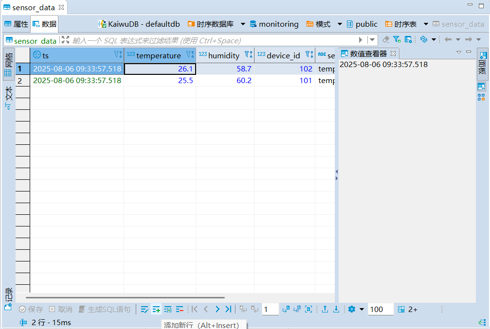
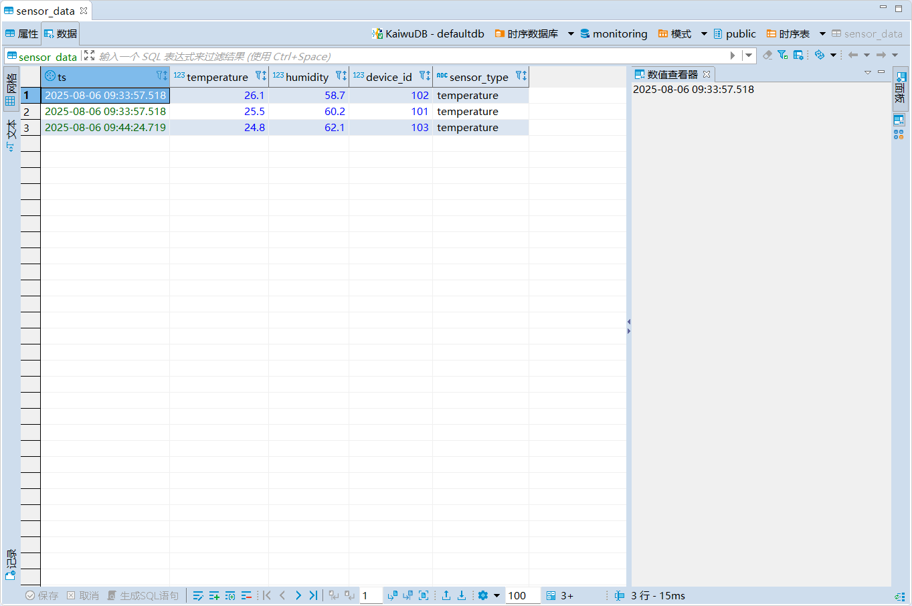
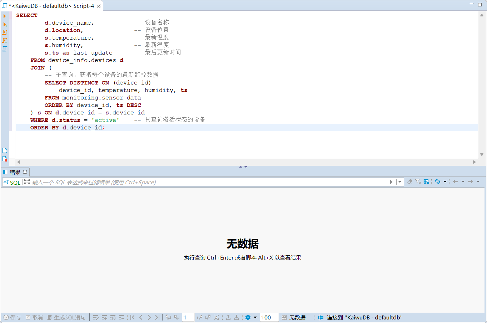

# Manage KWDB Using KaiwuDB Developer Center

This section demonstrates how to use the [KaiwuDB Developer Center](../../kaiwudb-developer-center/overview.md)’s graphical interface  to manage the KWDB multi-model database, including:

- **Relational Data Operations**: Manage relatively static data, such as device information and user profiles
- **Time-Series Data Operations**: Process dynamic time-series data, such as sensor readings and monitoring metrics
- **Cross-Model Queries**: Perform queries across relational and time-series databases for comprehensive data analysis

## Relational Data Operations

### Creating a Relational Database

**Prerequisites**

User must be a member of the `admin` role. By default, the `root` user belongs to the `admin` role.

**Steps**

1. In the Database Navigator, right-click **关系数据库 (Relational Databases)** and select **新建关系数据库 (Create Relational Database)**.

   

2. In the **创建数据库 (Create Database)** dialog, enter the database name and click **确定 (OK)**.

   

   After successful creation, the new database will automatically appear in the Database Navigator and inherit KWDB's role and user settings.

### Creating a Relational Table

**Prerequisites**

User must be a member of the `admin` role or have CREATE privileges on the target database. By default, the `root` user belongs to the `admin` role.

**Steps**

1. In the Database Navigator, select the target database and schema.

2. Right-click **表 (Tables)** and select **新建表 (Create Table)**.

   

   The system will automatically create a table named `newtable` and open the Object window.

3. In the Object window, enter the table name, add fields, and click **保存 (Save)**.

   

4. In the **执行修改 (Persist Changes)** dialog, review the SQL statement and click **执行 (Execute)**.

### Writing Data

**Prerequisites**

User must be a member of the `admin` role or have INSERT privileges on the target table. By default, the `root` user belongs to the `admin` role.

**Steps**

1. In the Database Navigator, double-click the table you want to modify.

2. In the **数据 (Data)** tab, click the **添加新行 (Add New Row)** button at the bottom to add new data.

   

3. Click **保存 (Save)**.

### Querying Data

**Prerequisites**

User must be a member of the `admin` role or have SELECT privileges on the target table. By default, the `root` user belongs to the `admin` role.

**Steps**

1. In the Database Navigator, double-click the table you want to view. The table data will be displayed in the **数据 (Data)** tab.

   

## Time-Series Data Operations

### Creating a Time-Series Database

**Prerequisites**

User must be a member of the `admin` role. By default, the `root` user belongs to the `admin` role.

**Steps**

1. In the Database Navigator, right-click **时序数据库 (Time-Series Databases)** and select **新建时序数据库 (Create Time-Series Database)**.

   

2. In the **创建时序数据库 (Create Time-Series Database)** dialog, enter the database name and click **确定 (OK)**.

   

   After successful creation, the new database will automatically appear in the Database Navigator and inherit KWDB's role and user settings.

### Creating a Time-Series Table

**Prerequisites**

User must be a member of the `admin` role or have CREATE privileges on the target database. By default, the `root` user belongs to the `admin` role.

**Steps**

1. In the Database Navigator, select the target database and schema.

2. Right-click **时序表 (Time-Series Tables)** and select **新建时序表 (Create Time-Series Table)**.

   

   The system will automatically create a table named `newtable` and open the Object window.

3. In the **属性 (Properties)** tab, enter the table name.

4. In the **字段 (Fields)** tab, modify or create fields by specifying the field name, data type, length, null/not null constraint, default value, and description. Note that the first field must be of type `timestamp` or `timestamptz` and cannot be null.

   

5. In the **标签 (Tags)** tab, modify or add tags by specifying the tag name, data type, length, primary tag, not null constraint, and description. Then click **保存 (Save)**.

   ::: warning Note

   - Each time-series table must have at least one primary tag, and primary tags cannot be null.
   - Tag names do not currently support Chinese characters and have a maximum length of 128 bytes.

   :::

    

6. In the **执行修改 (Persist Changes)** dialog, review the SQL statement and click **执行 (Execute)**.

### Writing Data

**Prerequisites**

User must be a member of the `admin` role or have INSERT privileges on the target table. By default, the `root` user belongs to the `admin` role.

**Steps**

1. In the Database Navigator, right-click the table you want to edit and select **编辑数据 (Edit Data)**.

2. In the **数据 (Data)** tab, click the **添加新行 (Add New Row)** button at the bottom to add new data to the table.

   

3. Click **保存 (Save)**.

### Querying Data

**Prerequisites**

User must be a member of the `admin` role or have SELECT privileges on the target table. By default, the `root` user belongs to the `admin` role.

**Steps**

1. In the Database Navigator, double-click the table you want to view. The table data will be displayed in the **数据 (Data)** tab.

   

## Cross-Model Queries

KaiwuDB Developer Center supports using the SQL Editor to perform cross-model queries in KWDB.

**Prerequisites**

User must be a member of the `admin` role or have SELECT privileges on the target tables. By default, the `root` user belongs to the `admin` role.

**Steps**

1. Click **SQL 编辑器 (SQL Editor)** in the Menu bar and select **新建 SQL 编辑器 (New SQL Editor)**.

   

2. In the new SQL Editor page, enter your cross-model query statement.

   

3. Click the **执行 SQL 语句 (Execute SQL Statement)** button on the left to run the query and retrieve the results.

   