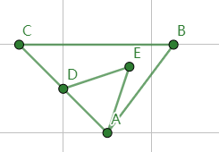

# Time-Series Data Types

KWDB time-series databases support the following data types:

- Time types
- Numeric types
- BOOL types
- String types

This table lists the original data types, default width, maximum width, and converted data types for time-series data.

| Original Data Type | Default Width | Max Width        | Converted Data Type                                  | Description                                                                                                                                                                                                               |
|--------------------|---------------|------------------|------------------------------------------------------|---------------------------------------------------------------------------------------------------------------------------------------------------------------------------------------------------------------------------|
| TIMESTAMP   | -        | -          | TIMESTAMPTZ, INT8, FLOAT4, FLOAT8                     | It is unavailable for TAG columns. <br>- When converting TIMESTAMP-typed values to INT8-typed values, the INT8-typed value is fixed with the microseconds precision level that has 13 digits. <br>- When converting TIMESTAMP-typed values to FLOAT4-typed values, the FLOAT4-typed value is fixed with a precision level that has about 7 valid digits. <br>- When converting TIMESTAMP-typed values to FLOAT8-typed values, the FLOAT8-typed value is fixed with a precision level that has about 15-17 valid digits.     |
| TIMESTAMPTZ | -        | -          | TIMESTAMP, INT8, FLOAT4, FLOAT8                                              | It is unavailable for TAG columns. <br>- When converting TIMESTAMPTZ-typed values to INT8-typed values, the INT8-typed value is fixed with the microseconds precision level that has 13 digits. <br>- When converting TIMESTAMPTZ-typed values to FLOAT4-typed values, the FLOAT4-typed value is fixed with a precision level that has about 7 valid digits. <br>- When converting TIMESTAMPTZ-typed values to FLOAT8-typed values, the FLOAT8-typed value is fixed with a precision level that has about 15-17 valid digits.                                                                              |
| INT2               | 2 bytes       | -                | INT4, INT8, VARCHAR                                  | When converting INT2-typed values to VARCHAR-typed values, the minimum VARCHAR-typed data width is 6.                                                                                                                      |
| INT4               | 4 bytes       | -                | INT8, VARCHAR                                        | When converting INT4-typed values to VARCHAR-typed values, the minimum VARCHAR-typed data width is 11.                                                                                                                     |
| INT8               | 8 bytes       | -                | VARCHAR                                              | When converting INT8-typed values to VARCHAR-typed values, the minimum VARCHAR-typed data width is 20.                                                                                                                     |
| FLOAT4             | 4 bytes       | -                | FLOAT, VARCHAR                                       | When converting FLOAT4-typed values to VARCHAR-typed values, the minimum VARCHAR-typed data width is 30.                                                                                                                     |
| FLOAT8             | 8 bytes       | -                | VARCHAR                                              | When converting FLOAT8-typed values to VARCHAR-typed values, the minimum VARCHAR-typed data width is 30.                                                                                                                    |
| CHAR               | 1 byte        | 1023             | NCHAR, VARCHAR, NVARCHAR                             | When converting CHAR-typed values to NCHAR-typed or NVARCHAR-typed values, the NCHAR-typed or NVARCHAR-typed data width should not be shorter than a quarter of the original data width.                                  |
| VARCHAR            | 254 bytes     | 65534 bytes      | CHAR, NCHAR, NVARCHAR, INT2, INT4, INT8, REAL, FLOAT | When converting VARCHAR-typed values to NCHAR-typed or NVARCHAR-typed values, the NCHAR-typed or NVARCHAR-typed data width should not be shorter than a quarter of the original data width.                               |
| NCHAR              | 1 character   | 254 characters   | CHAR, VARCHAR, NVARCHAR                              | When converting NCHAR-typed values to CHAR-typed or VARCHAR-typed values, the CHAR-typed or VARCHAR-typed data width should not be shorter than 4 times of the original data width.                                       |
| NVARCHAR           | 63 characters | 16384 characters | CHAR, VARCHAR, NCHAR                                 | When converting NVARCHAR-typed values to CHAR-typed or VARCHAR-typed values, the CHAR-typed or VARCHAR-typed data width should not be shorter than 4 times of the original data width. It is unavailable for TAG columns. |

::: warning Note

- The converted data width must be greater than the original data width. For example, INT4 can be converted to INT8 but not to INT2. CHAR(200) can be converted to VARCHAR (254) but not to VARCHAR (100).
- CHAR-typed, VARCHAR-typed, NCHAR-typed, and NVARCHAR-typed values can be converted to values of the same data types. But the width cannot be shorter. For example, CHAR(100) can be converted to VARCHAR (200) but not to VARCHAR (50).

:::

## Time Types

KWDB time-series databases support TIMESTAMP and TIMESTAMPTZ time types.

### Basic Information

The TIMESTAMP data type has TIMESTAMP and TIMESTAMPTZ variants. The TIMESTAMP-typed values support a nacoseconds precision level.

TIMESTAMP constants represent specific date and time. In general, the TIMESTAMP constants cannot be modified. You can express TIMESTAMP constants using the `timestamp 'YYYY-MM-DD HH:MM:SS.SSS'` format, such as `timestamp '2023-10-19 15:30:00'`.

| Name        | Alias                       | Description                                                          |
|-------------|-----------------------------|----------------------------------------------------------------------|
| TIMESTAMP   | TIMESTAMP WITHOUT TIME ZONE | Store date and time in UTC.                                          |
| TIMESTAMPTZ | TIMESTAMP WITH TIME ZONE    | Convert TIMESTAMP values from UTC to the client's session time zone. |

::: warning note

- TIMESTAMPTZ does not store any time zone data.
- By default, KWDB adopts UTC. Therefore, the default value for TIMESTAMPTZ is identical to that of TIMESTAMP.
- When the first column of a time-series table is specified as a TIMESTAMP-typed column, it adopts the same processing logic as a TIMESTAMPTZ-typed column.
- KWDB does not support changing the precision level of a TIMESTAMP-typed or TIMESTAMPTZ-typed column using the `ALTER COLUMN ... SET DATA TYPE` statement.

:::

KWDB supports precision levels of 3 (milliseconds), 6 (microseconds) and 9 (nacoseconds) for TIMESTAMP/TIMESTAMPTZ values. By default, TIMESTAMP/TIMESTAMPTZ values have a precision of 3 (milliseconds). Precision in time values specifies the number of fractional digits retained in the seconds field. For example, specifying a TIMESTAMPTZ value as TIMESTAMPTZ(3) truncates the time component to milliseconds. If no precision level is specified, KWDB adopts the default precision level.

Currently, KWDB supports inserting a timestamp using any of the following ways:

- `now()` function: when inserting a timestamp using the `now()` function, KWDB converts the value to an INT64-typed value based on the precision level, checks whether the converted value exceeds the time range supported by the precision level, and then inserts the value into the column.
- STRING-typed timestamp: when inserting a STRING-typed timestamp, KWDB converts the value to an INT64-typed value based on the precision level, checks whether the converted value exceeds the time range supported by the precision level, rounds and truncates the time that exceeds the precision level, then inserts the truncated value into the column.
- INT-typed timestamp: when inserting an INT-typed timestamp, KWDB checks whether the value exceeds the time range supported by the precision level and then inserts the value into the column.

KWDB supports addition and subtraction operations of time in queries for timestamp-typed columns or timestamp constants, and for functions and expressions whose result is timestamp. KWDB supports comparing the operation results using the greater than sign (`>`), the less than sign (`<`), the equals sign (`=`), the greater than or equal to sign (`>=`), and the less than or equal to sign (`<=`). For details, see [Simple Query](../dml/ts-db/ts-select.md).

### Data Type Conversions and Casts

TIMESTAMP-typed values can be cast to any of the following data types.

| Type | Description |
| --- | --- |
| INT | The system returns an error if the value is NaN or +/- Inf. |
| FLOAT | Convert to milliseconds since Jan. 1, 1970. |
| STRING | - |
| TIMESTAMPTZ | - |

TIMESTAMPTZ-typed values can be cast to any of the following data types.

| Type | Description |
| --- | --- |
| INT | The system returns an error if the value is NaN or +/- Inf. |
| FLOAT | Convert to milliseconds since Jan. 1, 1970. |
| STRING | - |
| TIMESTAMP | - |

### Data Type Conversions and Casts

TIMESTAMP-typed values can be cast to any of the following data types.

| Type | Description |
| --- | --- |
| INT | The system returns an error if the value is NaN or +/- Inf. |
| FLOAT | Convert to milliseconds since Jan. 1, 1970. |
| STRING | - |
| TIMESTAMPTZ | - |

TIMESTAMPTZ-typed values can be cast to any of the following data types.

| Type | Description |
| --- | --- |
| INT | The system returns an error if the value is NaN or +/- Inf. |
| FLOAT | Convert to milliseconds since Jan. 1, 1970. |
| STRING | - |
| TIMESTAMP | - |

### Examples

- Create a table with TIMESTAMP-typed and TIMESTAMPTZ-typed columns.

    ```sql
    -- 1. Create a table named timestamps.

    create table timestamps (ks timestamp not null, c1 timestamp, c2 timestamptz) tags (site int not null) primary tags (site);
    CREATE TABLE

    -- 2. Check columns of the table. 

    show columns from timestamps;
        column_name |  data_type  | is_nullable | column_default | generation_expression |  indices  | is_hidden | is_tag
    --------------+-------------+-------------+----------------+-----------------------+-----------+-----------+---------
        ks          | TIMESTAMPTZ |    false    | NULL           |                       | {primary} |   false   | false
        c1          | TIMESTAMP   |    true     | NULL           |                       | {}        |   false   | false
        c2          | TIMESTAMPTZ |    true     | NULL           |                       | {}        |   false   | false
        site        | INT4        |    false    | NULL           |                       | {}        |   false   |  true
    (4 rows)
    ```

- Create a table with TIMESTAMP-typed and TIMESTAMPTZ-typed columns and specify the precision levels.

    ```sql
    -- 1. Create a table named t.

    CREATE TABLE t(ts timestamptz(3), ts1 timestamp, ts2 timestamp(6), ts3 timestamp(9)) tags(ptag int not null) primary tags(ptag);

    -- 2. Check the created table.

    SHOW CREATE TABLE t; 
      table_name |              create_statement
    -------------+----------------------------------------------
      t          | CREATE TABLE t (
                |     ts TIMESTAMPTZ(3) NOT NULL,
                |     ts1 TIMESTAMP(3) NULL,
                |     ts2 TIMESTAMP(6) NULL,
                |     ts3 TIMESTAMP(9) NULL,
                | ) TAGS (
                |     ptag INT4 NOT NULL ) PRIMARY TAGS(ptag)
    ```

## Numeric Types

KWDB time-series databases support integer and floating-point numeric types.

### Integer Types

#### Basic Information

KWDB supports various signed integer data types.

| Name | Alias                | Storage Space | Range                                       |
|------|----------------------|---------------|---------------------------------------------|
| INT2 | SMALLINT             | 2 bytes       | -32768 ~ +32767                             |
| INT4 | - INT <br>- INTEGER  | 4 bytes       | -2147483648 ~ +2147483647                   |
| INT8 | - INT64 <br>- BIGINT | 8 bytes       | -9223372036854775808 ~ +9223372036854775807 |

::: warning note
A constant value of an integer type can be entered as a numeric literal. For example, `42`, `-1234` or `0xCAFE`.
:::

#### Data Type Conversions and Casts

INTEGER-typed values can be cast to any of the following data types.

| Type | Description |
| --- | --- |
| BOOL | `0` converts to `false`. All other values convert to `true`. |
| FLOAT | - |
| STRING | Convert the INTEGER-typed value to the corresponding STRING-typed value and truncate it based on the converted STRING type. |
| TIMESTAMP | Convert to milliseconds since Jan. 1, 1970.|
| TIMESTAMPTZ | Convert to milliseconds since Jan. 1, 1970.|

#### Examples

This example creates a table with INTEGER-typed columns.

```sql
-- 1. Create a table named ints.

create table ints(ts timestamp not null,c1 int,c2 smallint,c3 bigint,c4 integer,c5 int2,c6 int4,c7 int8,c8 int64) tags (tag1 int not null) primary tags (tag1);
CREATE TABLE

-- 2. Check columns of the table.

show columns from ints;
  column_name |  data_type  | is_nullable | column_default | generation_expression |  indices  | is_hidden | is_tag
--------------+-------------+-------------+----------------+-----------------------+-----------+-----------+---------
  ts          | TIMESTAMPTZ |    false    | NULL           |                       | {primary} |   false   | false
  c1          | INT4        |    true     | NULL           |                       | {}        |   false   | false
  c2          | INT2        |    true     | NULL           |                       | {}        |   false   | false
  c3          | INT8        |    true     | NULL           |                       | {}        |   false   | false
  c4          | INT4        |    true     | NULL           |                       | {}        |   false   | false
  c5          | INT2        |    true     | NULL           |                       | {}        |   false   | false
  c6          | INT4        |    true     | NULL           |                       | {}        |   false   | false
  c7          | INT8        |    true     | NULL           |                       | {}        |   false   | false
  c8          | INT8        |    true     | NULL           |                       | {}        |   false   | false
  tag1        | INT4        |    false    | NULL           |                       | {}        |   false   |  true
(10 rows)
```

### Floating-Point Types

#### Basic Information

KWDB supports FLOAT4 and FLOAT8 floating-point types, with the maximum precision of 17 decimal digits. A constant value of a floating-point type can be entered as a numeric literal. For example, `1.414` or `1234`.

Floating-point types are handled internally using the standard double-precision (64-bit binary-encoded) IEEE754 format.

| Name   | Alias                                        | Storage Space |
|--------|----------------------------------------------|---------------|
| FLOAT8 | - DOUBLE <br> - DOUBLE PRECISION <br>- FLOAT | 8 bytes       |
| FLOAT4 | REAL                                         | 4 bytes       |

A FLOAT-typed column supports values up to 8 bytes in width, but the total storage size is likely to be larger due to KWDB metadata.

To limit a FLOAT-typed column, use `CAST(column as DECIMAL(precision, scale))`, where `precision` is the maximum count of digits both to the left and right of the decimal point and `scale` is the exact count of digits to the right of the decimal point. The `precision` must not be smaller than the `scale`. Using `DECIMAL(precision)` is equivalent to `DECIMAL(precision, 0)`.

#### Data Type Conversions and Casts

Floating-point-typed values can be cast to any of the following data types.

| Type | Description |
| --- | --- |
| BOOL | `0` converts to `false`. All other values convert to `true`. |
| FLOAT | Lose precision when converting the floating-point-typed value to the corresponding FLOAT4-typed value.|
| STRING | Convert the floating-point-typed value to the corresponding STRING-typed value and truncate it based on the converted STRING type. |

#### Examples

This example creates a table with floating-point-typed columns, inserts data into the table, and then uses the `CAST` function to limit the floating-point-typed columns.

```sql
-- 1. Create a table named floats.

create table floats(ts timestamp not null,c1 float,c2 real,c3 double precision) tags (tag1 int not null) primary tags (tag1);
CREATE TABLE

-- 2. Check columns of the table.

show columns from floats;
  column_name |  data_type  | is_nullable | column_default | generation_expression |  indices  | is_hidden | is_tag
--------------+-------------+-------------+----------------+-----------------------+-----------+-----------+---------
  ts          | TIMESTAMPTZ |    false    | NULL           |                       | {primary} |   false   | false
  c1          | FLOAT8      |    true     | NULL           |                       | {}        |   false   | false
  c2          | FLOAT4      |    true     | NULL           |                       | {}        |   false   | false
  c3          | FLOAT8      |    true     | NULL           |                       | {}        |   false   | false
  tag1        | INT4        |    false    | NULL           |                       | {}        |   false   |  true
(5 rows)

-- 3. Insert data into the floating-point-typed columns.

INSERT INTO floats VALUES (now(), 2.718281828459,3.1415926,1e1,1);
INSERT 1

-- 4. Check data of the table. 

SELECT * FROM floats;
               ts               |       c1       |    c2    | c3 | tag1
--------------------------------+----------------+----------+----+-------
  2024-02-05 01:32:15.569+00:00 | 2.718281828459 | 3.141593 | 10 |    1
(1 row)

-- 5. Use the CAST function to limit the floating-point-typed column.

SELECT cast(c1 as decimal (8,6)),cast (c2 as decimal (8,2)) FROM floats;
c1      |c2
--------+-----
2.718282|3.14
(1 row)
```

## BOOL Types

### Basic Information

The BOOL data type stores a Boolean value of `false` or `true`. A BOOL-typed column supports values up to 1 byte in width, but the total storage size is likely to be larger due to KWDB metadata.

| Name | Alias   | Storage Space |
|------|---------|---------------|
| BOOL | BOOLEAN | 1 byte        |

There are two predefined named constants for BOOL: `TRUE` and `FALSE` (the names are case-insensitive).

A boolean value can be obtained by coercing a numeric value. Zero is coerced to `FALSE`, and any non-zero value to `TRUE`.

- `CAST(0 AS BOOL) (false)`
- `CAST(119 AS BOOL) (true)`

### Data Type Conversions and Casts

BOOL-typed values can be cast to any of the following data types.

| Type | Description |
| --- | --- |
| INT | Convert `true` to `1`, `false` to `0`.|
| FLOAT | Convert `true` to `1`, `false` to `0`.|
| STRING | - |

### Examples

This example creates a table with BOOL-typed columns.

```sql
-- 1. Create a table named bools.

CREATE TABLE bools(ts timestamp not null,c1 bool,c2 boolean) tags (tag1 int not null) primary tags (tag1);
CREATE TABLE

-- 2. Check columns of the table.

show columns from bools;
  column_name |  data_type  | is_nullable | column_default | generation_expression |  indices  | is_hidden | is_tag
--------------+-------------+-------------+----------------+-----------------------+-----------+-----------+---------
  ts          | TIMESTAMPTZ |    false    | NULL           |                       | {primary} |   false   | false
  c1          | BOOL        |    true     | NULL           |                       | {}        |   false   | false
  c2          | BOOL        |    true     | NULL           |                       | {}        |   false   | false
  tag1        | INT4        |    false    | NULL           |                       | {}        |   false   |  true
(4 rows)
```

## String Types

### VARBYTES

#### Basic Information

VARBYTES-typed values are variable-length strings. The maximum size of VARBYTES-typed values is subject to the column's length limit.

- If the value is shorter than the column's length limit, KWDB stores the value with its actual length and does not add space padding to the end of the value.
- If the value exceeds the column's length limit, KWDB returns an error.

VARBYTES-typed values are stored and sorted based on binary values.

| Name     | Storage Space |
|----------|---------------|
| VARBYTES | 0 ~ 64K bytes |

#### Examples

This example creates a table with VARBYTES-typed columns.

```sql
-- 1. Create a table named varbytes.

CREATE TABLE varbytes(ts timestamp not null,c1 varbytes,c2 varbytes(65536)) tags (tag1 int not null) primary tags (tag1);
CREATE TABLE

-- 2. Check columns of the table.

show columns from varbytes;
  column_name |    data_type    | is_nullable | column_default | generation_expression |  indices  | is_hidden | is_tag
--------------+-----------------+-------------+----------------+-----------------------+-----------+-----------+---------
  ts          | TIMESTAMPTZ     |    false    | NULL           |                       | {primary} |   false   | false
  c1          | VARBYTES(254)   |    true     | NULL           |                       | {}        |   false   | false
  c2          | VARBYTES(65536) |    true     | NULL           |                       | {}        |   false   | false
  tag1        | INT4            |    false    | NULL           |                       | {}        |   false   |  true
(4 rows)
```

### CHAR

#### Basic Information

CHAR-typed values are fixed-length strings. The length of a CHAR-typed value is fixed to the length that you declare when you create the table.

- If the value is shorter than the column's length limit, KWDB adds space padding to the end of the value.
- If the value exceeds the column's length limit, KWDB returns an error.

The length of a single character depends on the coding method.

To limit the length of a CHAR-typed value, use `CHAR(n)`, where `n` represents the number of bytes. By default, it is set to 1 byte.

| Name | Alias     | Storage Space  |
|------|-----------|----------------|
| CHAR | CHARACTER | 0 ~ 1023 bytes |

#### Examples

This example creates a table with CHAR-typed columns and then inserts data into the table.

```sql
-- 1. Create a table named chars.

CREATE TABLE chars(ts timestamp not null,c1 char,c2 character,c3 char(1023)) tags (tag1 int not null) primary tags (tag1);
CREATE TABLE

-- 2. Check columns of the table.

SHOW COLUMNS FROM chars;
  column_name |  data_type  | is_nullable | column_default | generation_expression |  indices  | is_hidden | is_tag
--------------+-------------+-------------+----------------+-----------------------+-----------+-----------+---------
  ts          | TIMESTAMPTZ |    false    | NULL           |                       | {primary} |   false   | false
  c1          | CHAR        |    true     | NULL           |                       | {}        |   false   | false
  c2          | CHAR        |    true     | NULL           |                       | {}        |   false   | false
  c3          | CHAR(1023)  |    true     | NULL           |                       | {}        |   false   | false
  tag1        | INT4        |    false    | NULL           |                       | {}        |   false   | true
(5 rows)

-- 3. Insert data into the table.

INSERT INTO chars values(now(),'s','9','a1b2c3d4', 1);
INSERT 1

-- 4. Check data of the table. 

SELECT * FROM chars;
               ts               | c1 | c2 |    c3    | tag1
--------------------------------+----+----+----------+-------
  2024-02-05 01:54:05.369+00:00 | s  |  9 | a1b2c3d4 |    1
(1 row)
```

### NCHAR

#### Basic Information

NCHAR-typed values are fixed-length strings. The length of a NCHAR-typed value is fixed to the length that you declare when you create the table.

- If the value is shorter than the column's length limit, KWDB adds space padding to the end of the value.
- If the value exceeds the column's length limit, KWDB returns an error.

To limit the length of a NCHAR-typed value, use `NCHAR(n)`, where `n` represents the number of characters. By default, it is set to 1 character.

| Name  | Storage Space      |
|-------|--------------------|
| NCHAR | 0 ~ 255 characters |

#### Examples

This example creates a table with NCHAR-typed columns and then inserts data into the table.

```sql
-- 1. Create a table named nchars.

CREATE TABLE nchars(ts timestamp not null,c1 nchar,c2 nchar(255)) tags (tag1 int not null) primary tags (tag1);
CREATE TABLE

-- 2. Check columns of the table.

SHOW COLUMNS FROM nchars;
  column_name |  data_type  | is_nullable | column_default | generation_expression |  indices  | is_hidden | is_tag
--------------+-------------+-------------+----------------+-----------------------+-----------+-----------+---------
  ts          | TIMESTAMPTZ |    false    | NULL           |                       | {primary} |   false   | false
  c1          | NCHAR       |    true     | NULL           |                       | {}        |   false   | false
  c2          | NCHAR(255)  |    true     | NULL           |                       | {}        |   false   | false
  tag1        | INT4        |    false    | NULL           |                       | {}        |   false   | true
(4 rows)

-- 3. Insert data into the table.

INSERT INTO nchars values(now(),'a','a1b2c3d4',1);
INSERT 1

-- 4. Check data of the table. 

select * from nchars;
               ts               | c1 |    c2    | tag1
--------------------------------+----+----------+-------
  2024-02-05 01:56:16.796+00:00 | a  | a1b2c3d4 |    1
(1 row)
```

### VARCHAR

#### Basic Information

VARCHAR-typed values are variable-length strings. The maximum size of VARCHAR-typed values is subject to the column's length limit.

- If the value is shorter than the column's length limit, KWDB stores the value with its actual length and does not add space padding to the end of the value.
- If the value exceeds the column's length limit, KWDB returns an error.

The length of a single character depends on the coding method.

To limit the length of a VARCHAR-typed value, use `VARCHAR(n)`, where `n` represents the number of bytes. By default, it is set to `254` bytes.

| Name    | Storage Space |
|---------|---------------|
| VARCHAR | 0 ~ 65534 bytes |

#### Examples

This example creates a table with VARCHAR-typed columns and then inserts data into the table.

```sql
-- 1. Create a table named varchars.

CREATE TABLE varchars(ts timestamp not null,c1 varchar,c2 varchar(65534)) tags (tag1 int not null) primary tags (tag1);
CREATE TABLE

-- 2. Check columns of the table.

show columns from varchars;
  column_name |   data_type    | is_nullable | column_default | generation_expression |  indices  | is_hidden | is_tag
--------------+----------------+-------------+----------------+-----------------------+-----------+-----------+---------
  ts          | TIMESTAMPTZ    |    false    | NULL           |                       | {primary} |   false   | false
  c1          | VARCHAR(254)   |    true     | NULL           |                       | {}        |   false   | false
  c2          | VARCHAR(65534) |    true     | NULL           |                       | {}        |   false   | false
  tag1        | INT4           |    false    | NULL           |                       | {}        |   false   | true
(4 rows)

-- 3. Insert data into the table.

INSERT INTO varchars values(now(),'a','a1b2c3d4',1);
INSERT 1
```

### NVARCHAR

#### Basic Information

NVARCHAR-typed values are variable-length strings. The maximum size of NVARCHAR-typed values is subject to the column's length limit.

- If the value is shorter than the column's length limit, KWDB stores the value with its actual length and does not add space padding to the end of the value.
- If the value exceeds the column's length limit, KWDB returns an error.

NVARCHAR-typed values are stored using the Unicode coding method.

To limit the length of a NVARCHAR-typed value, use `NVARCHAR(n)`, where `n` represents the number of characters. By default, it is set to `63` characters.

| Name     | Storage Space        |
|----------|----------------------|
| NVARCHAR | 0 ~ 16384 characters |

#### Examples

This example creates a table with NVARCHAR-typed columns and then inserts data into the table.

```sql
-- 1. Create a table named nvarchars.

CREATE TABLE nvarchars(ts timestamp not null,c1 nvarchar,c2 nvarchar(16384)) tags (tag1 int not null) primary tags (tag1);
CREATE TABLE

-- 2. Check columns of the table.

SHOW COLUMNS FROM nvarchars;
  column_name |    data_type    | is_nullable | column_default | generation_expression |  indices  | is_hidden | is_tag
--------------+-----------------+-------------+----------------+-----------------------+-----------+-----------+---------
  ts          | TIMESTAMPTZ     |    false    | NULL           |                       | {primary} |   false   | false
  c1          | NVARCHAR(63)    |    true     | NULL           |                       | {}        |   false   | false
  c2          | NVARCHAR(16384) |    true     | NULL           |                       | {}        |   false   | false
  tag1        | INT4            |    false    | NULL           |                       | {}        |   false   | true
(4 rows)

-- 3. Insert data into the table. 

INSERT INTO nvarchars values(now(),'a1b2c3d4','abc',1);
INSERT 1
```

### GEOMETRY

#### Basic Information

The GEOMETRY-typed values are used to store, compute, and query spatial data. KWDB supports POINT, LINESTRING, POLYGON spatial data types.

- POINT: have a set of planar coordinates, such as `'POINT(1.0 1.0)'`.
- LINESTRING: at least have coordinates for two points, such as `'LINESTRING(1.0 1.0, 2.0 2.0)'`.
- POLYGON: a collection of polygons, which may consist of one or more polygons. Polygons may be nested or contained within each other to represent shapes with holes. Each polygon must contain n+1 points, where the first point and the n+1 point must be the same to ensure that the planes are closed.
  - `'POLYGON((1.0 1.0, 2.0 2.0, 3.0 2.0, 1.0 1.0))'`: represent a plane with a triangle. The outer parentheses represent the overall plane while the inner parentheses represent a triangle.
  - `'POLYGON ((3.0 2.0, 4.5 4.0, 1.0 4.0, 3.0 2.0), (2.0 3.0, 3.5 3.5, 3.0 2.0, 2.0 3.0))'`: represent a plane with inter-embedded triangles. The outmost parentheses represent the overall plane. For the inner part, the first parentheses represent a triangle made by points A, B and C and the second parentheses represent a triangle made by points D, E and A.

    

#### Examples

This example creates a table with GEOMETRY-typed columns and then inserts data into the table.

```sql
-- 1. Create a table named geos.

create table geos (k_timestamp timestamptz not null, l1 geometry, l2 geometry, l3 geometry) TAGS (site_id int2 not null, sensor_id int4) PRIMARY TAGS(site_id);
CREATE TABLE

-- 2. Check the created table.

SHOW CREATE TABLE geos;
        table_name        |           create_statement
--------------------------+----------------------------------------
  tsdb.public.geos        | CREATE TABLE geos (
                          |     k_timestamp TIMESTAMPTZ NOT NULL,
                          |     l1 GEOMETRY NULL,
                          |     l2 GEOMETRY NULL,
                          |     l3 GEOMETRY NULL,
                          | ) TAGS (
                          |     site_id INT2 NOT NULL,
                          |     sensor_id INT4 ) PRIMARY TAGS(site_id)
(1 row)

-- 3. Insert data into the table.

INSERT INTO geos VALUES(now(),'Point(0.0 0.0)', 'Linestring(1.0 1.0, 2.0 2.0)', 'Polygon((1.0 1.0, 2.0 2.0, 3.0 2.0, 1.0 1.0))',1,1);
INSERT 1

-- 4. Check data of the table.

SELECT * FROM geos;
         k_timestamp        |       l1       |              l2              |                      l3                       |     site_id      |     sensor_id    |
----------------------------+----------------+------------------------------+-----------------------------------------------+------------------+-------------------
  2024-01-24 02:09:13+00:00 | Point(0.0 0.0) | Linestring(1.0 1.0, 2.0 2.0) | Polygon((1.0 1.0, 2.0 2.0, 3.0 2.0, 1.0 1.0)) |        1         |       1          |
(1 row)
```
