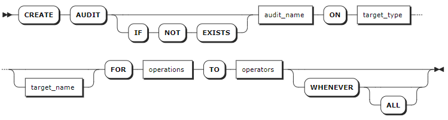
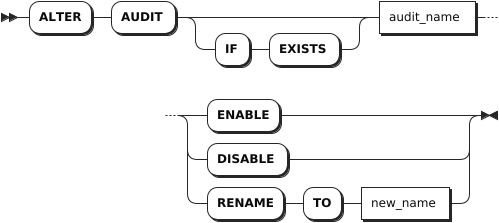
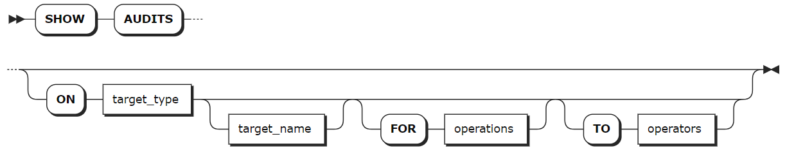
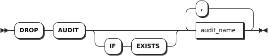

# Audit Management

Database audit is centered on security events and based on comprehensive and accurate audit. It achieves compliance management through real-time recording of database activities and fine-grained audit of database operations. By logging, analyzing, and reporting access to databases, it helps generate post-event compliance reports and trace the root causes of events. Leveraging big data search technology, it provides efficient querying of audit reports to locate the cause of an event for later query, analysis and filter. This strengthens the monitoring and audit of internal and external database behaviors, enhancing the security of data assets.

KWDB supports monitoring and logging user operations, including those of administrators, and audits system-level, statement-level, and object-level operations. When database audit is enabled, the system automatically initiates system-level audit.

This table lists all the system-level audit operations supported by KWDB.

| Object          | Operation                                                              |
|-----------------|------------------------------------------------------------------------|
| NODE            | - RESTART <br >- DECOMMISON <br >- RECOMMISION <br >- QUIT <br >- JOIN |
| CONNECT         | - LOGIN <br >- LOGOUT                                                  |
| CLUSTER SETTING | - SET <br >- RESET                                                     |

You can use SQL statements to create or enable related statement-level and object-level audit policies.

This table lists all the statement-level audit operations supported by KWDB.

| Object     | Relational Database                                                                                   | Time-series Database                                                                     |
|------------|-------------------------------------------------------------------------------------------------------|------------------------------------------------------------------------------------------|
| USER       | - CREATE USER <br >- ALTER USER <br >- DROP USER                                                      | - CREATE USER <br >- ALTER USER <br >- DROP USER                                         |
| ROLE       | - CREATE ROLE <br >- ALTER ROLE <br >- GRANT ROLE <br >- REVOKE ROLE  <br >- DROP ROLE                | - CREATE ROLE <br >- ALTER ROLE <br >- GRANT ROLE <br >- REVOKE ROLE <br >- DROP ROLE    |
| DATABASE   | - CREATE DATABASE <br >- ALTER DATABASE <br >- DROP DATABASE <br >- IMPORT <br >- EXPORT              | - CREATE DATABASE <br >- ALTER DATABASE <br >- DROP DATABASE <br >- IMPORT <br >- EXPORT |
| SCHEMA     | - CREATE SCHEMA <br >- DROP SCHEMA                                                                    | -                                                                                        |
| TABLE      | - CREATE TABLE <br >- ALTER TABLE <br >- DROP TABLE <br >- TRUNCATE TABLE <br >- IMPORT <br >- EXPORT | - CREATE TABLE <br >- ALTER TABLE <br >- DROP TABLE <br >- IMPORT <br >- EXPORT          |
| VIEW       | - CREATE VIEW <br >- ALTER VIEW <br >- DROP VIEW                                                      | -                                                                                        |
| INDEX      | - CREATE INDEX <br >- ALTER INDEX <br >- DROP INDEX                                 | - CREATE INDEX <br >- ALTER INDEX <br >- DROP INDEX                 |
| SEQUENCE   | - CREATE SEQUENCE <br >- ALTER SEQUENCE <br >- DROP SEQUENCE                                          | -                                                                                        |
| PRIVILEGE  | - GRANT PRIVILEGE <br >- REVOKE PRIVILEGE                                                             | - GRANT PRIVILEGE <br >- REVOKE PRIVILEGE                                                |
| AUDIT      | - CREATE AUDIT <br >- ALTER AUDIT <br >- DROP AUDIT                                                   | - CREATE AUDIT <br >- ALTER AUDIT <br >- DROP AUDIT                                      |
| RANGE      | ALTER RANGE                                                                                           | ALTER RANGE                                                                              |
| QUERY      | - CANCEL QUERY <br >- EXPLAIN QUERY                                                                   | - CANCEL QUERY <br >- EXPLAIN QUERY                                                      |
| JOB        | - CANCEL JOB <br >- PAUSE JOB <br >- RESUME JOB                                                       | - CANCEL JOB <br >- PAUSE JOB <br >- RESUME JOB                                          |
| SCHEDULE   | - CREATE SCHEDULE <br >- ALTER SCHEDULE <br >- PAUSE SCHEDULE <br >- RESUME SCHEDULE  <br >- DROP SCHEDULE                     | - CREATE SCHEDULE <br >- ALTER SCHEDULE <br >- PAUSE SCHEDULE <br >- RESUME SCHEDULE  <br >- DROP SCHEDULE                  |
| SESSION    | - SET SESSION <br >- RESET SESSION <br >- CANCEL SESSION                                              | - SET SESSION <br >- RESET SESSION <br >- CANCEL SESSION                                 |
| STATISTICS | CREATE STATISTICS                                                                                     | CREATE STATISTICS                                                                        |

This table lists all the object-level audit operations supported by KWDB.

| Object | Relational Database                                | Time-series Database                                                                          |
|--------|----------------------------------------------------|-----------------------------------------------------------------------------------------------|
| TABLE  | - INSERT <br >- SELECT <br >- UPDATE <br >- DELETE | - INSERT <br >- SELECT <br >- UPDATE <br >- DELETE <br >Where, the `UPDATE` and `DELETE` statements only support error-reporting audit. |
| VIEW   | SELECT                                             | -                                                                                             |

After database audit is enabled, the system will save the audit results to the audit logs by default. For more information about audit logs, see [Log Management](../../db-operation/log-mgmt.md).

## CREATE AUDIT

The `CREATE AUDIT` statement creates statement-level or object-level audit policies. You can use the `ALTER AUDIT ENABLE` or `ALTER AUDIT DISABLE` statement to enable/disable the created audit policies.

### Privileges

The user must be a member of the `admin` role. By default, the `root` user belongs to the `admin` role.

### Syntax



### Parameters

| Parameter | Description |
| --- | --- |
| `IF NOT EXISTS` | Optional. <br>- When the `IF NOT EXISTS` keyword is used, the system creates a new audit policy only if an audit policy of the same name does not already exist. Otherwise, the system fails to create a new audit policy without returning an error. <br>- When the `IF NOT EXISTS` keyword is not used, the system creates a new audit policy only if an audit policy of the same name does not already existed. Otherwise, the system fails to create a new audit policy and returns an error. |
| `audit_name` | The name of the audit policy to create. The audit policy name must be unique. |
| `target_type` | The type of audit objects. Available options are `user`, `role`, `database`, `schema`, `table`, `view`, `index`, `sequence`, `privilege`, `audit`, `range`, `query`, `job`, `schedule`, `session`, `statistics`. If it is set to `ALL`, it means to perform audits on all object types. |
| `target_name` | The name of audit objects in a format of `database_name.target_name`. If the `database_name` is not specified, perform audits on objects in the current database. If the `target_name` is not specified, perform audits on all audit object types in the specified database. <br > **Note** <br >If the audit object type is set to `database`, you cannot specify the `target_name`. |
| `operations` | A comma-separated list of audit operations. If it is set to `ALL`, it means to perform audits on all operations. The supported audit operations depends on the audit object. |
| `operators` | A comma-separated list of roles or users to perform audits on. If it is set to `ALL`, it means to perform audits on all roles or users. |
| `WHENEVER` | Optional. Specify the conditions to perform audits on. By default, it is set to `ALL` and only supports to be set to `ALL`, which means to always record audits. |

### Examples

- Create a statement-level audit policy.

    This example creates a statement-level audit policy to perform audits on the `root` user when the user creates a database.

    ```sql
    CREATE AUDIT atest ON DATABASE FOR create TO root;
    ```

- Create an object-level audit policy.

    This example creates an object-level audit policy to perform audits on the `root` user when the user queries a table.

    ```sql
    CREATE AUDIT atest ON TABLE t1 FOR SELECT TO root;
    ```

## ALTER AUDIT

The `ALTER AUDIT` statement enables, disables, or renames audit policies.

### Privileges

The user must be a member of the `admin` role. By default, the `root` user belongs to the `admin` role.

### Syntax



### Parameters

| Parameter | Description |
| --- | --- |
| `IF EXISTS` | Optional. <br>- When the `IF EXISTS` keyword is used, the system changes an audit policy only if the target audit policy has already existed. Otherwise, the system fails to change the audit policy without returning an error. <br>- When the `IF EXISTS` keyword is not used, the system changes an audit policy only if the target audit policy has already existed. Otherwise, the system fails to change the audit policy and returns an error. |
| `audit_name` | The current name of the audit policy.|
| `ENABLE` | Enable an audit policy. By default, the system disables audit policies. |
| `DISABLE` | Disable an audit policy. |
| `new_name` | The new name of the audit policy. The audit policy name must be unique. |

### Examples

These examples assume that you have created an audit policy named `atest`.

- Enable an audit policy.

    ```sql
    ALTER AUDIT atest ENABLE;
    ```

- Rename an audit policy.

    ```sql
    ALTER AUDIT atest RENAME TO btest;
    ```

## SHOW AUDITS

The `SHOW AUDITS` statement lists all audit policies.

### Privileges

N/A

### Syntax



### Parameters

| Parameter | Description |
| --- | --- |
| `target_type` | Optional. The type of audit objects. Available options are `user`, `role`, `database`, `schema`, `table`, `view`, `index`, `sequence`, `privilege`, `audit`, `range`, `query`, `job`, `schedule`, `session`, `statistics`. If it is set to `ALL`, it means to list audit policies on all object types. |
| `target_name` | Optional. The name of audit objects in a format of `database_name.target_name`. If the `database_name` is not specified, list audit policies on objects in the current database. If the `target_name` is not specified, list audit policies on all audit object types in the specified database. <br > **Note** <br >If the audit object type is set to `database`, you cannot specify the `target_name`. |
| `operations` | A comma-separated list of audit operations. |
| `operators` | A comma-separated list of roles or users whose audit policies to show. |

### Examples

- Show all audit policies.

    ```sql
    SHOW AUDITS;
    ```

    If you succeed, you should see an output similar to the following:

    ```sql
      audit_name | target_type | target_name | target_id | operations | operators | condition | whenever | action | level | enable
    -------------+-------------+-------------+-----------+------------+-----------+-----------+----------+--------+-------+---------
      b          | ALL         |             |         0 | ALL        | rest_user |         0 | ALL      |      0 |     0 | false
      c          | DATABASE    |             |         0 | ALL        | rest_user |         0 | ALL      |      0 |     0 | false
      d          | ALL         |             |         0 | ALL        | rest_user |         0 | ALL      |      0 |     0 | false
    (3 rows)
    ```

- Show audit policies on a specified object.

    ```sql
    SHOW AUDITS ON DATABASE;
    ```

    If you succeed, you should see an output similar to the following:

    ```sql
      audit_name | target_type | target_name | target_id | operations | operators | condition | whenever | action | level | enable
    -------------+-------------+-------------+-----------+------------+-----------+-----------+----------+--------+-------+---------
      c          | DATABASE    |             |         0 | ALL        | rest_user |         0 | ALL      |      0 |     0 | false
    (1 row)
    ```

## DROP AUDIT

The `DROP AUDIT` statement removes one or more audit policies.

### Privileges

The user must be a member of the `admin` role. By default, the `root` user belongs to the `admin` role.

### Syntax



### Parameters

| Parameter | Description |
| --- | --- |
| `IF EXISTS` | Optional. <br>- When the `IF EXISTS` keyword is used, the system removes an audit policy only if the target audit policy has already existed. Otherwise, the system fails to remove the audit policy without returning an error. <br>- When the `IF EXISTS` keyword is not used, the system removes an audit policy only if the target audit policy has already existed. Otherwise, the system fails to remove the audit policy and returns an error. |
| `audit_name` | A comma-separated list of audit policy names.|

### Examples

- Remove a single audit policy.

    ```sql
    DROP AUDIT btest;
    ```

- Remove multiple audit policies.

    ```sql
    DROP AUDIT dca, dcd;
    ```
