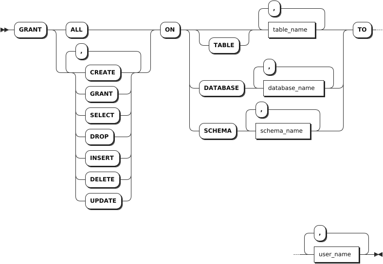
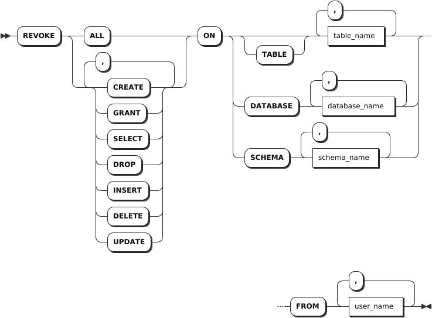
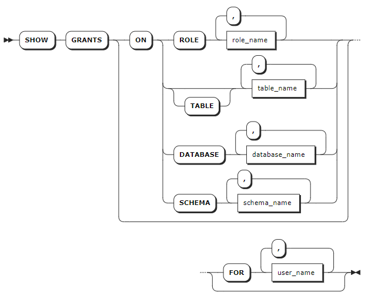

# Privilege Management

KWDB supports managing privileges on objects within a database to ensure database security. This table lists all privileges supported by KWDB.

| Privilege  | Object | Description |
| --- | --- | --- |
| ALL | - DATABASE <br>- TABLE <br>- SCHEMA (only available for relational databases) | Perform all operations on the specified object(s). |
| CREATE | - DATABASE <br>- TABLE <br>- SCHEMA (only available for relational databases) | Create one or more objects.  |
| DROP | - DATABASE <br>- TABLE <br>- SCHEMA (only available for relational databases) | Remove the specified object(s). |
| GRANT | - DATABASE <br>- TABLE <br>- SCHEMA (only available for relational databases) |  Grant privileges to the specific user(s). |
| SELECT | TABLE | Query data from the specified table(s). |
| INSERT | TABLE | Insert data into the specified table(s). |
| DELETE | TABLE | Remove data from the specified table(s).   |
| UPDATE | TABLE | Update the specified table(s). |

## GRANT {privileges}

The `GRANT <privileges>` statement grants privileges on the specified objects to one or more users/roles.

::: warning Note

If the privileges of a user are not updated on time, you can remove the user and then create a new user with a different name and re-grant privileges to the new user.

:::

### Privileges

The user granting the privileges must also have the `GRANT` privilege on the specified database(s), table(s) or schema(s) (only for user-defined schema of relational databases). For example, a user granting the `SELECT` privilege on a table to another user must have the `GRANT` and `SELECT` privileges on that table.

### Syntax



### Parameters

| Parameter | Description |
| --- | --- |
| `table_name` | A comma-separated list of table names to grant privileges on. |
| `database_name` | A comma-separated list of database names to grant privileges on.|
| `schema_name` | A comma-separated list of schema names to grant privileges on. <br> **Note** <br > This parameter is available only for the relationdal database.|
| `user_name` | A comma-separated list of role or user names to grant privileges to. |

### Examples

This example grants the privilege to create the `db1` and `defaultdb` databases to `operatora` user.

```sql
GRANT CREATE ON DATABASE db1, defaultdb TO operatora;
```

## REVOKE {Privileges}

The `REVOKE <privileges>` statement revokes privileges on the specified objects from one or more users/roles.

### Privileges

The user revoking the privileges must also have the `GRANT` privilege on the specified database(s), table(s) or schema(s) (only for user-defined schema of relational databases). For example, a user revoking the `SELECT` privilege on a table from another user must have the `GRANT` and `SELECT` privileges on that table.

### Syntax



### Parameters

| Parameter | Description |
| --- | --- |
| `table_name` | A comma-separated list of table names to revoke privileges from. |
| `database_name` | A comma-separated list of database names to revoke privileges from.|
| `schema_name` | A comma-separated list of schema names to revoke privileges from. <br> **Note** <br > This parameter is available only for the relationdal database.|
| `user_name` | A comma-separated list of role or user names to revoke privileges from. |

### Examples

This example revokes the privilege to create the `db1` and `defaultdb` databases from `user11` user.

```sql
REVOKE CREATE ON DATABASE db1, defaultdb FROM user11;
```

## SHOW GRANTS

The `SHOW GRANTS` statement lists one of the following:

- The roles granted to users in a cluster.
- The privileges granted to users on databases, tables, or user-defined schemas (only for user-defined schema of relational databases).

### Privileges

N/A. To run the `SHOW GRANTS ON ROLE` command, the user must have been granted the `SELECT` privilege on the system table.

### Syntax



### Parameters

| Parameter | Description |
| --- | --- |
| `table_name` | A comma-separated list of table names to check privileges on. |
| `database_name` | A comma-separated list of database names to check privileges on.|
| `schema_name` | A comma-separated list of schema names to check privileges on. <br> **Note** <br > This parameter is available only for the relationdal database.|
| `user_name` | A comma-separated list of roles or users whose grants to show. |

### Examples

This example shows grants on the `defaultdb.t1` table.

```sql
SHOW GRANTS ON TABLE defaultdb.t1;
```

If you succeed, you should see an output similar to the following:

```sql
database_name|schema_name|table_name|grantee|privilege_type
-------------+-----------+----------+-------+--------------
defaultdb    |public     |t1        |admin  |ALL
defaultdb    |public     |t1        |root   |ALL
defaultdb    |public     |t1        |user11 |DELETE
(3 rows)
```
