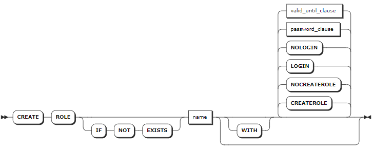
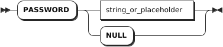
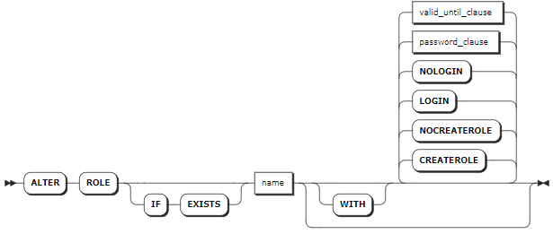
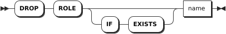

# Role Management

## CREATE ROLE

The `CREATE ROLE` statement creates a role and sets one or more options for the role. Each statement creates only one role. By default, the new role does not support `CREATEROLE` and `LOGIN` options. 

### Privileges

The user must have the `CREATEROLE` option or be a member of the `admin` role. By default, the `root` user belongs to the `admin` role.

### Syntax



- `password_clause`

    

- `valid_until_clause`

    

### Parameters

| Parameter | Description |
| --- | --- |
| `IF NOT EXISTS` | Optional. <br>- When the `IF NOT EXISTS` keyword is used, the system creates a new role only if a role of the same name does not already exist. Otherwise, the system fails to create a new role without returning an error. <br>- When the `IF NOT EXISTS` keyword is not used, the system creates a new role only if a role of the same name does not already existed. Otherwise, the system fails to create a new role and returns an error. |
| `name` | The name of the role to create. The role name is case-insensitive and follows these rules: <br> - Start with a letter or an underscore (`_`). <br >- Contain letters, numbers, or underscore (`_`). <br>- Must be 1 - 63 characters in length.|
| `CREATEROLE` | Allow the new role to create, change, and drop other non-admin roles. By default, do not set this option when creating a role. |
| `NOCREATEROLE` | Disallow the new role to create, change, and drop other non-admin roles. By default, this option is set when creating a role.|
| `LOGIN` | Allow the new role to log in to the KWDB server. By default, this option is set when creating a role.|
| `NOLOGIN` | Disallow the new role to log in to the KWDB server. By default, do not set this option when creating a role.|
| `PASSWORD <password>` | Set the password for the role. The password can also be set to NULL. The role with this option can access to a secure cluster with the password. The password should be entered as a string literal, enclosed in single quotes (`' '`). <br >By default, do not set this option when creating a role. |
| `VALID UNTIL <date_time>` | Set the date and time (in the `timestamp` format) after which the password is not valid. It can also be set to NULL. It is enclosed in single quotes (`' '`). When you log in to the KWDB database through a CLI tool, you can check the expiration time of the password. <br >By default, do not set this option when creating a role. |

### Examples

- Create a role with default options. By default, the new role does not support `CREATEROLE` and `LOGIN` options.

    ```sql
    -- 1. Create a role named role1.

    CREATE ROLE role1;
    CREATE ROLE

    -- 2. Check role options.

    SHOW ROLES;
      username |                    options                     | member_of
    -----------+------------------------------------------------+------------
      admin    | CREATEROLE                                     | {}
      role1    | NOLOGIN                                        | {}
      root     | CREATEROLE                                     | {admin}
    (3 rows)
    ```

- Create a role with the `CREATEROLE` option.

    ```sql
    -- 1. Create a role named role2 with the CREATEROLE option.

    CREATE ROLE role2 WITH CREATEROLE;
    CREATE ROLE

    -- 2. Check role options.

    SHOW ROLES;
      username |                    options                     | member_of
    -----------+------------------------------------------------+------------
      admin    | CREATEROLE                                     | {}
      role1    | NOLOGIN                                        | {}
      role2    | CREATEROLE, NOLOGIN                            | {}
      root     | CREATEROLE                                     | {admin}
    (4 rows)
    ```

- Create a role with the `LOGIN` option.

    ```sql
    -- 1. Create a role named role3 with the LOGIN option.

    CREATE ROLE role3 WITH LOGIN;
    CREATE ROLE

    -- 2. Check role options.

    SHOW ROLES;
      username |                    options                     | member_of
    -----------+------------------------------------------------+------------
      admin    | CREATEROLE                                     | {}
      role1    | NOLOGIN                                        | {}
      role2    | CREATEROLE, NOLOGIN                            | {}
      role3    |                                                | {}
      root     | CREATEROLE                                     | {admin}
    (5 rows)
    ```

- Create a role and set the password and expiration time for the role.

    ```sql
    -- 1. Create a role named role4 and set the password and expiration time for the role.

    CREATE ROLE role4 WITH PASSWORD '11aa!!AA' VALID UNTIL '2024-01-01';
    CREATE ROLE 

    -- 2. Check role options.

    SHOW ROLES;
      username |                    options                     | member_of
    -----------+------------------------------------------------+------------
      admin    | CREATEROLE                                     | {}
      role1    | NOLOGIN                                        | {}
      role2    | CREATEROLE, NOLOGIN                            | {}
      role3    |                                                | {}
      role4    | NOLOGIN, VALID UNTIL=2024-01-01 00:00:00+00:00 | {}
      root     | CREATEROLE                                     | {admin}
    (6 rows)
    ```

## SHOW ROLES

The `SHOW ROLES` or `SHOW USERS` statement lists all created roles for a database.

### Syntax


### Privileges

The user must have been granted the `SELECT` privilege on the `system.users` and `system.role_members` system table.

### Parameters

N/A

### Examples

This example lists all created roles for a database.

```sql
SHOW ROLES;
```

If you succeed, you should see an output similar to the following:

```sql
  username |                    options                     | member_of
-----------+------------------------------------------------+------------
  admin    | CREATEROLE                                     | {}
  role1    | NOLOGIN                                        | {}
  role2    | CREATEROLE, NOLOGIN                            | {}
  role3    |                                                | {}
  role4    | NOLOGIN, VALID UNTIL=2024-01-01 00:00:00+00:00 | {}
  root     | CREATEROLE                                     | {admin}
(6 rows)
```

## ALTER ROLE

The `ALTER ROLE` statement changes one or more options for a role. Each statement changes only one role.

### Privileges

The user must have the `CREATEROLE` option or be a member of the `admin` role. By default, the `root` user belongs to the `admin` role.

### Syntax



- `password_clause`

    

- `valid_until_clause`

    

### Parameters

| Parameter | Description |
| --- | --- |
| `IF EXISTS` | Optional. <br>- When the `IF EXISTS` keyword is used, the system changes a role only if the target role has already existed. Otherwise, the system fails to change the role without returning an error. <br>- When the `IF EXISTS` keyword is not used, the system changes a role only if the target role has already existed. Otherwise, the system fails to change the role and returns an error. |
| `name` | The name of the role to change. The role name is case-insensitive and follows these rules: <br> - Start with a letter or an underscore (`_`). <br >- Contain letters, numbers, or underscore (`_`). <br>- Must be 1 - 63 characters in length.|
| `CREATEROLE` | Allow the role to create, change, and drop other non-admin roles. By default, do not set this option when creating a role. |
| `NOCREATEROLE` | Disallow the role to create, change, and drop other non-admin roles. By default, this option is set when creating a role.|
| `LOGIN` | Allow the role to log in to the KWDB server. By default, this option is set when creating a role.|
| `NOLOGIN` | Disallow the role to log in to the KWDB server. By default, do not set this option when creating a role.|
| `PASSWORD <password>` | Set the password for the role. The password can also be set to NULL. The role with this option can access to a secure cluster with the password. The password should be entered as a string literal, enclosed in single quotes (`' '`). <br >By default, do not set this option when creating a role. |
| `VALID UNTIL <date_time>` | Set the date and time (in the `timestamp` format) after which the password is not valid. It can also be set to NULL. It is enclosed in single quotes (`' '`). When you log in to the KWDB database through a CLI tool, you can check the expiration time of the password. <br >By default, do not set this option when creating a role. |

### Examples

- Set a role with the `CREATEROLE` option.

    ```sql
    -- 1. Check role options.

    SHOW ROLES;
      username |                    options                     | member_of
    -----------+------------------------------------------------+------------
      admin    | CREATEROLE                                     | {}
      role1    | NOLOGIN                                        | {}
      role2    | CREATEROLE, NOLOGIN                            | {}
      role3    |                                                | {}
      role4    | NOLOGIN, VALID UNTIL=2024-01-01 00:00:00+00:00 | {}
      root     | CREATEROLE                                     | {admin}
    (6 rows)

    -- 2. Set role1 with the CREATEROLE option.

    ALTER ROLE role1 WITH CREATEROLE;
    ALTER ROLE

    -- 3. Check role options.

    SHOW ROLES;
      username |                    options                     | member_of
    -----------+------------------------------------------------+------------
      admin    | CREATEROLE                                     | {}
      role1    | CREATEROLE, NOLOGIN                            | {}
      role2    | CREATEROLE, NOLOGIN                            | {}
      role3    |                                                | {}
      role4    | NOLOGIN, VALID UNTIL=2024-01-01 00:00:00+00:00 | {}
      root     | CREATEROLE                                     | {admin}
    (6 rows)
    ```

- Modify the password and expiration time for a role.

    ```sql
    -- 1. Modify the password and expiration time for role4.

    ALTER ROLE role4 WITH PASSWORD 'pas2doc' VALID UNTIL '2025-12-31';
    ALTER ROLE

    -- 2. Check role options.

    SHOW ROLES;
      username |                    options                     | member_of
    -----------+------------------------------------------------+------------
      admin    | CREATEROLE                                     | {}
      role1    | CREATEROLE, NOLOGIN                            | {}
      role2    | CREATEROLE, NOLOGIN                            | {}
      role3    |                                                | {}
      role4    | NOLOGIN, VALID UNTIL=2025-12-31 00:00:00+00:00 | {}
      root     | CREATEROLE                                     | {admin}
    (6 rows)
    ```

## GRANT

The `GRANT` statement grants membership to an existing role and the role member inherites all privileges of that role. To grant membership to an `admin` role, the user must be an `admin` role with the `WITH ADMIN OPTION` option.

::: warning Note

If the privileges of a role are not updated on time, you can remove the role and then create a new role with a different name and re-grant privileges to the new role.

:::

### Privileges

The user must be the admin of the role or a member of the `admin` role. By default, the `root` user belongs to the `admin` role.

### Syntax


### Parameters

| Parameter | Description |
| --- | --- |
| `role_name` | A comma-separated list of role names. |
| `user_name` | A comma-separated list of role members to grant. The role member can be a user or a role. |
| `WITH ADMIN OPTION` | Designate the role member as a role admin. Role admins can grant or revoke membership for the specified role. <br> Role members with the `admin` option can grant or revoke membership for the specified role. |

### Examples

- Grant membership to a role. By default, the newly-granted member does not have the `admin` privilege.

    ```sql
    -- 1. Grant memebership role1.

    GRANT role1 TO user1;
    GRANT 

    -- 2. Show members of role1.

    SHOW GRANTS ON ROLE role1;
      role_name | member | is_admin
    ------------+--------+-----------
      role1     | user1  |  false
    (1 row)
    ```

- Grant a role admin to a role.

    ```sql
    -- 1. Grant a role admin to role1.

    GRANT role1 TO user1 WITH ADMIN OPTION;
    GRANT

    -- 2. Show members of role1.

    SHOW GRANTS ON ROLE role1;
      role_name | member | is_admin
    ------------+--------+-----------
      role1     | user1  |   true
    (1 row)
    ```

## REVOKE

The `REVOKE` statement revokes membership from an existing role.

::: warning Note

The `root` user cannot be revoked from the `admin` role.

:::

### Privileges

The user must be the admin of the role or a member of the `admin` role. By default, the `root` user belongs to the `admin` role.

### Syntax


### Parameters

| Parameter | Description |
| --- | --- |
| `WITH ADMIN FOR` | Optional.  <br> When the `WITH ADMIN FOR` keyword is used, the system revokes the role admin privilege from the role member but keeps its membership. Otherwise, the system revokes the membership from the role. |
| `role_name` | A comma-separated list of role names. |
| `user_name` | A comma-separated list of role members to revoke. The role member can be a user or a role. |

### Examples

- Revoke the role admin privilege from the role member but keeps its membership.

    ```sql
    -- 1. Show members of role1.

    SHOW GRANTS ON ROLE role1;
    role_name|member|is_admin
    ---------+------+--------
    role1    |role2 |false
    role1    |user1 |true
    (2 rows)

    -- 2. Revoke the role admin privilege from the user1 member but keeps its membership.

    REVOKE ADMIN OPTION FOR role1 FROM user1;
    REVOKE

    -- 3. Show members of role1.

    SHOW GRANTS ON ROLE role1;
    role_name|member|is_admin
    ---------+------+--------
    role1    |role2 |false
    role1    |user1 |false
    (2 rows)
    ```

- Revoke membership from a role.

    ```sql
    -- 1. Show members of role1.

    SHOW GRANTS ON ROLE role1;
    role_name|member|is_admin
    ---------+------+--------
    role1    |role2 |false
    role1    |user1 |false
    (2 rows)

    -- 2. Revoke user1 member from role1.

    REVOKE role1 FROM user1;
    REVOKE

    -- 3. Show members of role1.

    SHOW GRANTS ON ROLE role1;
    role_name|member|is_admin
    ---------+------+--------
    role1    |role2 |false
    (1 row)
    ```

## DROP ROLE

The `DROP ROLE` statement removes one or more roles.

### Privileges

The user must have the `CREATEROLE` option or be a member of the `admin` role. By default, the `root` user belongs to the `admin` role.

### Syntax



### Parameters

| Parameter | Description |
| --- | --- |
| `IF EXISTS` | Optional. <br>- When the `IF EXISTS` keyword is used, the system removes a role only if the target role has already existed. Otherwise, the system fails to remove the role without returning an error. <br>- When the `IF EXISTS` keyword is not used, the system removes a role only if the target role has already existed. Otherwise, the system fails to remove the role and returns an error. |
| `name` | A comma-separated list of role names to remove.|

### Examples

This example removes a role named `role1`.

```sql
DROP ROLE role1;
```
