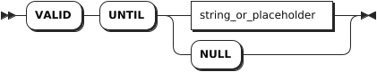

# User Management

## CREATE USER

The `CREATE USER` statement creates a user and sets one or more options for the user. Each statement creates only one user. By default, the new user supports `LOGIN` options.

### Privileges

The user must have the `CREATEROLE` option or be a member of the `admin` role. By default, the `root` user belongs to the `admin` role.

### Syntax


- `valid_until_clause`

    

- `password_clause`

    

### Parameters

| Parameter | Description |
| --- | --- |
| `IF NOT EXISTS` | Optional. <br>- When the `IF NOT EXISTS` keyword is used, the system creates a new user only if a user of the same name does not already exist. Otherwise, the system fails to create a new user without returning an error. <br>- When the `IF NOT EXISTS` keyword is not used, the system creates a new user only if a user of the same name does not already existed. Otherwise, the system fails to create a new user and returns an error. |
| `name` | The name of the user to create. The user name is case-insensitive and follows these rules: <br> - Start with a letter or an underscore (`_`). <br >- Contain letters, numbers, or underscore (`_`). <br>- Must be 1 - 63 characters in length.|
| `CREATEROLE` | Allow the new user to create, change, and drop other non-admin users. By default, do not set this option when creating a user. |
| `NOCREATEROLE` | Disallow the new user to create, change, and drop other non-admin users. By default, this option is set when creating a user.|
| `LOGIN` | Allow the new user to log in to the KWDB server. By default, this option is set when creating a user.|
| `NOLOGIN` | Disallow the new user to log in to the KWDB server. By default, do not set this option when creating a user.|
| `PASSWORD <password>` | Set the password for the user. The password can also be set to NULL. The user with this option can access to a secure cluster with the password. The password should be entered as a string literal, enclosed in single quotes (`' '`). <br >By default, do not set this option when creating a user.  |
| `VALID UNTIL <date_time>` | Set the date and time (in the `timestamp` format) after which the password is not valid. It can also be set to NULL. It is enclosed in single quotes (`' '`). When you log in to the KWDB database through a CLI tool, you can check the expiration time of the password. <br >By default, do not set this option when creating a user. |

### Examples

- Create a user with default options. By default, a new user cannnot create a role but can log in to the KWDB server.

    ```sql
    CREATE USER user1;
    CREATE USER
    ```

- Create a user with the `CREATEROLE` option.

    ```sql
    CREATE USER user2 WITH CREATEROLE;
    CREATE USER
    ```

- Create a user with the `NOLOGIN` option.

    ```sql
    CREATE USER user3 WITH NOLOGIN;
    CREATE USER
    ```

- Create a user and set the password and expiration time for the user.

    ```sql
    CREATE USER user4 WITH PASSWORD '11aa!!AA' VALID UNTIL '2023-01-01 00:00:00+00:00';
    CREATE USER
    ```

## SHOW USERS

The `SHOW USERS` or `SHOW ROLES` statement lists all created users for a database.

### Privileges

The user must have been granted the `SELECT` privilege on the `system.users` and `system.role_members` system table.

### Syntax


### Parameters

N/A

### Examples

This example lists all created users for a database.

```sql
SHOW USERS;
```

If you succeed, you should see an output similar to the following:

```sql
username|options                              |member_of
--------+-------------------------------------+---------
admin   |CREATEROLE                           |{}
root    |CREATEROLE                           |{admin}
user1   |CREATEROLE                           |{}
user2   |CREATEROLE                           |{}
user3   |VALID UNTIL=2023-01-01 00:00:00+00:00|{}
```

## ALTER USER

The `ALTER USER` statement changes one or more options for a user. Each statement changes only one user.

### Privileges

The user must have the `CREATEROLE` option or be a member of the `admin` role. By default, the `root` user belongs to the `admin` role.

### Syntax


- `password_clause`

    

- `valid_until_clause`

    

### Parameters

| Parameter | Description |
| --- | --- |
| `IF EXISTS` | Optional. <br>- When the `IF EXISTS` keyword is used, the system changes a user only if the target user has already existed. Otherwise, the system fails to change the user without returning an error. <br>- When the `IF EXISTS` keyword is not used, the system changes a user only if the target user has already existed. Otherwise, the system fails to change the user and returns an error. |
| `name` | The name of the user to change. The user name is case-insensitive and follows these rules: <br> - Start with a letter or an underscore (`_`). <br >- Contain letters, numbers, or underscore (`_`). <br>- Must be 1 - 63 characters in length.|
| `CREATEROLE` | Allow the new user to create, change, and drop other non-admin users. By default, do not set this option when creating a user. |
| `NOCREATEROLE` | Disallow the new user to create, change, and drop other non-admin users. By default, this option is set when creating a user.|
| `LOGIN` | Allow the new user to log in to the KWDB server. By default, this option is set when creating a user.|
| `NOLOGIN` | Disallow the new user to log in to the KWDB server. By default, do not set this option when creating a user.|
| `PASSWORD <password>` | Set the password for the user. The password can also be set to NULL. The user with this option can access to a secure cluster with the password. The password should be entered as a string literal, enclosed in single quotes (`' '`). <br >By default, do not set this option when creating a user.  |
| `VALID UNTIL <date_time>` | Set the date and time (in the `timestamp` format) after which the password is not valid. It can also be set to NULL. It is enclosed in single quotes (`' '`). When you log in to the KWDB database through a CLI tool, you can check the expiration time of the password. <br >By default, do not set this option when creating a user.  |

### Examples

- Set a user with the `NOCREATEROLE` option.

    ```sql
    -- 1. Check user options.

    SHOW USERS;
      username |                options                | member_of
    -----------+---------------------------------------+------------
      admin    | CREATEROLE                            | {}
      root     | CREATEROLE                            | {admin}
      user1    |                                       | {}
      user2    | CREATEROLE                            | {}
      user3    | NOLOGIN                               | {}
      user4    | VALID UNTIL=2023-01-01 00:00:00+00:00 | {}
    (6 rows)

    -- 2. Set user2 with the NOCREATEROLE option.

    ALTER USER user2 WITH NOCREATEROLE;
    ALTER USER

    -- 3. Check user options.

    SHOW USERS;
      username |                options                | member_of
    -----------+---------------------------------------+------------
      admin    | CREATEROLE                            | {}
      root     | CREATEROLE                            | {admin}
      user1    |                                       | {}
      user2    |                                       | {}
      user3    | NOLOGIN                               | {}
      user4    | VALID UNTIL=2023-01-01 00:00:00+00:00 | {}
    (6 rows)
    ```

- Modify the password and expiration time for a user.

    ```sql
    -- 1. Modify the password and expiration time for user4.

    ALTER USER user4 WITH PASSWORD '11aa!!AA' VALID UNTIL '2023-01-01 00:00:00+00:00';
    ALTER USER

    -- 2. Check user options.

    SHOW USERS;
      username |                    options                     | member_of
    -----------+------------------------------------------------+------------
      admin    | CREATEROLE                                     | {}
      root     | CREATEROLE                                     | {admin}
      user1    |                                                | {}
      user2    |                                                | {}
      user3    | NOLOGIN, VALID UNTIL=2023-12-31 00:00:00+00:00 | {}
      user4    | VALID UNTIL=2023-01-01 00:00:00+00:00          | {}
    (6 rows)
    ```

## DROP USER

The `DROP USER` statement removes one or more usres.

### Privileges

The user must have the `CREATEROLE` option or be a member of the `admin` role. By default, the `root` user belongs to the `admin` role.

### Syntax


### Parameters

| Parameter | Description |
| --- | --- |
| `IF EXISTS` | Optional. <br>- When the `IF EXISTS` keyword is used, the system removes a user only if the target user has already existed. Otherwise, the system fails to remove the user without returning an error. <br>- When the `IF EXISTS` keyword is not used, the system removes a user only if the target user has already existed. Otherwise, the system fails to remove the user and returns an error. |
| `name` | A comma-separated list of user names to remove.|

### Examples

This example removes a user named `user1`.

```sql
DROP USER user1;
```
