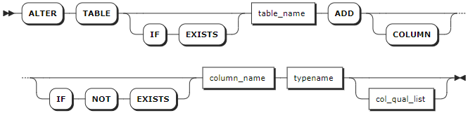
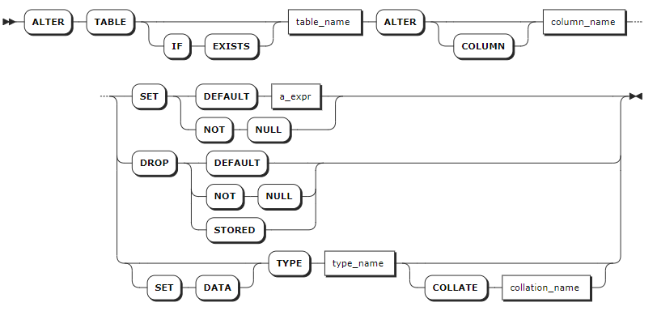
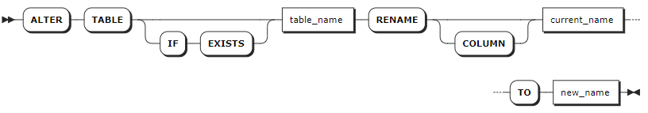
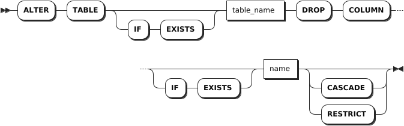

# Columns

## ADD COLUMN

The `ALTER TABLE ... ADD COLUMN` statement adds columns to existing tables. `ADD COLUMN` is an online operation, which does not block reading from or writing data into the database.

### Privileges

The user must be a member of the `admin` role or have been granted the `CREATE` privilege on the specified table(s). By default, the `root` user belongs to the `admin` role.

### Syntax



### Parameters

| Parameter | Description |
| --- | --- |
| `IF EXISTS` | Optional. <br>- When the `IF EXISTS` keyword is used, the system adds a column only if the target table has already existed. Otherwise, the system fails to add the column without returning an error. <br>- When the `IF EXISTS` keyword is not used, the system adds a column only if the target table has already existed. Otherwise, the system fails to add the column and returns an error. |
| `table_name` | The table to which a column is added. |
| `IF NOT EXISTS` | Optional. <br>- When the `IF NOT EXISTS` keyword is used, the system creates a new column only if a column of the same name does not already exist. Otherwise, the system fails to create a new column without returning an error. <br>- When the `IF NOT EXISTS` keyword is not used, the system creates a new column only if a column of the same name does not already exist. Otherwise, the system fails to create a new column and returns an error. |
| `column_name` | The name of the column to add. The column name must be unique within the table and must follow these [Identifier Rules](../../sql-identifiers.md). |
| `type_name` | The data type of the new column. |
| `col_qual_list` | A list of column qualifications. KWDB supports the following qualifications: <br >- `<col_qualification_elem>`: `NULL`, `NOT NULL`, `UNIQUE`, `PRIMARY KEY`, `CHECK`, `DEFAULT`, `REFERENCES`, `AS`.<br >- `CONSTRAINT <constraint_name> <col_qualification_elem>` <br >- `COLLATE <collation_name>` <br >- `FAMILY <family_name>`: If no column family is specified, the column is added to the first column family. <br >- `CREATE FAMILY [<family_name>]` <br > **Note** <br > KWDB does not support adding columns with a FOREIGN KEY constraint. For details about how to add a FOREIGN KEY constraint to a column, see [ADD CONSTRAINT](../../../db-administration/db-object-mgmt/relational-db/constraint-mgmt-relational.md#add-constraint). |

### Examples

- Add a single column.

    ```sql
    -- 1. Add a column named names to the re_users table.

    ALTER TABLE re_users ADD COLUMN names STRING;
    ALTER TABLE

    -- 2. Show columns of the re_users table.

    SHOW COLUMNS FROM re_users;
      column_name | data_type | is_nullable |  column_default   | generation_expression |              indices               | is_hidden | is_tag
    --------------+-----------+-------------+-------------------+-----------------------+------------------------------------+-----------+---------
      id          | UUID      |    false    | gen_random_uuid() |                       | {primary,re_users_credit_card_key} |   false   | false
      city        | STRING    |    false    | NULL              |                       | {primary,re_users_credit_card_key} |   false   | false
      name        | STRING    |    true     | NULL              |                       | {}                                 |   false   | false
      address     | STRING    |    true     | NULL              |                       | {}                                 |   false   | false
      credit_card | STRING    |    true     | NULL              |                       | {re_users_credit_card_key}         |   false   | false
    (5 rows)
    ```

- Add multiple columns.

    ```sql
    -- 1. Add location and amount columns to the re_users table.

    ALTER TABLE re_users ADD COLUMN location STRING, ADD COLUMN amount DECIMAL;
    ALTER TABLE

    -- 2. Show columns of the re_users table. 

    SHOW COLUMNS FROM re_users;
      column_name | data_type | is_nullable |  column_default   | generation_expression |              indices               | is_hidden | is_tag
    --------------+-----------+-------------+-------------------+-----------------------+------------------------------------+-----------+---------
      id          | UUID      |    false    | gen_random_uuid() |                       | {primary,re_users_credit_card_key} |   false   | false
      city        | STRING    |    false    | NULL              |                       | {primary,re_users_credit_card_key} |   false   | false
      name        | STRING    |    true     | NULL              |                       | {}                                 |   false   | false
      address     | STRING    |    true     | NULL              |                       | {}                                 |   false   | false
      credit_card | STRING    |    true     | NULL              |                       | {re_users_credit_card_key}         |   false   | false
      location    | STRING    |    true     | NULL              |                       | {}                                 |   false   | false
      amount      | DECIMAL   |    true     | NULL              |                       | {}                                 |   false   | false
    (7 rows)
    ```

- Add a column with a `NOT NULL` constraint and a default value.

    ```sql
    -- 1. Add the interest column with a default value to the re_users table. 

    ALTER TABLE re_users ADD COLUMN interest DECIMAL NOT NULL DEFAULT (DECIMAL '1.3');
    ALTER TABLE

    -- 2. Show columns of the re_users table.

    SHOW COLUMNS FROM re_users;

      column_name | data_type | is_nullable |     column_default     | generation_expression |              indices               | is_hidden | is_tag
    --------------+-----------+-------------+------------------------+-----------------------+------------------------------------+-----------+---------
      id          | UUID      |    false    | gen_random_uuid()      |                       | {primary,re_users_credit_card_key} |   false   | false
      city        | STRING    |    false    | NULL                   |                       | {primary,re_users_credit_card_key} |   false   | false
      name        | STRING    |    true     | NULL                   |                       | {}                                 |   false   | false
      address     | STRING    |    true     | NULL                   |                       | {}                                 |   false   | false
      credit_card | STRING    |    true     | NULL                   |                       | {re_users_credit_card_key}         |   false   | false
      location    | STRING    |    true     | NULL                   |                       | {}                                 |   false   | false
      amount      | DECIMAL   |    true     | NULL                   |                       | {}                                 |   false   | false
      interest    | DECIMAL   |    false    | 1.3:::DECIMAL::DECIMAL |                       | {}                                 |   false   | false
    (8 rows)
    ```

- Add a column with a UNIQUE constraint.

    ```sql
    ALTER TABLE re_users ADD COLUMN cust_number DECIMAL UNIQUE NOT NULL;
    ```

- Add a column and assign it to a new column family.

    ```sql
    ALTER TABLE re_users ADD COLUMN location1 STRING CREATE FAMILY new_family;
    ```

- Add a column and assign it to an existing column family.

    ```sql
    ALTER TABLE re_users ADD COLUMN location2 STRING FAMILY existing_family;
    ```

- Add a column and create a new column family if the column family does not exist.

    ```sql
    ALTER TABLE re_users ADD COLUMN new_name STRING CREATE IF NOT EXISTS FAMILY f1;
    ```

## SHOW COLUMNS

The `SHOW COLUMNS` statement shows details about columns in a table, including each column's name, type, default value, and whether or not it's nullable.

### Privileges

The user must have any privilege on the specified table(s).

### Syntax


### Parameters

| Parameter | Description |
| --- | --- |
| `table_name` | The name of the table for which to show columns. |
| `WITH COMMENT` | Optional. Show a column's comments. By default, the column's comment is set to `NULL`. |

### Examples

This example shows details about columns in the `re_users` table.

```sql
SHOW COLUMNS FROM re_users;
```

If you succeed, you should see an output similar to the following:

```sql
  column_name |     data_type     | is_nullable |     column_default     | generation_expression |              indices               | is_hidden | is_tag
--------------+-------------------+-------------+------------------------+-----------------------+------------------------------------+-----------+---------
  id          | UUID              |    false    | gen_random_uuid()      |                       | {primary,re_users_credit_card_key} |   false   | false
  city        | STRING            |    false    | NULL                   |                       | {primary,re_users_credit_card_key} |   false   | false
  name        | STRING            |    true     | NULL                   |                       | {}                                 |   false   | false
  address     | STRING            |    true     | NULL                   |                       | {}                                 |   false   | false
  credit_card | STRING            |    true     | NULL                   |                       | {re_users_credit_card_key}         |   false   | false
  location    | STRING            |    true     | NULL                   |                       | {}                                 |   false   | false
  amount      | DECIMAL           |    true     | NULL                   |                       | {}                                 |   false   | false
  interest    | DECIMAL           |    false    | 1.3:::DECIMAL::DECIMAL |                       | {}                                 |   false   | false
  more_names  | STRING COLLATE en |    true     | NULL                   |                       | {}                                 |   false   | false
(9 rows)
```

## ALTER COLUMN

The `ALTER TABLE ... ALTER COLUMN` statement performs the following operations. `ALTER COLUMN` is an online operation, which does not block reading from or writing data into the database.

- Set, change, or drop a column's `DEFAULT` constraint.
- Set or drop a column's `NOT NULL` constraint.
- Change a column's data type.

### Privileges

The user must be a member of the `admin` role or have been granted the `CREATE` privilege on the specified table(s). By default, the `root` user belongs to the `admin` role.

### Syntax



### Supported Operations

- SET
  - `SET DEFAULT`: Set a `DEFAULT` constraint. KWDB writes the default value when inserting a row of data. Therefore, there is no need to explicitly specify a value for the column. If a default value has been defined, you can use this statement to modify the default value of the column.
  - `SET NOT NULL`: Set a `NOT NULL` constraint.
- DROP
  - `DROP DEFAULT`: Remove a `DEFAULT` constraint. No default value is inserted after the `DEFAULT` constraint is removed.
  - `DROP NOT NULL`: Remove a `NOT NULL` constraint.
  - `DROP STORED`: Convert a computed column to a regular column.
- `SET DATA TYPE`: Modify the data type of the column. `SET DATA` is optional. Whether or not using the `SET DATA` keyword does not affect modifying the data type of the column.

    ::: warning Note

    - For character-typed and bytes-typed data, if the original data does not have a length limit, the converted data can only be modified to unlimited length (i.e., no length limit on the converted data).
    - When modifying a column's data type, character-typed data can be converted to bytes-typed data. However, bytes-typed data cannot be converted to character-typed data. For details about the data type, default width, maximum width, and convertible data types, see [Relational Data Types](../../data-type/data-type-relational-db.md).

    :::

### Parameters

| Parameter | Description |
| --- | --- |
| `IF EXISTS` | Optional. <br>- When the `IF EXISTS` keyword is used, the system updates the column only if the target table has already existed. Otherwise, the system fails to update the column without returning an error. <br>- When the `IF EXISTS` keyword is not used, the system updates the column only if the target table has already existed. Otherwise, the system fails to update the column and returns an error. |
| `table_name` | The name of the table. You can use `<database_name>.<table_name>` to specify a table in another database. |
| `COLUMN` | Optional. Whether or not using the keyword does not affect the modification of the column. |
| `column_name` | The name of the column to modify. |
| `a_expr` | The new default value to set.|
| `type_name` | The new data type to use. |
| `collation_name` | The name of the collation. |

### Examples

- Set or change a default value.

    ```sql
    ALTER TABLE office_dogs ALTER COLUMN alive SET DEFAULT 'true';
    ```

- Remove a `DEFAULT` constraint.

    ```sql
    ALTER TABLE office_dogs ALTER COLUMN alive DROP DEFAULT;
    ```

- Remove a `NOT NULL` constraint.

    ```sql
    ALTER TABLE office_dogs ALTER COLUMN alive DROP NOT NULL;
    ```

- Convert a computed column to a regular column.

    ```sql
    -- 1. Create a table named office_dog with a computed column.

    CREATE TABLE office_dogs (                                                 
                        id INT8 NOT NULL,                                                      
                        first_name STRING NULL,                                                
                        last_name STRING NULL,                                                 
                        full_name STRING NULL AS (concat(first_name, ' ', last_name)) STORED,  
                        alive STRING NULL,                                                     
                        CONSTRAINT "primary" PRIMARY KEY (id ASC),                             
                        FAMILY "primary" (id, first_name, last_name, full_name, alive)         
                    );
    CREATE TABLE

    -- 2. Insert data into the table.

    INSERT INTO office_dogs (id, first_name, last_name) VALUES(1, 'Petee', 'Hirate'), (2, 'Carl', 'Kimball'), (3, 'Ernie', 'Narayan');
    INSERT 3

    -- 3. Check the data of the table.

    SELECT * FROM office_dogs;
      id | first_name | last_name |   full_name   | alive
    -----+------------+-----------+---------------+--------
      1 | Petee      | Hirate    | Petee Hirate  | NULL
      2 | Carl       | Kimball   | Carl Kimball  | NULL
      3 | Ernie      | Narayan   | Ernie Narayan | NULL
    (3 rows)

    -- 4. Convert the full_name column to a regular column. The full_name column is computed from the first_name and last_name columns.

    ALTER TABLE office_dogs ALTER COLUMN full_name DROP STORED;
    ALTER TABLE

    -- 5. Check that the full_name column was converted.

    SHOW COLUMNS FROM office_dogs;
      column_name | data_type | is_nullable | column_default | generation_expression |  indices  | is_hidden | is_tag
    --------------+-----------+-------------+----------------+-----------------------+-----------+-----------+---------
      id          | INT8      |    false    | NULL           |                       | {primary} |   false   | false
      first_name  | STRING    |    true     | NULL           |                       | {}        |   false   | false
      last_name   | STRING    |    true     | NULL           |                       | {}        |   false   | false
      full_name   | STRING    |    true     | NULL           |                       | {}        |   false   | false
      alive       | STRING    |    true     | NULL           |                       | {}        |   false   | false
    (5 rows)

    -- 6. The full_name column is now a regular column and can be updated.

    INSERT INTO office_dogs (id, first_name, last_name, full_name) VALUES (4, 'Lola', 'McDog', 'This is not computed');
    INSERT 1

    -- 7. Check the data of the table.

    SELECT * FROM office_dogs;
      id | first_name | last_name |      full_name       | alive
    -----+------------+-----------+----------------------+--------
      1 | Petee      | Hirate    | Petee Hirate         | NULL
      2 | Carl       | Kimball   | Carl Kimball         | NULL
      3 | Ernie      | Narayan   | Ernie Narayan        | NULL
      4 | Lola       | McDog     | This is not computed | NULL
    (4 rows)
    ```

## RENAME COLUMN

The `ALTER TABLE ... RENAME COLUMN` statement changes the name of a column in a table.

### Privileges

The user must be a member of the `admin` role or have been granted the `CREATE` privilege on the specified table(s). By default, the `root` user belongs to the `admin` role.

### Syntax



### Parameters

| Parameter | Description |
| --- | --- |
| `IF EXISTS` | Optional. <br>- When the `IF EXISTS` keyword is used, the system renames the column only if the target table has already existed. Otherwise, the system fails to rename the column without returning an error. <br>- When the `IF EXISTS` keyword is not used, the system renames the column only if the target table has already existed. Otherwise, the system fails to rename the column and returns an error. |
| `table_name` | The name of the table whose columns will be renamed.|
| `current_name` | The current name of the column.|
| `new_name` | The new name of the column.|

### Examples

This example renames the `customer` column in the `orders` table to `customer_id`.

```sql
-- 1. Check details of columns in the orders table. 

SHOW COLUMNS FROM orders;
  column_name |   data_type   | is_nullable | column_default | generation_expression |  indices  | is_hidden | is_tag
--------------+---------------+-------------+----------------+-----------------------+-----------+-----------+---------
  customer    | INT4          |    false    | NULL           |                       | {primary} |   false   | false
  id          | INT4          |    false    | NULL           |                       | {primary} |   false   | false
  total       | DECIMAL(20,5) |    true     | NULL           |                       | {}        |   false   | false
(3 rows)

-- 2. Rename the customer column to customer_id.

ALTER TABLE orders RENAME customer TO customer_id;
ALTER TABLE

-- 3. Check details of columns in the orders table. 

SHOW COLUMNS FROM orders;
  column_name |   data_type   | is_nullable | column_default | generation_expression |  indices  | is_hidden | is_tag
--------------+---------------+-------------+----------------+-----------------------+-----------+-----------+---------
  customer_id | INT4          |    false    | NULL           |                       | {primary} |   false   | false
  id          | INT4          |    false    | NULL           |                       | {primary} |   false   | false
  total       | DECIMAL(20,5) |    true     | NULL           |                       | {}        |   false   | false
(3 rows)
```

## DROP COLUMN

The `ALTER TABLE ... DROP COLUMN` statement removes columns from a table. `DROP COLUMN` is an online operation, which does not block reading from or writing data into the database.

### Privileges

The user must be a member of the `admin` role or have been granted the `CREATE` privilege on the specified table(s). By default, the `root` user belongs to the `admin` role.

### Syntax



### Parameters

| Parameter | Description |
| --- | --- |
| `IF EXISTS` | Optional. <br>- When the `IF EXISTS` keyword is used, the system removes the column only if the target table has already existed. Otherwise, the system fails to remove the column without returning an error. <br>- When the `IF EXISTS` keyword is not used, the system removes the column only if the target table has already existed. Otherwise, the system fails to remove the column and returns an error. |
| `table_name` | The name of the table from which the column to remove.|
| `name` | The name of the column to remove. If the target column is set with a `CHECK` constraint, the `CHECK` constraint will also be removed. |
| `CASCADE` | Optional. Remove the target column and its dependent objects. The `CASCADE` keyword does not list objects it removes, so it should be used cautiously. |
| `RESTRICT` | (Default) Optional. Do not remove the column if any objects depend on it. |

### Examples

- Remove a column.

    ```sql
    ALTER TABLE office_dogs DROP COLUMN alive;
    ALTER TABLE
    ```

- Prevent removing columns with dependent objects using the `RESTRICT` keyword.

    ```sql
    ALTER TABLE office_dogs DROP COLUMN first_name RESTRICT;
    ```

- Remove a column and its dependent objects using the `CASCADE` keyword.

    ::: warning Note
    To perform a cascade deletion, set the `sql_safe_updates` session variable to `false`. By default, when the `sql_safe_updates` session variable is set to `true`, it means that the system prevents performing unsafe SQL statements. When the `sql_safe_updates` session variable is set to `false`, KWDB supports deleting non-nullable databases and its dependent objects, performing the `DELETE` statement without the `WHERE` clause, the `UPDATE` statement without the `WHERE` clause, and the `ALTER TABLE ... DROP COLUMN` statement.
    :::

    ```sql
    -- 1. Create the test_view view for the first_name column in the office_dog table. 

    CREATE VIEW test_view (first_name) AS SELECT first_name FROM db4.public.office_dogs;
    CREATE VIEW

    -- 2. Check the created test_view view.

    SHOW CREATE test_view;
    table_name|create_statement                                                                   
    ----------+-----------------------------------------------------------------------------------
    test_view |CREATE VIEW test_view (first_name) AS SELECT first_name FROM db4.public.office_dogs
    (1 row)

    -- 3. Remove the first_name column and its dependent view using the CASCADE keyword. The system returns an error.

    ALTER TABLE office_dogs DROP COLUMN first_name CASCADE;
    ERROR: rejected: ALTER TABLE DROP COLUMN will remove all data in that column (sql_safe_updates = true)

    -- 4. Modify the sql_safe_updates session variable.

    SET sql_safe_updates = FALSE;
    SET 

    -- 5. Check the sql_safe_updates session variable.

    SHOW sql_safe_updates;
    sql_safe_updates
    ----------------
    off             
    (1 row)

    -- 6. Remove the first_name column and its dependent view using the CASCADE keyword. The system removes the column successfully.

    ALTER TABLE office_dogs DROP COLUMN first_name CASCADE;
    ALTER TABLE
    
    -- 7. Check the created test_view view.

    SHOW CREATE test_view;
    ERROR:  relation "test_view" does not exist
    ```
