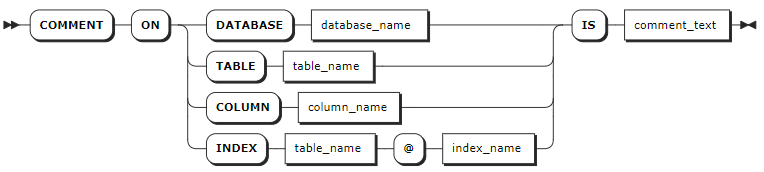

# Comments

## COMMENT ON

The `COMMENT ON` statement associates comments to databases, tables, columns, or indexes.

### Privileges

The user must have the `CREATE` privilege on the object they are commenting on.

### Syntax



### Parameters

| Parameter       | Description                                 |
|-----------------|---------------------------------------------|
| `database_name` | The name of the database to comment on.     |
| `table_name`    | The name of the table to comment on.        |
| `column_name`   | The name of the column to comment on.       |
| `index_name`    | The name of the index to comment on.        |
| `comment_text`  | The comment to be associated to the object. |

### Examples

- Add a comment to a database.

    ```sql
    -- 1. Add a comment to the db3 database.

    COMMENT ON DATABASE db3 IS 'database for order statistics';
    COMMENT ON DATABASE

    -- 2. Check the database's comments.

    SHOW DATABASES WITH COMMENT;
      database_name | engine_type |            comment
    ----------------+-------------+--------------------------------
      db1           | RELATIONAL  | NULL
      db2           | RELATIONAL  | NULL
      db3           | RELATIONAL  | database for order statistics
    ...
    (6 rows)
    ```

- Add a comment to a table.

    ```sql
    -- 1. Add a comment to the orders table.

    COMMENT ON TABLE orders IS 'orders from 2020 till now.';
    COMMENT ON TABLE

    -- 2. Check the table's comments.

    SHOW TABLES WITH COMMENT;
      table_name | table_type |          comment
    -------------+------------+-----------------------------
      orders     | BASE TABLE | orders from 2020 till now.
      order_list | BASE TABLE |
    (2 rows)
    ```

- Add a comment to a column.

    ```sql
    -- 1. Add a comment to the id column of the orders table.

    COMMENT ON COLUMN orders.id IS 'auto-generated';
    COMMENT ON COLUMN

    -- 2. Check the column's comments.

    SHOW COLUMNS FROM orders WITH COMMENT;
      column_name | data_type | is_nullable | column_default  | generation_expression |                 indices                 | is_hidden | is_tag |    comment
    --------------+-----------+-------------+-----------------+-----------------------+-----------------------------------------+-----------+--------+-----------------
      id          | INT4      |    false    | NULL            |                       | {primary,orders_customer_id_key_rename} |   false   | false  | auto-generated
      date        | TIMESTAMP |    false    | NULL            |                       | {}                                      |   false   | false  | NULL
      priority    | INT4      |    true     | 1:::INT8        |                       | {}                                      |   false   | false  | NULL
      customer_id | INT4      |    true     | NULL            |                       | {orders_customer_id_key_rename}         |   false   | false  | NULL
      status      | STRING    |    true     | 'open':::STRING |                       | {}                                      |   false   | false  | NULL
    (5 rows)
    ```

- Add a comment to an index.

    ```sql
    -- 1. Add a comment to the primary index of the orders table.

    COMMENT ON INDEX orders @ primary is 'auto-generated';
    COMMENT ON INDEX

    -- 2. Check the index's comments.

    SHOW INDEXES FROM orders WITH COMMENT;
      table_name |          index_name           | non_unique | seq_in_index | column_name | direction | storing | implicit |    comment
    -------------+-------------------------------+------------+--------------+-------------+-----------+---------+----------+-----------------
      orders     | primary                       |   false    |            1 | id          | ASC       |  false  |  false   | auto-generated
      orders     | orders_customer_id_key_rename |   false    |            1 | customer_id | ASC       |  false  |  false   | NULL
      orders     | orders_customer_id_key_rename |   false    |            2 | id          | ASC       |  false  |   true   | NULL
    (3 rows)
    ```
