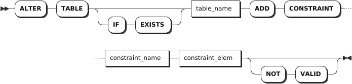
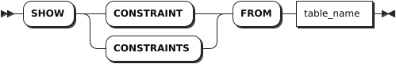
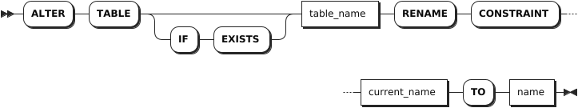
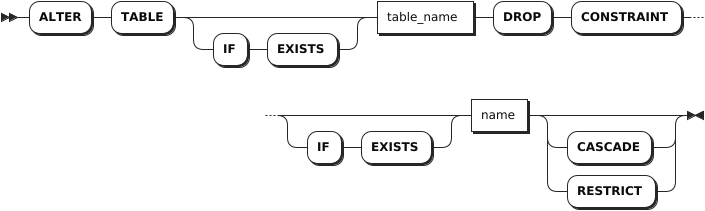

# Constraints

## ADD CONSTRAINT

The `ALTER TABLE ... ADD CONSTRAINT` statement adds the following constraints to columns:

- UNIQUE
- CHECK
- FOREIGN KEY

::: warning Note

- You can use the `ALTER TABLE ... ADD COLUMN` statement to add or change default constraints.
- KWDB does not supports using the `ALTER TABLE ... ADD CONSTRAINT` to add a primary key constraint. To add a primary key constraint to a table, you should explicitly define the primary key at table creation.

:::

### Privileges

The user must have been granted the `CREATE` privilege on the specified table(s).

### Syntax



### Parameters

| Parameter | Description |
| --- | --- |
| `IF EXISTS` | Optional. <br>- When the `IF EXISTS` keyword is used, the system adds a constraint only if the target table has already existed. Otherwise, the system fails to add the constraint without returning an error. <br>- When the `IF EXISTS` keyword is not used, the system adds a constraint only if the target table has already existed. Otherwise, the system fails to add the constraint and returns an error. |
| `table_name`| The table to which a constraint is added. |
| `constraint_name`| The name of the constraint. The constraint name must be unique within the table and must follow these [Identifier Rules](../../../sql-reference/sql-identifiers.md). |
| `constraint_elem` | The constraint to add. KWDB supports adding the following constraints: <br >- `CHECK`: specify that values for the column must satisfy the specified conditions or expressions. <br >- `UNIQUE`: require that all of a column's values be distinct from one another except for NULL values. <br >- `FOREIGN KEY`: before adding a foreign key constraint to a column, an index must already exist for that column. If not, use the `CREATE INDEX` statement to create an index in advance, and then add the foreign key constraint. |
| `NOT VALID`| Create unvalidated constraints. When creating an unvalidated constraint, the system does not check whether existing table data satisfies the constraint. The constraint is still enforced when table data is modified. |

### Examples

- Add the UNIQUE constraint.

    ```sql
    ALTER TABLE orders ADD CONSTRAINT id_unique UNIQUE (id);
    ALTER TABLE
    ```

- Add the CHECK constraint.

    ```sql
    ALTER TABLE orders ADD CONSTRAINT date_check CHECK (date > '2020-01-01') NOT VALID;
    ALTER TABLE
    ```

- Add the FOREIGN KEY constraint.

    The following example assumes that you have created `office_dogs` and `address` tables without foreign key constraints.

    ```sql
    -- 1. Check the created office_dogs table.

    SHOW CREATE TABLE office_dogs;
      table_name  |                                            create_statement                                              
    --------------+---------------------------------------------------------------------------------------------------------+
      office_dogs | CREATE TABLE office_dogs (                                                                               
                  |     id INT8 NOT NULL,                                                                                    
                  |     last_name STRING NULL,                                                                               
                  |     full_name STRING NULL,                                                                               
                  |     alive STRING NULL,                                                                                   
                  |     rides_id UUID NULL,                                                                                  
                  |     rides_length interval NULL,                                                                          
                  |     rides_city STRING NULL,                                                                              
                  |     address_id UUID NULL,                                                                                
                  |     CONSTRAINT "primary" PRIMARY KEY (id ASC),                                                           
                  |     UNIQUE INDEX id_customer_unique (id ASC, full_name ASC),                                             
                  |     INDEX office_dogs_rides_id_idx (rides_id ASC),                                                       
                  |     INDEX office_dogs_rides_length_rides_city_idx (rides_length ASC, rides_city ASC),                    
                  |     FAMILY "primary" (id, last_name, full_name, alive, rides_id, rides_length, rides_city, address_id),  
                  |     CONSTRAINT alive_check CHECK (alive = 'true') ENABLE                                                 
                  | )                                                                                                        
    (1 row)

    -- 2. Check the created address table.

    SHOW CREATE TABLE address;
      table_name |                create_statement                 
    -------------+------------------------------------------------+
      address    | CREATE TABLE address (                          
                |     id UUID NOT NULL,                           
                |     city STRING NOT NULL,                       
                |     CONSTRAINT "primary" PRIMARY KEY (id ASC),  
                |     FAMILY "primary" (id, city)                 
                | )                                               
    (1 row)

    -- 3. Create an index on the address_id column for the office_dogs table.

    CREATE INDEX ON office_dogs (address_id);

    -- 4. Add a foreign key constrain to the address_id column for the office_dogs table, using ON DELETE CASCADE statement to delete all dependent objects when deleting related rows.

    ALTER TABLE office_dogs ADD CONSTRAINT address_fk FOREIGN KEY (address_id) REFERENCES address (id) ON DELETE CASCADE;
    ALTER TABLE

    -- 5. Show constrains for the office_dogs table.

    SHOW CONSTRAINTS FROM office_dogs;
      table_name  |  CONSTRAINT_name   | CONSTRAINT_type |                              details                               | validated  
    --------------+--------------------+-----------------+--------------------------------------------------------------------+-----------+
      office_dogs | address_fk         | FOREIGN KEY     | FOREIGN KEY (address_id) REFERENCES address (id) ON DELETE CASCADE |   false    
      office_dogs | alive_check        | CHECK           | CHECK (alive = 'true') ENABLE                                      |   true     
      office_dogs | id_customer_unique | UNIQUE          | UNIQUE (id ASC, full_name ASC)                                     |   true     
      office_dogs | primary            | PRIMARY KEY     | PRIMARY KEY (id ASC)                                               |   true     
    (4 rows)
    ```

## SHOW CONSTRAINTS

The `SHOW CONSTRAINTS` statement lists all named constraints as well as any unnamed UNIQUE constraints on a table.

### Privileges

The user must have any privilege on the specified table(s).

### Syntax



### Parameters

| Parameter | Description |
| --- | --- |
| `table_name` | The name of the table for which to show constraints.|

### Responses

| Field | Description |
| --- | --- |
| `table_name` | The name of the table. |
| `constraint_name` | The name of the constraint.|
| `constraint_type` | The type of the constraint. |
| `details` | The definition of the constraint, including the column(s) to which it applies. |
| `validated` | Whether values in the column(s) match the constraint. |

### Examples

This example shows details about constraints on the `orders` table.

```sql
SHOW CONSTRAINTS FROM orders;
```

If you succeed, you should see an output similar to the following:

```sql
  table_name |    constraint_name     | constraint_type |                                               details                                                | validated
-------------+------------------------+-----------------+------------------------------------------------------------------------------------------------------+------------
  orders     | check_priority         | CHECK           | CHECK ((priority BETWEEN 1 AND 5))                                                                   |   true
  orders     | check_status           | CHECK           | CHECK ((status IN ('open':::STRING, 'in progress':::STRING, 'done':::STRING, 'cancelled':::STRING))) |   true
  orders     | date_check             | CHECK           | CHECK ((date > '2020-01-01'))                                                                        |   false
  orders     | id_unique              | UNIQUE          | UNIQUE (id ASC)                                                                                      |   true
  orders     | orders_customer_id_key | UNIQUE          | UNIQUE (customer_id ASC)                                                                             |   true
  orders     | primary                | PRIMARY KEY     | PRIMARY KEY (id ASC)                                                                                 |   true
(6 rows)
```

## RENAME CONSTRAINT

The `ALTER TABLE ... RENAME CONSTRAINT` statement changes the name of a constraint on a column.

### Privileges

The user must have been granted the `CREATE` privilege on the specified table(s).

### Syntax



### Parameters

| Parameter | Description |
| --- | --- |
| `IF EXISTS` | Optional. <br>- When the `IF EXISTS` keyword is used, the system renames a constraint only if the target table has already existed. Otherwise, the system fails to rename the constraint without returning an error. <br>- When the `IF EXISTS` keyword is not used, the system renames a constraint only if the target table has already existed. Otherwise, the system fails to rename the constraint and returns an error. |
| `table_name` | The name of the table for which to rename constraints. |
| `current_name` | The current name of the constraint. The constraint name must be unique within the table and must follow these [Identifier Rules](../../sql-identifiers.md). |
| `name` | The new name of the constraint. The constraint name must be unique within the table and must follow these [Identifier Rules](../../sql-identifiers.md). |

### Examples

This example renames the `orders_customer_id_key` constraint on the `orders` table to `orders_customer_id_key_rename`.

```sql
-- 1. Renames the orders_customer_id_key constraint on the orders table to orders_customer_id_key_rename.

ALTER TABLE orders RENAME CONSTRAINT orders_customer_id_key TO orders_customer_id_key_rename;
ALTER TABLE

-- 2. Show constraints on the orders table.

SHOW CONSTRAINTS FROM orders;
  table_name |        constraint_name        | constraint_type |                                               details                                                | validated
-------------+-------------------------------+-----------------+------------------------------------------------------------------------------------------------------+------------
  orders     | check_priority                | CHECK           | CHECK ((priority BETWEEN 1 AND 5))                                                                   |   true
  orders     | check_status                  | CHECK           | CHECK ((status IN ('open':::STRING, 'in progress':::STRING, 'done':::STRING, 'cancelled':::STRING))) |   true
  orders     | date_check                    | CHECK           | CHECK ((date > '2020-01-01'))                                                                        |   false
  orders     | id_unique                     | UNIQUE          | UNIQUE (id ASC)                                                                                      |   true
  orders     | orders_customer_id_key_rename | UNIQUE          | UNIQUE (customer_id ASC)                                                                             |   true
  orders     | primary                       | PRIMARY KEY     | PRIMARY KEY (id ASC)                                                                                 |   true
(6 rows)
```

## DROP CONSTRAINT

The `ALTER TABLE ... DROP CONSTRAINT` statement removes CHECK and FOREIGN KEY constraints from columns.

### Privileges

The user must have been granted the `CREATE` privilege on the specified table(s).

### Syntax



### Parameters

| Parameter | Description |
| --- | --- |
| `IF EXISTS` | Optional. <br>- When the `IF EXISTS` keyword is used, the system removes the constraint only if the target constraint has already existed. Otherwise, the system fails to remove the constraint without returning an error. <br>- When the `IF EXISTS` keyword is not used, the system removes the constraint only if the target constraint has already existed. Otherwise, the system fails to remove the constraint and returns an error.  |
| `table_name` | The name of the table from which the constraint to remove.|
| `name` | The name of the constraint to remove.|
| `CASCADE` | Optional. Remove the target constraint and its dependent objects. The `CASCADE` keyword does not list objects it removes, so it should be used cautiously. |
| `RESTRICT` | (Default) Optional. Do not remove the constraint if any objects depend on it. |

### Examples

This example removes the `check_status` constraint from the `orders` table.

```sql
-- 1. Show constrains for the orders table.

SHOW CONSTRAINTS FROM orders;
  table_name |        constraint_name        | constraint_type |                                               details                                                | validated
-------------+-------------------------------+-----------------+------------------------------------------------------------------------------------------------------+------------
  orders     | check_priority                | CHECK           | CHECK ((priority BETWEEN 1 AND 5))                                                                   |   true
  orders     | check_status                  | CHECK           | CHECK ((status IN ('open':::STRING, 'in progress':::STRING, 'done':::STRING, 'cancelled':::STRING))) |   true
  orders     | date_check                    | CHECK           | CHECK ((date > '2020-01-01'))                                                                        |   false
  orders     | orders_customer_id_key_rename | UNIQUE          | UNIQUE (customer_id ASC)                                                                             |   true
  orders     | primary                       | PRIMARY KEY     | PRIMARY KEY (id ASC)                                                                                 |   true
(5 rows)

-- 2. Remove the check_status constraint from the orders table. 

ALTER TABLE orders DROP CONSTRAINT check_status;
ALTER TABLE

-- 3. Show constrains for the orders table.

SHOW CONSTRAINTS FROM orders;
  table_name |        constraint_name        | constraint_type |              details               | validated
-------------+-------------------------------+-----------------+------------------------------------+------------
  orders     | check_priority                | CHECK           | CHECK ((priority BETWEEN 1 AND 5)) |   true
  orders     | date_check                    | CHECK           | CHECK ((date > '2020-01-01'))      |   false
  orders     | orders_customer_id_key_rename | UNIQUE          | UNIQUE (customer_id ASC)           |   true
  orders     | primary                       | PRIMARY KEY     | PRIMARY KEY (id ASC)               |   true
(4 rows)
```
